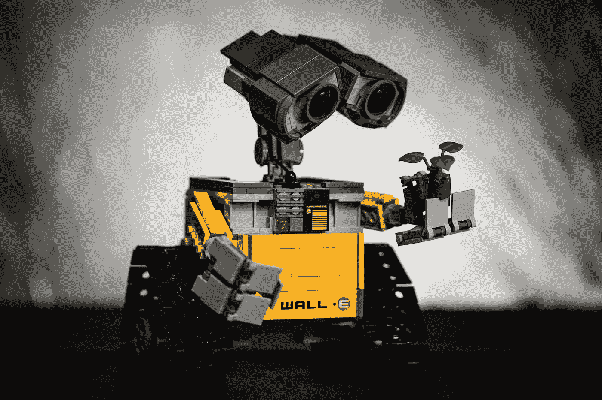

# 面向青少年的流行机器人套件

> 原文：<https://medium.com/codex/popular-robotics-kits-for-teens-c52f523cea69?source=collection_archive---------7----------------------->

无论你是一名希望提高数学技能的学生还是一名技术爱好者，机器人都是学习 STEM 多个方面并创造有形事物的绝佳方式。多亏了套件，很容易构建和编程各种各样的机器人。Mech-5 和 4M 铁罐机器人是两种受青少年欢迎的机器人套件。其他受欢迎的选择包括 ELEGOO UNO R3 智能机器人汽车和 mBot Ultimate 2.0。

[梁杰森](https://unsplash.com/@ninjason?utm_source=medium&utm_medium=referral)在 [Unsplash](https://unsplash.com?utm_source=medium&utm_medium=referral) 上的照片