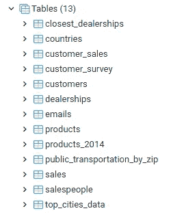
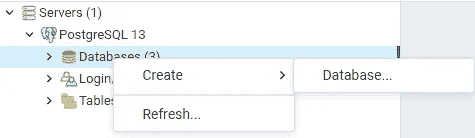
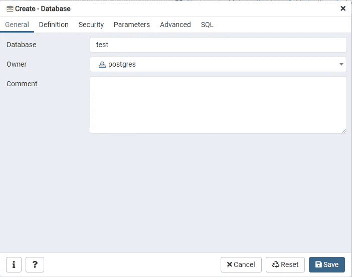
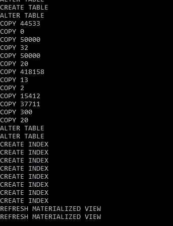
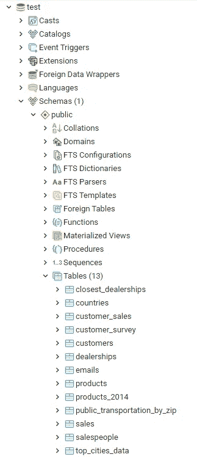

# Windows 10 中的 PostgreSQL 及其转储

> 原文：<https://medium.com/codex/postgresql-and-their-dumps-in-windows-10-fdff4c960ea3?source=collection_archive---------2----------------------->

## [法典](http://medium.com/codex)


和平的

大约一周前，我决定用 SQL 做更多的事情，而不是我在工作中使用的。我在 Packt 出版社看到了一本名为*的应用 SQL 数据分析研讨会*的书，于是我决定购买。它似乎拥有我在教程中想要的一切。

在工作中，我们使用微软的 SQL Server 和 SQL Server Management Studio，在我看来这并没有什么不妥。然而，这本书利用了 PostgreSQL 和 pgAdmin4，所以在开始时有一点学习曲线。

**接受挑战！**

原来 PostgreSQL 和我习惯的没那么大区别。随着我对这本书的深入研究，很明显我需要创建这本书用来教授课程的数据库。我发现，我需要从转储文件中恢复数据库。**嗯？！**

# 什么是转储文件

实际上，我从未查询过转储文件的定义是什么。我一直认为它是一个以文本形式保存大量信息的文件。今天我查了一下什么是转储文件。事实证明我并没有差那么远。

它们被称为转储文件，因为程序实际上是将原始数据转储到一个几乎没有任何格式的文件中。还有其他形式的转储文件，但是我将处理文本转储文件

# 分两步在 PostgreSQL 中创建转储文件

为了创建这个转储文件，我假设您已经有了一个 PostgreSQL 数据库。我将使用我在本教程中创建的那个。它名为 sqlda2，包含以下表格。你可以把这个数据库想象成一个只卖电动滑板车和电动汽车的车辆经销店。现在是一个很好的时机来提一下，这都是编造的数据。这些表和其中包含的所有数据将被转储到一个文本文件中。



数据库表树

现在来创建一个转储文件。以下是方法:

第一步:

打开命令提示符并导航到您正在使用的 PostgreSQL 版本的 bin 文件夹。我使用的是版本 13，所以这是我的样子:

```
C:\Users\username>cd C:\Program Files\PostgreSQL\13\bin
C:\Program Files\PostgreSQL\13\bin>
```

第二步:

运行以下命令，将*用户名*替换为您的用户名，将*数据库名*替换为您想要转储的数据库，将*备份文件名和路径*替换为您想要的位置和名称。

*pg _ dump . exe-U USERNAME-d DBNAME-f BACKUP _ FILE _ NAME _ AND _ PATH*

```
C:\Program Files\PostgreSQL\13\bin>pg_dump.exe -U postgres -d sqlda2 -f c:\users\username\desktop\test.dump
Password:
```

按下 enter 键后，系统会提示您输入密码。输入密码并按回车键。恭喜您，您刚刚创建了一个转储文件并备份了您的数据库！

# 通过 4 个步骤从转储文件恢复 PostgreSQL 数据库

因此，您的数据库发生了一些问题，您需要恢复它。不久前，您为它创建了一个备份转储文件，这真是一个奇迹。遵循这三个步骤，您将很快恢复正常运行。

第一步:

打开 pgAdmin4，单击 servers 下拉列表，然后单击 PostgreSQL <version>下拉列表，并右键单击 databases。将鼠标悬停在创建上，然后单击数据库。</version>



在 PostgreSQL 中创建数据库

第二步:

为数据库命名并确保所有者正确，然后单击 save。



命名数据库

第三步:

打开命令提示符并导航到您正在使用的 PostgreSQL 版本的 bin 文件夹。我用的是第 13 版，所以这是我的样子。

```
C:\Users\username>cd C:\Program Files\PostgreSQL\13\bin 
C:\Program Files\PostgreSQL\13\bin>
```

第四步:

运行以下命令，将*用户名*替换为您的用户名，将*数据库名*替换为您要恢复的数据库，将*备份文件名和路径*替换为它存储的位置和名称。

*psql.exe-U 用户名-d 数据库名-f 备份 _ 文件名和 _ 路径*

```
C:\Program Files\PostgreSQL\13\bin>psql.exe -U postgres -d test -f c:\users\username\desktop\test.dump
Password:
```

按下 enter 键后，系统会提示您输入密码。输入密码并按回车键。当它运行时，您将得到与此类似的内容。



# 验证数据库的恢复

现在恢复已经运行，您应该能够打开 pgAdmin 4 并找到您恢复的数据库。我能够验证恢复是否成功。



您可以运行一些快速的 SQL 代码来查看它确实成功了。

```
select *
from customers 
where title is not null
    and phone is not null
order by last_name
limit 10;select c.customer_id  
    , c.first_name  
    , c.last_name  
    , p.product_id  
    , p.model  
    , p.year  
    , p.product_type  
    , s.sales_amount  
    , s.sales_transaction_date 
from sales s 
left outer join customers c on s.customer_id = c.customer_id 
left outer join products p on s.product_id = p.product_id 
order by s.sales_transaction_date desc;select c.customer_id
	, c.first_name
	, c.last_name
	, p.product_id
	, p.model
	, p.year
	, p.product_type
	, s.sales_amount
	, s.sales_transaction_date
from sales s
left outer join customers c on s.customer_id = c.customer_id
left outer join products p on s.product_id = p.product_id
order by s.sales_transaction_date desc
```

感谢您的阅读，我希望你喜欢！