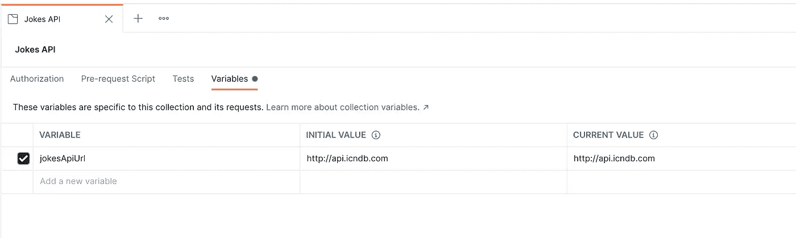
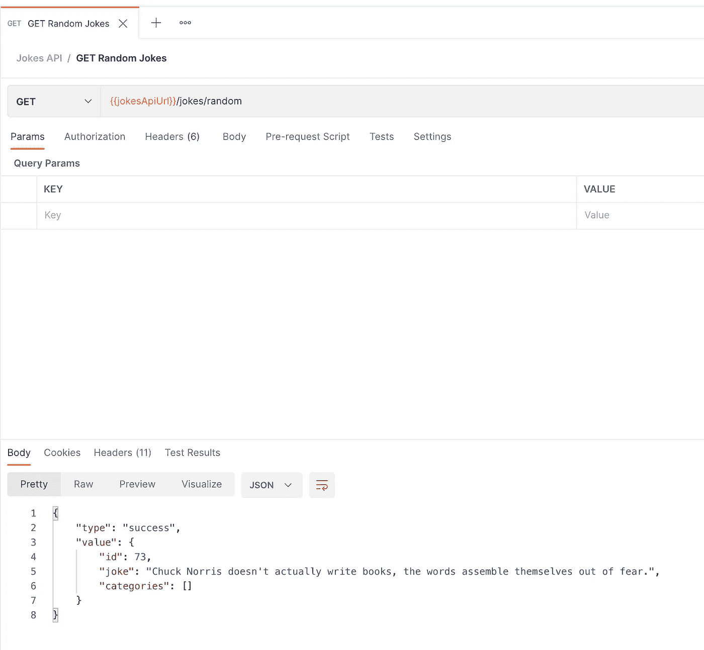
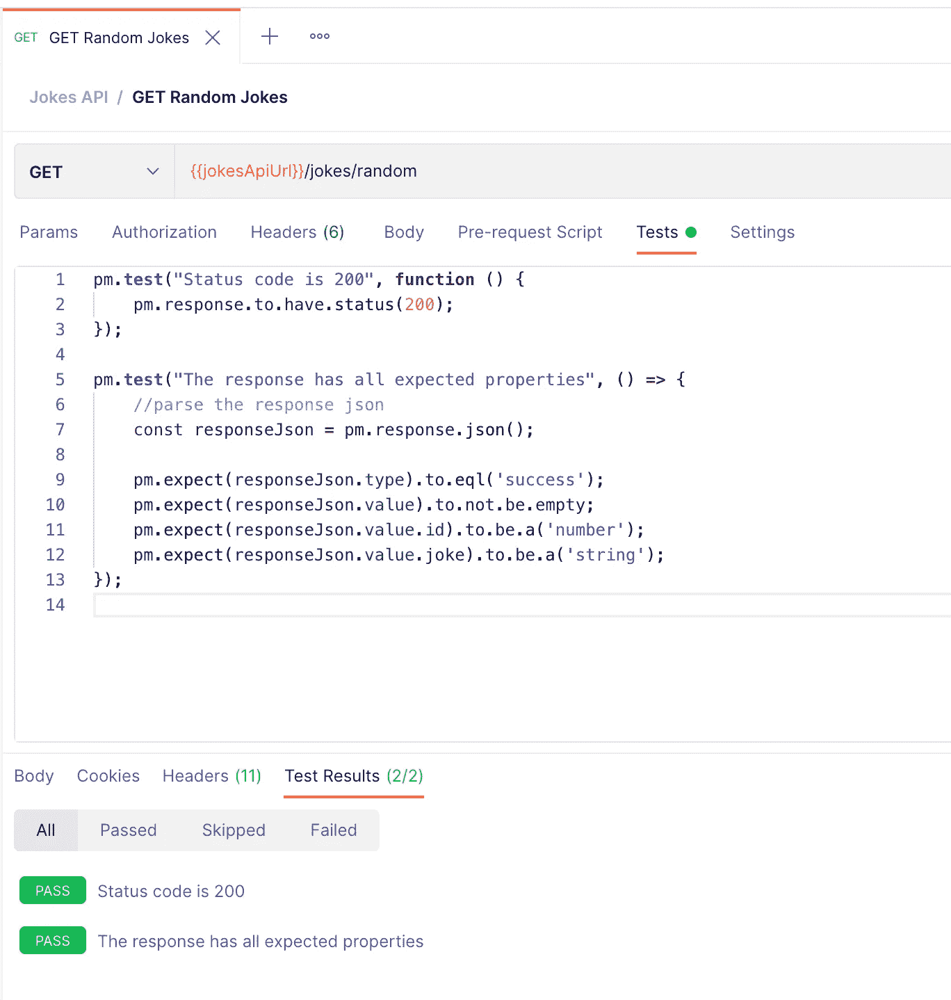
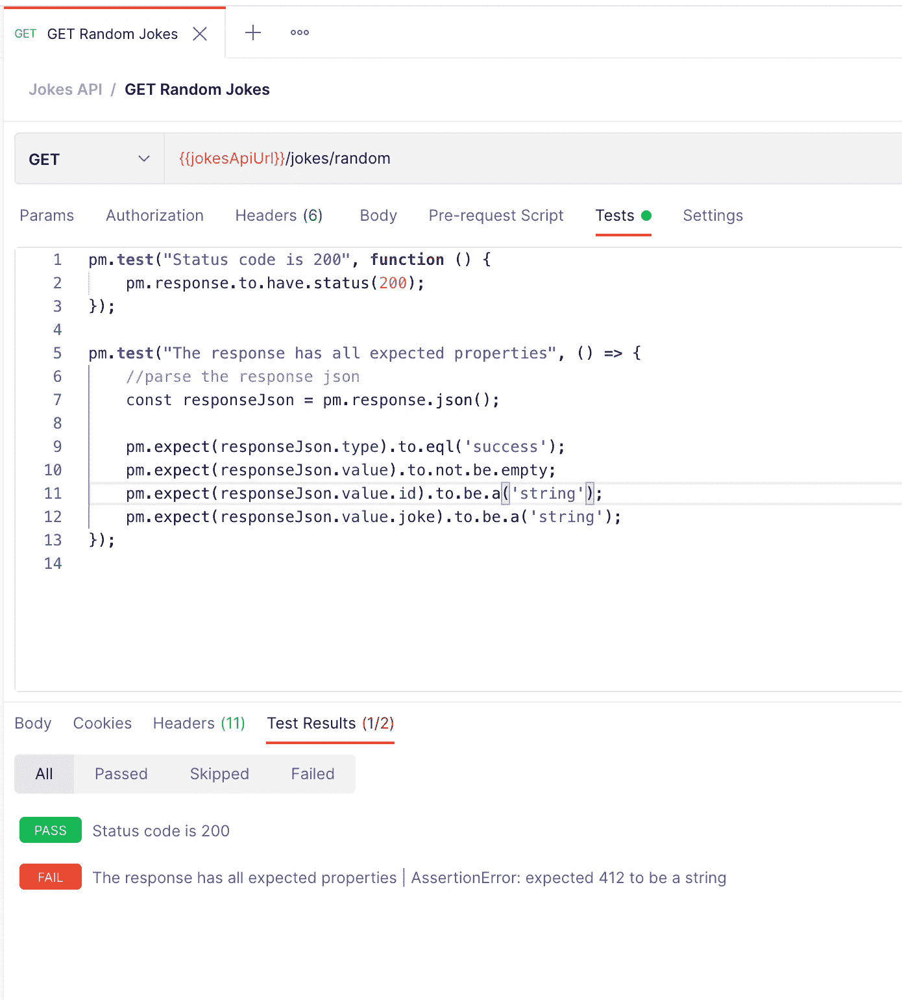
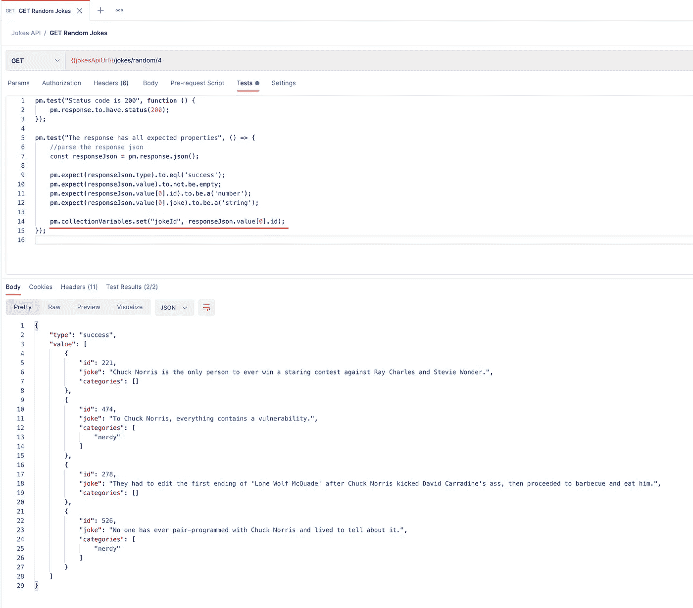
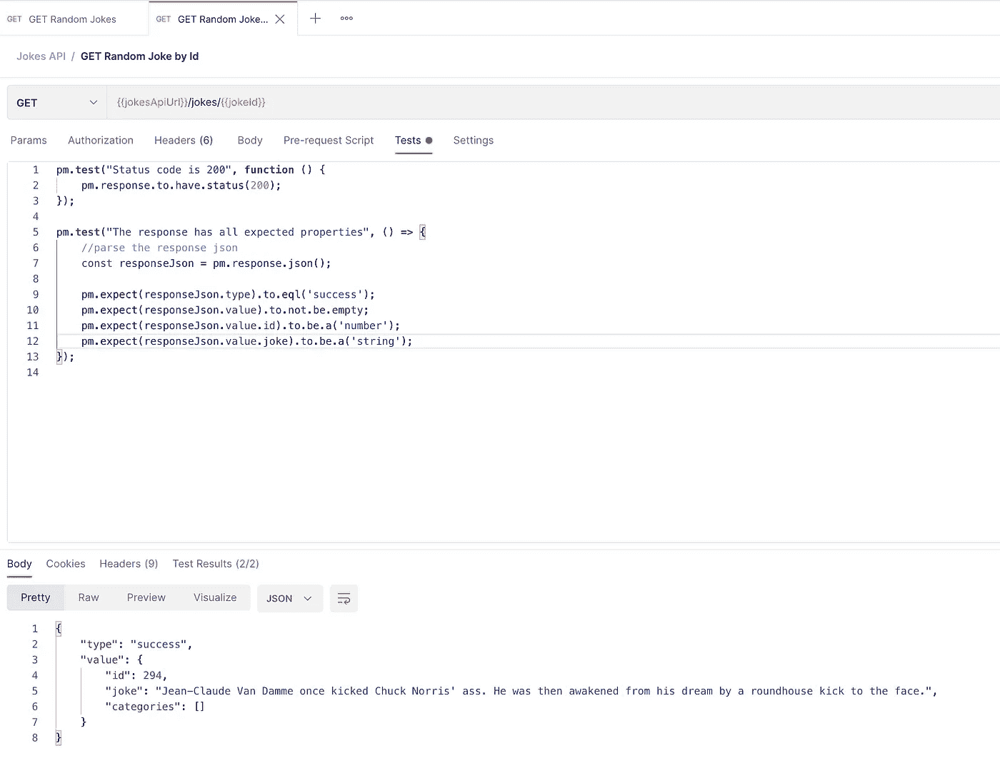

# 作为完整测试工具的 Postman

> 原文：<https://medium.com/codex/postman-as-a-full-testing-tool-9ce47f219286?source=collection_archive---------4----------------------->

我们中的许多人使用 [Postman](https://www.postman.com/) 作为帮助我们“测试请求”的简单工具或程序。我想这是我脑海中第一个突兀的描述。有人给我们一个 URL，告诉我们方法、参数和任何其他细节，因此我们验证结果是否是我们所期望的。这种类型的场景非常常见，例如在开发服务 API 时。但是，如果它仅仅是为了做到这一点，邮差将只不过是一个花哨的卷曲命令。


当然，Postman 是一个更完整的工具，它有几十个功能来创建请求、管理和共享收藏、同步帐户等。在这些功能中，本文的主题是:**使用 Postman 作为在我们的服务应用程序中创建和执行集成测试的解决方案**。有了这个伪描述性的标题，我将试着向你展示允许你尝试这个的基本步骤。

Postman 测试是用 Javascript 编写的，它允许您确保您的 API 正确工作，并且每个服务正确处理参数并返回预期的输出，完美地模拟了您的应用程序的消费者客户端的体验。值得一提的是，Postman 中的集成(或端到端)测试是对应用程序单元测试的补充，因此我鼓励您在开发服务 API 时同时使用这两部分。所以事不宜迟，让我们把这个付诸实践。

我们将使用 http://api.icndb.com 的公共 api [来创建我们的测试。在这里，你可以得到可用服务的详细信息。第一件事是在 Postman 中创建新的集合，并添加一个包含主 url 的变量。在文章的最后，你可以下载邮差合集来亲自测试一下:](http://api.icndb.com)



现在是时候向集合添加一个新的请求来获得*/笑话/随机*资源了。结果将类似于下图。



在上面的选项卡中，您可以找到“Tests ”,这是使用 Javascript 创建测试的空间，在这里您可以定义对结果的断言，从而确认您的 API 工作正常。Postman 测试可以使用[柴断言库 BDD](https://www.chaijs.com/api/bdd/) 语法。[在这里](https://learning.postman.com/docs/writing-scripts/test-scripts/)你会找到官方的例子

按照我们的用例，我们将创建验证以下方面的测试:

```
- Status code is 200
- Body.type = 'success'
- Body.value is an object containing
   - id is a number
   - joke is an string
```

下图显示了两个测试用例，第一个验证状态代码，第二个断言响应体的属性。



如果我们使用“Send”再次测试请求，我们将看到测试已经自动执行，结果显示在 Test Results 选项卡中，确认我们的 API 在该端点上正常工作。同样，如果其中一个断言不匹配(我们将把 expect from id 修改为一个字符串)，我们将在结果中看到错误。



这些简单的例子是 Postman 中测试的主体，通过遵循这种方法，我们将能够对我们的 API 进行更加健壮的覆盖。但是，如果我们的 api 需要我们不知道的参数，例如，接收一个 id 以获得一个简单对象的细节，该怎么办呢？为此，我们将在测试中使用变量来“链接”我们的请求。在结束之前，让我们看一下这个例子，在这个例子中，我们希望在获得一个笑话的列表之后，通过 id 获得一个特定笑话的细节。



如您所见，我们添加了一个新行，将 *jokeId* 存储在一个集合变量中(您也可以将它作为一个全局变量持久化)。然后我们创建一个新的请求，通过它的 id 实现相应的测试来获取笑话。



[在这里](https://gist.github.com/wolivera/a418a1be322116f271643a78a0171b99)您可以下载测试集来自己运行这些用例。

感谢阅读！

你可以[在 Twitter](https://twitter.com/liams_o) 上关注我的这篇文章和更多文章:)