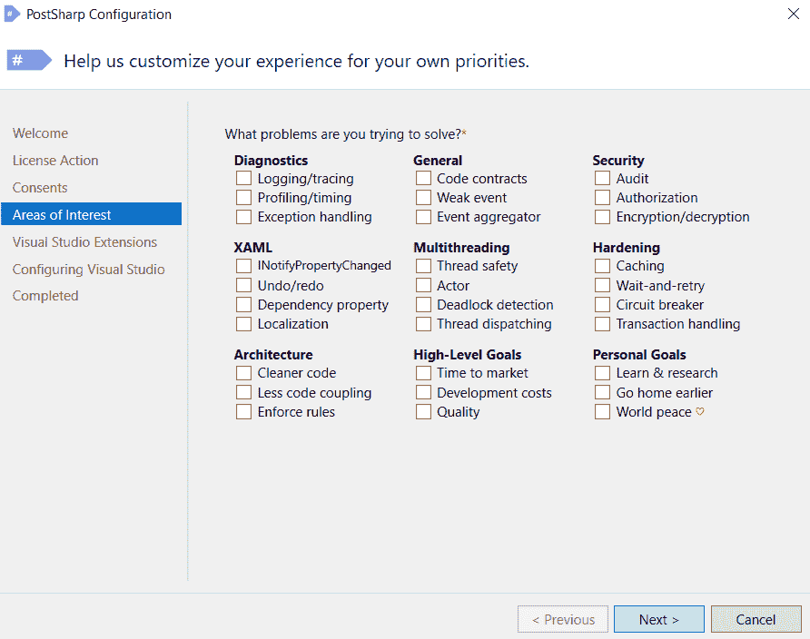

# PostSharp —您需要知道的一切

> 原文：<https://medium.com/codex/postsharp-everything-you-need-to-know-15d3197575fd?source=collection_archive---------20----------------------->

在我们深入研究 PostSharp 之前，您必须首先理解面向方面编程(AOP)的概念。这种编程风格允许分离不同且独立的功能。

随着代码模块性的增加，这种风格力求内聚的功能。这些不同的功能被归类为横切关注点，它们将整个应用程序的主要部分分类，如数据模型、用户界面或业务逻辑。

这种高级封装形成了 AOP 的核心概念。有了对 AOP 的基本理解，让我们进入这篇文章，理解什么是 PostSharp 工具。

**目录**

*   什么是 PostSharp 工具？
*   为什么要用 PostSharp？
*   使用 PostSharp 的好处
*   PostSharp 解决的问题
*   PostSharp 是如何工作的？
*   PostSharp 使用的关键概念
*   结论

# 什么是 PostSharp 工具？

PostSharp 工具是最常用的软件开发工具之一。NET 世界，它使用了面向方面编程的概念。它提供了将重复代码封装到自定义属性类中的能力。在 PostSharp 中，这些类被称为各种类型的方面类。

PostSharp 提供了用比普通代码更少的代码行开发干净精确的代码块所需的工具。这种简洁的代码可以成功地编写，因为 PostSharp 操作方法通常被归类为设计模式自动化，其中它基于模式实现应用程序，并优化开发团队的生产力。

# 为什么要用 PostSharp？

以下是 PostSharp 工具的一些其他好处-

*   代码会更干净
*   锅炉镀层减少，即消除重复代码。
*   代码的抽象性和模块化增加了
*   改进了维护，使调试更容易，性能也更容易跟踪。
*   由于缺陷减少，降低了维护成本
*   当添加新功能或删除旧功能时，代码的弹性会增加
*   有条理的可读性增加了团队的生产力

# PostSharp 解决的问题

在进行常规编码时，不使用模式的概念。因此，模式通常是手工编码的，这进一步导致样板代码。

以下是样板代码的影响:

## 高开发努力

*   **大型代码库:**在使用现有的主流编译器技术实现时，很少有应用程序会有大量的样板代码或重复代码。
*   **重新发明轮子:**由于在传统编程语言中没有可重用的选项，像 INotifyPropertyChanged 这样的问题的解决方案总是被重新发明。

## 质量差的软件

*   大量缺陷:每一行代码都很有可能存在缺陷。然而，作为复制-粘贴结果的代码更有可能出现错误，因为在这种情况下，细微的差异往往会被忽略。
*   **多线程问题:**在使用面向对象编程来开发多线程应用程序时，很多价值都没有得到体现。PostSharp 在较低的抽象层次上考虑问题，包括事件、互锁访问或锁，它们最终会导致随机数据竞争或死锁。
*   **缺乏健壮性:**由于大量的源代码，异常处理或缓存经常在企业级特性中被故意省略。这在应用程序的某些部分被无意地禁止了，这些应用程序仍然没有经过测试，因此是不可靠的。

## 难以添加或修改功能

*   **难以维护的不可读代码:**当最初的开发人员离开后，阅读业务代码变得更加困难。它经常充斥着非功能性的底层需求，这使得它很难理解和维护。
*   **强耦合:**问题分解不好形成重复代码。强耦合使得更改异常处理、INotifyPropertyChange、日志记录等实现变得更加困难，因为它们分散在成吨的文件中。

## 新团队成员的缓慢增加

*   **需要大量知识:**当新的团队成员加入到某个特定特性的工作中时，他们需要首先了解线程、缓存和其他技术问题，然后才能开始贡献商业价值。这是一个分工不好的例子。
*   **长反馈循环:**即使在小团队中，日志、线程、诊断、撤销、重做等模式。可能会被不同的开发者以不同的方式处理。因此，架构师需要看到新的团队成员遵循设计标准，并利用他们的大部分时间审查手动代码。

下图显示了 PostSareharp 可以解决的不同问题:

# PostSharp 是如何工作的？

从概念上讲，你可以把 PostSharp 看作是 VB 编译器或者 C#的扩展。然而，实际上微软的编译器本身是不可扩展的，但是构建的过程是可以扩展的。类似的事情也发生在 PostSharp 中——当它将自己插入到构建过程中时，它会对编译器的输出进行后处理。

让我们看看它是如何发生的:

*   **MSBuild 集成:**使用 *PostSharp.targets* ，PhotoSharp 将自己集成到构建过程中。 *PostSharp.targets* 由名为 *install.ps1* 的 NuGet 安装脚本使用 PostSharp 导入到每个项目中。 *PostSharp.targets 在构建过程中增加了几个步骤*后处理是 PostSharp 自己处理的编译器输出中最重要的步骤。
*   **MSIL 重写**:通过读取和反汇编中间汇编，验证，执行所需的转换，并将最终汇编写入磁盘，PostSharp 对编译器输出进行后处理。虽然这听起来很神奇，但请记住，自 2004 年以来，PostSharp 的 MSIL 技术已经被成千上万的开发人员使用，因为它非常稳定和成熟。

# PostSharp 使用的关键概念

为了利用设计模式自动化，PostSharp 使用了下面给出的几个概念的组合:

*   **元编程:**写一段代码，对自己或者其他程序进行分析和转换，就是元编程。一个. NET 程序在内部被 PostSharp 表示为一个. NET 对象，因此它可以被认为是一个元编程工具。
*   **面向方面编程:** AOP 是一种与 OOP 正交的编程风格，它允许模块化某些特性，否则这些特性会横切大量的方法和类。可以很有信心地说，PostSharp 是一个先进的 AOP 框架。
*   **静态程序分析:**对一个不执行的程序进行分析，称为静态程序分析。静态分析工具有两个系列，即结构静态分析和行为静态分析。PostSharp 只有用于结构静态分析的工具。
*   **动态程序分析:**程序在执行过程中的分析称为动态程序分析。它用于尽早检测问题，以防止更大的损害。为了对照线程模型检查程序，PostSharp 使用了动态分析。

# 结论

从这篇文章中看到的好处，你可以有把握地得出结论，PostSharp 是一个惊人的工具，可以用来消除任何样板文件。它还有助于分离不同代码集之间的关注点。即使经过几年的发展，它仍然是全球各大公司使用的趋势工具。

*原载于*[*https://www . partech . nl*](https://www.partech.nl/nl/publicaties/2021/06/postsharp---everything-you-need-to-know)*。*