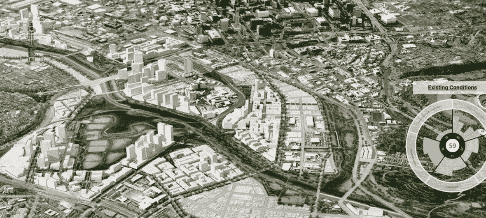

# 城市分析在提高经济生产率方面的潜在用途

> 原文：<https://medium.com/codex/potential-uses-of-urban-analytics-to-increase-economic-productivity-66f8d81fe9ff?source=collection_archive---------9----------------------->

## 智能城市技术如何洞察生产力的各种驱动因素

在当今世界，科技行业持续增长，数据是新的黄金。购物、通勤甚至看电视等日常活动的数字化转型使科技巨头和初创公司能够根据实时分析确定其战略方向并改善运营。公司可以快速了解并预测哪种产品对个人客户最有吸引力，他们经常订购的食品，当前感兴趣的地方以及他们想看到的广告。这些数据将成为产品开发、定价和促销策略以及建立合作伙伴关系的基础。它也提供了一个更强的视角来观察从国家层面到单个社区的商业表现。我们可以很容易地确定哪些领域目前有很高的需求，并计算服务的成本。这些只是数据分析无限潜力的几个例子。

作为一名数据分析专家和城市学家，我想知道，我们如何优化数据的使用来改善我们城市的生活？一些国家现在正在采用物联网(IoT)，其中物理对象嵌入了传感器、软件和其他技术，以连接和传输数据到在线平台。收集的数据包括行人活动、交通拥堵和空气质量。这导致了智能城市的兴起，这些城市使用来自技术的数据洞察力来解决其当前和潜在的问题。纽约、伦敦和雅加达等大城市的政府已经建立了专门的机构，致力于发展城市分析，以改善公共服务。这种做法包括在交通灯中放置传感器来检测移动信号，在建筑物中放置传感器来测量能源效率。有了这些实时数据，我们如何利用它来提高经济生产率？我想到了 5 个领域:交通效率、土地估价和使用、经济适用房、绿地可用性和小企业授权。

资料来源:AECOM (2020 年)

交通拥堵是大都市长期存在的问题，尤其是像雅加达这样公共交通仍在发展的城市。当前的智能城市技术现在可以通过传感器和卫星图像捕捉每条道路和每小时的拥堵量。有了这些数据，城市分析可以深入了解拥堵的根本原因；无论是交通信号灯故障、公共交通可用性/容量不足，还是仅仅因为车辆太多而乘客/车辆比率低。从这里，我们可以计算社会经济成本效益，并提供潜在的缓解方案。这些成本包括增加的碳足迹和员工因通勤而损失的生产时间。我们还可以计算出减少拥堵带来的好处，比如增加送餐数量或乘坐出租车的次数。有了可靠的计算和清晰的规划，就更有理由产生公共投资。在杭州，当地政府发现，利用这项技术，只需简单地调整一下交通灯，就能大幅减少出行时间。利物浦市可以通过测量每个车站的密度和平均等待时间来改善公交服务。它还为根据乘客需求创造新的公交线路提供了见解。

交通基础设施和城市复兴项目可以提升周边土地的价值。目前的方法大多基于历史档案和来自调查和焦点小组讨论的定性数据。检索此类数据需要及时的人工操作和主观因素，因为公共数据通常是分散的，研究受访者可能不具有代表性。借助城市分析，地方当局可以确定这些项目附近区域的经济活动模式。通过将历史档案数字化，我们可以计算并可视化土地和住房价格与交通基础设施或再生项目之间的相关性。我们还可以根据传感器生成的人流量数据，比较半径内和半径外的企业生产率。这可以成为预测规划项目土地价值上涨的基础。城市分析可以做的另一件事是比较房地产的经济用途和潜在的土地价值。这种可见性可以通过显示选定区域中资产的经济活动的地图来提供。如果物业的使用没有达到潜力，地方当局可以为业主设计激励/抑制计划，以将其物业开发为生产性用途。有了这个估价模型，也可以给城市再开发项目出思路。物联网技术可以检测低价值的欠发达地区，作为交通基础设施和商业地产的投资对象，从而增加就业机会。

借助移动模式的可视化，城市分析也有助于改善住房政策。让我们以南雅加达的一栋办公楼及其员工的日常通勤为例。大多数员工从家到工作地点大约需要 45 到 90 分钟。当到达他们的工作地点时，他们会经过几栋超出承受能力的房子。如果数据显示这些房子的入住率很低，甚至为零，而根据现实的计算，这些房子可以容纳 2-3 个家庭，那该怎么办？这意味着有一个由业主造成的生产性浪费。政府可以鼓励业主为年轻家庭提供共享的居住机会，作为一种负担得起的住房，而不是拥有闲置的空间。员工将不再需要花很多时间通勤，增加了他/她的生产时间，减少了街道上的车辆数量。

公园和娱乐场所等绿地是城市的重要组成部分。它促进了周边地区的经济活动，成为社区活动的场所，增加了旅游业，提高了土地价值，最重要的是，改善了空气质量。然而，许多地方政府未能认识到这些经济属性。由于直接的短期收入，大多数政府官员更喜欢房地产开发而不是绿地。城市分析工具可以通过显示绿色空间的经济和环境影响来改进成本效益分析。通过适当的数据可视化，我们可以比较公园附近区域和非公园区域的经济活动水平。我们还可以看到公园范围之外的空气质量，并计算环境成本。空气质量较低的建筑不太可能吸引大量的经济活动。地方政府也可以进行实验，比如将一个社区的一处空置国有房产改造成公园，将另一处改造成出租房屋，并比较经济效果。当然，这并不像听起来那么容易，但它给出了城市分析在改善绿色空间方面的潜在用途。

从城市分析产生的数据中，我们可以对购物习惯进行深入分析。可能会有这样的情况，住在郊区的居民每周花一个小时开车去购物中心或连锁超市购物。与此同时，数据显示，在步行距离内有几家夫妻店提供相同的产品类别。看到这里，我们就能发现这些店铺影响居民偏好的模式，无论是购物体验、商品完整度还是定价。从这里，我们可以确定这些中小企业需要的正确的支持政策，例如建立业务的可行的金融贷款、适当的培训或接触更好的供应商。小企业主然后可以发展他们的业务，以进一步支持他们的当地社区。

许多人对智能城市的担忧是数据隐私。有些人会对政府监视我们的行动感到不安。从另一个角度来看，所有收集的数据都是为了公民的更大利益。城市分析不跟踪特定的个人，而是看到一个地区的整体模式。此外，除非一个人犯了重罪，否则政府监控普通公民没有什么价值。所以应该少一些担心，多一些希望。

总之，城市分析在提高经济生产率方面的潜力还有很多值得探索的地方。生成的实时数据使地方政府能够了解市民的需求，而不必花费数小时进行研究和实地调查。它还可以帮助城市规划者预测其发展战略的未来结果。让我们兴奋地看看我们的城市会变得多聪明！