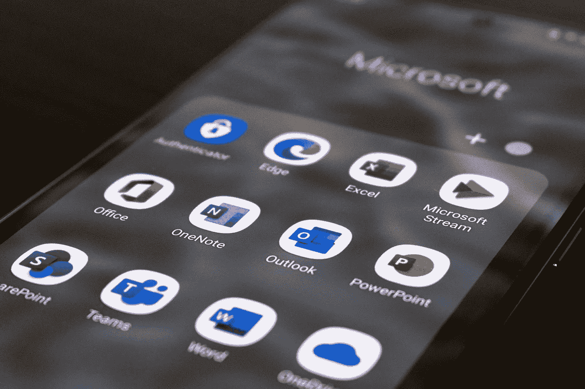

# 电源应用中的电源 BI 报告

> 原文：<https://medium.com/codex/power-bi-reports-in-power-apps-63f5b35abe1b?source=collection_archive---------3----------------------->

## 微软如何将自助式商务智能集成到办公产品中

[埃德·哈迪](https://unsplash.com/@impelling?utm_source=unsplash&utm_medium=referral&utm_content=creditCopyText)在 [Unsplash](https://unsplash.com/s/photos/microsoft?utm_source=unsplash&utm_medium=referral&utm_content=creditCopyText) 上拍摄的照片

对于微软世界的所有数据爱好者来说，这是一个好消息，因为 Power BI 元素现在将更多地与 Office 应用程序联系在一起，微软已经正式宣布:

> 现在，应用程序制造商可以将 Power BI 报告和数据集作为 Dataverse 组件添加到 Power Apps 解决方案中…