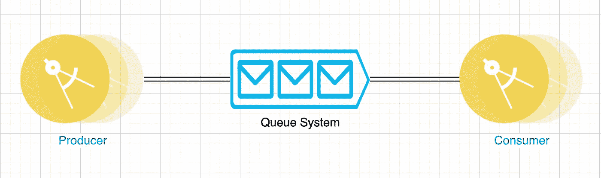
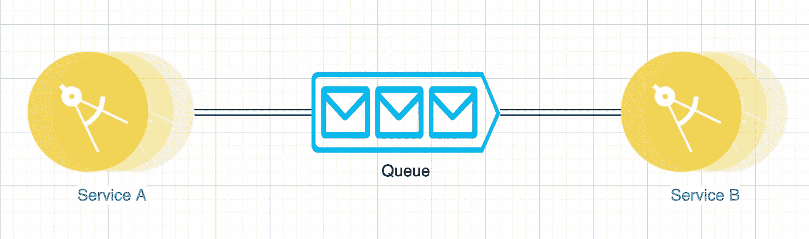
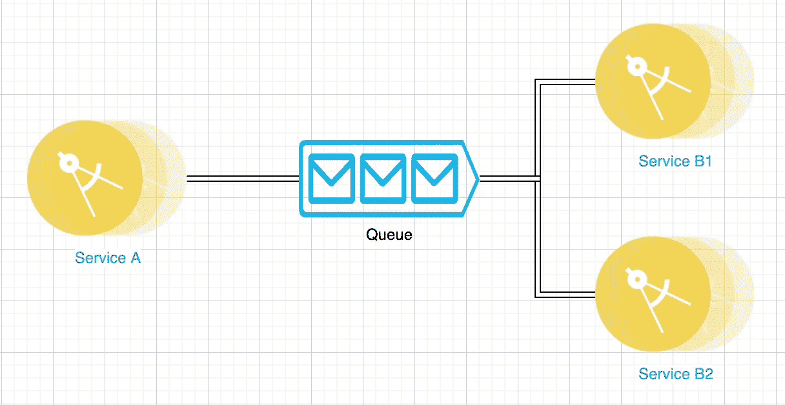
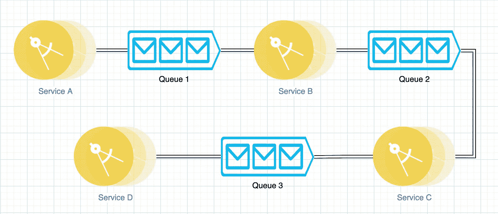
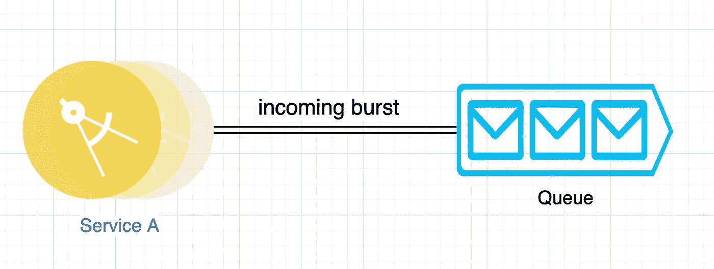
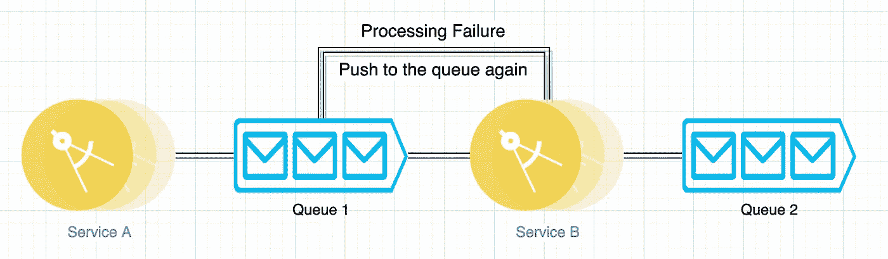
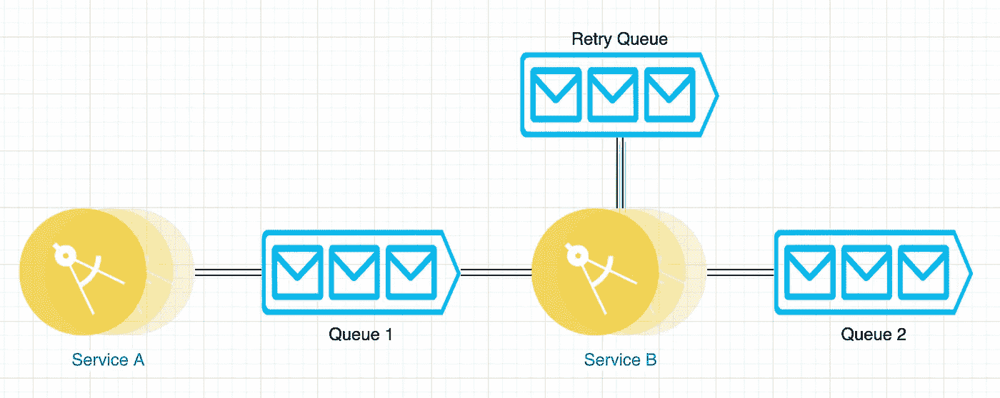
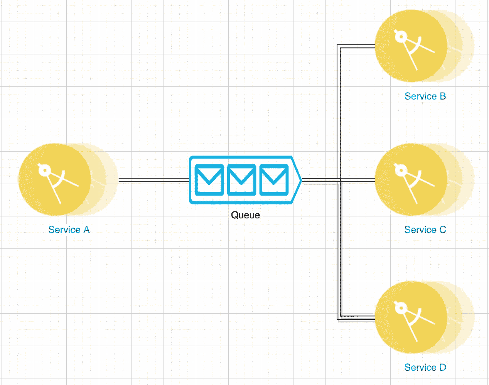

# 排队的好处

> 原文：<https://medium.com/codex/power-of-queue-5eb92e40d50e?source=collection_archive---------8----------------------->

如今，几乎每个大型系统都以这样或那样的形式使用队列。它们是**事件驱动**架构的核心。它们构成了**异步**的基础。每天使用队列传输的消息数量可能是无法计数的。大规模工作的组织，例如 **Twitter、YouTube 和 Amazon** 使用队列来传输消息。

消息队列带来的力量是不可抗拒的。我在下面列出了几个队列的伟大应用，这些应用使它们真正物有所值。

## 退耦

队列允许将服务相互分离。消费消息的服务不需要知道消息的来源，产生消息的服务不需要知道消息的目的地。

队列:解耦

队列充当一个抽象层，允许消费者使用来自任何队列的消息，允许生产者向任何队列发送消息。

## 并行执行

通过使用队列和侦听请求的多个使用者，可以并行处理请求。

队列:并行执行

## 管道铺设

有了队列，请求的不同阶段可以由系统中不同的独立部分来处理。

队列:流水线

## 短时间爆发

队列可以吸收突发的请求并缓冲它们，直到它们被消费者使用，从而为整个系统留出一些喘息空间。

队列:传入突发

## 重试次数

消息可以在失败时重新发布，并在一段时间后重试。它们可以被推送到同一个队列或专门为保存此类消息而创建的另一个队列。

队列:使用同一队列重试

队列:使用重试队列(另一个队列)重试

## 广播

消息可以被有效地广播到相关队列，每个消息都是原始消息的副本，并且可能被用于不同的用例，例如状态转换、日志记录、审计跟踪等。

队列:广播

排队系统提供的一些其他强大功能包括消息复制、消息生存时间、基于时间的重试、持久性、队列铲取等。

> 这是我最近写的关于设计模式的书的链接。希望你会觉得有用。

 [## 面向 Java 开发人员的软件设计模式:专家主导的构建可重用软件的方法和…

### 面向 Java 开发人员的软件设计模式:专家主导的构建可重用软件的方法和…

www .亚马逊. in](https://www.amazon.in/Software-Design-Patterns-Java-Developers/dp/9391392474)