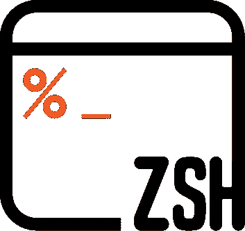
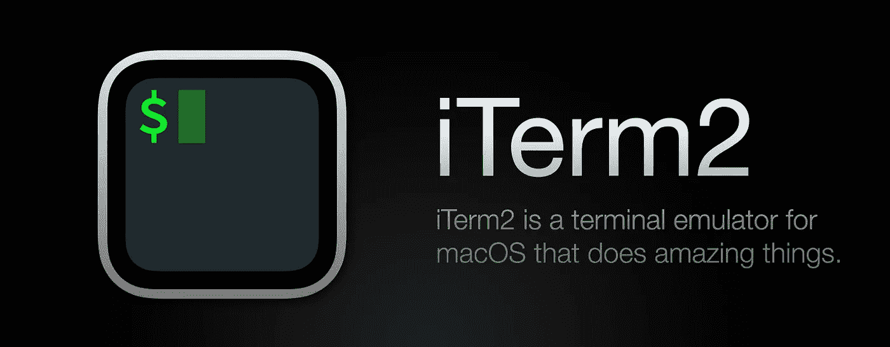
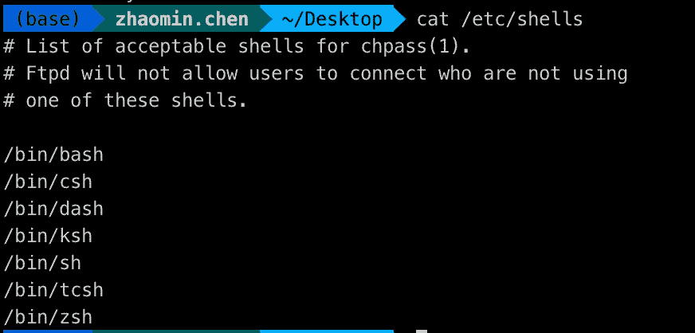
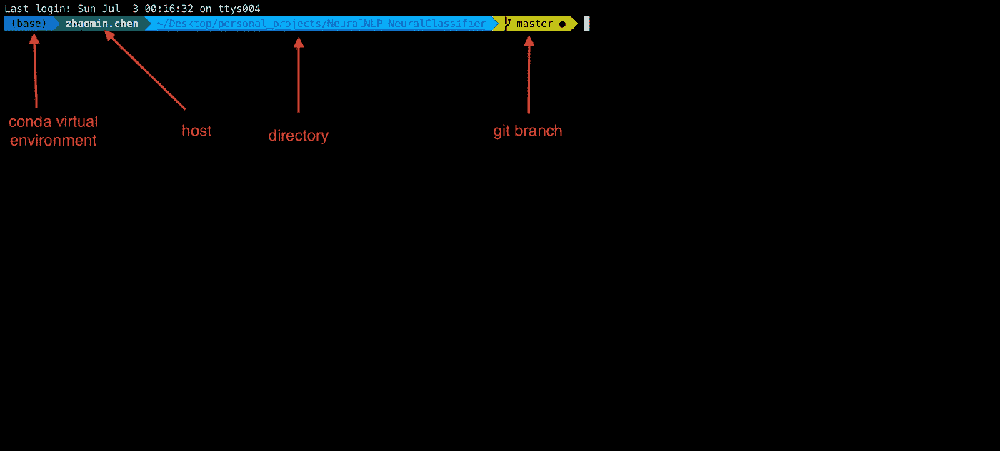
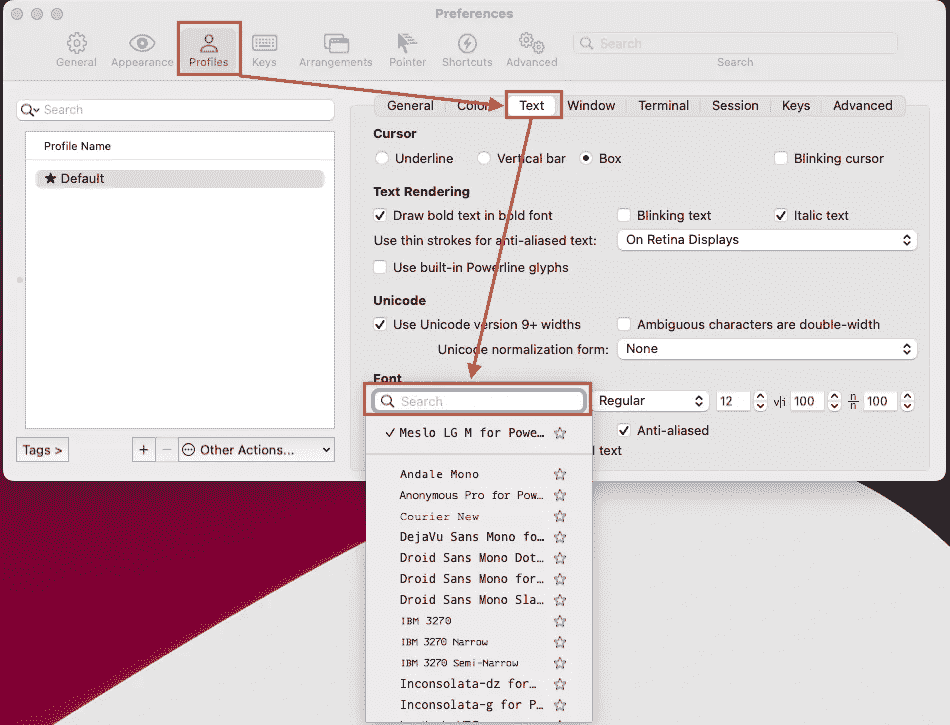

# 用 zsh 和 iTerm2 给自己充电

> 原文：<https://medium.com/codex/power-yourself-with-zsh-and-iterm2-3b2a9a202e7d?source=collection_archive---------5----------------------->



[https://www.zsh.org/](https://www.zsh.org/)



来源:https://iterm2.com/

# **Mac/Linux 支持的外壳**

无论在 macOS 还是 Linux 中，默认 shell 都是 bash。然而，我们在 macOS/Linux 中有许多 shells 可供选择，例如 zsh、csh 等。你可以看一下*/etc/shell*来检查支持的 shell:



您可以使用以下命令检查您的默认 shell:

```
echo $SHELL
```

# **为什么选择 zsh**

很多 mac 用户是赞成 zsh 的。对我来说，与 bash 相比有几个优点:

1.  更智能的命令推荐。无论你是想尝试一些 shell 命令还是跳转到一些特定的文件夹，`tab`键都是你所需要的。
2.  你可以为 zsh 选择更多有趣的主题
3.  如果目录是 git repo，zsh 可以显示 git 分支名称


# **macOS 设置**

## iTerm2

我想推荐使用 ITER ms([https://iterm2.com/](https://iterm2.com/))。iTerms 中的许多惊人特性可以让你更有效率。

## 哦，我的 Zsh

虽然 macOS 已经有了它的 zsh，但是我还是推荐使用 Oh My Zsh([https://ohmyz.sh/#install](https://ohmyz.sh/#install)，[https://github.com/ohmyzsh/ohmyzsh](https://github.com/ohmyzsh/ohmyzsh))。安装它的简单脚本:

```
sh -c "$(curl -fsSL https://raw.github.com/ohmyzsh/ohmyzsh/master/tools/install.sh)"
```

现在外壳会切换到 zsh。和之前的 bash 配置文件`~/.bashrc`一样，zsh 的配置文件现在是`~/.zshrc`。

这里需要注意的是，在 Mac 上安装 Oh My Zsh 之后，你的系统会生成一个新的`.zshrc`文件。这里有两种情况:

1.  如果你使用默认的 zsh，你旧的`.zshrc`文件的内容将全部转移到`.zshrc-pre-oh-my-zsh`。所以，如果你有一些定制的配置，最好把它们从`.zshrc-pre-oh-my-zsh`复制到`.zshrc`里
2.  如果您使用的是 bash，您还可以将您的定制配置从`.bashrc`或`.bash_profile`复制到`.zshrc`。或者您可以简单地将以下命令放入`.zshrc`:

```
source ~/.zshrc
source ~/.bash_profile
```

## zsh 主题

在`~/.zshrc`中，您可以使用以下命令设置 zsh 主题:

```
ZSH_THEME="robbyrussell"
```

你可以在`~/.oh-my-zsh/themes`中找到 Oh My Zsh 的所有主题。此外，您还可以在[我的 Zsh 主题](https://github.com/ohmyzsh/ohmyzsh/wiki/themes)中查看所有主题的详细信息。

对我来说，我对主题`agnoster`做了一些修改:



第一个是 conda/pyenv 虚拟环境，下面是主机名、目录和 git 分支。修改后的主题文件在这里是，命名为`agnoster-custom.zsh-theme`。下载文件后，您可以将其放入`~/.oh-my-zsh/custom/themes`，并在`~/.zshrc`中更改设置:

```
ZSH_THEME="agnoster-custom"
```

你也可以根据你的喜好改变主题，在这里按照 zsh 语法。

记得运行`source ~/.zshrc`来激活您的更改

## 电力线设置

Powerline 是 vim 的一个状态行插件，为其他几个应用程序提供状态行和提示，包括 zsh、bash、tmux、IPython、Awesome、i3 和 Qtile。(参考来自[电力线](https://powerline.readthedocs.io/en/master/overview.html)

整个设置如下:

1.  您可以使用 pip 简单地安装电力线:

```
pip install --user powerline-status
```

`--user`确保将 powerline 安装到`~/.local`中，方便您管理。

2.运行以下命令安装电力线字体:

```
git clone [https://github.com/powerline/fonts.git](https://github.com/powerline/fonts.git)
cd fonts
./install.sh
```

3.您还需要将以下内容添加到`~/.zshrc`中，以使 zsh 能够使用电力线字体:

```
export PATH=$HOME/.local/bin:$PATH
. ~/.local/lib/python3.7/site-packages/powerline/bindings/bash/powerline.sh 
```

运行`source ~/.zshrc`后，一些奇怪的事情发生了:


这是因为您还没有设置 iTerm2 的字体:



Mac iTerm2 字体设置

尝试搜索以`Powerline`结尾的字体。

那么一切都结束了，你现在可以开始你的新 ZSH 了！