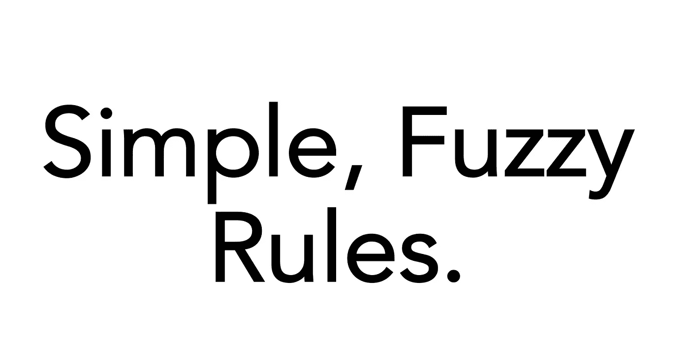
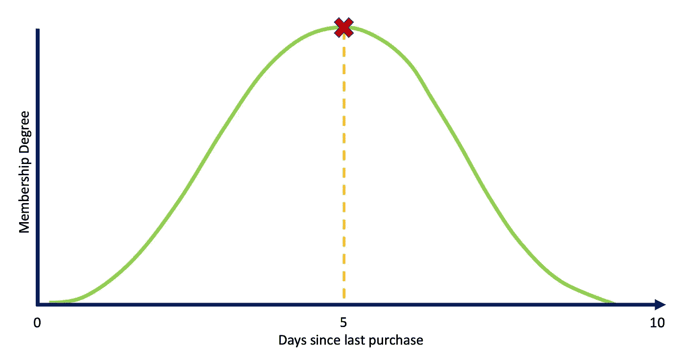

# 实用人工智能-模糊解决方案。

> 原文：<https://medium.com/codex/practical-ai-a-fuzzy-solution-beaa6cb79228?source=collection_archive---------6----------------------->

在这篇文章中，我将介绍我们如何使用一种鲜为人知的数学——模糊逻辑——创造出一个实用的人工智能解决方案。

# “我们能做什么？”

工程师是修补匠。我们建造东西。有时候，它们很有用。我数不清我做了多少最终毫无用处的东西。尽管如此，我喜欢制作它们的每一秒钟。从我记事起，这种热情就伴随着我。坐在小学里，我会把笔拆开，看看它们是如何工作的。直到我上了大学，我都不知道有多少像我这样的修补匠存在。沿着进入学术界的道路，我能够建造东西。很多事情。数千行代码。一路上，我意识到我们在问这个问题，“我们能做什么？”探索可能性的极限是研究人员最擅长的。如果没有科学家问我们能做什么，我们会怎么样？

# “我们该怎么办？”

当问题不再是“我们能做什么？”时，每个研究人员的工作都会遇到这种情况；取而代之的是“我们该怎么办？”这是我在很多场合纠结过的问题。它的共同主题是——为复杂的问题构建实用的解决方案。仅这个主题就可以产生许多帖子，但我想专注于我所创造的可以说是最实用的东西——一个可解释的人工智能(XAI)工具，用于揭示简单的数据规则。毫无疑问，这个工具正是我应该做的。

# 简单的规则

可以说，在实验室之外使用人工智能最具挑战性的部分是描述它在做什么，它有什么不同，以及为什么有人应该使用它。交流复杂的算法是我每天都会遇到的一个障碍。为了开发有价值的东西，我需要找到别人没有直接解决的有价值的问题，这就是我们所做的。

我们的咨询公司访问了我们的内部数据和一些客户，他们很高兴并愿意让我们进行实验。这些数据集中有两个共同的线索:

1.  每个组织都觉得他们无法解开数据的秘密。
2.  我们可以代表光谱上的每个数据点。

在确定了这些共性之后，问题和解决方案就显而易见了。我需要构建一种算法，能够从数据中提取见解，并将这些见解传达给组织中的决策者。简单吧？

这个问题变成了一个由三部分组成的解决方案:

1.  代表数据
2.  确定学习框架
3.  将见解转化为行动

第 1 部分:表示数据
这是一颗难以下咽的药丸，但知道如何有效地用数学表示数据是一门艺术和科学。我的大部分研究都是在研究模糊逻辑(师从一些大师，比如[吉姆·凯勒博士](https://scholar.google.com/citations?user=TwmyWYYAAAAJ&hl=en))。我不能在本文中深入研究模糊逻辑，但模糊逻辑(在我看来)是在现实世界中转化数据洞察力的最佳方式——在现实世界中，数据是不确定的。简而言之，模糊逻辑可以在传统的黑色或白色数学中传达灰色。它允许我们从数据中提取规则，这些规则可以很容易地翻译给人类。

**第二部分:确定学习框架** 深度学习对于 AI 社区中(甚至社区外)的任何人来说都是一个熟悉的时髦词。深度学习(又名人工神经网络)是一套高效的机器学习算法，专门用于优化功能。神经网络因其黑盒性质而臭名昭著，在这种情况下，很难从他们从数据中学到的东西中提取洞察力。然而，通过适当的设置，我们可以构建一个学习模糊规则库(或一组模糊规则)的神经网络。

**第 3 部分:将见解转化为行动** 如果你从这篇文章中没有学到任何东西，你应该知道任何机器学习、人工智能、数据科学解决方案中最具挑战性的部分是翻译你的结果。在解决方案的细节和非专家之间找到一个中间立场是很复杂的。然而，我相信我们的复杂算法有效地转化了数据洞察力。一旦算法完成学习，就会出现两种主要的解释。

1.  **简单、模糊的规则**

“*如果 X 那么 Y* ”就是一个规则格式的例子。如果你决定涂防晒霜，考虑一下这个例子。规则可以是:

> **“如果是晴天，那就涂防晒霜。”**

阳光和防晒霜出现在一个光谱上。阳光充足的程度会告诉你使用哪种防晒霜。**所以，模糊规则很容易翻译成自然语言。**

2.**可视化**

文字解释很容易理解，但可视化结果往往能让人理解得更深。规则的一个反复出现的问题围绕着对先行词(或“X”)的理解。在训练过程中，我们学习了决定模糊隶属度范围的参数。我们的用户想要知道前因的理想值，以便进行干预，确保这些值朝着正确的方向发展。

例如，一家公司决定他们应该何时联系客户进行下一次购买。我们可以学习一个规则，该规则可以模拟适当的接触时间，以增加该客户再次购买的可能性。

> “如果购买已经过了很长时间，那就联系一下。”

在这种情况下，规则将决定联系每个客户的最佳时间。视觉上，我们可以在下面的图中表示每个规则。“X”表示联系尚未购买的客户的理想时间(即五天)。

这个图也让我们看到了规则是多么的敏感。也就是说，我们可以问数据这样一个问题，“什么时候是联系客户 A 的合适时机？”或者“如果我们等十天而不是五天会怎么样？”模糊隶属图是一种通过向用户提供与原始值相关的信息来将每个数据点上下文化的方法。有了这些信息，某人就可以知道何时干预某个问题以及不干预的后果。

# 结论

我希望你已经从这篇文章中了解了让人工智能变得实用的必要性，并理解了一种转化实用见解的方法——产生简单的规则。多年来，工程师、数学家和科学家有效地回答了“我们能做什么？”现在是我们把它变成现实的时候了——让世界变得更美好。

要了解更多信息，[给我发消息](mailto: Bryce.Murray@thinkaperio.com)并访问我们的网站[https://thinkaperio.com](https://thinkaperio.com)

请务必订阅:)并且不要忘记，如果你喜欢它，你可以多次鼓掌！