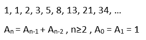
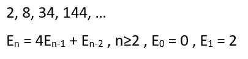
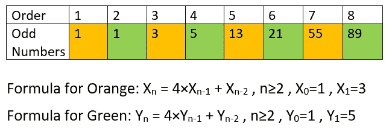
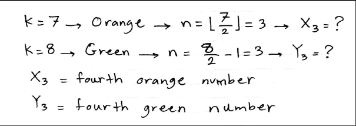

# 用数学智力题练习算法第 2 部分

> 原文：<https://medium.com/codex/practice-algorithms-with-math-puzzles-part-2-45fb40ecfa32?source=collection_archive---------6----------------------->

## [法典](http://medium.com/codex)

## 你好，我来解释一下**寻找斐波那契数列中第 k 个**偶数**和第 k 个**奇数**的两个**算法。

照片由[克里斯·利维拉尼](https://unsplash.com/@chrisliverani?utm_source=unsplash&utm_medium=referral&utm_content=creditCopyText)在 [Unsplash](/s/photos/math?utm_source=unsplash&utm_medium=referral&utm_content=creditCopyText) 上拍摄

如果你没听说过，斐波纳契数列是这样的:

图片 1

它的偶数项是 2，8，34 等等。我想到的第一种方法是使用 for 循环来生成序列，并在前进的过程中跟踪偶数，当我们到达第 k 个偶数时，我们退出并返回它。

但是，如果你注意斐波纳契数列的偶数，并稍微摆弄一下，你会注意到有一个公式可以生成它们:

图片 2

这样，当我们想找到第 n 个偶数时，就不需要之前斐波纳契数列的所有数字了。下面的函数遵循图 2 并返回我们想要的。

第 3 行中的“elif”相当于 python 中的“else if”。

我们通过更新变量 a 和 b 来跟踪前两项，并使用它们来生成图 2 中序列的下一个值。

现在我们来看看如何高效地找到斐波那契数列中的第**个奇数**。这个更棘手也更酷。如果我们拿出那些奇数并注意，我们会发现一个模式。下图显示了这一过程。顺序意味着它们彼此之间的相对顺序，并且等于 k，因此图 3 中 3 的顺序意味着斐波那契数列中的第三个奇数(k=3)。公式是相同的，但是开始的配对是不同的。

图 3

在寻找斐波那契数列的第 k 个奇数时，如果 k 是奇数的，我们认为是橙色的，应该在橙色的数列中找到索引为(k//2)的数字。如果 k 是**偶数**我们认为**绿色**并且应该在**绿色**系列中找到索引为((k/2)-1)的数字。这样，我们只需要绿色或橙色的斐波那契数列，当给定的 k 很大时，它可以大大减少运行时间。

图 4

这是它的代码:

在第 2 行中，如果输入不是整数，函数会产生错误。

感谢阅读。

这是上一部分的链接:

 [## 用数学智力题练习算法第 1 部分

### 你好，我们要解决一个关于回文数字的谜题。

medium.com](/codex/practice-algorithms-with-math-puzzles-part-1-82e4a4d9b644)