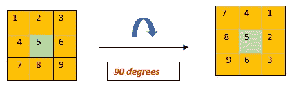

# 用数学智力题练习算法第三部分矩阵旋转

> 原文：<https://medium.com/codex/practice-algorithms-with-math-puzzles-part-3-matrix-rotation-b853a8edb204?source=collection_archive---------13----------------------->

你好，在这一部分我将解释 2D 矩阵的原地旋转，而不使用另一个矩阵来存储，所以我们只需改变原始矩阵。


卡拉·埃尔南德斯在 [Unsplash](/s/photos/puzzle?utm_source=unsplash&utm_medium=referral&utm_content=creditCopyText) 上的照片

我将把旋转角度为 90 度的情况解释为地面情况，然后再谈其他情况，如-90 度、180 度、270 度。



图片 1

如你所见，我们正在处理两个正方形，橙色和绿色。我们应该想办法把左边的橙色方块变成右边的。下面的算法对每个原地方块都这样做。

如果我们想就地做，那么我们的矩阵显然应该是平方的。

正方形的数量是矩阵大小的一半。

```
**def****rotate_matrix(M):**
 **N=len(M)** # Loop through all squares    **for** **i** **in****range(0, int(N /****2)):**
        # Consider elements in group of 4 in current square
 **for** **j** **in****range(x, N-i-1):
            temp =** **M****[i][j]
            M[i][j] =** **M****[N -****1****-****j][i]
            M[N -****1****-****j][i] =** **M****[N -****1****-****i][N -****1****-****j]
            M[N -****1****-****i][N -****1****-****j] =** **M****[j][N -****1****-****i]
            M[j][N -****1****-****i] =****temp**
```

为了更好的理解，我在这里画了一个 3x 3 矩阵的算法内部发生了什么。


图片 2

请注意，由于我们索引矩阵以访问元素的方式，我们可以实现图 2 中的每个步骤。

旋转-90 度和 270 度的情况是相同的。对于-90 度情况，我们使用类似于 90 度情况的算法:


图 3

我们在每个正方形的四个一组中互相替换元素的方式与我们做 90 度的方式相反，这反映在我们在内部循环中的索引中。

```
**def****rotate_matrix(M):
    N=len(M)
**    # loop through all squares    
 **for** **i** **in****range(N //****2):
**        # Consider elements in group of 4 in current square
 **for** **j** **in****range(i, N-i-1):
**            # store current cell in temp variable
 **temp =****M[i][j]
**            # move value from right to top
 **M[i][j] =****M[j][N-1-j]** # move value from bottom to right
 **M[j][N-1-i] =****M[N-1-i][N-1-j]** # move value from left to bottom
 **M[N-1-i][N-1-j] =****M[N-1-j][i]** # assign temp to left
            **M[N-1-j][i] =****temp**
```

对于 180 度旋转的情况，我们以相反的顺序交换第一行和最后一行的元素，依此类推。对于奇数大小的矩阵，当我们到达中间行时，我们只需反转它。


图 4

```
**def rotate_matrix(M):**
 **N = len(M)
    for i in range(N // 2):**        **for j in range(N):
            temp = M[i][j]
            M[i][j] = M[N - i - 1][N - j - 1]
            M[N - i - 1][N - j - 1] = temp**# the case when the matrix has odd dimensions **if N % 2 == 1:
        for j in range(N // 2):
            temp = M[N // 2][j]
            M[N // 2][j] = M[N // 2][N - j - 1]
            M[N // 2][N - j - 1] = temp**
```

感谢阅读。