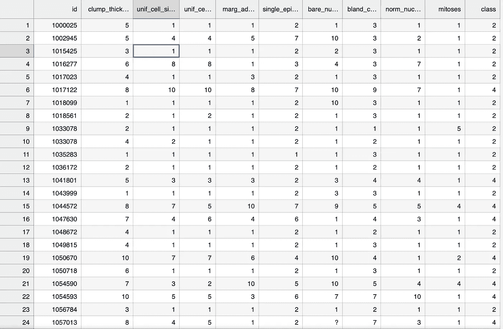

# 实践:在乳腺癌数据中使用 K-最近邻

> 原文：<https://medium.com/codex/practice-using-k-nearest-neighbors-on-breast-cancer-data-2c8b9e0ed151?source=collection_archive---------12----------------------->

## Sentdex 教程笔记

下面是 YouTube 上的教程链接:

或者，如果您喜欢更多基于文本的教程，请访问以下网页:

[](https://pythonprogramming.net/k-nearest-neighbors-application-machine-learning-tutorial/) [## Python 编程教程

### 欢迎来到 Python 机器学习教程系列的第 14 部分。在上一部分中，我们介绍了…

pythonprogramming.net](https://pythonprogramming.net/k-nearest-neighbors-application-machine-learning-tutorial/) 

如果你有兴趣学习 Python 中机器学习的基础知识以及如何使用 scikit-learn，我鼓励你浏览整个播放列表。我认为 Sentdex 用非常容易理解的术语解释了一切，这足以让我了解每个算法的要点。

在 2022 年重新看这个教程时，我发现 1:1 复制代码是行不通的，可能是因为这些库在教程完成后已经更新了。下面我想分享一下我对这个小项目的最新记录。我发现写这个非常有帮助，万一我需要它作为将来的参考，以及提醒我(作为一个完全的 Python 初学者)为什么代码是这样写的。

**第一步:下载并浏览数据**

您可以从 UCI 机器学习知识库中获取数据，具体来说就是从以下链接中获取数据:

[https://archive . ics . UCI . edu/ml/datasets/breast % 2b cancer % 2b Wisconsin % 2B(原文)](https://archive.ics.uci.edu/ml/datasets/breast%2Bcancer%2Bwisconsin%2B(original))

进入“数据文件夹”，您将看到以下内容:


我们需要下载“乳腺癌-威斯康辛. data”和“乳腺癌-威斯康辛. names ”,以便按照教程进行操作。的”。data”文件包含我们想要分析的实际数据表，而。names”文件包含对数据的简要描述，这将对我们了解背景非常有用。在我的例子中，我只需将扩展名改为。人名”到。txt 格式和"。数据”一到 CSV 格式，这将使事情变得更容易。

来自数据描述文件的一些重要观察结果:

*   表格包含 699 行数据
*   表格包含样本号、用作确定细胞是良性还是恶性的变量的属性，以及目标值本身(名为“类”)
*   类别分为 2 种类型:2 为良性，4 为恶性
*   有 16 行存在单个缺失的属性，用“？”表示。
*   在数据中，65.5%是良性的，而 34.5%是恶性的

我们在这里的目标是使用 K-最近邻来尝试和看看我们的模型是否可以尽可能接近预测，基于可用的数据，癌细胞是良性的还是恶性的。

打开 CSV 文件，我们发现我们有全套数据，但它们没有按列区分。所以第一步就是这么做。我们知道描述中给出的列名:


与本教程中一样，我们可以通过在 CSV 文件的第一行之上插入新的一行，并直接添加列名来手动完成。您喜欢如何命名这些列并不重要，但最终它应该类似于下面的代码片段:



我用 Jupyter 实验室来做这个

现在，我认为我们已经准备好进入 Python 代码了

**第二步:导入库**

以下是您需要在此项目中导入的库:

```
import numpy as np 
from sklearn.model_selection import train_test_split
from sklearn import neighbors
from sklearn.metrics import accuracy_score
import pandas as pd
```

*   numpy，因为我们需要将特征和标签转换成 numpy 数组，然后再将它们输入 KNN 算法
*   train_test_split 将数据集拆分为训练和测试数据集。
*   邻居使用 KNN 的训练数据，这些数据最终将被用来做出预测
*   accuracy_score 将用于查看我们的预测与实际值的接近程度
*   熊猫，因为我们必须处理数据帧

**第三步:导入并清理数据**

现在我们使用 pandas 读取 CSV 文件(在这种情况下，CSV 文件的位置与 Python 脚本的位置相同)，让我们快速了解一下 DataFrame 格式的数据:

```
df = pd.read_csv("breast-cancer-wisconsin.csv")
df.head()
```

您应该看到类似这样的内容(获取前 5 行数据):


接下来，我们做一点清理工作。还记得在我们所做的观察中，有用“？”表示的缺失属性吗在数据中。我们需要删除这些，因为它可能会影响我们的算法。有两种方法可以做到这一点，要么我们可以完全删除所有 16 行，或者按照教程，我们可以用-99999 替换它们。我们碰巧能够使用第二个，因为正如我们在属性描述中看到的，每一列(除了 id 和 class)恰好是一个从 1 到 10 的值。这意味着我们放入的包含-99999 值的行将被视为异常值，不会影响我们算法的预测。

```
df.replace('?',-99999, inplace=True)
```

最后，我们知道样本 ID 与我们算法的预测无关，因为它与我们的癌细胞是良性还是恶性没有关系。让我们也摆脱它。

```
df.drop(columns=['id'],axis=1,inplace=True)
```

**第四步:在将数据送入算法之前对其进行预处理**

因此，除了类(2 或 4)之外的任何东西都将是确定值的变量(“features”，用 x 表示)，而类本身将是预测的目标值(“labels”，用 y 表示)。我们将以 numpy 数组而不是 DataFrame 格式来分隔它们:

```
x = np.array(df.drop(columns=['class'], axis=1))y = np.array(df['class'])
```

现在我们只需将整个数据分成两部分:一部分用于训练，另一部分用于测试。为此，我们使用之前导入的 train_test_split:

```
x_train, x_test, y_train, y_test = train_test_split(x,y,test_size = 0.2)
```

上面的代码只是意味着我们将把 x 和 y 分成训练数据和测试数据。80%的数据将用于训练 KNN，20%将用于测试。总的目标是，在我们训练算法并做出预测后，我们将其与 y_test 进行比较，看看我们的预测与实际值有多接近，并给它打分。

但是我想得太多了。

**第五步:用我们的训练数据集训练模型，进行预测并测试其准确性**

我们只需要做以下事情来训练数据:

```
clf = neighbors.KNeighborsClassifier()
clf.fit(x_train, y_train)
```

请记住，我们使用了 x_train 和 y_train 中存储的整个数据集的 80%。

既然模型已经训练好了，我们就可以尝试使用剩下的 20%的数据(特别是 x_test)进行预测，并将它们与我们的 y_test 进行比较，并给它一个接近程度的分数。完整代码如下:

```
y_pred = clf.predict(x_test)accuracy = accuracy_score(y_test, y_pred)
accuracy
```

您可以看到如下结果:


这仅仅意味着我们的模型与实际的 y_test 结果相比有 95%的准确性。还不错，但肯定需要改进。但是就教程来说，这对于今天已经足够了。

**使用该算法预测新样本**

假设我们有几个新样本，我们想用这个模型来预测它们是良性的还是恶性的。我们可以简单地将它们包含在一个 numpy 数组中，并将它们输入到模型中，这将为我们提供一个结果。

```
example_data = np.array([[4,2,1,1,1,2,3,2,1], [8,9,9,9,10,4,9,8,1]])
example_data.reshape(len(example_data), -1)predictions = clf.predict(example_data)predictions
```

这里每个数组有 9 个值，因为有 11 列，其中一列包含样本 ID(我们不需要)，最后一列是类(我们试图找到它)。此外，numpy 因为一些不赞成的警告而要求我们对数据进行整形，并告诉我们如果只有一个标签就整形为(1，-1)，如果只有一个特征就整形为(-1，1)。我们的例子肯定是前者，因为我们有 2 个数据集，我们将其整形为(2，-1)。

我们的结果如下，这意味着第一个样本是良性的，第二个样本是恶性的:


如果你有兴趣浏览 Sentdex 的 Python 机器学习教程的完整播放列表，你可以点击下面的链接直接进入: