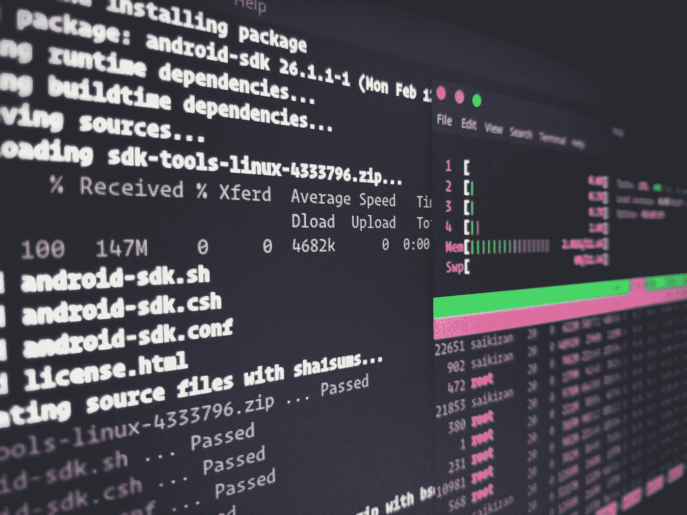

# 用 Chromebook 练习 Linux

> 原文：<https://medium.com/codex/practicing-linux-with-chromebook-8bd806d4add9?source=collection_archive---------13----------------------->

在这里，我将谈论如何使用一种叫做 Chromebook 的廉价上网本来处理 Linux 操作系统。正如我在以前的故事中所说的，我一直在花时间使用 Linux，并试图获得 Linux 认证。在这个过程的这一点上，我正在做实验，在那里我可以实践操作 Linux。然而，我没有在我目前的电脑上工作…