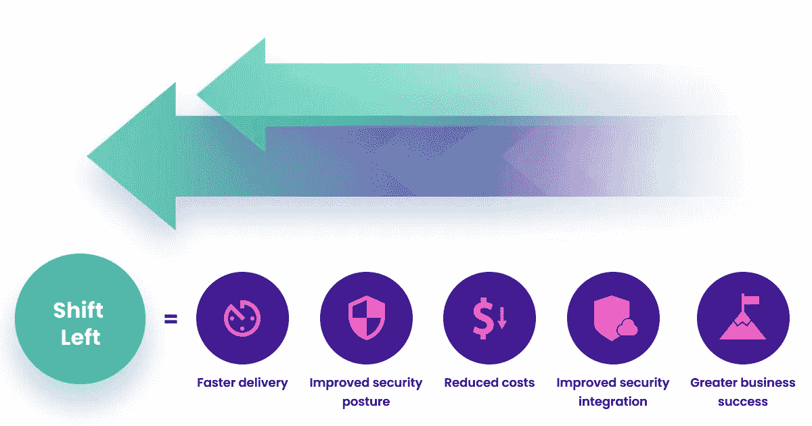
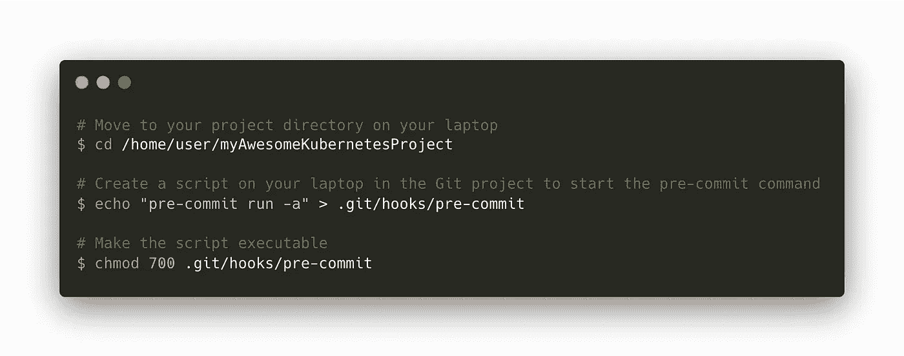
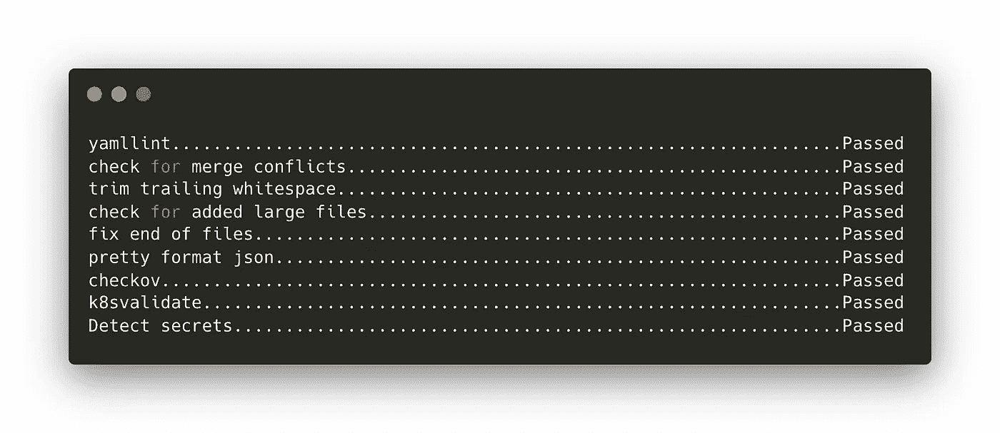

# DevOps 工程师应该知道如何控制 Kubernetes

> 原文：<https://medium.com/codex/pre-commit-hooks-devops-engineer-should-know-to-control-kubernetes-febf5557df0b?source=collection_archive---------3----------------------->


照片由 [*利亚姆塔克*](https://unsplash.com/@itsliamtucker?utm_source=unsplash&utm_medium=referral&utm_content=creditCopyText) *上* [*Unsplash*](https://unsplash.com/s/photos/security?utm_source=unsplash&utm_medium=referral&utm_content=creditCopyText)

一般来说，所有公司都在寻求提高各个层面的生产率:人力、基础设施、流程等。通常，这种生产率是通过增加自动化流程来促进和提高生产速度来实现的。这种自动化需要对历史上使用的概念进行演变、调整甚至完全转变。这包括安全策略的实施和控制。

事实上，自从基于敏捷性和灵活性的新工作方法(如 DevOps)出现以来，一些安全概念不得不适应基础架构组件的开发和管理步伐。今天，最好的安全实践之一是在集成链中尽可能早地移动这些控制点，以便尽快检测到任何值得特别注意的异常情况。

# 你为什么要转移左边的安全？

术语“左移”是由 DevSecOps 方法通过增加开发、安全和操作团队之间的协作而引入的。其思想是通过将安全性和测试过程移到 SDLC 的传统线性表示的左侧，从开发周期的开始就保证应用程序的安全性。

这种方法多年来一直被认为是最佳开发实践，自从 DevOps 方法出现以来，由于其使用和配置的简单性以及在复杂项目(如使用 Terraform、Ansible 或 Kubernetes 进行基础设施管理)的团队协作方面的难以置信的好处，这种方法得到了广泛采用。



[左移安全性:入门最佳实践](https://snyk.io/learn/shift-left-security/)

强制在 YAML 定义文件开发级别和它们的内容和配置级别使用标准有助于它们的阅读、采用和维护。今天任何项目都应该实现的三个原则。

安全性左移的目的是设计具有集成安全性最佳实践的软件，并在开发过程中尽可能早地检测和解决潜在的安全问题和漏洞。这使得解决安全问题更容易、更快、更经济。

# 怎么左移？

[预提交](https://pre-commit.com/)是一个命令行工具，是该系列工具的一部分，用于通过在每次提交后添加自动控制点来左移某些安全方面。

这使得在集成管道中尽早检测和控制任何异常成为可能，从而在投入生产之前对其进行纠正。

为此，需要三个步骤:

*   预提交要求安装在您的机器上
*   名为“”的配置文件。pre-commit-config.yaml”必须在 Git 项目的根目录下创建，并使用钩子进行配置
*   Git 项目需要在本地配置，以便在每次提交时自动执行命令



# 重要考虑事项

正如您在上一节中所理解的，预提交命令和 Git 项目必须在本地配置为自动运行。这不是可以从远程源控制器强制执行的配置。这需要在入职阶段进行项目配置，以确保其应用。因此，需要文件来传播信息并确保其被采纳。

根据上下文，通过开发一个环境配置脚本(在这种情况下，所有团队成员的笔记本电脑)或者甚至创建、共享和鼓励团队使用一个带有所有必要开发工具的公共容器映像，仍然可以实现其使用的自动化。这种做法有很多优点，特别是在新员工入职时，最大限度地减少了配置开发环境所需的操作。

然而，如果这不适用或者看起来太复杂，总是有可能将这些控件进一步向下移动到集成链中，从而在部署之前自动使用它们。

# 您可以使用哪些钩子来控制 Kubernetes 资源？

本节列出了一组钩子，这些钩子可以免费使用，并且可以通过预提交很容易地安装和使用。这是一个固执己见的列表，显然可以根据上下文用其他钩子来补充。为了便于阅读，我们已主动将该名单缩减至 Kubernetes 生态系统。

下面是一个预提交扩展列表，有助于在集成管道中尽快检查 Kubernetes 资源的开发和维护:

*   [检查-合并-冲突](https://github.com/pre-commit/pre-commit-hooks#check-merge-conflict)在提交任何事情之前检查合并冲突
*   [尾随空格](https://github.com/pre-commit/pre-commit-hooks#trailing-whitespace)，将代码从无用的空格中清除
*   [检查添加的大文件](https://github.com/pre-commit/pre-commit-hooks#check-added-large-files)以控制存储在您的存储库中的文件的大小
*   确保文件以一个新行结束，并且只有一个新行
*   [Yamllint](https://github.com/adrienverge/yamllint) 在每次提交前自动识别代码的格式错误，这对于规范代码和方便阅读非常重要
*   [Yamlfix](https://github.com/lyz-code/yamlfix) 自动化格式修正
*   根据最佳开发实践和定制规则，检查 Kubernetes 定义文件的符合性
*   [K8svalidate](https://github.com/Agilicus/pre-commit-hook-k8svalidate) 根据使用的 Kubernetes 版本检查 Kubernetes 定义文件的符合性
*   [Detect-secrets](https://github.com/Yelp/detect-secrets) 检测任何敏感数据，避免它们存储在代码中

这些挂钩中的大多数也适用于其他上下文。根据项目的性质，可以添加其他几个挂钩来控制文件及其内容的格式。然而，保持一个简短的清单，以尽量减少这些对你的生产力的影响。

这里有一个预提交配置文件，可以在您的 Kubernetes 项目上快速测试这些钩子:

```
---
repos:
  - repo: https://github.com/adrienverge/yamllint.git
    rev: v1.17.0
    hooks:
      - id: yamllint
        args: [-c=.yamllint]
  - repo: https://github.com/pre-commit/pre-commit-hooks
    rev: v4.1.0
    hooks:
      - id: check-merge-conflict
      - id: trailing-whitespace
      - id: check-added-large-files
      - id: end-of-file-fixer
        args: [--no-ensure-ascii, --autofix]
  - repo: https://github.com/bridgecrewio/checkov.git
    rev: 2.0.975
    hooks:
      - id: checkov
        args: [-d .]
  - repo: https://github.com/Agilicus/pre-commit-hook-k8svalidate.git
    rev: v0.0.8
    hooks:
      - id: k8svalidate
        files: .yaml$
  - repo: https://github.com/Yelp/detect-secrets
    rev: v1.2.0
    hooks:
      - id: detect-secrets
```

复制此文件的内容，并将其粘贴到名为“”的文件中。项目根文件夹中的“pre-commit-config.yaml”。然后运行预提交命令来获得结果！



成功的预提交挂钩示例

# 下一个？

在本文中，我们列出了一组预提交挂钩，对于任何管理一个或多个 Kubernetes 集群的人来说都非常有用。当然，还有许多其他适应不同环境的方法。例如，DevOps 工程师会对控制 [Prometheus 配置](https://github.com/fortman/pre-commit-prometheus)甚至格式化规则的扩展，或者[浮动文件控制](https://github.com/ashwin153/pre-commit-vagrant)等感兴趣。

可以控制的东西是没有限制的，但是仍然有必要衡量这些挂钩的积累对一个人的生产力的影响以及它们带来的好处。

有关预提交的更多信息，请参考以下链接:

*   [预提交网站](https://pre-commit.com/)
*   [左移安全性:入门最佳实践](https://snyk.io/learn/shift-left-security/)

# 关于作者

Hicham Bouissoumer —现场可靠性工程师(SRE) — DevOps

[Nicolas Giron](https://www.linkedin.com/in/nicolas-giron-6129b0a1/) —现场可靠性工程师(SRE) — DevOps