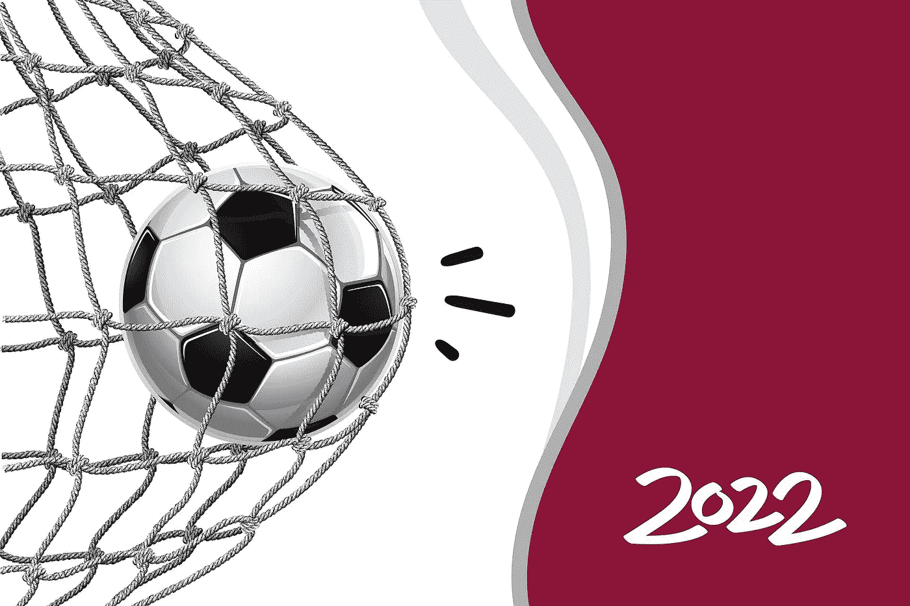
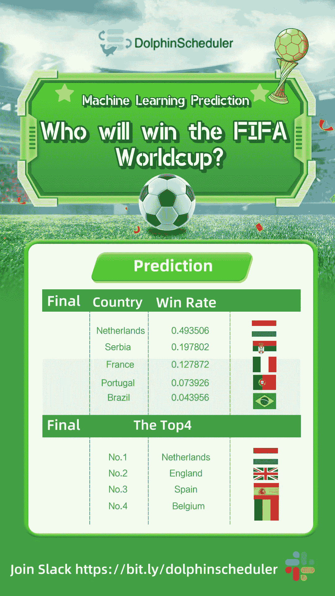
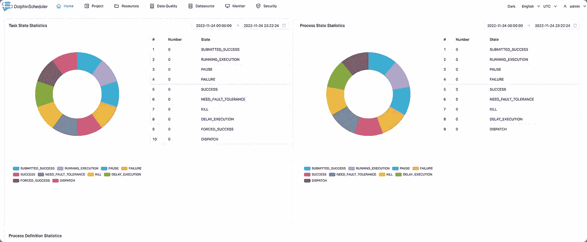
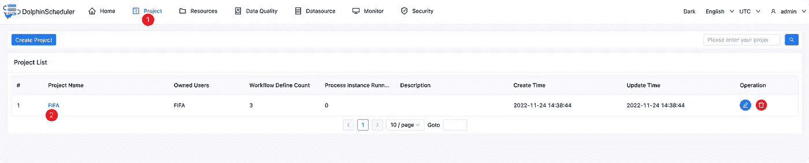
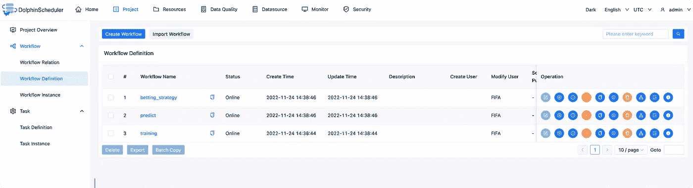
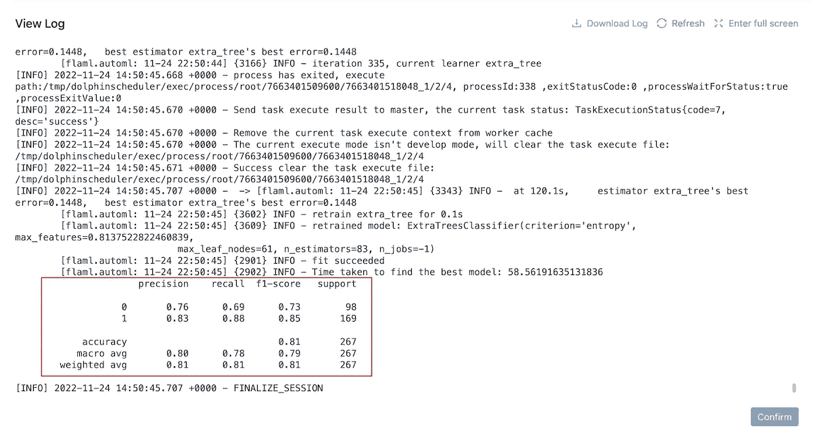
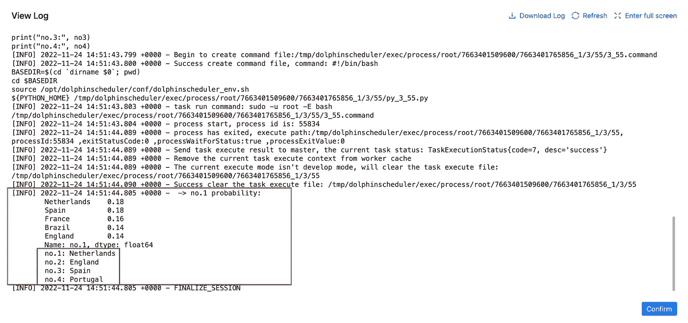
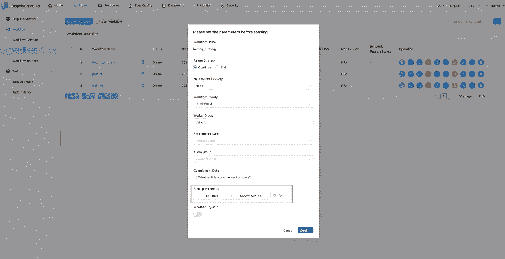
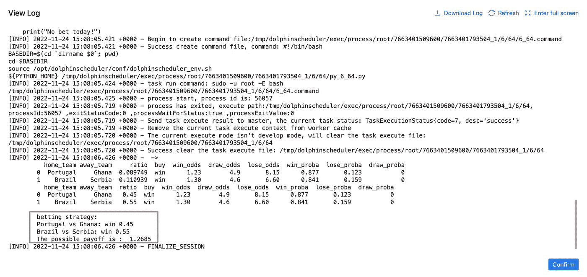
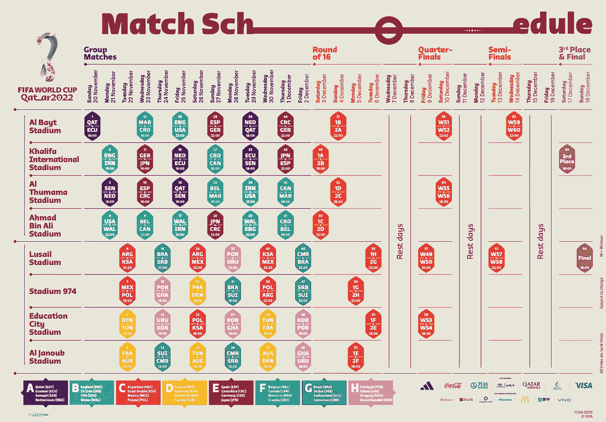

# DolphinScheduler 预测荷兰将成为 2022 年国际足联世界杯冠军！

> 原文：<https://medium.com/codex/predict-fifa-world-cup-2022-champion-and-get-a-betting-strategy-by-dolphinscheduler-4e6733c8f8ec?source=collection_archive---------6----------------------->



> 海豚调度委员会委员周杰光

2022 年国际足联世界杯正在火热进行中！在过去的几天里，这场盛宴吸引了全世界足球迷的目光。除了咬指甲的比赛和馄饨皮似的吉祥物(好可爱)，预测和押注冠军绝对是球迷最大的乐趣之一。

我是狂热的球迷之一，渴望看到今年哪个队会把奖杯带回家。我马上采取行动，用 DolphinScheduler 做一个机器学习预测模型，预测 FIFA 2022 世界杯的冠军，得到每天的投注策略，几个小时。

这不是一项复杂的工作，实际上只需要 3 个步骤就可以完成预测，我在 GitHub 上分享了如何做预测:[https://GitHub . com/Jie Guangzhou/FIFA-World-Cup-2022/tree/master](https://github.com/jieguangzhou/FIFA-World-Cup-2022/tree/master)

以下是我的预测结果:



我还制作了一个视频来解释它是如何工作的，希望它能帮助你享受这个游戏，或者只是为了好玩:)

[YouTube](https://youtu.be/pXBINJR2l5Y)

下面是我的项目的具体实现，有兴趣的可以试试。

# 世界杯预测

两种不同预测方法的结果:

1.  根据球队获胜概率模拟 1000 场世界杯资格赛结果

冠军概率

```
Netherlands    0.493506
Serbia         0.197802
France         0.127872
Portugal       0.073926
Brazil         0.043956
```

前四名

```
No.1: Netherlands
No.2: England
No.3: Spain
No.4: Belgium
```

2.选择获胜概率大的队伍

```
No.1: Spain
No.2: England
No.3: Netherlands
No.4: Belgium
```

所有比赛结果可以在以下两个文件中查看

[https://github . com/Jie Guangzhou/FIFA-World-Cup-2022/blob/workflow-pro/results/predict . txt](https://github.com/jieguangzhou/FIFA-World-Cup-2022/blob/workflow-pro/results/predict.txt)

[https://github . com/Jie Guangzhou/FIFA-World-Cup-2022/blob/workflow-pro/results/results . CSV](https://github.com/jieguangzhou/FIFA-World-Cup-2022/blob/workflow-pro/results/results.csv)

> *以上结果来自* `*workflow-pro*` *分支。这个分支将训练更长的模型并运行更多的模拟。*

# 我是如何建立这个模型的？

## 分三步建立预测系统

***第一步启动 DolphinScheduler***

我们可以使用 Docker 启动一个独立的服务器

```
docker run --name dolphinscheduler-standalone-server -p 12345:12345 -p 25333:25333 -d jalonzjg/dolphinscheduler-fifa
```

然后，您可以在[http://localhost:12345/DolphinScheduler/ui](http://localhost:12345/dolphinscheduler/ui)登录 dolphin scheduler

用户:管理员密码:dolphinscheduler123



***第二步提交工作流***

```
python3 -m pip install apache-dolphinscheduler==3.1.1
export PYDS_HOME=./
python3 pyds.py
```

可以点击`Project`->-`FIFA`



然后，我们可以看到 3 个工作流程

*   训练:使用 FLAML 训练模型
*   预测:使用模型预测哪个国家将赢得世界杯
*   赌博策略:每天制定一个赌博策略



***第三步运行工作流程***

*   开始培训工作流程



我们可以在工作流完成后查看日志

*   开始预测工作流



我们可以在工作流完成后查看日志

*   启动下注策略工作流程



`$[yyyy-MM-dd]`意味着 DolphinScheduler 将使用当前的年、月和日作为参数，我们也可以将其设置为`2022-11-26`或其他日期。



你认为这个预测符合你的期望吗？哪个队会赢得最后的比赛，在下面投票？

PS:下一场比赛的时间表附后，祝你玩得愉快！



📌📌欢迎填写[本次调查](https://www.surveymonkey.com/r/7CHHWGW)来反馈您的用户体验或您对 Apache DolphinScheduler 的想法:)

[https://www.surveymonkey.com/r/7CHHWGW](https://www.surveymonkey.com/r/7CHHWGW)