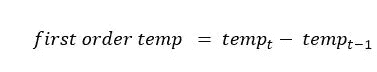

# 预测反事实建筑能耗

> 原文：<https://medium.com/codex/predicting-counterfactual-building-energy-consumption-79b3b0e97e22?source=collection_archive---------9----------------------->


克里斯蒂安·杜博万在 [Unsplash](https://unsplash.com/photos/gxsRL8B_ZqE) 上拍摄的照片

# 介绍

近年来，人们越来越重视减少建筑物的能源排放和消耗。最大限度地减少能源消耗不仅有助于经济，而且对环境也有重大的积极影响。随着投资被用于降低能源使用水平，问题仍然是如何衡量它们的好处？

# 商业问题

我们试图解决的问题不仅具有经济意义，而且还能带来显著的环境效益。随着环境意识的不断增强，企业正在积极努力减少碳足迹，其中一项努力就是减少他们消耗的能源。商业建筑正在翻新，以确保有效的能源消耗。然而，为了量化投资产生的价值，我们需要能够比较改造能耗水平与反事实(没有改造投资)水平。这不仅对于确定投资的有效性很重要，而且对于提高对可能产生的潜在节约的认识也很重要。

过去，研究人员尝试了各种方法来估计这些反事实的消耗值，但这些方法受到电表类型的限制，或者仅适用于特定的建筑物。因此，我们在这里试图解决并创造价值的业务问题是，能够创建能够预测反事实能耗值的模型，而不管电表类型或建筑类型如何。简而言之，我们面临的挑战是构建一个可扩展的解决方案，它与建筑类型或仪表类型无关。

# 数据来源

我们将要研究的数据集是由美国供暖、制冷和空调工程师协会 **ASHRAE 收集的。** ASHRAE 成立于 1894 年，目标是推动供暖、通风和空调制冷领域的技术进步。从 2016 年 1 月 1 日到 2018 年 12 月 31 日的三年时间里，从全球 16 个站点收集了能源或电表读数数据集。还提供了每个地点的相应天气数据。

# 数据描述

数据被分成三个链接表，下面详细描述了每一个表。

> **仪表读数**

此表包含给定建筑和仪表类型的每小时仪表读数。这些仪表读数是我们的目标变量，或者是我们的机器学习算法最终需要预测的。我们需要预测四种不同类型的电表的能耗水平:电、冷水、蒸汽和热水。

> **构建元数据**

这些仪表读数是从世界各地的 1449 栋建筑中收集的。对于这些建筑中的每一个，我们都被提供了它们的主要用途、平方英尺的面积、建造年份和楼层数。

> **天气数据**

1449 座建筑中的每一座都根据它们的位置被分成了 16 个地点。每小时的天气记录，如气温、云量等。已经为这些网站提供了。


数据表和连接

# ML 问题公式化

既然我们已经了解了总体业务目标和数据集，我们需要能够将其转化为数据科学目标。使用过去或历史能耗数据，我们需要能够预测未来的反事实能耗水平。由于目标变量(能耗)是实值，在最大似然术语中，我们有一个基于时间序列的预测或回归问题。因为除了历史负荷数据之外，我们还有建筑元数据和天气数据形式的额外数据源，更准确地说，我们有一个多元回归问题。

# 模型评估

对于任何数据科学问题，我们都需要能够客观地评估我们的机器学习模型的性能。因此，我们需要清楚地定义一个适合我们问题的性能指标。

我们可以用来评估和测量模型的性能指标是均方根对数误差，其数学定义如下:


从等式中可以看出，与简单的 RMSE 相比，我们使用自然对数，然后计算实际值和预测值之间的平方差。我们建议使用 RMSLE 而不是简单指标的原因是因为我们的目标变量(能耗)是有偏差的，并且可能具有较大的非负值。因此，应用对数变换来确保我们的度量不受大的异常值的影响是适当的。此外，因为我们的目标具有较大的非负值，所以我们希望考虑相对误差并忽略数据的规模，这是 RMSLE 允许我们实现的。

# 探索性数据分析

在开始用复杂的机器学习算法解决我们的问题之前，深入了解可用的数据并识别特征变量和我们的目标变量之间的相关性至关重要。

我们将把 EDA 工作的重点放在三大目标上:

*   数据理解
*   识别异常
*   因变量和仪表读数之间的关系

**数据理解**

在本节中，我们的目标是理解已经提供的不同数据表，并对每个数据表下可用的不同原始功能有所了解。

让我们首先看看不同的仪表类型，并分析我们的目标变量(仪表读数)。


按仪表类型的记录计数

上图描述了不同仪表类型的记录或观察计数。从上面的图中可以看出，大多数记录或观察值都与仪表 id 0 有关。在 2000 万个仪表读数中，大约有 1200 万个(大约。60%)的记录只与仪表 id 0 相关。仪表 ID 1 的第二高观测值约为 400 万次(约为 100 万次)。20%).剩下的两米构成了其余的 20%的观测值。


建筑 ID 1232 的仪表读数分布


建筑 ID 1294 的仪表读数分布

上图描绘了所有仪表类型和给定建筑物 id 的仪表读数分布。从本质上讲，每个图都与单个建筑相关，然后每个子图都按仪表类型描述了能耗分布。我们随机选择了 2 栋建筑(安装了所有类型的电表)来分析分布情况。仔细分析后发现，在几乎所有的图中，都有许多仪表读数为零。另一个观察结果是，在所有仪表类型的情况下，我们确实有一些正常读数范围，但也有一些可以看到极值的情况，或者简单地说，我们有右偏分布。

现在我们将从天气数据中探索气温时间序列。


站点 9 的平均温度趋势


站点 8 的平均温度趋势

这些线图展示了随机选择的两个地点的日平均温度趋势。从上面的图中，我们可以根据日平均气温来观察季节趋势。两幅图都显示了 1 月至 3 月期间的较低温度。从 5 月开始，我们可以观察到温度持续上升，直到 7 月左右，然后从 9 月开始再次下降。有趣的是，当我为所有剩余的网站绘制相同的信息时，观察到了类似的模式。基于这一点，我们可以得出结论，我们所有的站点以及所有的建筑都位于北半球。

现在，我们将强调建筑元数据中的几个可用特征:平方英尺和主要用途。


按主要用途统计的建筑物数量

条形图显示了按主要用途划分的建筑数量。据观察，大约 35-40%的建筑主要用于教育目的。继教育之后，第二个最常见的主要用途是“办公室”,约占所有建筑的 20%。由于大多数建筑要么是教育机构，要么是办公场所，因此考虑诸如一天中的时间、日期类型、公共假日等因素是很重要的。同时选择特征来预测目标变量。


建筑平方英尺的分布

上图描绘了建筑面积的平方英尺分布。建筑平方英尺的分布似乎是右偏的，大多数建筑的面积不到 20 万平方英尺。很小一部分建筑分布在很大的区域。虽然大多数建筑的面积覆盖范围相似，但我们仍然观察到建筑平方英尺分布的一些变化。因为能源需求在很大程度上受建筑物大小的影响，我们在定义我们的特征时需要考虑这一点。

## 识别异常

在这一节中，我们将努力找出数据中是否有任何异常，我们可能需要在数据预处理中纠正这些异常。


建筑物 ID 320 和仪表 ID 0 的仪表读数


建筑 ID 103 和仪表 ID 1 的仪表读数


建筑物 ID 3 和仪表 ID 0 的仪表读数

上面的图是按建筑物 id 过滤的特定电表类型的时间序列图。如上所述，我们试图绘制出在整个数据集中观察到的每种不同异常的样本。在第一个图中，我们可以观察到有一个突然的负尖峰。第二个图与第一个图正好相反，我们看到恒定值，然后是突然的正尖峰。第三种绘图类型表示数据中普遍存在的一种情况，在这种情况下，我们在很长一段时间内都有恒定的零读数。因为作为这个问题的一部分，仪表读数是我们需要预测的目标变量，所以跨数据集检测这样的异常并移除它们将是至关重要的。

一些参赛选手指出，对于气象数据中的一些站点，时区是以 UTC 表示的，而不是当地时间。为了进一步分析这一点，我们将绘制几个站点 id:全年每小时的平均温度。


站点 2 每小时的平均温度


站点 13 每小时的平均温度

上面按站点 id 过滤的图反映了在观察时间段内给定小时的平均温度。在这两个图中，我们可以观察到温度值在大约 2100 小时或晚上 9 点达到峰值。同样，我们也可以观察到温度在 1200 时左右或中午下降。根据这些观察，我们可以明确地得出结论，天气数据中的时间戳是基于 UTC 的，而不是本地的。温度峰值和下降似乎是反直觉的，我们通常期望在中午看到温度峰值，而在晚上看到较低的温度。

## 特征和目标变量之间的关系

在本节中，我们的目标是解码我们的各种特征和目标变量(仪表读数)之间的关系。所有的分析和探索都将集中在寻找相关的或影响能源消耗的特征上。

让我们先来看看日期时间特性(如一天中的小时和一天中的类型)是如何影响能耗的。


一周中各天的能耗

条形图显示了工作日和周末的能耗差异。每个子图表示根据仪表 id 过滤出的数据。对于仪表类型 0、1、2，我们可以清楚地观察到工作日的中值消耗量高于周末。对于仪表类型 3，周末和工作日的中值消耗量看起来几乎相似，但仔细观察就会发现，工作日的消耗量略高。


一天中每个小时的能耗

这些图试图描述基于一天中某个小时的能源消耗模式。每个子图由特定的仪表类型过滤。所有电表类型的一个共同观察结果是，夜间能耗相对较低，白天能耗相对较高。仪表 ID 0 和 1 显示能量消耗从上午 10 点左右开始增加，并在下午达到峰值。另一方面，仪表 ID 2 和 3 在上午 6 点到 8 点之间达到峰值，然后在上午 9 点开始下降。当我们查看提供的数据描述时，仪表 id 0、1、2 和 3 代表电力、冷冻水、热水和蒸汽相关的能耗。从这个意义上说，观察结果似乎也很直观，因为我们预计与冷却水相关的能耗会在下午达到峰值，然后在夜间下降，这正是从仪表 id 2 的曲线图中观察到的行为。

接下来，我们将继续确定天气特征和目标变量之间的相关性。


建筑物 ID 1296 的天气相关热图


建筑物 ID 1293 的天气相关热图

这些热图试图描述天气变量和我们的目标变量“仪表读数”之间的相关性。我们随机选择了两栋拥有所有四种仪表类型的建筑，然后尝试测量仪表读数和天气变量之间的相关系数。对于这两个建筑，空气温度和露水温度与仪表 ID 1、2 和 3 有很强的相关性。空气温度和露水温度都与仪表 id 1 的能耗读数正相关。由于该仪表与冷冻水相关，因此它也具有直观意义，因为随着温度升高，我们预计冷却需求也会增加。相反，空气温度和露水温度与仪表 id 2 和 3 的读数有很强的负相关性。这表明随着温度下降，能量消耗增加，这又是直观的，因为仪表 2 和 3 与加热要求相关。风向、风速和海平面气压与仪表读数的相关性较弱，其他变量的相关值在零附近。

现在，我们将重点了解一些建筑属性如何影响能源消耗模式。


散点图:建筑平方英尺与能耗

这些散点图试图代表建筑平方英尺和给定电表类型的能耗之间的相关性。对于每幅图，我们可以观察到，在大多数情况下，随着建筑面积或平方英尺的增加，我们会看到建筑的中值消耗量增加。建筑面积和能源消耗之间没有非常强的相关性，但我们可以笼统地说，随着建筑面积的增加，我们可以预期能源消耗也会增加。


建筑主要用途的能源消耗

这些图表试图通过建筑的主要用途或目的得出能源消耗的比较。快速观察每种仪表类型的曲线图可以发现，建筑类型不同，能耗差异也很大。对于仪表 id 0，我们观察到主要用于医疗保健的建筑具有最高的日能耗中值。同样，仪表 id 1，2 和 3 分别在公共设施，服务和公共服务建筑类型中消耗最高。

# 数据处理和清理

既然我们已经很好地理解了数据中的任何不一致，我们就可以着手清理和处理它们了。在本节中，我们将重点关注四大活动:

*   天气数据-时区偏移
*   清洗常量零值
*   清理异常尖峰
*   缺失值插补

**天气数据—时区偏移**

正如在 EDA 阶段所讨论的，对于天气数据中的一些站点 id，我们需要偏移时区。下面的讨论提供了每个站点需要应用的偏移。

[](https://www.kaggle.com/patrick0302/locate-cities-according-weather-temperature) [## 根据天气温度定位城市🌇

### 使用 Kaggle 笔记本探索和运行机器学习代码|使用来自多个数据源的数据

www.kaggle.com](https://www.kaggle.com/patrick0302/locate-cities-according-weather-temperature) 

时区偏移

**清洗常量零值**

在我们的 EDA 过程中，我们观察到电表读数在很长一段时间内都是恒定的零值。现在，这些恒定的零值可能是因为相应的系统已经关闭(出于季节性目的)，或者它们只是我们需要清理的异常。为了清除不合理的零读数，我们将采取以下方法:

*   对于仪表 id 0，删除所有连续 48 小时或更长时间读数为零的行，无论季节如何。由于电表 id 0 与用电量相关，我们希望它全年都可以正常工作。
*   对于仪表 id 1(冷冻水)，删除所有连续 48 小时或以上读数为零的行，冬季除外(十二月、一月、二月、三月)。
*   对于仪表 id 2(蒸汽)和仪表 id 3(热水)，删除所有连续 48 小时或以上读数为零的行，夏季除外(六月、七月、八月、九月)。

清除不合理零读数的功能

**清洗异常尖刺**

除了恒定的零值之外，在我们的 EDA 过程中，我们还观察到异常的正负尖峰。这是非常重要的清理出来，使它不影响我们的模型训练过程。为了识别这些异常峰值，我们将基于 **building_id** 、**计量器、**和**季节**来创建组。在我们的每个小组中，我们将计算仪表读数的 z 分数，并删除任何 z 分数为 4 或偏离小组仪表读数平均值超过 4 个标准偏差的读数。

因为我们所有的建筑都在北半球，所以我们将季节定义如下:


季节定义

识别异常峰值的功能

**缺失值插补**

在我们的数据理解阶段，我们发现我们的大部分天气变量都缺少观测值或记录。我们将使用简单的线性插值策略来输入这些缺失值。

使用线性插值法估算缺失天气变量的函数

# 特征工程

解决任何机器学习问题的最关键因素是能够设计与我们的目标变量高度相关的特征。我们将应用从 EDA 第三阶段学到的知识(在该阶段，我们探索了原始特征和目标变量之间的关系),同时创建新的特征。

**温差特征**

除了我们已经保留的原始天气特征，我们将为气温创建两个额外的基于滞后的特征，定义如下。

产生一阶和二阶温差的功能

1.  **first_order_temp** :这里我们将对每个站点的气温进行一阶差分。换句话说，这意味着当前时间戳和先前时间戳之间的气温差异。
2.  **second_order_temp** :这里我们将对每个站点的空气温度进行二阶差分。换句话说，这意味着当前时间戳和先前时间戳之间的一阶空气温度差。



一阶差分


二阶差分

**日期时间特性**

在本节中，我们将研究时间戳或日期时间元素的工程特征。为了保留日期时间特征的循环性质，我们将主要使用正弦和余弦变换在二维空间中表示它们。这样做很重要，因为如果我们按顺序考虑基于时间的特征，我们将无法反映不同值之间的真实关系。例如，直觉上，11pm 和 12am(午夜)应该表示为彼此接近，因为我们知道 12am 发生在 11pm 之后。然而，当用连续数字(0 & 23 小时)表示时，我们不能保持这种关系。

从下图中可以看到数学解释和直观表示。


小时数据转换

从上面的图中可以明显看出，通过将每小时的数据转换成二维数据，我们能够保持一天中不同时间之间的关系。例如，现在 12 点与晚上 11 点和凌晨 1 点都相邻。


月数据转换

类似地，这些转换也可以用于表示一周中的几天和几个月，因为它们也遵循类似循环的关系模式。上图中显示了月份转换的类似情况。

我们将从时间戳列创建以下功能:

1.  **hour_x:** 小时特征的第一维将使用正弦变换来表示
2.  **hour_y:** 小时特征的第二维将使用余弦变换表示
3.  **day_x:** 日特征的第一维将使用正弦变换表示
4.  **day_y:** 日特征的第二维将使用余弦变换表示
5.  **dayofweek_x:** 星期几特征的第一维将使用正弦变换表示
6.  **dayofweek_y:** 星期几特征的第二维将使用余弦变换表示
7.  **month_x:** 月特征的第一维将使用正弦变换表示
8.  **month_y:** 月特征的第二维将使用余弦变换表示
9.  **is_weekend:** 表示观察值是与工作日还是周末相关的二元特征。如果是周末，我们将其标记为 1，否则如果是工作日，我们将其标记为 0


日期时间具有正弦和余弦转换功能

创建日期时间功能的函数

**建筑特征**

既然我们已经设计了所需的日期时间特性，我们将致力于构建元数据特性。在使用这些功能之前，我们将首先根据仪表 id 将训练数据分成四个部分，也就是说，我们希望为每种仪表类型训练四个独立的模型。在根据仪表 id 分割数据时，我们还将使用 log 函数转换我们的目标变量(仪表读数)。

根据仪表类型划分数据，并将对数转换应用于仪表读数

建筑物元数据主要涉及类别特征，如建筑物 id、站点 id 和主要用途。为了对这些分类特征进行编码，我们将遵循留一个目标编码策略。

**留一编码**类似于均值目标编码，其中我们通过给定类别过滤的目标变量的均值对每个类别进行编码。然而，朴素均值目标编码的一个问题是，存在数据泄漏和过拟合问题的可能性。因此，为了避免遗漏编码中数据泄漏，对于给定类别中的给定观察，我们通过来自该类别中所有其他观察的目标变量来替换它，在计算平均值时忽略给定观察。它可以用数学方法表示如下:


此外，为了使其对过拟合和数据泄漏更加鲁棒，我们还向目标编码值添加高斯噪声。


省略一个编码示例

为了实现我们的遗漏编码策略，我们将借助**类别编码器**库。

函数对分类特征进行编码

# 系统模型化

现在，我们已经分析和理解了数据，执行了所需的数据处理/清理，并根据原始数据设计了特征，我们可以继续进行建模阶段。

由于我们已经对目标变量进行了对数转换，为了评估我们模型的性能，我们将使用 RMSE 指标。


对于我们试验的每个机器学习算法，我们将为每种仪表类型训练四个单独的模型。建模策略的可视化表示如下所示。


## 基线模型

因为我们的性能指标是误差的平方，我们没有误差的上限，我们需要建立一个简单的基线模型，我们将所有测试仪表读数预测为列车仪表读数的平均值。然后，我们可以将我们实际的机器学习模型的性能与这个简单的基线模型的误差进行比较。只有当机器学习模型比这个简单的基线模型表现得更好时，我们才能得出结论，我们的模型已经能够从数据中学习一些模式。

基线预测的代码片段

在 Kaggle 上上传基线预测导致在看不见的测试数据集上的性能下降。


基线模型性能

## 单一型号

在本节中，我们将训练两个简单的机器学习模型，如下所示:

1.  线性回归
2.  决策树回归器

对于这些模型中的每一个，我们将使用五重网格搜索验证策略来调整超参数。

超参数调谐功能

在交叉验证期间找到的最佳超参数上训练模型后，我们在 Kaggle 的测试数据集上测量性能，结果如下所示。


线性回归(SGD)性能


决策树回归器性能

## 集合模型

既然我们已经用简单的单个模型进行了实验，我们将把重点放在用基于集合的模型进行训练上。这里的建模策略是相似的，即我们将为每种仪表类型训练一个单独的模型。然而，我们将稍微改变的一个方面是超参数优化。因为我们的数据集非常大，所以对于复杂的基于集合的模型来说，搜索 CV 的计算代价太高。因此，我们将使用一种称为**贝叶斯优化**的技术来调整超参数。

GridSearch 和 RandomSearch CV 的失败之处在于它们不能将以前的迭代(超参数选择)与未来的迭代联系起来。有可能他们花了很多时间试图评估不好的超参数。这就是**贝叶斯优化**的用武之地，因为它只关注最有希望的超参数。**贝叶斯优化**利用过去的信息为自己服务。因此，与其他基于网格的技术相比，它可以通过只关注重要的区域来节省时间。

为了使用贝叶斯优化调整超参数，我们将依赖一个名为**hyperpt***的库。*

在这一节中，我们将实验以下众所周知的集成算法

1.  随机森林回归量
2.  XGBoost 回归器
3.  LGBM 回归器

应用贝叶斯优化的每个算法的目标函数

从上面的代码片段可以看出，我们已经为每个集成算法定义了单独的目标函数。贝叶斯优化的目标是搜索整个参数网格，并找到使这些函数的得分或输出最小化的最佳参数。在我们的例子中，要最小化的分数只不过是前面描述的均方误差。

一旦我们为每个模型找到了最佳参数，我们就用它们来训练前面提到的每个集合模型。这些模型在看不见的数据上的表现可以在下面看到。


随机森林模型性能


XGBoost 模型性能


LGBM 模型性能

## 堆叠模型

堆叠模型使用多个基础模型的预测来预测目标变量。换句话说，所有基础模型的预测都被用作训练元模型的特征。下面的架构图和数学表达式展示了堆叠模型的工作原理。


堆叠模型的架构


叠加模型的预测方程

对于我们的堆叠架构，我们将使用之前训练的集合模型 Random Forest、XGBoost 和 LGBM 作为基础模型。我们将再次使用 LGBM 作为我们的元模型，如下所示。


集合模型的堆叠

为堆叠模型准备数据

元回归器的超参数，即 LGBM，再次使用贝叶斯优化进行调整。下面可以观察到堆叠算法对不可见数据的性能。


堆叠模型性能

# 汇总结果

下表总结了我们试验过的所有模型在不可见数据上的性能。

```
 +-------------------------+---------------+--------------+
     |          Model          | Private Score | Public Score |
     +-------------------------+---------------+--------------+
     |         Baseline        |     2.355     |    2.089     |
     |    Linear Regression    |     1.437     |    1.196     |
     | Decision Tree Regressor |     1.365     |    1.195     |
     | Random Forest Regressor |     1.381     |    1.206     |
     |    XGBoost Regressor    |     1.325     |    1.142     |
     |      LGBM Regressor     |     1.315     |    1.135     |
     |      Stacking Model     |     1.341     |    1.169     |
     +-------------------------+---------------+--------------+
```

从上表可以清楚地观察到，我们所有的机器学习模型都有比基线预测更好的结果。基于此，我们可以得出结论，我们的所有模型都能够学习能源消耗数据中的一些模式或相关性。

总的来说，轻型 GBM 是所有其他型号中性能最好的。与 LGBM 回归器相比，堆叠模型的性能似乎有所下降。

# 未来的工作


照片由 [Jungwoo Hong](https://unsplash.com/@hjwinunsplsh) 在 [Unsplash](https://unsplash.com/photos/cYUMaCqMYvI) 上拍摄

我们可以通过尝试以下额外的想法来进一步改进性能指标:

*   在我们的功能工程部分，我们可以创建增强的基于天气的功能，例如相对湿度，它会影响能耗水平
*   我们目前只研究了涉及机器学习算法的方法。此外，我们可以探索各种深度学习方法。
*   目前，对于每个机器算法，我们只训练 4 个模型(每个仪表类型一个)。我们可以考虑为数据集中的每个不同建筑训练多个模型的可能性。

# 参考

1.  【https://www.appliedaicourse.com/】T5[T6](https://www.appliedaicourse.com/)
2.  [*https://www.kaggle.com/c/ashrae-energy-prediction*](https://www.kaggle.com/c/ashrae-energy-prediction)
3.  [*https://www.ashrae.org/*](https://www.ashrae.org/)
4.  [*https://contrib.scikit-learn.org/category_encoders/*](https://contrib.scikit-learn.org/category_encoders/)
5.  [http://hyperopt.github.io/hyperopt/T21](http://hyperopt.github.io/hyperopt/)

 [## Mohammed z .-Rubik on 实验室的初级数据科学家| LinkedIn

### 在世界上最大的职业社区 LinkedIn 上查看 Mohammed Z 的个人资料。穆罕默德有两个工作列在他们的…

www.linkedin.com](https://www.linkedin.com/in/mohammedzoher/)