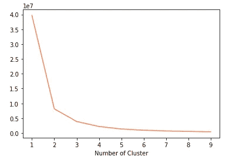
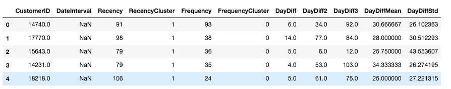

# 使用预测模型预测客户的下一次购买

> 原文：<https://medium.com/codex/predicting-customers-next-purchase-b3dd1890924e?source=collection_archive---------0----------------------->

电子商务公司总是把 GMV 作为他们的北极星指标之一，但是 GMV 真的那么重要吗？

当然，GMV 很重要，因为它显示了平台上销售的商品的总销售额，但公司一直在大量使用这一指标，通过设定疯狂的内部 GMV 目标来与市场上的其他参与者竞争。在一家风险投资公司工作过之后，我看到很多初创公司的估值都是基于他们的 GMV，GMV 已经成为他们的主要衡量标准。

你可能会问，目标定的高不好吗？竞争难道不会鼓励公司取得更多成就，从而帮助他们发挥最大潜力吗？是的，确实如此。然而，GMV 在几个方面可能会误导人，并有可能将公司的目标和资源转移到不想要的方向，从而导致结果。

首先，GMV 不考虑取消、退货、返现和折扣。第二，如果只看 GMV，企业将无法了解顾客重复购买的次数，以及每笔订单的平均价值。这些问题将导致另一个问题:该公司没有考虑到有多少钱实际进入其银行账户。

综上所述，本文将讨论我们如何发现客户购买行为的模式，并使用这些数据来预测客户下一次使用 Python 的购买行为。

# **数据**

该数据集是关于英国的一家零售公司的，是从 Kaggle 获得的。

# 1.度量探索

在构建预测模型之前，我们要探索的指标有:

1.  月收入和月增长率
2.  活跃客户数量和每个客户的订单数量
3.  每个订单的月平均收入
4.  每月客户保持率

通过导入所有需要的库，让我们先看看我们的数据集是什么样子的。

```
import pandas as pd
from datetime import datetime, timedelta
%matplotlib inline
import matplotlib.pyplot as plt
import numpy as np
import seaborn as sns
from __future__ import divisionimport chart_studio.plotly as py
import plotly.offline as pyoff
import plotly.graph_objs as gopyoff.init_notebook_mode()df = pd.read_csv(“OnlineRetail.csv”)
df.head(14)
```

上面的代码产生了下面的表 1.1。


表 1.1

从上表中，我们获得了了解业务进展所需的所有重要信息，并利用我们拥有的组件构建了北极星方程式。

我们先来探究一下公司的月营收。

我们将首先通过将“InvoiceDate”列转换为 pandas 的 datetime 格式来清理数据。

```
df[‘InvoiceDate’] = pd.to_datetime(df[‘InvoiceDate’])df[‘InvoiceYear’] = [d.date() for d in df[‘InvoiceDate’]]
```

然后，为了便于以后的分析和可视化，我们将从“InvoiceDate”列中创建一个仅包含月份和年份的新列。结果见表 1.2。

```
df[‘Month’]=df[‘InvoiceDate’].dt.strftime(‘%Y-%m’)df.head()
```


表 1.2

```
df[‘Revenue’] = df[‘UnitPrice’]*df[‘Quantity’]
df_Revenue = df.groupby([‘Month’])[‘Revenue’].sum().reset_index()fig_revenue = px.line(df_Revenue, x =”Month”, y=”Revenue”, title=”Revenue By Month”,color_discrete_sequence=px.colors.qualitative.Pastel1)
fig_revenue.show()
```

上面的代码让我们可以通过图表看到公司的收入——如下图所示。


图 1.1

该图清楚地告诉我们，从 2011 年 8 月开始，销售额一直在增长(从 11 月到 2011 年 12 月的销售额下降是由于数据不完整)。

## 1.1 活跃客户

为了了解企业的经营状况并在以后建立预测模型，我们需要了解公司的新客户和现有客户。

```
df = df.query(“Country==’United Kingdom’”)df_uk_active_cust = df.groupby(‘Month’)[‘CustomerID’].nunique().reset_index()fig_active_cust = px.bar(df_uk_active_cust, x=”Month”,y=”CustomerID”,color_discrete_sequence=px.colors.qualitative.Pastel1)
fig_active_cust.show()
```

上面的代码块首先对 dataframe 进行排序，并且只显示在“Country”列中带有“United Kingdom”的行。然后，我们创建另一个数据框架，只显示活跃客户的数量，按月份分组——图 1。


图 1.2

## 1.2 每份订单的数量和平均收入

上面的代码可以用来计算每月订单的数量和每个订单的平均收入。下图 1.3 显示了每月售出的数量，而图 1.4 显示了每份订单的平均收入。

完整代码可以看[这里](https://github.com/fistz24/ecommerce_analysis)。


图 1.3


图 1.4

## 1.3 新客户

每个公司都需要定义谁可以被视为新客户。在我们的例子中，我们将新客户定义为以前从未购买过产品的客户，并从月初开始购买。

```
cust_min_purchase = df.groupby(‘CustomerID’).InvoiceDate.min().reset_index()
cust_min_purchase.columns =[‘CustomerID’,’MinPurchaseDate’]
cust_min_purchase[‘MinPurchaseYearMonth’]=cust_min_purchase[‘MinPurchaseDate’].map(lambda date:100* date.year + date.month)df_uk = pd.merge(df, cust_min_purchase, on=’CustomerID’)df_uk[‘Year’]=df_uk[‘InvoiceDate_x’].dt.strftime(‘%Y-%m-%d’)df_uk[‘InvoiceYearMonth’]= df_uk[‘InvoiceDate’].map(lambda date:100* date.year + date.month)df_uk[‘UserType’] =’New’
df_uk.loc[df_uk[‘InvoiceYearMonth’]>df_uk[‘MinPurchaseYearMonth’],’UserType’]=’Existing’df_user_type_revenue = df_uk.groupby([‘InvoiceYearMonth’,’UserType’,’Month’])[‘Revenue’].sum().reset_index()df_user_type_revenue
```


表 1.3

从上面的代码中，我们得到了不同客户类别的收入数；新的和现有的。这将使我们对如何最大化营销预算和努力有一个更清晰的想法。

为了使表格易于理解，让我们创建一个散点图。

```
fig_user_type_revenue = px.scatter(df_user_type_revenue, x=”Month”,y=”Revenue”, color=”UserType”,color_discrete_sequence=px.colors.qualitative.Pastel1)
fig_user_type_revenue.show()
```


图 1.5

上面的图 5 告诉我们，现有客户显示出积极的趋势，这间接转化为强大的客户群，尽管新客户呈下降趋势。

## 1.4 保留率

df _ user _ purchase = df _ uk . group by([' CustomerID '，' Month'])['Revenue']。sum()。重置索引()

```
#retention matrix
df_retention = pd.crosstab(df_user_purchase[‘CustomerID’],df_user_purchase[‘Month’]).reset_index()
df_retention.head()months = df_retention.columns[2:]
retention_array=[]
for i in range(len(months)-1):
 retention_data={}
 selected_month = months[i+1]
 prev_month= months[i]
 retention_data[‘Month’] = (selected_month)
 retention_data[‘TotalUserCount’] = df_retention[selected_month].sum()
 retention_data[‘RetainedUserCount’]= df_retention[(df_retention[selected_month]>0)& (df_retention[prev_month]>0)][selected_month].sum()
 retention_array.append(retention_data)df_retention = pd.DataFrame(retention_array)
df_retention[‘RetentionRate’] = df_retention[‘RetainedUserCount’]/df_retention[‘TotalUserCount’]fig_retained_user = px.line(df_retention, x=”Month”,y=”RetentionRate”,color_discrete_sequence=px.colors.qualitative.Pastel1)
fig_retained_user.show()
```

从 6 月到 2011 年 8 月，留存率呈指数增长，然后在 2011 年 9 月再次下降，如图 1.6 所示。


图 1.6

# 2.客户细分

在分析了电子商务公司的主要指标后，我们现在可以进行客户细分，以了解谁是最好的客户。

为什么我们需要客户细分？

所有客户都有不同的行为、特征和需求。因此，我们不能以同样的方式对待他们，如果我们以同样的方式对待他们，他们最终会找到其他选择。

有几种客户细分方法，但我们将讨论最广泛使用的一种:RFM(最近，频率，货币)。我们将根据这三个细分市场划分客户:

1.  低价值:不太活跃的客户——很少购买和产生低收入的客户
2.  中等价值:那些频繁使用平台并产生中等收入的人
3.  高价值:非常活跃的客户，他们消费非常频繁，比其他任何客户都多

## 2.1 最近

```
To calculate recency, we’ll first sort the dataframe and find the most recent purchase date of each customer. df_user = pd.DataFrame(df[‘CustomerID’].unique())
df_user.columns = [‘CustomerID’]df_max_purchase= df_uk.groupby(‘CustomerID’).InvoiceDate.max().reset_index()
df_max_purchase.columns=[‘CustomerID’,’MaxPurchaseDate’]df_max_purchase[‘Recency’] = (df_max_purchase[‘MaxPurchaseDate’].max() — df_max_purchase[‘MaxPurchaseDate’]).dt.daysdf_user = pd.merge(df_user, df_max_purchase[[‘CustomerID’,’Recency’]], on=’CustomerID’)df_user.head()
```


表 2.1

代码中包含的步骤有:

1.  创建一个 df 来保存 customerID 和细分分数
2.  使用 **max()** 函数获取每个客户的最大购买日期
3.  通过从 df 中的每一行减去 **max()** 购买日期来计算最近日期，并使用 **dt.days** 函数来获得天数

表 2.1 显示了 5 行代码结果。

```
fig_recency = px.histogram(df_user, x=”Recency”,color_discrete_sequence=px.colors.qualitative.Pastel1)
fig_recency.show()
```


图 2.1

图 2.1 显示了最近的分布。

为了分配最近得分，我们将使用 KMeans 聚类。但是在此之前，与其他 KMeans 项目一样，我们需要知道我们需要多少个集群。

```
from sklearn.cluster import KMeanssse ={}
df_recency=df_user[[‘Recency’]]
for k in range(1,10):
 kmeans=KMeans(n_clusters=k, max_iter=1000).fit(df_recency)
 df_recency[“clusters”] =kmeans.labels_
 sse[k] = kmeans.inertia_

plt.figure()
plt.plot(list(sse.keys()),list(sse.values()), color=”#FF7F50")
plt.xlabel(“Number of Cluster”)
plt.show()
```



图 2.2

从图 2.2 中，我们可以得出结论，3 个集群就足够了，但我们将使用 4 个。

```
kmeans=KMeans(n_clusters=4)
kmeans.fit(df_user[[‘Recency’]])
df_user[‘RecencyCluster’] =kmeans.predict(df_user[[‘Recency’]])def cluster_order(cluster_name, target_name, df, ascending):
 new_cluster_field_name = ‘new_’ + cluster_name
 df_new = df.groupby(cluster_name)[target_name].mean().reset_index()
 df_new[‘index’] = df_new.index
 df_final = pd.merge(df, df_new[[cluster_name,’index’]],on=cluster_name)
 df_final = df_final.drop([cluster_name],axis=1)
 df_final = df_final.rename(columns={“index”:cluster_name})
 return df_finaldf_user = cluster_order(‘RecencyCluster’,’Recency’,df_user, False)df_user.groupby(‘RecencyCluster’)[‘Recency’].describe()
```


表 2.2

我们首先为最近建立了 4 个集群，并将其添加到现有的 df 中。然后我们定义一个函数，让我们对最近的聚类进行升序排序。

## 2.2 频率

相同的原理将用于频率。我不会在本文中展示完整的代码，但是您可以在这里找到关于代码[的更多信息。](https://github.com/fistz24/ecommerce_analysis)

```
kmeans = KMeans(n_clusters=4)
kmeans.fit(df_user[[‘Frequency’]])
df_user[‘FrequencyCluster’]= kmeans.predict(df_user[[‘Frequency’]])df_user = cluster_order(‘FrequencyCluster’,’Frequency’,df_user,True)df_user.groupby(‘FrequencyCluster’)[‘Frequency’].describe()
```


表 2.3

高频意味着高价值客户。

## 2.3 收入

我们将计算每个客户的总收入，并应用 kmeans 聚类对收入进行聚类。

```
df_uk[‘Revenue’]=df_uk[‘UnitPrice’] * df_uk[‘Quantity’]
df_revenue=df_uk.groupby(‘CustomerID’).Revenue.sum().reset_index()df_user = pd.merge(df_user, df_revenue, on=”CustomerID”)kmeans = KMeans(n_clusters=4)
kmeans.fit(df_user[[‘Revenue’]])
df_user[‘RevenueCluster’]=kmeans.predict(df_user[[‘Revenue’]])df_user = cluster_order(‘RevenueCluster’,’Revenue’, df_user, True)df_user.groupby(‘RevenueCluster’)[‘Revenue’].describe()
```


表 2.4


表 2.5

## 2.4 总体得分

我们现在需要合并最近，频率和收入 df，以获得总得分。

```
df_user[‘OverallScore’] = df_user[‘RecencyCluster’] + df_user[‘FrequencyCluster’] + df_user[‘RevenueCluster’]
df_user.groupby(‘OverallScore’)[‘Recency’,’Frequency’,’Revenue’].mean().reset_index()
```


表 2.6

上面的评分告诉我们，9 分是我们最好的客户。但是如前所述，我们可以将它们分为 3 类。因此，我们将重新命名分数:

1.  0–2:低值
2.  3–6:中间值
3.  7–9:高价值

```
df_user[‘Segment’] = ‘Low-Value’
df_user.loc[df_user[‘OverallScore’]>2,’Segment’] = ‘Mid-Value’ df_user.loc[df_user[‘OverallScore’]>6,’Segment’] = ‘High-Value’df_user_graph = df_user.query(“Revenue < 50000 and Frequency < 2000”)fig_score= px.scatter(df_user_graph, x=”Frequency”, y=”Revenue”,color=”Segment”)
fig_score.show()
```


图 2.3

图 2.3 显示了每个客户群的分布，如图所示，与其他两个客户群相比，中等价值客户购买最多，带来的收入也最多。

我们现在进入最后一步(但不是最后一步)，预测客户的下一次购买。

# 3.预测客户的下一次购买

## 3.1 数据争论

为了构建模型，我们将使用 6 个月的数据来预测未来 3 个月的客户行为。

我们将首先创建一个新的数据帧，以免弄乱原始数据。

```
df_order_day= df_6m[[‘CustomerID’,’InvoiceDate’]]df_order_day = df_order_day.sort_values([‘CustomerID’,’InvoiceDate’])df_order_day[‘InvoiceDay’] = df_6m[‘InvoiceDate’]df_order_day = df_order_day.drop_duplicates(keep=’first’)df_order_day.head()
```

我们需要找出每个 CustomerID 的最后 3 次购买，我们将使用 **shift()来完成这项工作。**

```
df_order_day[‘PrevInvoiceDate’] = df_order_day.groupby(‘CustomerID’)[‘InvoiceDay’].shift(1)
df_order_day[‘D2InvoiceDate’] = df_order_day.groupby(‘CustomerID’)[‘InvoiceDay’].shift(2)
df_order_day[‘D3InvoiceDate’] = df_order_day.groupby(‘CustomerID’)[‘InvoiceDay’].shift(3)df_order_day[‘DayDiff’] = (df_order_day[‘InvoiceDay’]-df_order_day[‘PrevInvoiceDate’]).dt.days
df_order_day[‘DayDiff2’] = (df_order_day[‘InvoiceDay’]-df_order_day[‘D2InvoiceDate’]).dt.days
df_order_day[‘DayDiff3’] = (df_order_day[‘InvoiceDay’]-df_order_day[‘D3InvoiceDate’]).dt.daysdf_order_day.head()
```


表 3.1

表 3.1 显示了新数据帧 df_order_day 的前 5 行。正如所见，有些客户只购买了 0-2 次，这导致了大量的 NaN 值。这将在以后破坏我们的模型，所以我们将只保留购买超过 3 次的客户，使用下面的代码。

```
df_order_day_last = df_order_day.drop_duplicates(subset=[‘CustomerID’],keep=’last’)df_order_day_last = df_order_day_last.dropna()df_order_day_last = pd.merge(df_order_day_last, df_day_diff, on=’CustomerID’)df_user = pd.merge(df_user, df_order_day_last[[‘CustomerID’,’DayDiff’,’DayDiff2',’DayDiff3',’DayDiffMean’,’DayDiffStd’]],on=’CustomerID’)df_class =df_user.copy()
df_class = pd.get_dummies(df_class)
df_class.head()
```



表 3.2

# 4.构建模型

在建立模型之前，让我们先来看看 df 的百分位数。

```
df_user.DateInterval.describe()
```


图 1.1

## 4.1 客户购买日课程

为了有效地开展营销活动，我们需要锁定有可能再次购买的正确客户。为此，我们将客户分为三类:

1.  第 0 类:将在 50 天以上再次购买的客户
2.  第 1 类:将在 21–49 天内再次购买的客户
3.  第 2 类:将在 0-20 天内再次购买的客户

```
df_class[‘DateIntervalRange’]=2
df_class.loc[df_class.DateInterval>20, ‘DateIntervalRange’]=1
df_class.loc[df_class.DateInterval>50, ‘DateIntervalRange’]=0
```

上面的代码让我们得到了表 3.3


表 3.3

## 4.2 相关矩阵

```
corr = df_class[df_class.columns].corr()
plt.figure(figsize = (30,20))
sns.heatmap(corr, annot=True, linewidth=0.2)
```


图 1.2

该矩阵显示“总体得分”具有最高的正相关性，而新近性具有最低的(负)相关性。

## 4.3 模型

我们将使用多分类模型并调整超参数。

```
df_class = df_class.drop(‘DateInterval’,axis=1)
X,y = df_class.drop(‘DateIntervalRange’,axis=1),df_class.DateIntervalRangeX_train, X_test, y_train, y_test = train_test_split(X, y, test_size=0.2, random_state=40)xgb_model = xgb.XGBClassifier().fit(X_train, y_train)xgb_model.score(X_train, y_train)xgb_model.score(X_test[X_train.columns], y_test)
```

我们的训练集的精度是 0.86，而我们的测试集的精度是 0.52。

```
param_test1 = {
 ‘max_depth’:range(3,10,2),
 ‘min_child_weight’:range(1,6,2)
}
gsearch1 = GridSearchCV(estimator = xgb.XGBClassifier(), 
param_grid = param_test1, scoring=’accuracy’,n_jobs=-1,cv=2)
gsearch1.fit(X_train,y_train)
gsearch1.best_params_, gsearch1.best_score_
```

我们将看看上面的准确性是否可以提高，根据上面的代码，max_dept 和 min_child_weight 的最佳值分别是 5 和 3。让我们测试一下它是否能提高我们模型的准确性。


```
xgb_model = xgb.XGBClassifier(max_depth=5, min_child_weight=3).fit(X_train, y_train)
xgb_model.score(X_train, y_train)xgb_model.score(X_test[X_train.columns], y_test)
```

新的参数确实改善了训练模型，但对测试模型没有影响，训练模型改善到 0.9678，而测试模型保持在 0.52。