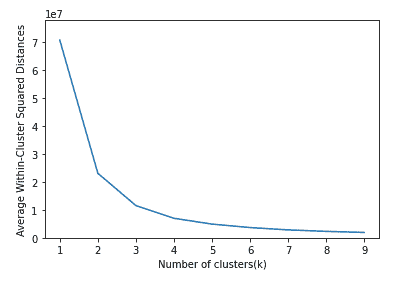

# 用机器学习预测糖尿病再入院

> 原文：<https://medium.com/codex/predicting-diabetes-readmissions-with-machine-learning-1d34296c49a7?source=collection_archive---------9----------------------->


被记入:[medialfuturist.com](https://medicalfuturist.com/what-to-expect-from-digital-health-2018/)

# 摘要

这篇文章描述了我所经历的过程，使用糖尿病的再入院数据来建立一个可以用来预测再入院的模型。

要明确的是，这不是一个努力拿出一个实用的模型，而是一个 ML 学习过程。目标是分析和检查数据，探索定量值和分类值，将不同的模型放在一起并比较性能。

这篇文章的成果发表在一个 [Deepnote 笔记本](https://deepnote.com/@charles-gagnon-c496/Predicting-Diabetes-Readmissions-UumuLo1CSMmZiFiPWiYjBg)上，每个人都可以查看。笔记本仍然是一项正在进行的工作，所以如果需要的话，我希望对它和这篇文章进行改进。

这项工作不是独一无二的。该数据集是公开可用的，已经存在了一段时间，通常用于教授机器学习。你可以在 [Kaggle](https://www.kaggle.com/brandao/diabetes) 上找到类似的媒体文章和作品分享。

# 介绍

该项目专注于糖尿病再入院，并分析了可从加州大学欧文分校获得的名为“1999-2008 年糖尿病 130 家美国医院”[的数据集。](https://archive.ics.uci.edu/ml/datasets/diabetes+130-us+hospitals+for+years+1999-2008)

该数据集代表了 130 家美国医院和综合交付网络 10 年(1999-2008)的临床护理。它包括 50 多个代表患者和医院结果的特征。从数据库中提取满足以下条件的信息。

*   这是住院病人的遭遇(住院)。
*   这是一次糖尿病遭遇，也就是说，在此期间，任何类型的糖尿病都作为诊断输入到系统中。
*   停留时间最少为 1 天，最多为 14 天。
*   遭遇期间进行了实验室测试。
*   在遭遇期间进行了药物治疗。

该数据包含诸如患者编号、种族、性别、年龄、入院类型、住院时间、入院医生的医学专业、执行的实验室测试次数、HbA1c 测试结果、诊断、药物治疗次数、糖尿病药物治疗、住院前一年的门诊患者、住院患者和急诊患者的数量等属性。

前 20 行数据粘贴在下面:


贷记:作者

该数据是代表弗吉尼亚联邦大学临床和转化研究中心提交的，是 NIH CTSA 赠款 UL1 TR00058 的接受者，也是 CERNER 数据的接受者。约翰·克洛(jclore@vcu.edu)、克日什托夫·j·Cios(kcios @ vcu . edu)、乔恩·德萨佐(jpdeshazo@vcu.edu)、贝亚塔·斯特拉克(strackb@vcu.edu)。该数据是健康事实数据库(密苏里州堪萨斯城 Cerner 公司)的去标识摘要。

Cerner Corporation 制造了一种电子健康记录系统，在许多医院和门诊诊所使用。这些数据是从许多医院的 Cerner EHR 系统中提取和编辑的。最初的工作是为了促进 Clore 博士的研究，由 NIH 资助。Clore 博士的目标是明确 HbA1c 结果对再入院的影响(Strack，2014)。Strack 的论文也被用作参考，以更好地理解数据、各种诊断代码，并促进良好模型实现所需的预处理。

我们的分析有几个目标:

*   当然，高层次的目标是建立一个模型来预测患者是否会在 30 天内再次入院。
*   为此，我们将执行各种步骤来准备数据
*   我们还将构建不同类型的多个模型，并比较它们的性能。

# 数据预处理

数据预处理分几步进行。

首先，根据我对论文的阅读和对数据的简单浏览(上面粘贴的标题输出)，我选择删除以下几列:

*   **重量**包含非常少的值。
*   在没有更多信息的情况下，**医疗专业**很难解码。
*   对于**付款人代码**也是一样，这也不太可能影响我的模型
*   **遭遇 id** 是该集合的唯一值
*   ，并且不需要**患者编号**(患者代码)。

如果我重做或扩展这项工作，我会包括更多关于病人代码的探索。例如，确保相同的代码不会出现在不同的性别或种族中，这可能是对数据的良好质量控制。最后一个值可能有助于确保数据质量，但在本项目中没有使用。

接下来，我测试了一个名为[*pandas _ profiling*](https://github.com/pandas-profiling/pandas-profiling)的新模块，结果证明这是一个快速查看大量数据的非常有效的方法。该工具会生成一个小部件，提供数据的概览。这里可以看到该剖析工具第一次通过的输出[profile1.html](https://rawcdn.githack.com/charlesg/HI530/fda6f3b8a1a4d5277f17f91d1e36a444a95d47bb/project/profile1.html)。

使用分析结果，我完成了数据的预处理。

# 分类数据(离散变量)

## **性别**

性别，男性或女性，是经典的分类数据。我通过创建一个“ **isFemale** ”二元特征来规范化这个特征。我还移走了一个性别未知的病人。然后我们可以删除**性别**特征。

## 人种

对于种族，我只是为每个种族创建了分类二进制特征(“假人”)。

## 诊断的

这些数据需要更多的工作。有三种独立的诊断(diag_1、diag_2 和 diag_3)，每种诊断都可以有 700 多个不同的值。为此，我将诊断简化为几个相关的类别。

对于数字 icd9 代码，我遵循论文(Strack，2014)中的信息和数据:

> 以下缩写用于特定的 icd9 代码:ICD 9:390–459，785 的“循环”, ICD 9:520–579，787 的“消化”, ICD 9:580–629，788 的“泌尿生殖”, icd9: 250.xx 的“糖尿病”, ICD 9:800–999 的“损伤”, ICD 9:710–739 的“肌肉骨骼”, ICD 9:11 的“肿瘤”

上面给了我映射“相关”代码所需的蓝图，剩下的大部分作为“其他”一些诊断代码以 E 和 V 开头，所以不知道这些代码应该如何映射，我将它们作为“其他”代码。一旦转换成实际的“文本”诊断，我就将它们纳入易于在我的模型中使用的二进制分类变量:

*   糖尿病 _ 诊断
*   其他 _ 诊断
*   等等。

## 药

药物专栏数量众多，难以跟踪，这也增加了这方面的挑战。首先，我去除了所有很少出现的药物，如 **examide** 、 **citoglipton、**和**二甲双胍-罗格列酮**。接下来，对于更常见的药物，我创建了一个二元变量，其中 NO 为假，而“下降”、“稳定”或“上升”意味着药物“存在”，因此为真。

## A1C 和格鲁塞尔血清试验

根据该论文(Strack，2014 年)，7 或 8 的 A1C 将被视为异常。血清测试的“200”或“300”也是如此。我决定将这两者结合起来，以减少分类变量的数量。我用“Abnorm”替换了编码结果，并由此创建了二进制假人。我丢弃了*_None 结果二进制，留下了 1 个结果 _ 正常，1 个结果 _ 异常和 Glu _ 血清 _ 正常，Glu _ 血清 _ 异常。我觉得这将使建模变得容易。

## 变化与糖尿病

这两个特性只需进行转换:

*   改变，从“Ch”到“True”和“No”到“False”
*   对于“糖尿病”,从“是”到“真”,从“否”到“假”

## 未映射的数据

在完成我的评论后，我选择删除另外几个列，我不确定这些列是否能为这个模型提供有用的信息

*   录取类型标识
*   出院 _ 处置 _ 标识
*   录取 _ 来源 _id

我很难为这些 id 找到一个有意义的映射，并赋予信息意义。为了避免损害模型，我删除了列。

## 再入院(我们的目标或结果)

我们期待预测的结果或特征是再入院。当前数据集包括一个变量“重新允许”，它有几个可能的值:

*   它可以被`NO`为永不重新接纳
*   `>30`如果 30 天后再次入院
*   或`<30`如果 30 天内重新入院。

我创建了一个单一的虚拟二进制变量“重新入院”，这是针对 30 天内重新入院的患者的`TRUE`，这是我们希望预测的结果。

所以我们希望建立一个离散结果的模型。

# **定量数据(连续变量)**

## 年龄

年龄以范围表示。我用十进制将这些范围转换回数值:

*   10–20 == 10
*   20–30 == 20
*   等等。

其他数值变量不需要特殊处理。

# 最终剖析

在对导入的数据集进行所有更改之后，我重新运行了分析工具，以验证结果并检查工作。第二次分析的结果可以在这里看到[profile2.html](https://rawcdn.githack.com/charlesg/HI530/fda6f3b8a1a4d5277f17f91d1e36a444a95d47bb/project/profile2.html)。

# 数据可视化

第一个也是最明显的可视化是快速浏览我的数值，查看范围和分布:


署名:作者

接下来，我绘制了我的结果变量，看看结果是否平衡。


署名:作者

结果并不均衡，30 天内不需要再次住院的病例比例很高。我的最终图表更接近于“住院时间”变量，因为它与再入院相关。我用 Seaborn KDEPlot 绘制了住院时间值。核密度估计(KDE)图是一种将数据集中的观察值分布可视化的方法，类似于直方图。KDE 使用一维或多维的连续概率密度曲线来表示数据。


署名:作者

有趣的是，如果住院天数增加，再入院率会下降。从该图中可以看出，住院 2 至 4 天的患者更有可能再次入院。我考虑过用类似的技术探索更多的连续变量，但是时间紧迫。

# 数据分组

我们使用 K-均值聚类算法来评估我们的数据聚类大小。计划是用层次聚类来研究结果聚类。K-mean 结果清楚地表明过去 4 个集群没有改进，因此这成为我们集群方法的目标。



署名:作者

所以使用`k-4`克迈恩斯模型，我研究并绘制了质心:


署名:作者

# 模型训练和预测

我们的结果是离散的(再次入院是或否)，因此我将比较三种不同类型的模型，但总共有四种模型:

*   逻辑回归( **logit**
*   在去除一些变量后，我重新做了一个逻辑回归模型。我根据得到的 p 值减少，并不断去除较高的值，直到我的所有变量都低于 0.05。( **newlogit** )
*   分类树(**完全分类树**
*   最后，一个人工神经网络——使用 Keras ANN ( **annmodel** )

## 型号选择

我们必须选择处理离散结果的模型，因为我们的预测结果是一个 Y/N 问题(基于患者健康记录中包含的变量的患者再入院)。在机器学习中，有一种东西叫做“没有免费的午餐”定理。简而言之，它表明没有一种算法对每个问题都是最好的，并且它特别适用于监督学习(即预测建模)。

首先，我们可以对主要关注连续产出(数字或定量预测)的模型打折扣。我们忽略了:

*   多元线性回归
*   回归树

我们选择的所有型号都提供了一系列不同的功能，并且每一种在特定环境下都表现最佳。

## 逻辑回归

分类模型是所有那些为离散结果设计的模型。逻辑回归是线性回归的分类替代方法。使用逻辑函数将预测映射为 0 和 1。

*   **优势**:输出有一个很好的概率解释，算法可以被正则化以避免过度拟合。使用随机梯度下降，逻辑模型可以很容易地用新数据更新。
*   **缺点**:当存在多重或非线性决策边界时，逻辑回归往往表现不佳。它们不够灵活，无法自然地捕捉更复杂的关系。

## 分类树

分类树是回归树的分类替代物。它们基于“决策树”

*   **优势**:与回归一样，分类树集成在实践中也表现得非常好。由于它们的层次结构，它们对异常值是鲁棒的、可扩展的，并且能够自然地模拟非线性决策边界。
*   **缺点**:不受约束的，单个的树容易过度拟合，但是这可以通过集合方法来缓解。

## 深度学习

深度学习通常用于连续输出，但也可以很容易地适应分类问题。我们选择了 Keras-ANN 模型，很大程度上是基于过去的经验。

*   **优势**:深度学习在对音频、文本、图像数据进行分类时表现非常好。这不是我们的案子。我们的数据集更简单。
*   **缺点**:和回归一样，深度神经网络需要非常大量的数据来训练，所以它不被视为通用算法。

## **型号**性能

在建立和运行我的模型之后，我使用混淆矩阵和精确度来比较结果。

## 准确(性)

逻辑回归的混淆矩阵和准确度；

```
Confusion Matrix (Accuracy 0.8844)PredictionActual 0 10 34627 751 4457 62 — — — — — — — — — — — — — — — — — — — — — — — — — — — — — -Confusion Matrix and accuracy for LogReg reduced:Confusion Matrix (Accuracy 0.8846)PredictionActual 0 10 34631 711 4457 62 — — — — — — — — — — — — — — — — — — — — — — — — — — — — — -Confusion Matrix and accuracy for LogReg reduced:Confusion Matrix (Accuracy 0.8226)PredictionActual 0 10 31789 29131 4045 474 — — — — — — — — — — — — — — — — — — — — — — — — — — — — — -Acccuracy for ANN model:Out[43]:0.8914356827735901
```

## 收益图表

前三个模型的增益图证实了完全和简化逻辑回归的性能是相同的。这也证实了分类模型的性能较差:


署名:作者

## ROC 和 AUC


署名:作者

# 结论

可以得出一些结论:

*   表现最差的模型是分类树。我希望我有更多的时间来重新考虑为什么，因为这不是我所期望的。但是很快，我的逻辑回归模型和 Keras-ANN 模型的表现超过了分类树，所以我花了更少的时间。
*   移除所有变量使结果保持一致(如果没有稍微改善的话)，考虑到对所需计算资源的益处，使用 reduced 将是有益的。我期望通过移除高 p 值特征来改善结果，但最终，使用较少的特征获得相同的高精度模型是有价值的。
*   Keras-ANN 模型计算量更大，但精度最高。有趣的是，AUC 低于具有低时期的分类树(<10) and surpassed the Logistic Regression once reaching over 70\. My final results used epochs=100.

The work done by Strack, for which the dataset was created, came to the conclusion that the to obtain HbA1c results for a patient could be considered a useful predictor of readmission. This seems supported by this experiment since the A1C_Abnorm feature remained in the regression with a P-value lower than 0.05\. They also used a logistic regression model and used a P-value breakpoint to select relevant features. Unlike in this project, they used pairwise comparisons with and without A1Cresults to focus their study on the impact on this feature.

> “First, we fitted a logistic model with all variables butHbA1c. We refer to this model as the core model. Second, we added HbA1c to the core model. Third, we added pairwise interactions to the core model (without HbA1c) and kept only the significant ones. Finally, we added pairwise interactions with HbA1c, leaving only the significant ones in the final model.”

In the end, **)我会选择逻辑回归(或线性分类)来完成这个任务**。这种方法建立起来非常快速和容易，而且它可以很容易地重新运行，并给出一致的结果，AUC 比其他方法更好。

# 未来的改进

我最近发现了[显然是 AI](https://evidentlyai.com/) ，它制作工具来分析和监控机器学习模型。我想使用他们的一些工具重做一些工作，并比较结果。

我希望这能使评审更加一致，并保持代码更加整洁。举例来说，正如我的代码所证明的那样，我一直在努力解决 ANN 模型的混淆矩阵问题。

我还希望它能有助于修改模型、改变参数和比较结果。

# 参考

Strack，b .，DeShazo，J. P .，Gennings，c .，Olmo，J. L .，Ventura，s .，CIO，K. J .，& Clore，J. N. (2014 年)。HbA1c 测量对医院再入院率的影响:对 70，000 例临床数据库患者记录的分析。国际生物医学研究，2014，781670。

“现代机器学习算法:优势和劣势。”EliteDataScience，2020 年 6 月 9 日，elitedatascience.com/machine-learning-algorithms.

放大图片作者:Paul j ...商业分析的数据挖掘。威利。Kindle 版

[https://hub . packtpub . com/selecting-statistical-based-features-in-machine-learning-application](https://hub.packtpub.com/selecting-statistical-based-features-in-machine-learning-application)

[https://www . ka ggle . com/victoral cimed/diabetes-re-admission-through-logistic-regression](https://www.kaggle.com/victoralcimed/diabetes-readmission-through-logistic-regression)