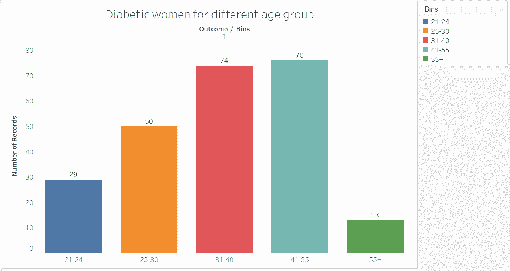

# 使用 PIMA 数据集预测糖尿病

> 原文：<https://medium.com/codex/predicting-diabetes-using-pima-dataset-b0ed22111fef?source=collection_archive---------7----------------------->

## 选择预测糖尿病的最佳机器学习算法

糖尿病是一种身体无法产生足够胰岛素的疾病。胰岛素是由胰腺产生的激素。它负责利用葡萄糖并将其转移到身体细胞中以产生能量。胰岛素分泌水平低会增加体内的葡萄糖(血糖)。高葡萄糖水平会对个体的健康产生不利影响，并且它还与器官和组织的损伤有关。有三种类型的糖尿病，如 1 型、2 型和妊娠期糖尿病。

糖尿病在印度很普遍。全球 16%的糖尿病患者来自印度。印度的糖尿病患者数量位居全球第二，有 7700 万人患有糖尿病。根据 IDF(国际糖尿病联盟)的数据，到 2045 年底，T2 的糖尿病患者将增加到 1 . 34 亿。以上事实表明，在印度非常需要深入了解这种疾病。这就是数据分析和机器学习发挥重要作用的地方。

本文将建立一个精确准确的机器学习模型，该模型可以根据数据集中包含的不同诊断指标来预测患者是否患有糖尿病，并减少假阴性。

照片由[迈肯齐·约翰逊](https://unsplash.com/@mykjohnson?utm_source=unsplash&utm_medium=referral&utm_content=creditCopyText)在 [Unsplash](https://unsplash.com/s/photos/diabetes?utm_source=unsplash&utm_medium=referral&utm_content=creditCopyText) 上拍摄

# 方法学

我使用了 **CRISP-DM 方法**进行分析。CRISP-DM 代表跨行业数据挖掘过程。这种方法广泛用于数据挖掘项目。它为我们提供了一种简单而结构化的方法。该方法包含六个步骤:

1.  **业务理解**
2.  **数据理解**
3.  **数据准备**
4.  **建模**
5.  **评估**
6.  **部署**

# 数据描述

我用了皮马糖尿病数据库。这个数据集是从 [Kaggle](https://www.kaggle.com/uciml/pima-indians-diabetes-database) 下载的。该数据集包含关于至少 21 岁及以上的印度女性的信息，并且它包括 9 个属性和 768 个实例。这些属性是**年龄、怀孕、葡萄糖、血压、皮肤厚度、胰岛素、身体质量指数、糖尿病谱系功能、**和**结果。**除了**输出**变量，所有属性都是数字。结果变量的数据类型为布尔型。

# 缺少值

我使用 pandas profiling 模块生成了一个探索性的数据分析报告。下面的报告显示了由 pandas profiling 生成的数据集的缺失值。

分析报告

上述报告显示，怀孕、血压、皮肤厚度、胰岛素和身体质量指数有很多值为零。对于怀孕属性，该值可以为零，因为该属性表示怀孕的次数。但是，血压、皮肤厚度、胰岛素和身体质量指数等属性的值不能为零。这些零值可能是数据收集错误或测试设备错误造成的。对于上面提到的属性，零表示缺少的值。如果我排除“怀孕”属性，**数据集中有 647 个缺失值。**

# 极端值

异常值是指不具备其他数据点或观察值质量的数据点。说白了，**就是驴群中的一匹马。**发现离群点，用合适的方法去除离群点，可以显著提高我们的机器学习模型的质量。

我使用箱线图来表示所有的数字数据点，通过它们的四分位数，分析师可以通过查看该图来检测异常值。

下图显示了数据集六种不同属性的箱线图:

六种不同属性的箱线图

所有数据点之外的点是异常值。**血压、胰岛素和糖尿病谱系函数似乎有许多异常值。**我们必须移除这些异常值，以进行适当的分析并构建完美的模型。

# 数据处理

如上所述，数据集中有许多零。为了解决这个问题，我们删除了所有的零，用空白代替。我用特定属性的中值替换了所有这些空白。我使用了中间值，因为几乎所有的属性都是偏斜的。当数据有偏差时，中位数是最佳选择。

对于异常值，我使用 Z 分数方法来检测异常值。我删除了所有有异常值的行，因为它们不代表正确的数据。正如我们在箱线图中看到的，有许多身体质量指数值超过 50。这是极不可能的。

# 形象化

## 1.怀孕次数多的女性更容易患糖尿病？

下图是怀孕与结果属性的计数图。该图显示了糖尿病患者和非糖尿病患者怀孕数量的比较。

从图中可以看出，怀孕较少的患者中，非糖尿病患者多于糖尿病患者。此外，如果我们检查怀孕超过 7 次的患者，糖尿病患者比非糖尿病患者更多。因此，我们可以得出结论，怀孕次数越多，患糖尿病的几率就越高。

## 2.老年女性患糖尿病的几率高吗？

下图是不同年龄组糖尿病女性的条形图。这个条形图是在**画面**中创建的。我对年龄进行了分类，并将其分为 5 个不同的组。这些年龄组是 21-24 岁、25-30 岁、31-40 岁、41-55 岁和 55 岁以上。

这张图表为我们提供了重要的见解。如果你看一下图表，你会发现从 31 岁到 55 岁，有很多女性患有糖尿病。我们可以得出结论，**中年女性患糖尿病的风险更高。它还向我们表明，年龄可能是预测糖尿病的一个重要因素。**

# 模型结构

我使用了四种不同的机器学习算法，如 K-NN、随机森林、逻辑回归和朴素贝叶斯。最初，我将我们的数据分为训练集和测试集。在处理的数据中有 719 个实例，我选择了 575 个实例用于训练目的，144 个实例用于测试目的，使我们的数据分成 20-80 份。

我选择**准确性、敏感性、特异性、F1 评分、精确度、ROC 和 AUC 作为评估的性能指标。**每个算法的结果如下所示。

## K 近邻

我们选择 K = 5 作为该算法的最近邻的值。测试集的总实例数是 144。

1.  精度- **0.75**
2.  特异性- **0.86**
3.  灵敏度- **0.63**
4.  F1 得分- **0.64**
5.  精度- **0.66**
6.  AUC- **0.81**
7.  假阴性- **22**

## 随机森林

以下是随机森林的评估方法:

1.  精度- **0.77**
2.  特异性- **0.88**
3.  灵敏度- **0.51**
4.  F1 得分- **0.57**
5.  精度- **0.65**
6.  AUC- **0.85**
7.  假阴性- **12**

## 朴素贝叶斯

1.  准确度- **0.78**
2.  特异性- **0.83**
3.  灵敏度- **0.71**
4.  F1 得分- **0.72**
5.  精度- **0.72**
6.  AUC- **0.85**
7.  假阴性- **16**

## 逻辑回归

1.  准确度- **0.74**
2.  特异性- **0.95**
3.  灵敏度- **0.37**
4.  F1 得分- **0.51**
5.  精度- **0.80**
6.  AUC- **0.82**
7.  假阴性- **33**

# 比较

## 准确(性)

正如我们在下面的条形图中看到的，朴素贝叶斯具有最高的准确性。这种准确性表明朴素贝叶斯比其他算法正确地分类了更多的实例。同时，逻辑回归显示出最低的准确性，其值为 0.74。因此，我们将向试图预测糖尿病的研究人员推荐朴素贝叶斯。另一方面，我们放弃了使用逻辑回归预测糖尿病的想法。

## 假阴性

下面的图表是假阴性的比较。正如我们从图中看到的，朴素贝叶斯比其他算法有更少的假阴性(16)。另一方面，在逻辑回归中可以看到最高数量的假阴性，其值为 33。同时，K-NN 和随机森林的假阴性分别为 21 和 21。因此，我们可以得出结论，朴素贝叶斯是预测糖尿病的好方法。

# 最后的想法

在预测糖尿病时，**nave Bayes 的表现优于其他算法，准确率为 78%。**根据这项分析，怀孕次数越多，患糖尿病的几率就越高，怀孕后，患糖尿病的几率就越高。血糖、血压和胰岛素水平高的女性患糖尿病的几率更高。中年女性更容易患糖尿病。上述发现有助于医学界深入了解糖尿病。需要做更多的研究，因为这关系到许多人的生命。

如果你喜欢这一个，这里是我的其他职位

 [## 数据分析师需要的 8 项技能

### 让你成为优秀数据分析师的技能

medium.com](/codex/8-skills-that-a-data-analyst-need-53a8aac565c9)