# 使用梯度增强决策树预测宫颈癌风险

> 原文：<https://medium.com/codex/predicting-the-risk-of-cervical-cancer-using-gradient-boosted-decision-trees-777077941ff7?source=collection_archive---------5----------------------->

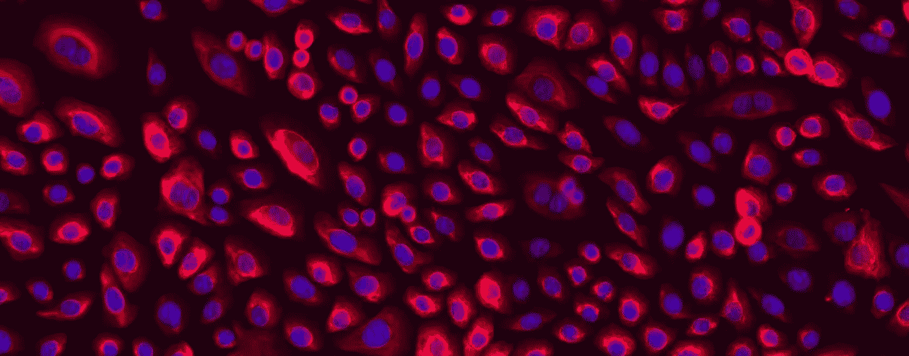

[来源](https://www.sciencellonline.com/human-cervical-epithelial-cells.html)

**每年，在美国本土有超过 13 万名女性**被诊断患有宫颈癌，其中超过 4000 名女性将死于该疾病。

宫颈癌是全球女性第四大常见癌症，但由于它会随着时间的推移而发展，它也是最*可预防的癌症类型之一。*

尽管多种因素都可能导致个人患宫颈癌，但我们没有标准的方法来诊断有患宫颈癌风险的女性。

例如，如果我们知道一名服用口服避孕药并经常吸烟的妇女有患宫颈癌的风险，她将能够消除这些风险因素并改变她的生活方式以限制她患宫颈癌的机会。

通过利用**机器学习**，我们可以通过建立风险预测模型来大幅减少被诊断患有宫颈癌和死于宫颈癌的女性人数。

为了建立宫颈癌的风险预测模型，我们可以利用极端梯度增强算法，也称为 **XGBoost 算法。**

## 了解 XGBoost 算法

XGBoost 算法是一个有用的算法，因为它可以用于回归和分类任务。它使用监督学习和梯度推进，这意味着它以多决策树的形式产生预测模型。

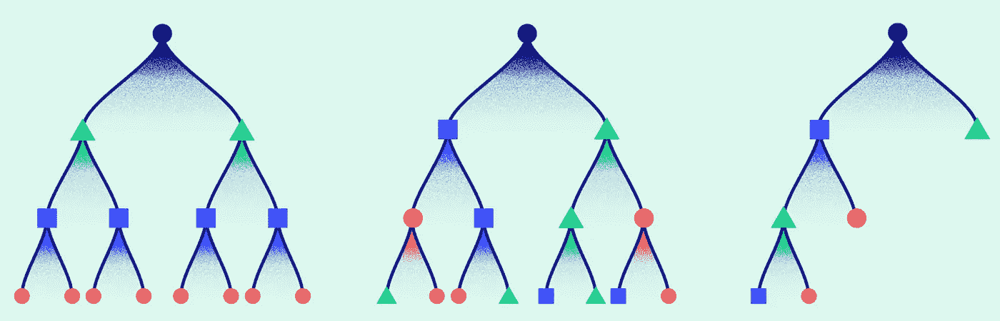

[来源](https://analyticsindiamag.com/xgboost-internal-working-to-make-decision-trees-and-deduce-predictions/)

该算法通过从以前模型预测中的错误中学习来实现更好的未来预测。它以连续的方式训练弱模型。它根据训练数据建立初步模型，并根据**残差**或第一个模型的错误建立第二个模型。重复此过程，直到创建了最大数量的模型，或者直到模型提供了准确的预测。

在这个项目中，模型将被输入输入特征，包括个人的年龄、怀孕次数、吸烟频率、宫内节育器(IUD)的存在，以及他们是否患有性病，并将被告知该妇女是否应该接受活检以检查宫颈癌的存在。如果她被告知接受活检，但没有宫颈癌，她会知道自己可能有风险，并可以相应地采取行动，以将风险降至最低。

为了这个项目，我使用了 2017 年的数据集,该数据集收集了委内瑞拉加拉加斯的加拉加斯大学医院(Hospital Universitario de Caracas)的女性信息。该数据集包含 858 名患者的人口统计信息、习惯和医疗记录。

# 1.导入库和数据集

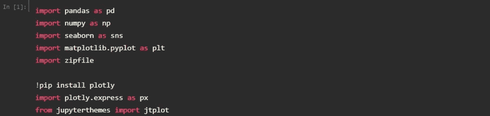

构建模型的第一步是将我们的库和数据集导入到我们的 Jupyter 笔记本中。

> **pandas** :最流行的 python 库，用于数据操作和分析。在这个项目中，它主要用于数据帧操作。
> 
> **NumPy** :一个 python 库，提供对大型多维数组和矩阵的支持，并具有高级数学函数来帮助操作和操纵这些数组。
> 
> **seaborn** 和 **matplotlib.pyplot** :用于数据可视化。
> 
> **plotly** :用于交互式数据可视化。

一旦我们安装了库，我们就可以使用 pandas 导入数据集。数据集应保存为 CSV 文件。下载我的数据集时，我将其命名为“子宫颈 _ 癌症. csv”，并能够导入它，如下所示。

```
cancer_df = pd.read_csv('cervical_cancer.csv')
```

# 2.探索性数据分析

进行探索性数据分析对于消除数据集中的不一致性至关重要；它需要删除重复，纠正错误，并处理丢失的值。

在项目的这一部分，我们将可视化我们的数据并删除空值。

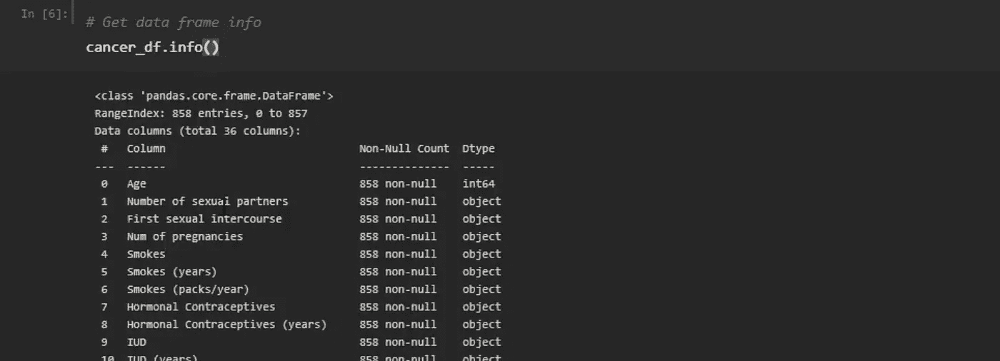

首先，我们想从数据帧中获取信息。当我们运行 *cancer_df.info( )* 时，我们应该得到一个表，它显示了我们有多少条目(我们有数据的患者)和 36 列，它们显示了我们的不同特征，从个体的年龄到他们的性病诊断数量。

我们还可以看到所有的功能都有非空计数，我们还可以看到不同功能的数据类型。大多数是对象，稍后我们需要将它们转换成数值。

接下来，我们还可以通过运行 *cancer_df.describe( )* 获得一些关于我们的数据帧的统计信息。例如，我们可以看到患者的平均年龄约为 26.8 岁。

但是，如果我们只看 dataframe 而不描述它，通过只运行 *cancer_df，*我们可以看到两列下面有问号；“STDs:自首次诊断以来的时间”和“STDs:自上次诊断以来的时间”

这些问号是缺失数据或空数据的占位符。因此，我们需要将问号替换为 *NaN* ，意思是“不是一个数字”，以表示它是一个空值。

```
cancer_df = cancer_df.replace('?', np.nan)
cancer_df
```

我们还可以通过真值或假值来可视化我们的数据框架，这将允许我们绘制热图，并查看整个数据中的空值。我们可以通过运行 *cancer_df.isnull()来做到这一点。*

数据中唯一的空值表示为“真”，而非空值表示为“假”

为了可视化我们数据中的空值，我们可以用给定的特性绘制一个数据帧的**热图**。我们可以将热图设置为 20x 20 的网格。白色部分显示数据中的空值。

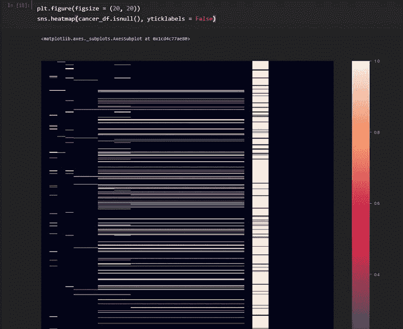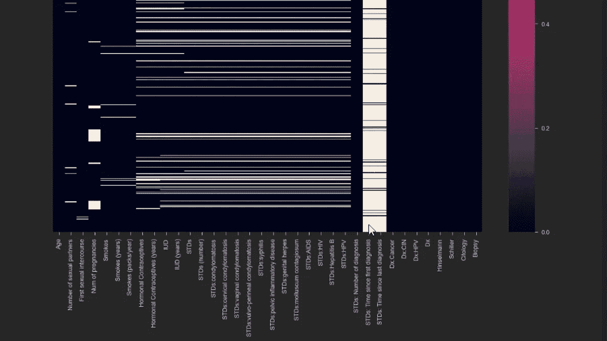

如热图所示,“STDs: Time since first diagnosis”和“STDs: Time since last diagnosis”功能有许多空值，因此我们需要从数据中删除这些功能。这样，我们的数据中将有 34 列，而不是 36 列。

```
cancer_df = cancer_df.drop(columns = ['STDs: Time since first diagnosis, 'STDs: Time since last diagnosis'])cancer_df
```

我们还需要将我们的数据从对象数据类型转换为数值，因为大多数要素都存储为对象数据类型。

```
cancer_df = cancer_df.apply(pd.to_numeric)
cancer_df.info()
```

既然我们的数据完全由数值组成，我们可以通过运行 *cancer_df.mean()来查看所有特征的平均值。*

然后，我们可以用平均值替换任何其他空值。

```
cancer_df = cancer_df.fillna(cancer_df.mean())
cancer_df
```

# 3.数据可视化

在这一步中，我们可以进一步可视化数据，以找到特征之间的相关性。

第一步是获得相关矩阵:

```
corr_matrix = cancer_df.corr()
corr_matrix
```

一旦我们这样做了，我们可以绘制它:

```
plt.figure(figsize = (30, 30))
sns.heatmap(corr_matrix, annot = True)
plt.show()
```

(30，30)创建了一个更大的热图，以确保所有数据都是可见的，并且适合热图，而 *annot = True* ，向我们显示热图中的数值。绘制时，它将如下所示:


该矩阵显示了数据集中所有要素之间的相关性或影响。最接近 1(白色)的值表示接近完美的相关性，最接近 0(紫色)的值表示几乎没有相关性，负值(最暗)表示相反的相关性。

如您所见，有一条白色的值的对角线，看起来具有完美的相关性，因为相同的要素在 x 轴和 y 轴上对齐，并且相同的要素与自身具有完美的相关性。

# 4.在模型训练之前准备数据

下一步是在训练模型之前准备我们的数据。

正如我们在前面描述数据时所看到的，数据中的最后四个特征是“Hinselman”、“Schiller”、“Citology”和“Biopsy”。所有这四个特性都是不同的诊断指标。但是，由于我们只是尝试训练算法来预测目标变量活检，因此我们只需要选择该列作为我们的目标输出。

```
target_df = cancer_df['Biopsy']
input_df = cancer_df.drop(columns = ['Biopsy'])
```

然后，我们可以检查我们的目标形状，它是 858，或者(858)，正如我们所预期的，因为我们有来自 858 个患者的数据。然后，我们想要检查输入形状，我们得到(858，33)，因为我们有 858 行和 33 列。

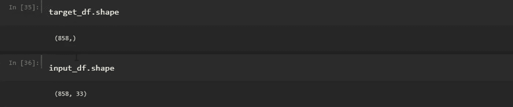

接下来，我们需要使用 NumPy 将输入和输出转换成“float32”格式。然后，我们可以通过运行 *y.shape* 来重塑输出的数组，以确保它是合适的。

```
x = np.array(input_df).astype('float32')
y = np.array(target_df).astype('float32')
```

在将数据输入模型之前，准备数据的下一步是缩放数据，为此我们需要导入 **scikit-learn** ，这是一个包含各种分类、回归和聚类算法的 Python 库。

我们可以使用 sci-kit learn 来规范化我们的输入数据或我们的特征，因此我们希望导入 StandardScaler 和 MinMaxScaler。

我们还想从我们的类“StandardScaler”中实例化一个对象“scaler”然后，我们希望对我们的对象应用“fit_transform”方法，这个对象是“scaler”，并将其传递给 X，以生成一个输出，这是 X 的缩放版本。

```
**from** sklearn.processing **import** StandardScaler, MinMaxScaler
scaler = StandardScaler()
X = scaler.fit_transform(X)
```

训练模型之前的最后一步是将其分成三个类别，训练数据、验证数据和测试数据。

**训练数据**仅用于训练模型。我们只需将数据输入模型，这样它就可以了解输入和输出之间的关系。

在对模型进行定型时，我们希望确保模型不会过度拟合定型数据。因此，我们可以使用**验证数据**并将其输入到模型中，因为它以前从未见过验证数据。

我们希望训练和验证数据的误差都下降。我们希望模型能够概括，而不是记忆。

然而，如果我们看到训练数据上的误差下降，而验证数据上的误差上升，这意味着模型对训练数据过度拟合，无法进行归纳。

**测试数据**在模型训练后使用。在我们完成训练和迭代之后，我们将测试数据提供给模型。模型在训练期间将永远不会看到测试数据。

```
**from** sklearn.model_selection **import** train_test_splitX_train, X_test, y_train, y_test = train_test_split(X, y, test_size = 0.2)
X_test, X_val, y_test, y_val = train_test_split(X, y, test_size = 0.5)
```

我们的训练和测试数据中的 0.2 意味着我们的数据有 20%是用于测试的，80%会用于训练。

测试数据集进一步分为验证和测试类别。正如我们所看到的，50%的数据进入测试集，其余的进入验证集。

# 5.训练和评估模型

为了训练和评估模型，我们首先需要通过运行以下代码来安装 xgboost:

```
!pip install xgboost
```

然后我们要*将 xgboost 导入为 xgb* 。一旦我们这样做了，我们就可以训练 xgboost 分类模型。

我们可以将学习率设定为 0.1，因为这可能是我们系统的一个很好的起点。我们还可以将分类树的期望深度指定为 5，这是从决策树的底部到根的最长路径。在这里，我们还可以指定估计器的数量或我们将要使用的模型的数量。我们可以将估计数设置为 10。

值得注意的是，我们可以显著增加树的深度和估计器的数量。然而，这意味着我们的模型变得更加复杂。可能出现的一个问题是训练数据的过度拟合。该模型可能在训练数据上表现很好，而在测试数据上表现很差。

在建立了我们的学习率和估计数之后，我们可以拟合模型，并传递我们的训练数据， *X_train，y_train。*在运行代码块之后，我们可以看到我们的模型已经被训练好了。

```
**import** xgboost **as** xgb
model = xgb.XGBClassifier(learning_rate = 0.1, max_depth = 5, n_estimators = 10)
```

接下来，我们可以使用测试数据集预测训练模型的得分。。我们还想在我们的测试数据上绘制模型的准确性，这是模型从未见过的。

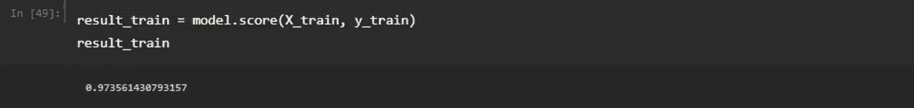

运行代码后，我们可以看到，在我们的训练数据上，我们已经达到了 **97%的准确率**。我们可以对测试数据重复同样的过程:

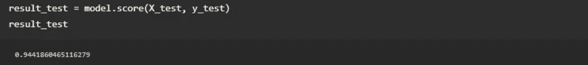

运行代码后，我们可以看到我们的模型在测试数据上达到了 **94%的准确率**。鉴于该模型以前从未见过这些数据，我们可以说该模型表现得相当好。

达到这个准确率后，我们可以继续绘制一个分类报告和混淆矩阵，它显示了模型哪里做得好，哪里做得差。

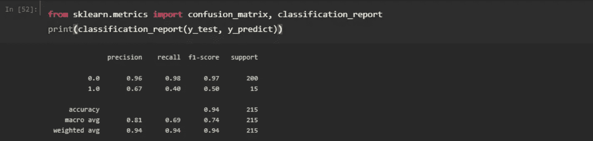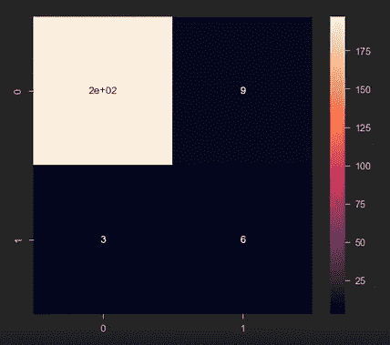

这就是你要的。一种宫颈癌风险预测模型，可以接受患者的信息并显示他们患宫颈癌的风险。如果你想更深入地了解这个项目是如何进行的，请查看我用过的[课程](https://www.coursera.org/projects/cervical-cancer-risk-prediction-using-machine-learning)，以及[我关于这个项目的视频](https://www.youtube.com/watch?v=Tdmx0aTHOIc)！

> 非常感谢您阅读这篇文章！如果你从这篇文章中学到了什么，请分享！一定要把[跟我](https://linktr.ee/manasigajjalapurna)联系起来，留下这篇文章一个掌声👏如果你喜欢的话！

## 来源:

[](https://machinelearningmastery.com/extreme-gradient-boosting-ensemble-in-python/) [## Python -机器学习掌握中的极端梯度推进(XGBoost)集成

### extreme Gradient Boosting(XGBoost)是一个开源库，它提供了一个高效的实现…

machinelearningmastery.com](https://machinelearningmastery.com/extreme-gradient-boosting-ensemble-in-python/) [](https://xgboost.readthedocs.io/en/latest/tutorials/model.html) [## 增强树简介- xgboost 1.5.0-dev 文档

### XGBoost 代表“极端梯度增强”，其中术语“梯度增强”源于论文 Greedy…

xgboost.readthedocs.io](https://xgboost.readthedocs.io/en/latest/tutorials/model.html)