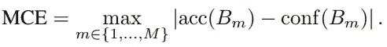
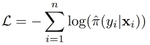

# 预测神经网络中的真实概率:置信度校准

> 原文：<https://medium.com/codex/predicting-the-true-probability-in-neural-networks-confidence-calibration-fa6c6d712ff?source=collection_archive---------4----------------------->

照片由[在](https://unsplash.com/@toolsformotivation?utm_source=medium&utm_medium=referral) [Unsplash](https://unsplash.com?utm_source=medium&utm_medium=referral) 上的激励工具拍摄

> 智慧是知道你不知道的事情——孔夫子

假设一个基于深度学习的二元癌症诊断系统，以其卓越的准确性而闻名，在我的数据上预测为 0.996。这是否意味着我*实际上*有 99.6%的机会患上那种疾病？嗯，他们应该是，但也许不是。我们将回顾为什么这些预测不一定反映深度学习模型中的概率以及对这种现象的解决方案，这种现象在当前的深度学习系统中普遍存在。

得益于现代加速器和设计原则，深度神经网络取得了毋庸置疑的成功。在基于深度学习的分类中，输出值被设计为反映正确的概率。虽然深度学习肯定提高了任务的准确性，但他们似乎没有能力准确地说出他们对输出的信心。一篇论文引用，“*现代神经网络不再校准良好”*。

*这篇文章评论了关于现代神经网络* 校准的论文

## *置信度校准*

> *置信度校准——预测代表真实正确性可能性的概率估计的问题*

*当我们说我们希望输出被*校准*时，我们希望输出代表真实概率。例如，给定 100 个预测，每个预测的置信度为 0.8，我们期望大约 80 个样本被正确分类。完美的校准应该是恰好 80 个样本是正确的，或者更正式地说，满足以下等式。*

**

*完美的校准显然是不可能的。事实上，不可能测量模型的精确校准，因为 pˇ是连续的，因为实际上不存在 pˇ= p。*

## *置信度校准的重要性*

*用交叉熵损失训练的具有 softmax 激活的神经网络被设计为被校准，但是在实践中经常不这样表现。*

*不校准就不能活吗？虽然深度学习取得了很好的性能，但它们有时是错误的。但是如果他们总是有 99%的信心，那么错误的后果将是严重的，我们必须减少对这些系统的信任。*不确定*的失败会限制 DL 在安全关键的真实世界系统中的应用。*

> *例如，考虑一辆使用神经网络来检测行人和其他障碍物的自动驾驶汽车。如果检测网络不能自信地预测当前障碍物的存在或不存在，汽车应该更多地依靠其他传感器的输出来制动。*
> 
> *或者，在自动化医疗保健中，当疾病诊断网络的可信度较低时，控制权应移交给人类医生。*

## *测量校准*

*如前所述，校准是不可能精确计算的。或者，我们通过将预测分成多个仓来估计校准。以下方法是如何估计校准的一些例子。*

***可靠性图表**:下图底部的图是可靠性图表的一个例子。通过将统计精度绘制为置信度(估计精度)的函数，我们可以直观地看到置信度反映真实精度的程度。例如，在右下方的图中，当置信值为 0.6~0.7 时，模型的真实准确度约为 0.3。与对角线相同线的较大差距代表校准错误。*

**

***预期校准误差(ECE):** 因为概率是无限的，所以预测被分组到 M 个区间箱中。ECE 是衡量校准的标量。它被计算为箱的准确度/置信度差异的加权平均值。|B_m|/n 项是 bin m 中样本的比率。*

**

***最大校准误差(MCE)** :类似于 ECE，但 MCE 检测的不是差值的加权平均值，而是置信度和准确度之间的最大偏差。*

**

***负对数似然(NLL)** : NLL 是二元交叉熵损失的一个分量。当且仅当ππ(Y |X)恢复地面真值条件分布π(Y | X)时，NLL 最小。*

**

## *技术对校准的影响*

*上面左图说明了 5 层 LeNet 的校准，而右图是 110 层 ResNet 的结果。更深的神经网络似乎具有明显更差的校准。该论文研究了当使用现代深度学习中使用的技术来找出错误校准的确切原因时，模型校准的变化。*

**

*当模型容量(深度和宽度)增加时，分类误差减小。然而，校准(ECE)似乎越来越差，直到一个程度(图 1，2)。接下来，有趣的是，批量标准化显著影响 6 层网络上的模型校准。不考虑超参数，发现批量标准化对模型校准有负面影响。最后，发现以权重衰减表示的正则化在一定程度上改善了分类误差，同时也改善了模型校准。有趣的是，即使校准似乎被认为是过度正则化(衰减因子**≈**10ˇ-2.5)，校准也在不断改进。*

*在这些实验中，我们可以观察到校准没有随着精度一起优化。我很好奇模型校准是否直接受到正则化量的影响，包括其他形式，如标签平滑、数据扩充、丢失或随机深度。*

## *在深度学习中实现校准*

*在这一部分，我们将回顾一些现有的校准解决方案。为简单起见，我们预期一个二进制分类问题，并确保模型预测一个置信度 pˇ_ I，用于正类。我们希望将输出置信度重新校准为 qˇ_ I，假设 z_i 是 sigmoid 激活前的输出。*

***直方图宁滨:**未校准的预测被分配给 M 个仓中的一个。将最小化仓式平方损失的分数θ_m 分配给每个仓。分数将预测范围映射到真实的校准置信度。在测试时，如果预测落入仓 m，则校准后的预测为θ_m。*

**

*分配θ_m 的公式*

***保序回归**:学习一个*分段常数*函数 f 来校准原始输出 pˇ_ I . f 最小化下面的函数。类似于直方图绑定，但是使用下面的函数通过条块预测来联合优化条块边界。*

****

***贝叶斯宁滨分位数(BBQ** ):本质上是使用贝叶斯平均的直方图宁滨。宁滨方案是对(M，I)，其中 M 是仓的数量，I 是划分[0，1]的区间列表。BBQ 考虑宁滨方案的空间，并对每个方案产生的概率进行贝叶斯平均。红色项表示使用宁滨方案 s 时的校准概率，蓝色项表示使用宁滨方案的概率。因为验证数据 D 是有限的，所以实际上可以直接计算这一项。*

**

***Platt scaling**:z 向量被输入到在验证集上训练的逻辑回归模型中，以预测概率。考虑到简化后的问题是二进制分类，它输出 qˇI =σ(az _ I+b)作为标定概率和学习参数 a，b，足够简单。*

*对于 K>2 类的分类，使用上述方法的扩展。然而，由于基本概念似乎与二进制分类相一致，所以我们不会在本文中描述这些方法中的大部分。更多细节请看原文。*

***温度缩放**:作为普拉特缩放的抽象，称为*温度*的单个参数 T 用于缩放所有类别。校准的置信度预测按下面的函数计算。T 起到软化置信度的作用，因为 T 值越大，校准后的概率 qˇ_ I 将达到 1/K，表示不确定性。然而，严格不等式将保持一致，因此不会影响模型的准确性。本文在置信度校准的背景下介绍了这一技术。*

**

*这些方法不是实际引导神经网络预测校准概率，而是通过向网络添加单独的分支来估计置信度，从而实现置信度校准。我相信这种趋势是基于这样的假设，即模型校准与模型精度无关，因此精度应该通过单独的过程来学习。但这真的是真的吗？交叉熵损失从根本上来说是被设计来校准的，但是他们为什么不这样做呢？我认为问题在于过度拟合和训练程序，并认为带有校准目标的训练可以为模型提供更好的反馈。*

## *实验*

**

*各种型号校准策略的 ECE(M=15)*

*在置信度校准的各种方法中，温度标度取得了令人惊讶的性能。无论数据集和网络架构如何，温度缩放都远远优于其他方法。尽管它很简单，我们可以观察到错误校准的问题是低维的，甚至可能是线性的。*

**

*从可靠性图中可以看出，未校准的网络(左)过于自信。虽然温度缩放是其中最好的，但所有其他方法也可以测量合理的校准。*

## *结论*

*更深层次的神经网络的错误校准是一个奇怪的问题，因为它们似乎与模型精度无关。我们讨论过，许多修改会在提高精度的同时损害模型的校准。我们还研究了以前的一些精确校准方法。我们得出结论，温度缩放是一种简单而有效的置信度校准技术。*

*对深度学习失调的理解是不完整的。需要研究这一现象的理论背景。因为交叉熵目标在不确定性上倾向于校准的输出，所以错误校准源于深度神经网络中未知的不健康行为。因此，网络参数应该学会正确地校准概率。然而，校准方法通常不会干扰模型预测。我期待着在这一领域的更多研究，因为没有太多关于校准的工作。*