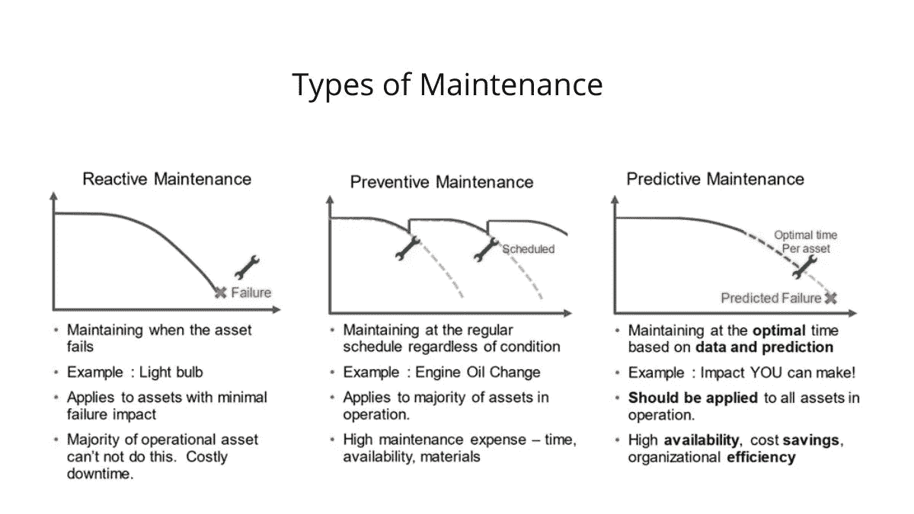
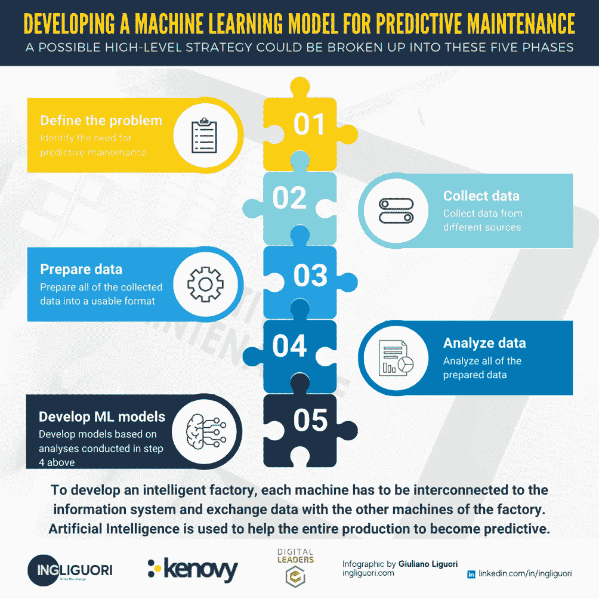
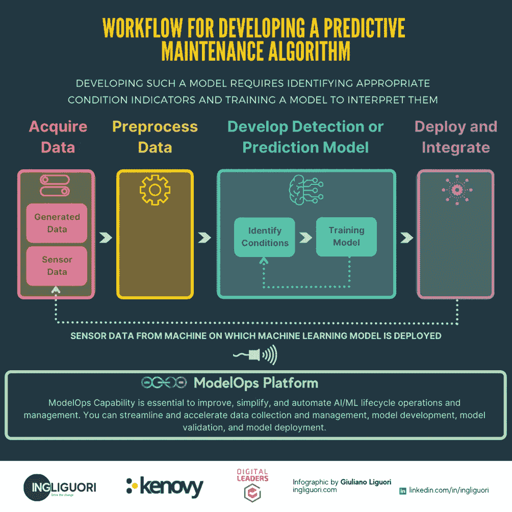
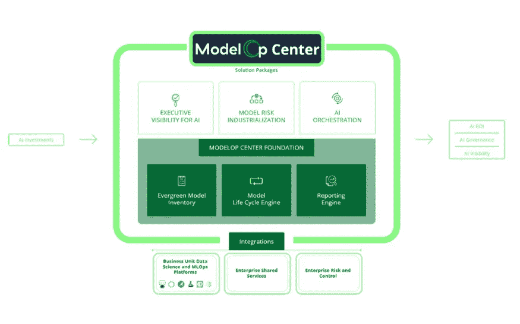
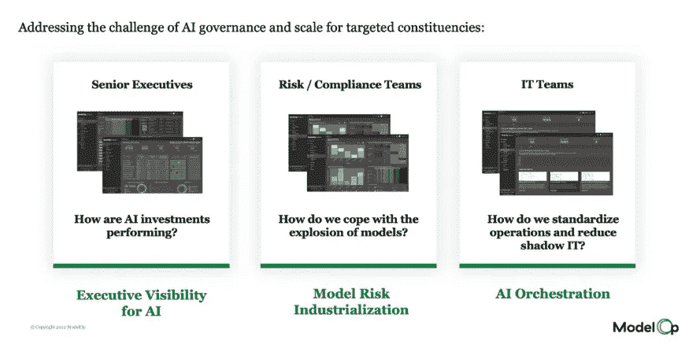
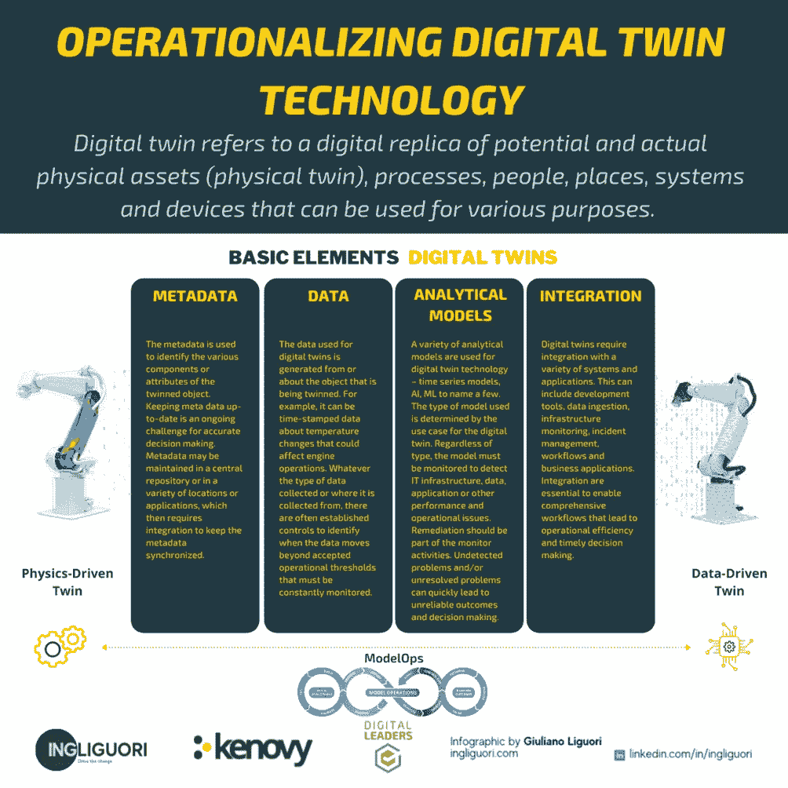

# 工业 4.0 中的预测性维护:应用和优势

> 原文：<https://medium.com/codex/predictive-maintenance-in-industry-4-0-applications-and-advantages-72bd7383823e?source=collection_archive---------3----------------------->

源 Canva

## 机器在我们的生活中发挥着巨大的作用，包括我们每天使用的机器，但如果没有维护，每台机器最终都会发生故障。公司遵循各种维护计划来提高运行可靠性和降低成本。

# 维护策略和方法

维护是保持资产的功能和效率所必需的一组操作，可以作为对故障的响应或作为预先计划的行动而发生。

根据德勤进行的研究，非优化的维护策略会使工厂的生产能力降低 5%至 20%。最近的研究还表明，工业制造商每年因停工损失约 450 亿欧元。

并非所有维护活动都是相同的。传统上有两种类型的维护，纠正性(或反应性)和预防性。

> *纠正性维护是修理或恢复设备、系统或机器至其原始或工作状态的过程。*

在**纠正性维护**的情况下，使用一个对象直到故障发生。这种方法是被动的，因为它是事件的结果。纠正性维护允许最大限度地利用设备，但同时意味着不可靠性，因为故障的确切时间是未知的，这可能导致安全问题。很明显，不可预见的故障或问题会造成暂时的以及相当大的经济损失。纠正性维护通常比预防性维护更昂贵和耗时，但对于纠正已经发生的问题是必要的，它实际上被认为是最昂贵的维护类型。

有时，纠正性维护也可视为定期预防性维护任务，执行该任务是为了纠正机器、系统或部件的现有问题。它与预防性维护的区别在于，纠正性维护任务不是预先计划的，而是由于系统中检测到的一些故障或问题而产生的。

> *预防性维护是维护设备或系统以防止故障的过程。*

**预防性维护**是以避免或消除故障，或至少减少故障发生的方式系统维护设备、系统或机器的实践。预防性维护的目标是提高系统的可靠性，同时减少与故障相关的成本和停机时间。预防性维护在故障发生前的一段时间内进行，并且本质上是循环的，因为不知道不利事件发生的确切时刻。这种类型的维护允许克服纠正性维护的限制，但是同时，由于接收到仍然有效和可用的部件的事实，会产生经济损失。预防性维护在故障发生前进行是最有效的，但这只有在你知道故障何时发生的情况下才有可能。预防性维护可能涉及的其他问题与以下事实有关:根据机器运行的环境，每台机器的工作方式不同，必要维护的频率也可能不同。

除了这两种维护方法之外，近年来，随着日益强大和有效的创新技术的出现，另一种类型的维护方法应运而生，即所谓的预测性维护。因此，我们来解释一下什么是预见性维护，以便更好地理解它。

> *预测性维护是计算机科学和工程的一个领域，它使用数据分析来识别和预测设备故障。*

**预测性维护**是现代制造过程中的一个关键要素。可用于汽车、航空航天、能源、制造业等行业。预测性维护可以通过减少停机时间和防止设备故障来帮助公司节省资金，通过允许公司为设备故障制定计划来帮助公司改善客户服务。另一方面，这种维护旨在预测未来的不利事件，以便更好地安排维护。

以工业物联网(IIoT)为例，它是一个由设备和传感器组成的网络，收集和共享数据，使公司能够预测设备何时会出现故障，安排预防性维护，并避免计划外停机。这是一个不断增长的市场，预计到 2025 年将达到 2250 亿美元。毫无疑问，预测性维护是 IIoT 的重要应用。

> *你可能也想读读* [人工智能法案:一种基于风险的政策方法，以实现人工智能的卓越和信任](https://ingliguori.medium.com/ai-act-a-risk-based-policy-approach-for-excellence-and-trust-in-ai-d29ce0d54e2?source=user_profile---------1-------------------------------)

通过在故障发生前预测故障，公司可以避免停机带来的成本和不便。预测性维护还通过在对生产影响最小的时候安排预防性维护来帮助公司优化资源。

源 Splunk

# 监控和预测性维护算法

正如我们所说的，如果你能预测机器什么时候会发生故障，你就能提前安排维修。好消息是，预测性维护让您可以估计故障时间。它还能准确定位复杂机器中的问题，并帮助您确定哪些部件需要修理。通过诊断或预测故障，您可以提前计划维护，更有效地管理库存，减少停机时间，并提高生产率。

通常，机器学习方法通常用于定义系统的当前状态并预测其未来状态。它使用数据来预测机器在实际发生故障之前何时会发生故障。机器学习模型的开发、管理和治理对于这种类型的维护的成功至关重要。

人工智能能够在很短的时间内处理大量复杂的数据，这就是为什么现在许多决策都委托给机器。沿着价值链收集并处理(实时)大量数据，然后可以使用这些数据分析当前情况并重新定义期望的情况。在这种情况下，对于公司来说，定义哪些数据与所使用的技术相关是很重要的。下一步是在定义适合数据收集和处理的模型或算法之前，找到并集成合适的测量工具来获取值。在这种情况下，理解价值链的所有阶段相互影响也很重要，这就是为什么孤立的方法在大多数情况下没有用。

作者提供的信息图

> 你可能也想阅读[安全可靠的人工智能模型操作](/codex/model-operations-for-secure-and-reliable-ai-2cf0ced9945b?source=user_profile---------2-------------------------------)

开发预测性维护机器学习模型并不是一件容易的事情。这需要大量的时间、精力和资源。一个可能的高级策略可以分为以下五个阶段:

1.  **定义问题** —确定预测性维护的需求，并定义预测性维护机器学习模型要解决的具体问题。
2.  **收集数据** —从不同来源收集有助于解决问题的相关数据。
3.  **准备数据** —将所有收集的数据准备成可用的格式。
4.  **分析数据** —分析所有准备好的数据，以识别可能有助于预测未来事件或发生的模式和关系。
5.  **开发算法或机器学习模型** —基于上面第 4 步中进行的分析开发算法或机器学习模型。

这种算法可能是迈向智能工厂发展的良好开端，在智能工厂中，每台机器都可以与信息系统互连，并与工厂的其他机器交换，人工智能不仅可以帮助维护，还可以帮助整个生产变得可预测。

因此，一旦我们定义了要通过预测方法解决的具体问题，我们就需要设置数据采集和存储，这是通过在机器上安装传感器来完成的。下一步是建立一个优化函数，用于训练和测试模型。最后，您需要使用数据集中的样本来训练和测试您的预测维护机器学习模型。

# ML 模型开发的工作流程

以收集代表健康和故障操作的大量传感器数据。您还希望确保在不同的操作条件下收集这些数据。例如，同一台机器可能在两个不同的地方运行，一个在北欧，一个在中国。两台机器可能在不同的操作条件下运行，因此，尽管机器类型相同，但其中一台可能会比另一台更快出现故障。

收集了所有数据后，您就有可能开发一个健壮的算法来更有效地检测故障。在某些情况下，您可能没有足够的数据来代表健康和故障的机器，因此您可以做的是建立机器的数学模型，并根据传感器数据估计其参数。由于该模型表示真实世界系统的模拟，为了模拟机器的可靠性，需要在不同的操作条件下用不同的故障状态来模拟它。这也可以通过使用故障数据生成器来完成。

因此，我们生成了补充数据以整合到传感器的数据中；此时，您可以使用两者的组合来开发您的算法。然而，一旦我们有了“原始”数据集，就有必要移除异常值并执行数据清理任务，例如通过过滤掉噪声或其他无用数据。这一阶段包括一个额外的预处理步骤，通常需要该步骤来揭示在数据的原始形式中可能不明显的额外信息。除了去除异常值和缺失值之外，数据预处理阶段还包括高级信号处理技术，例如短时傅立叶变换和阶域变换。例如，将数据从时域转换到频域可能是有用的，以捕捉对 ML 模型区分健康状况和故障状况的能力起作用的有用特征状况指示符。

作者提供的信息图

> 你可能也想阅读[用 ModelOps](https://towardsdatascience.com/unlocking-the-value-of-artificial-intelligence-in-business-applications-with-modelops-92379965f87c?source=user_profile---------3-------------------------------) 释放人工智能在商业应用中的价值

接下来的宏观阶段是条件的识别，这允许我们训练机器学习模型，这是预测性维护算法的核心过程。

作为该阶段的一部分，可以检测异常，训练分类器以识别不同类型的故障，深入了解机器、设备或部件的哪个部分需要修理，以及预测机器在状态之间转换的路径上可能遵循的趋势。

能够开发一个模型来捕捉提取的特征与机器或其某个部件的退化路径之间的关系，将有助于您估计离故障还有多长时间，以及您应该何时安排维护。

然后，一旦预测模型被开发出来，它必须被操作化，分布在云或边缘设备上(边缘计算)。

模型运营不是一个简单的过程，对许多公司来说，这通常是一个挑战。据估计，公司每天都要在数据科学家、软件工程师和人工智能应用上花费数百万美元。这些公司大多没有充分利用投资的策略，因此无法盈利。这意味着大部分的工作将永远不会被看到，也就是说，模型要么不会被投入运行，要么即使交付(经常是延迟)也不会呈现或者不会产生期望的结果。

那么，我们如何确保为我们的目的开发的模型能够在既定的阈值内有效地执行呢？我们如何通过建立一个策略来监控生产中的所有模型并快速交付它们以达到业务目的，从而管理整个模型生命周期？

# 模型操作:扩展和管理人工智能计划的关键能力

ModelOps 无疑是一种组织能力，它使大型企业能够扩展和管理他们的 AI 计划。更准确地说，事实证明，企业模型操作对于大型、复杂的企业来说是必不可少的，这些企业有广泛的计划在他们的运营中利用模型，而任何组织都需要某种形式的模型操作。

受 DevOps 启发的 ModelOps 实践可确保法规合规性、安全性和可管理性，从而实现持续交付以及顺利高效的大规模模型开发和部署。ModelOps 对于大规模预测分析非常重要。

为此，通过为您的机器学习模型建立 ModelOps 流程，以便建立预测性维护流程，您的工厂可以受益于完整的端到端 AI/ML 生命周期，从而优化您的数据和 AI 投资。该实践将允许您简化和加速数据收集和管理、模型开发、模型验证和模型部署。ModelOps 确实是一项关键能力，对于改进、简化和自动化 AI/ML 操作和生命周期管理至关重要。

ModelOp 平台(如 ModelOp Center)可自动执行模型操作的所有方面，而不管模型类型、开发方式或运行位置。自动化的好处是多方面的，例如改进决策以实现更快的交付周期和最大化的生产率，降低人员成本，以及捕获否则会通过手动方法丢失的数据。

在下面的模式中可以看到一个企业 ModelOps 平台的例子。

来源[www.modelop.com](http://www.modelop.com)

> 你可能也想阅读【ModelOps 如何帮助你执行你的人工智能策略

ModelOp Center v3.0 是领先的 ModelOps 平台，旨在解决企业在扩展和管理人工智能程序方面面临的挑战。ModelOp Center 3.0 引入了三种新的有针对性的解决方案，以解决整个组织中领导者的具体问题。

来源 www.modelop.com

1.  **人工智能的执行可见性**解决方案使整个组织的高级管理人员能够了解整个企业中所有人工智能模型在哪里运行，它们实际上推动了什么商业价值，以及是否存在任何运营风险问题。
2.  **模型风险产业化**是为风险和合规团队设计的解决方案，旨在帮助他们应对模型数量的爆炸式增长和全球模型验证人员面临的实际资源短缺。
3.  **AI Orchestration** 专为 IT 团队设计，帮助他们提供一致性标准化，以及他们如何装载和操作模型，而不管模型是在哪里创建的。数据科学平台中使用的技术是这些模型需要在供应商环境的云中本地运行的地方。

回到本文的主题，很明显，为了使维护策略有效，基于预测方法并由人工智能使之成为可能，必须建立一种模型操作能力，以不可知的方式管理整个模型生命周期，而不管数据科学家使用什么工具。

我们相信，工厂和负责其运营以及单台机器操作的人员必须获得必要的技能，以便为生产开发和管理人工智能。机器制造商或操作机器的人当然有能力知道潜在问题可能出现在哪个阶段。数据科学家当然可以开发出精心制作的模型，但他们缺乏机械或单个组件的一般知识。因此，即使模型在零时有效，也必须通过定期评估和维护来管理、培训和调整，以跟上不断变化的期望、环境、生产能力和业务目标。

拥有一个企业模型操作平台肯定会减少与开发和管理工业 AI / ML 模型相关的认知工作、时间和成本。

# 结论

预测性维护是维护流程中最重要的部分之一。对于公司来说，确保不在需要维修的设备上浪费时间和金钱是一个巨大的挑战。通过预测性维护，公司可以开始预测设备何时会发生故障，并在故障发生前采取措施。

我们讨论了为什么预测性维护很重要，以及你需要遵循什么步骤来开发可以查明你的机器中的问题并让你提前知道未来故障的人工智能模型。

为分析模型(包括 AI 和 ML)实现一个操作框架有很多好处。其中一个重要的方面是，它使制造商能够使用他们选择的任何工具来构建和部署分析模型，自动化对这些模型的持续监控、管理和治理，而不管它们在哪里运行，并将这些模型与必要的系统和应用程序集成。

作者提供的信息图

通过这种不可知的方法，企业 ModelOps 平台简化了例如数字双胞胎的采用，并通过自动化和编排整个模型生产生命周期来实现分析模型的更快部署。

**关注我的每日技术和创新更新**

【https://bit.ly/m/ingliguori 号

# 参考

*   [假人模特表演](https://bit.ly/MdlOpsB)
*   Modelop 的[网站](http://www.modelop.com/)
*   实施预测性维护— Splunk
*   使用 MATLAB 和 Simulink 进行预测性维护。
*   [ModelOp 中心 v3](https://www.youtube.com/watch?v=8a1ogcv72No)