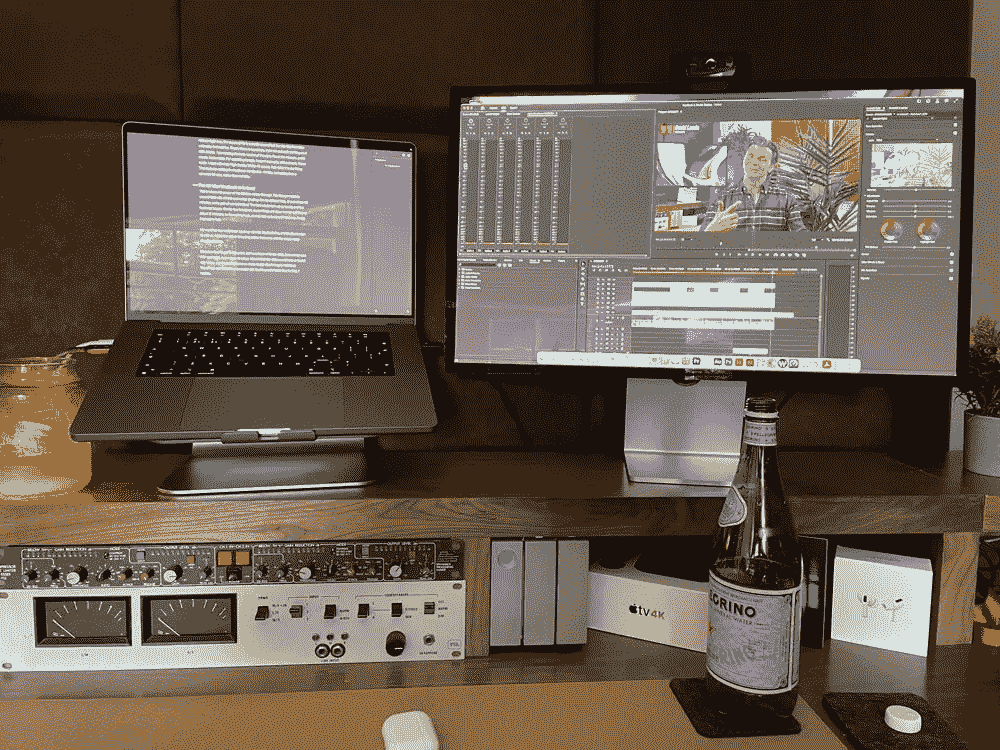
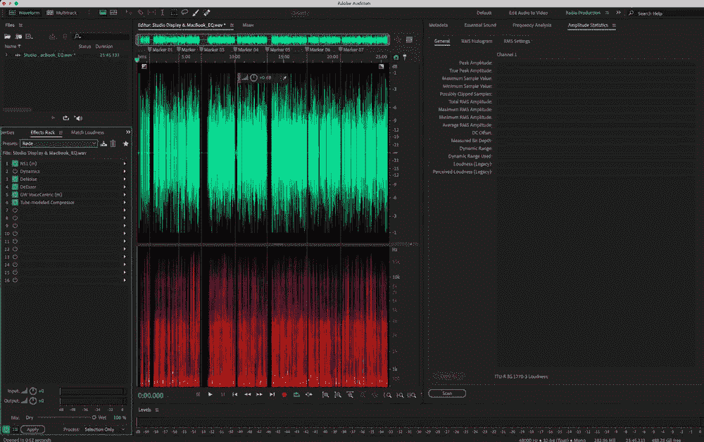
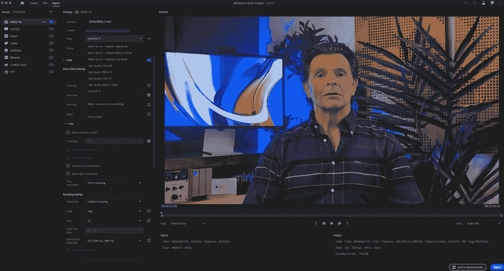
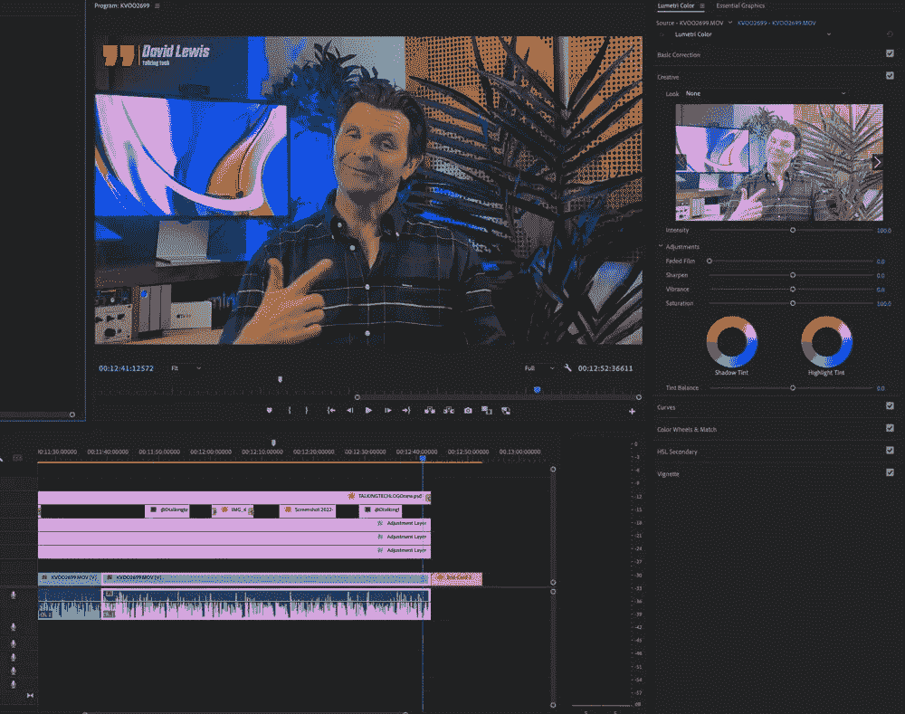
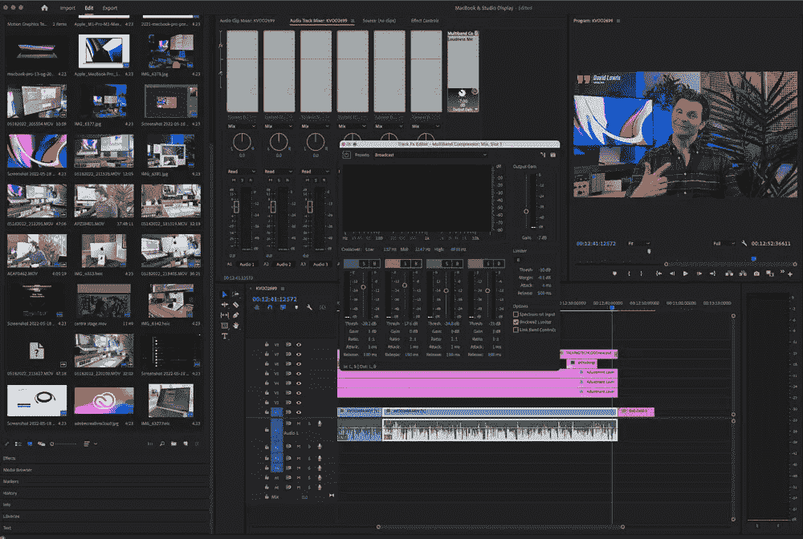

# Premiere Pro 和 M1 MacBook Pro 工作流程

> 原文：<https://medium.com/codex/premiere-pro-and-m1-macbook-pro-workflow-ae62d1be343c?source=collection_archive---------13----------------------->

## 最新的 M1 MacBook Pro 和 Adobe 的 Premiere Pro 配合得如何？

图片由作者提供

***我认为事实上我爱我的*** [***苹果***](https://talkingtechandaudio.com/blog/one-month-with-airpods-pro/) ***齿轮，由这一点来看，大概是没有疑问的。哪里能成为苹果，哪里就会成为苹果，应用程序也是如此。我仍然使用原生的日历应用程序、笔记、数字，甚至是备受诟病的 Mac Mail。但奇怪的是，一说到音频和视频，我就换阵营了。*** ***这是我用 Adobe&M1 MacBook Pro***的工作流程的一次演练。

# 学习是艰难的

我不知道你怎么样，但是我确实喜欢学习新的东西。挑战就在我的街上。我目前正处于饱和点，因为我正在学习我的新网站的后端，在 WordPress。有很多事情要做，但是，它很快就被消化了。不同的是，如果我想创造更好的搜索引擎优化等，我需要用我的新网站来改变。说到给我挣钱的 app，或者每天需要快速使用的 app，那我就三思而后行，重新学习技能。

 [## 使用 AirPods Pro 一个月

### AirPods Pro 值得改变吗？

medium.com](/codex/one-month-with-airpods-pro-f1c56da76c89) 

正如我刚才所说，我主要使用苹果软件，我真的很想成为那些使用 FCP (Final Cut Pro)进行视频编辑，或使用 [Logic Pro](https://www.apple.com/uk/logic-pro/) 进行音频编辑的酷小孩之一。他们的界面看起来非常诱人和丰富多彩，他们是苹果不可或缺的一部分，所以我想工作速度会更快，而且似乎许多创作者都在使用这些工具。但是我几年前学过土坯。这是我用过的第一个 DAW，随着时间的推移，“东西”就被吸收了。我知道在会话中，或者在编辑我的视频或播客时可能出现的问题的大多数答案。是的，你在我的[频道](https://www.youtube.com/c/DavidLewistalkingtechandaudio)的视频中听到的所有音频，都是先在试听中编辑的。如果我想把音量设置到某个 LUFS 标准——是的，我知道怎么做。如果我想在 Zoom 通话中消除沉默，我可以在眨眼之间做到。与 Premiere 一样，我知道添加淡入淡出或波纹删除的键盘快捷键。在我的 Adobe 工作流程中，我可以非常快速、非常高效地工作。所以，尽管我可能很想改变，但我只是认为这会给我带来太多的痛苦和泪水，成为苹果的净收益似乎没有任何意义。

因此，由于我将在 Adobe 呆一段时间，我想你可能会对我如何在 M1 MacBook Pro 上用 Adobe 制作 YouTube 视频感兴趣。也可能会有一两个惊喜！

# 照相机

我没有！从独立的、专用的单反相机或无反光镜相机的意义上来说，我从来没有拥有过。所有的视频，你看，都是用我的 iPhone 拍的。而且还不是最新的！这是几年前的标准 12 码。我得到的结果的秘密是，我不使用相机应用程序。相反，我用的是 FilMic Pro。这是你从应用商店获得的付费应用，它是游戏规则的改变者。它允许你设置白平衡(我对每个视频都这么做)，ISO 和快门设置。我也拍 10bit Log V3。这捕获了更多我可以在 post 中使用数据。YouTube 上一个 10 分钟的视频通常需要我花 40 分钟来录制。我工作流程中最大的延迟是从手机上获取文件。文件大小从 15GB 到 20GB 不等。隔空投送是一个禁忌，我想出的将文件导入 Mac 的唯一方法是通过图像捕捉。苹果公司可能将 USB-C 带到明年的 iPhone 上的消息对我来说简直是天籁之音。也就是说，我希望到那时已经买了并学会了相机的基本知识。对我来说，能够将 SD 卡从相机直接传输到 MacBook 将节省大量时间…..总有一天，总有一天！

 [## Studio Display 和 MacBook Pro —天作之合

### MacBook Pro 和 Studio display 是完美的搭档

medium.com](/codex/a-match-made-in-heaven-590f355b065f) 

# 声音的

图片由作者提供

接下来是音频。我用的是罗德 NTG4+鸟枪式话筒，它是*刚刚*出框。这是连接到一个混音器，其中有一些情商运行，然后记录在 M1 MacBook Pro 直接在试听。我在那里设置了一个效果架，有降噪、去压缩、均衡和压缩。然后，我将它设置为-23 LUFS loundness 标准，并将单声道 WAV 文件保存在项目文件夹中以备使用。

说到项目文件夹——最高提示。我有这个文件夹的模板，所有的子文件夹都在我的桌面上。它节省了很多时间。我开始的每一个视频，我都把那个模板复制到我的 [LaCie](https://www.lacie.com/gb/en/products/big/) 12TB raid 上，重新命名，然后我就可以开始了。怎么推荐都不过分。

# 在 Premiere Pro 中，我们开始

图片由作者提供

所以现在我准备开始编辑了。我拖动基本的，如我的标题序列，音频和原始视频文件。我将从原生的原始视频文件中删除音频，然后使用 Adobe 的同步功能将我的 *scratch* 音频与视频对齐。工作很愉快。在首映时，音频得到的唯一处理是添加一个多波段压缩器，给我的声音最后一点存在感，并设置一个音量表来检查我是否在限制范围内。

 [## 我刚刚经历了一场周末恋情

### 我想我可能正式爱上了工作室的展示

medium.com](/codex/i-just-had-a-weekend-affair-c35c2e4caba1) 

我将在视频的顶部添加三个空的调整层，为最后的颜色分级做准备。添加颜色对我来说是最后一个阶段。我现在将削减，剁碎，并添加 B 卷。我将为 Twitter 添加图形和一些过渡，在结束卡上弹出，我差不多完成了。

# 颜色，美丽的颜色

图片由作者提供

我提到过，评分是我做的最后一件事。10 位日志 V3 是非常平坦和灰色的，这是故意的。它允许我灵活地将 LUTS 添加到镜头中，并准确地添加颜色。直接来自 iPhone 的颜色太饱和了，看起来不太好。这样，我可以控制阴影、黑色和白色，以确保它们都不泛滥。《第一个 LUT》是你可以从他们的网站上免费下载的电影之一。第二个 LUT 是 Premiere Pro 的原生效果，可以在他们的技术 Lumetri 预设中找到。最后一个调整图层是添加一点饱和度，我的颜色设置好了。视频已准备好导出。

# 出口

图片由作者提供

Premiere Pro 里有快速导出功能，不过我不是很喜欢。在目前的版本中，导出的文件实际上只有 Premiere 估计的一半大小。显然有一个问题，我目前正在用 Adobe 解决它。我目前运行的是 Premiere Pro 的测试版，看起来更加稳定。不过，对于导出，我是手动导出的，并预先做了设置。我从他们的高质量 2160p 4K 预设开始，然后根据我的喜好进行调整。这包括将响度标准设置为-14 lufs，并将其设置为恒定比特率，而不是可变比特率。

# 最好的 M1 MacBook

这就是 M1 MacBook Pro 的强大之处。你看的文件大约 8GB，有特效和颜色分级。在我的旧 Intel Mac 上，用了大概 40 分钟，还有一副护耳器！风扇旋转的声音很大，热得让人发疯。在新的 M1 MacBook Pro 上，输出时间减少了一半以上，大约 17 分钟，没有风扇，没有热量……如果我愿意，这一切都靠电池。印象深刻吧。

# 结论

有了 M1 MacBook Pro 和 Studio Monitor 来编辑，我的工作流程真的加快了。我认为这种颜色看起来比以往任何时候都更好，结果也更令人赏心悦目。

达到这一点需要时间，但重新学习所有这些技能，只是为了我可以使用 FCP 和逻辑，只是没有意义。我不认为这个视频看起来或听起来会更好，而且它会花费我更多的时间。别忘了，我还有 WordPress 和 Mailchimp 要掌握。我认为，最好让大脑自由思考。

[FilMic Pro](https://www.filmicpro.com) —卓越相机&视频 app

[Final Cut Pro](https://www.apple.com/uk/final-cut-pro/)——如果你想试试的话

[Adobe CC](https://www.adobe.com/uk/creativecloud.html?mv=search&mv=search&sdid=KH8NVGP5&ef%5C_id=Cj0KCQjw1ZeUBhDyARIsAOzAqQILjkxRMwmydhiyMDaSgrktFyPcIjw9E09Lb7ZMzrC1uhlF4vlsg2saAswJEALw%5C_wcB:G:s&s%5C_kwcid=AL!3085!3!520877019586!e!!g!!adobe%20creative%20cloud!1422700238!58647978191&gclid=Cj0KCQjw1ZeUBhDyARIsAOzAqQILjkxRMwmydhiyMDaSgrktFyPcIjw9E09Lb7ZMzrC1uhlF4vlsg2saAswJEALw%5C_wcB) —我的创意应用

[YouTube](https://www.youtube.com/c/DavidLewistalkingtechandaudio)——在此订阅

*原载于 2022 年 5 月 19 日 https://talkingtechandaudio.com***。**