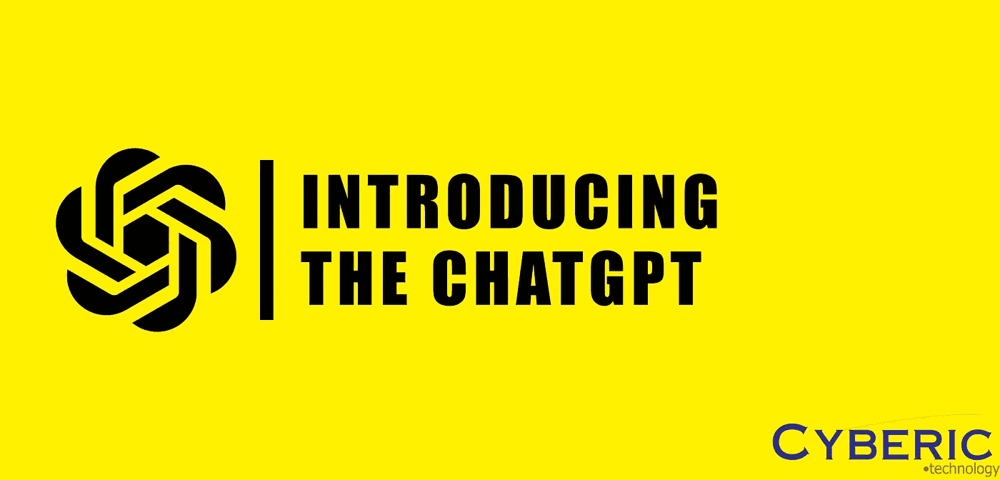
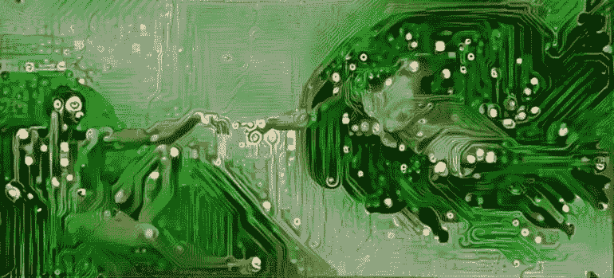
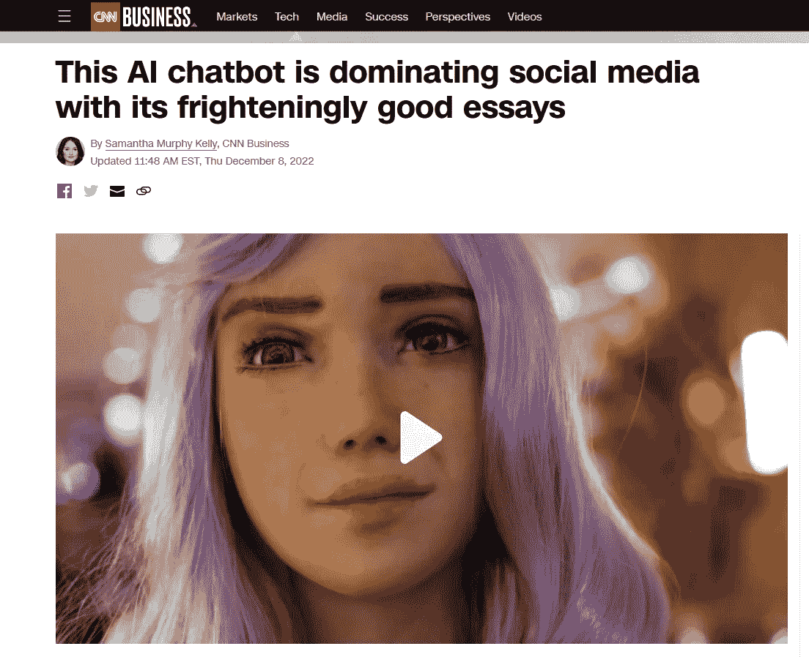

# 为前所未有的数字化转型做好准备(ChatGPT 的见解)

> 原文：<https://medium.com/codex/prepare-for-a-digital-transformation-bigger-than-before-insights-of-chatgpt-a4f6f1291772?source=collection_archive---------8----------------------->

作者图片

## 技术的复兴

AnarachaAnon 的作品

技术每天都在快速变化，不断有新的创新，我们当前的技术进步阶段被认为是第三次工业革命。虽然这也是事实，但称之为工业革命引发了另一个问题“第三次工业革命已经无声无息地演变成新的第四次革命了吗？”从历史上看，黑暗时代始于罗马衰落之后，当时教会开始统治整个欧洲，圣经所说的成为法律。结果，整个欧洲被严重宗教化，哲学家、学者和艺术家被视为非法。多年以后，在意大利的佛罗伦萨，出现了与教会所讲述的不同的关于世界的新思想和新观点。后来，这就是现在所知的文艺复兴。一段时间的启蒙运动和最初的科学革命后来促成了工业革命。

意大利文艺复兴思想的火花对现代社会的转变做出了重大贡献。因此，它提出了一个问题，目前的大技术会像比特币，区块链，物联网，人工智能和是的，GPT 人工智能吗？

## [阅读:我如何在青少年时期学习黑客技术](/codex/how-i-learned-hacking-as-a-teenager-4120a7ae69eb)

## 什么是 ChatGPT，为什么它会导致数字复兴

来自 cnn.com 的一篇新闻的标题

ChatGPT 是 GPT 3 语言模型的变体，代表了自然语言处理和机器学习领域的一个重大进步。这个强大的人工智能系统能够生成类似人类的文本，使其成为广泛应用的强大工具。

ChatGPT 和其他类似的高级语言模型的发展可以被视为一场更重要的数字复兴的一部分，这场复兴正在改变我们的生活和工作方式。凭借理解和生成类似人类语言的能力，ChatGPT 等人工智能系统正在为交流、合作和创造力开辟新的可能性。

在过去，产生和理解语言的能力是人类独有的特征，在我们作为一个物种的进化中发挥了关键作用。今天，随着 ChatGPT 等人工智能系统的发展，我们正在进入一个新的时代，机器可以复制这种能力，有可能彻底改变我们与世界和彼此互动的方式。

ChatGPT 最令人兴奋的潜在应用之一是在自然语言生成领域，它可以用于自动创建内容，如文章、报告和社交媒体帖子。这项技术有可能极大地提高各行各业的效率和生产力，它甚至可以为人们创造新的角色和机会，与这些系统一起工作。

然而，像 ChatGPT 这样的人工智能系统的发展也提出了重要的伦理和社会问题。随着我们继续推进人工智能的可能性，考虑这些技术对就业、隐私和其他关注领域的潜在影响和意义将是重要的。

总的来说，ChatGPT 代表了人工智能和自然语言处理领域令人兴奋的变革性发展。随着我们继续探索这些技术的全部潜力，我们可以期待一个为人类带来新的机遇和挑战的数字复兴。

## 另请阅读:[我是如何免费获得 IBM 的黑客证书的！](/@cyberictechnology/how-i-got-a-hacking-certificate-from-ibm-for-free-791fe7b8208?source=user_profile---------18----------------------------)

## ChatGPT 的潜力

关于这篇文章令人震惊的事实是，上面标题为“什么是 ChatGPT 以及为什么它将导致数字复兴”的段落完全是由人工智能自己只用一个命令编写的。ChatGPT 不仅可以写出这样的文章，还可以帮助你编写代码、创建游戏、讲笑话，甚至可以开发网站。从网络安全的角度来说，ChatGPT 的创建取代了我对互联网搜索引擎的使用频率，因为与 AI 交谈通常更快、更直截了当，它甚至可以写出使用 Kali Linux 中各种工具的各种命令。不仅人工智能足够聪明来分解如何使用工具，而且它还能够用 python 或任何语言生成各种工具。

作者 gif

您刚才看到的只是 ChatGPT 真正能力的一小部分。事实上，来自各种领域的许多技术专业人员开始采用 ChatGPT，这一事实节省了时间，并有助于缓解他们专业日常生活中的日常挑战。总之，ChatGPT 无疑是一个像比特币一样大的重大发明。然而，我们无法在这些非常早期的阶段真正确定 ChatGPT 的能力，但无论如何，它都是一个能够震撼地球的强大人工智能。但随着人工智能一年比一年聪明，可疑的道德和社会问题也将浮出水面。我们不能否认的事实是，人工智能的角色在我们的日常生活中变得越来越透明，以至于它会在未来以前所未有的方式自动化所有就业并改变整个世界，或者它会在未来如何影响整个社会，这将仍然是一个有趣的问题，直到时间到来。文艺复兴才刚刚开始！

今天的文章就到这里，希望我们已经介绍了足够多的 ChatGPT。ChatGPT 在—**对所有人完全免费使用和访问。**

****感谢阅读！****

## **阅读更多:[了解 Linux 背后的技术](/@cyberictechnology/what-is-linux-aad70dc11acc)**

## **阅读更多:[了解操作系统](/codex/understanding-operating-systems-part-1-d1f8d5c7dce8)**