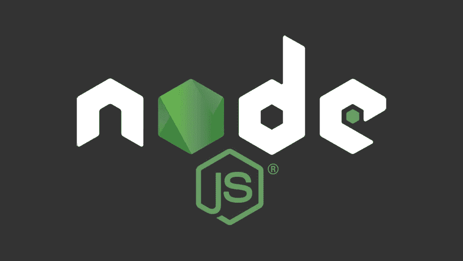

# 学习 Node.js 的先决条件

> 原文：<https://medium.com/codex/prerequisites-for-learning-node-js-da944eff4e30?source=collection_archive---------3----------------------->

## *node . js 的最佳学习方式，根据我的经验。*

最古老也是最流行的一种， **JavaScript** 正逐年流行，结果，[估计有 67.8%的开发者](https://insights.stackoverflow.com/survey/2019#technology-_-programming-scripting-and-markup-languages) 在使用 JavaScript 构建网站，还有 WOAH！太棒了，对吧？

早在 1995 年，当 JavaScript 被创建时，它基本上是一种网络浏览器语言，即客户端语言，但现在它几乎无处不在。随着其功能的增强，我们现在不仅可以在浏览器中运行 JavaScript 代码，还可以在独立的机器上运行，这就是 **Node.js** 的用武之地。

所以，在了解前提条件之前，我们先来小看看 **Node.js** 。现在，出现了一个问题-

## **到底是什么节点。JS 是？！**

刚接触 JavaScript 的人经常会对 Node.js 产生一些误解，我也是这样。有些人认为它是一种编程语言，有些人还把它和 JavaScript 框架或库混淆了，但这两者都不是。基本上，它是一个开源的 JavaScript 运行时环境，可以在 web 浏览器之外运行我们的 JavaScript 代码。我们经常使用 Node 来构建后端服务，也称为 API，它是构建高度可伸缩的实时 web 应用程序的理想选择。

对于不熟悉 Node.js 的人来说，到目前为止，您只能在浏览器中执行 JavaScript 代码，但现在使用 Node.js，您可以做所有事情，如访问文件、读取或写入文件、创建服务器、连接到数据库等。在你的网络浏览器之外。简而言之，我们可以说-

> Node.js 是一个开源的、跨平台的运行时环境，用于在 web 浏览器之外执行 JavaScript 代码。

好了，既然我们已经讨论了 Node.js 的基本定义，现在让我们来谈谈学习 Node.js 的**先决条件，**这会让你的学习之路变得非常容易。

1.  **JavaScript** :考虑到 Node.js 环境是基于 JavaScript 的，所以一定要很好的理解 JavaScript 的基础和中间概念，比如表达式、循环、作用域、数组、对象、回调、 *this* 关键字等。因此，我建议您在深入研究 Node.js 之前，先要很好地掌握 JavaScript 概念。
2.  NVM 代表“节点版本管理器”,它可以帮助你在 Node.js 的不同版本之间进行管理。考虑一种情况，当你在不同的项目上工作时，需要不同的 Node.js 版本，在这种情况下，NVM 可以很容易地管理这种情况，同时帮助你在 Node.js 的不同版本之间进行切换。所以，你应该对 nvm 及其工作原理有一些基本的了解。
3.  **NPM:** 另一个有用的缩写是 NPM(Node Package Manager 的缩写),顾名思义，它是一个非常强大的工具，用于管理 Node.js 项目的服务器端依赖性。使用 NPM，人们可以在需要时轻松地安装、删除或升级 JavaScript 的包或模块。
4.  **CLI:** 在使用 Node.js 之前，需要学习的另一个最重要和最有用的工具是 CLI(命令行界面)，它基本上是一个基于文本的用户界面，通过它，您只需键入命令，就可以指示您的计算机执行一些特定的任务。作为一名程序员，这真的让我们的生活变得轻松多了。如果您习惯使用命令行界面，那么您将能够非常轻松地运行 nvm 命令、npm 命令和 Node.js 应用程序。
5.  **ECMAScript(ES6)的最新特性:** ECMAScript 基本上是 JavaScript 等脚本语言的标准。正如我们所知，JavaScript 是一种不断发展的语言，ES6 或 ECMAScript 2015 是 JavaScript 的第二个主要版本，它为该语言引入了一些真正有用的功能，如 *let* 和 *const* 关键字、箭头函数、承诺、默认参数、For/of 循环、JavaScript 类等等。因此，我强烈建议您也熟悉 JavaScript 的这些新特性。
6.  **异步编程:**异步编程是你上 Node.js 之前必须熟悉的话题之一，你必须了解异步代码是如何工作的。异步编程或模型使您可以在不中断主程序线程的情况下同时执行多个任务，Javascript 使用任务完成时调用的回调来实现这种模型。Node.js 中的大多数方法或函数在默认情况下都是异步的，因此必须对 JavaScript 中的异步编程有很好的理解。
7.  **HTTP 请求:**当您接近 Node.js 时，因为它也用于后端，所以会有需要从数据源检索一些数据或发送数据的场景，在这种情况下，或者类似的情况下，您需要通过 HTTP 向那个服务器发出 API 请求。因此，了解 HTTP 请求及其一些有用的方法(如 GET、POST、PUT、DELETE 等)将对您有所帮助。

我希望这篇文章已经阐明了一些先决条件，这肯定会帮助您开始使用 Node.js. **一切顺利！**

感谢您的阅读:)