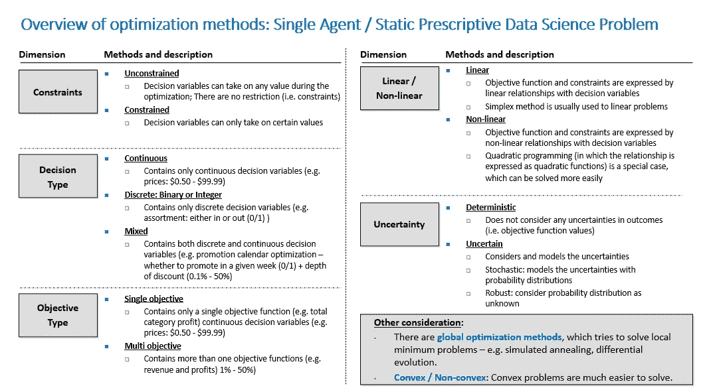

# 规范数据科学:单主体/静态问题—联合价格优化(1/2)

> 原文：<https://medium.com/codex/prescriptive-data-science-single-agent-static-problem-joint-price-optimization-1-2-7538ccd8b6ed?source=collection_archive---------4----------------------->

**优化方法概述:单智能体/静态规定数据科学问题**

欢迎回来。在[的上一篇文章](/codex/prescriptive-data-science-101-types-of-problems-and-methods-for-a-single-agent-case-e80cf879ccb6)中，我描述了四种不同类型的规定性数据科学问题，它们取决于两个关键维度:(1)代理的数量和(2)跨时间段的依赖性。

在本文中，我将展示如何解决一个规范性的数据科学问题。我将从…