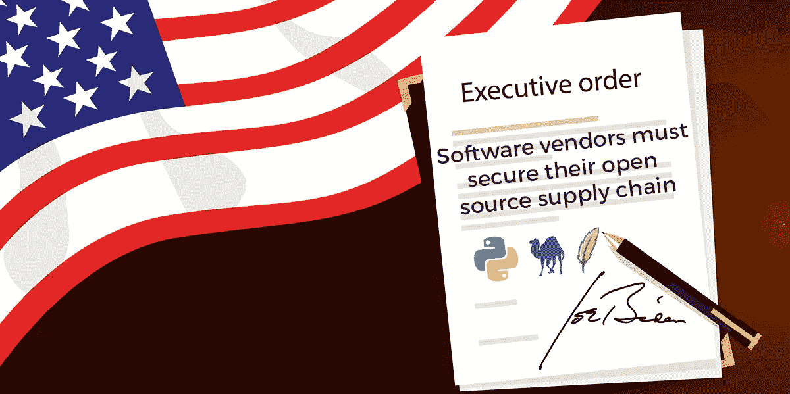
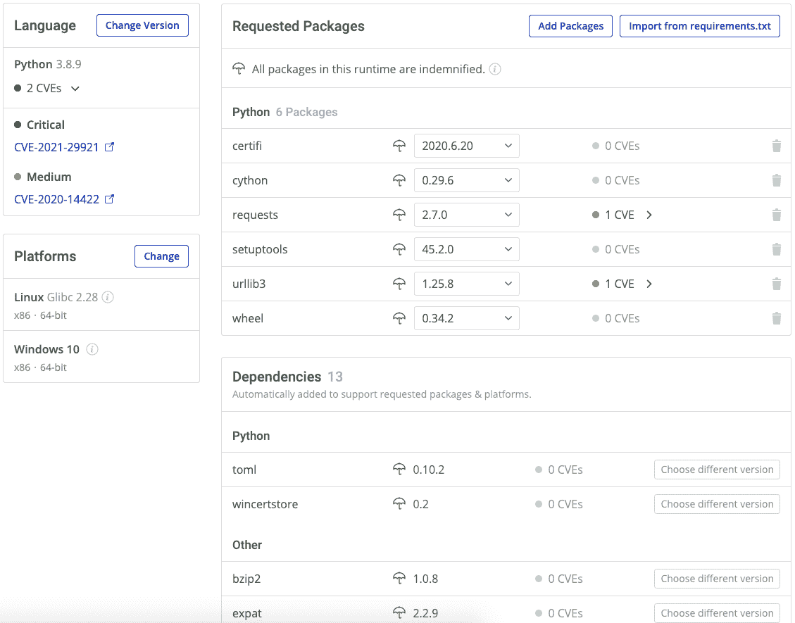
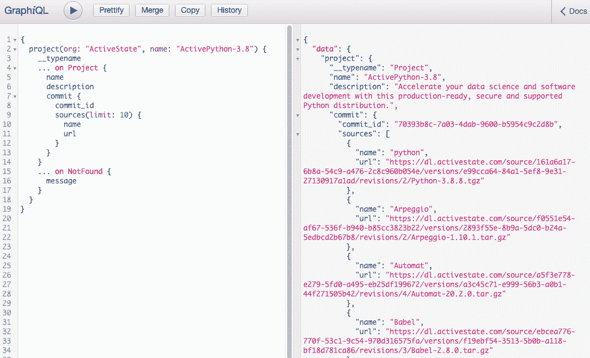

# 拜登总统:保护软件供应链

> 原文：<https://medium.com/codex/president-biden-secure-the-software-supply-chain-63378943bf65?source=collection_archive---------7----------------------->

美国总统拜登呼吁对软件进行大胆改革，以应对网络攻击的急剧增加，包括近年来对物理和软件基础设施的一些最严重的黑客攻击:

*   [网络安全管理软件产品](https://www.businessinsider.com/solarwinds-hack-explained-government-agencies-cyber-security-2020-12)，它入侵了包括美国政府在内的 33，000 多家客户使用的 IT 资源管理软件
*   [殖民地时期的输油管道](https://www.bbc.com/news/technology-57063636)，它阻碍了向美国东海岸输送天然气和石油

总统的行政命令要求采用多种安全最佳实践，但软件供应商需要特别注意的是，美国联邦政府现在将要求:

*   与政府采购的任何软件相关的**软件材料清单(BOM)**
*   检查和自动化**漏洞修复**的方法
*   **出处**，或者能够识别所有软件组件来源的能力

对于希望向美国联邦政府机构销售其应用程序和解决方案的软件供应商来说，这些要求可能会构成巨大的进入壁垒。联邦政府发起的项目，私营部门很可能会采纳。ActiveState 是来帮忙的。

ActiveState 平台是 Python、Perl 和 Tcl(更多编程语言即将推出)的通用包管理解决方案，有助于确保从开发到生产都使用安全的开源组件。更确切地说，它还提供了拜登总统行政命令所要求的许多供应链安全功能。

# 软件材料清单

该行政命令要求“直接或通过在公共网站上发布，向购买者提供每个产品的软件材料清单(SBOM)”

[我之前已经讨论过 BOM 了](https://www.activestate.com/blog/how-to-spell-security-b-o-m/)，但是简单回顾一下，BOM 只是构建应用程序所需的一个全面的成分列表。BOM 可以包括:

*   编程语言的一个版本
*   来自该语言生态系统的开源包，以及它们的依赖项
*   操作系统级依赖关系
*   专有代码包(即您的开发人员编写的代码)
*   配置(即元数据，如版本号、开源许可证等)
*   常见漏洞和披露(CVE)报告，显示每个组件的漏洞

ActiveState 平台更进一步，为您提供了:

*   Python，Perl 和 Tcl 传递依赖(即。依赖关系的依赖关系)
*   共享依赖(即。OpenSSL，它在您的应用程序支持的所有操作系统之间共享)

根据行政命令，您可以通过简单的复制和导出(对于私人项目)或提供一个链接(对于公共项目)，直接从 ActiveState 平台获得您的 BOM。典型的 BOM 可能如下所示:

BOM 不仅标识了所有的包和依赖项，还标识了哪些包有 CVE，以及详细解释每个包的国家漏洞数据库的链接。

# 开源漏洞补救

该行政命令要求“采用自动化工具或类似流程，检查已知和潜在的漏洞并进行补救”

我以前也讨论过 ActiveState 平台的[漏洞修复功能](https://www.activestate.com/blog/how-to-remediate-your-open-source-vulnerabilities-quicker/)。概括地说，ActiveState 平台为您提供了:

*   当您的 Python、Perl 或 Tcl 环境易受攻击时，状态会更新
*   显示每个漏洞的严重性级别和详细信息的 PDF 报告
*   能够在几分钟内使用安全组件修复并自动重建您的环境

因为 ActiveState 平台跟踪所有组件的多个版本，所以您只需选择一个无漏洞的版本，就可以在操作系统、软件包和依赖关系级别修复漏洞。通过自动重建您的环境，ActiveState 平台可以节省大量的时间和精力，并可以随时引入您的 CI/CD 管道进行测试。

在我们的 2 分钟视频中看看这是如何做到的:

https://youtu.be/0AqFG-5YZYw

# 软件代码起源

当涉及出处时，该行政命令要求“保持准确和最新的数据、软件代码或组件的出处(即来源)”以及“在可行的范围内确保和证明开放源码软件的完整性和出处”

在这里，ActiveState 平台为您提供:

*   **精选目录** —我们所有的 Python、Perl 和 Tcl 包都是从各自的官方库(PyPI、CPAN 等)以及其他来源(如 GitHub)导入的。
*   **从源代码构建** —所有软件包都是从 Windows、Linux 和 macOS 的源代码中自动构建的，只需几分钟，而不是依赖可能包含恶意代码的预构建二进制文件。
*   **补偿构建** —我们的企业客户能够从已经过 ActiveState 审查的组件创建 Python、Perl 和 Tcl 环境，并发现这些组件维护良好，适合包含在商业应用程序中。你可以在上面的截图中看到这样一个被赔偿的构建的例子。
*   **审计跟踪** —对您的 Python、Perl 和 Tcl 环境的所有更改都会被跟踪，因此您可以随时确定谁在何时进行了哪些更改。

您甚至可以使用 ActiveState 平台的[构建图形 API](https://buildgraph-docs.activestate.build/) 来验证您环境中每个包的源代码。例如，[运行 API 查询](https://platform.activestate.com/sv/mediator/?query=%7B%0A%20%20project(org%3A%20%22ActiveState%22%2C%20name%3A%20%22ActivePython-3.8%22)%20%7B%0A%20%20%20%20__typename%0A%20%20%20%20...%20on%20Project%20%7B%0A%20%20%20%20%20%20name%0A%20%20%20%20%20%20description%0A%20%20%20%20%20%20commit%20%7B%0A%20%20%20%20%20%20%20%20commit_id%0A%20%20%20%20%20%20%20%20sources(limit%3A%203)%20%7B%0A%20%20%20%20%20%20%20%20%20%20name%0A%20%20%20%20%20%20%20%20%20%20url%0A%20%20%20%20%20%20%20%20%7D%0A%20%20%20%20%20%20%7D%0A%20%20%20%20%7D%0A%20%20%20%20...%20on%20NotFound%20%7B%0A%20%20%20%20%20%20message%0A%20%20%20%20%7D%0A%20%20%7D%0A%7D)将返回指向我们的 ActivePython 项目的源代码的链接:

# 结论:安全性左移

当美国总统将开源安全置于疫情、全球变暖和经济等问题之前时，现状就不再能够维持，需要探索新的解决方案。

也许最能说明问题的是，网络安全管理软件产品黑客攻击损害了公司的开发环境(而不是通常的生产环境黑客)，这意味着他们创建的任何软件都会受到损害。这是一种针对食物链顶端的新型攻击的先兆 DevSecOps 的支持者多年来一直在警告我们:需要将安全性向左转移，以确保您开发的代码是安全的。

这是 ActiveState 平台的重点，它不仅允许您创建安全的 Python、Perl 和 Tcl 环境来构建您的应用程序，还允许您以一种简单、自动化的方式确保它们随时保持安全和最新。

准备好自己看了吗？你可以通过[注册一个免费账户](https://platform.activestate.com/create-account)来尝试 ActiveState 平台。或者[注册免费演示](https://www.activestate.com/get-a-demo/)，让我们向您展示如何在您的组织中保护开源供应链。

需要更多信息？阅读:

*   [数据表:通过材料清单提高开源安全性](https://www.activestate.com/resources/datasheets/improve-open-source-security-with-a-bill-of-materials/)
*   [数据表:保护您的开源供应链](https://www.activestate.com/resources/datasheets/securing-your-open-source-supply-chain/)