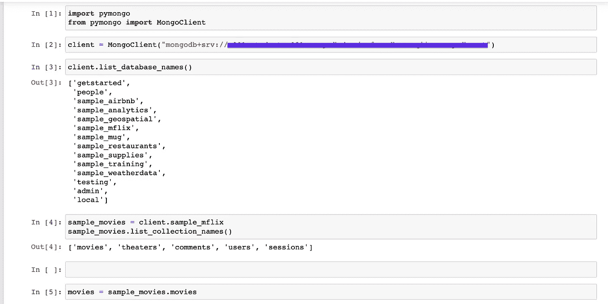
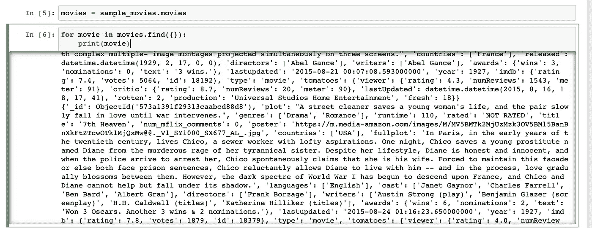
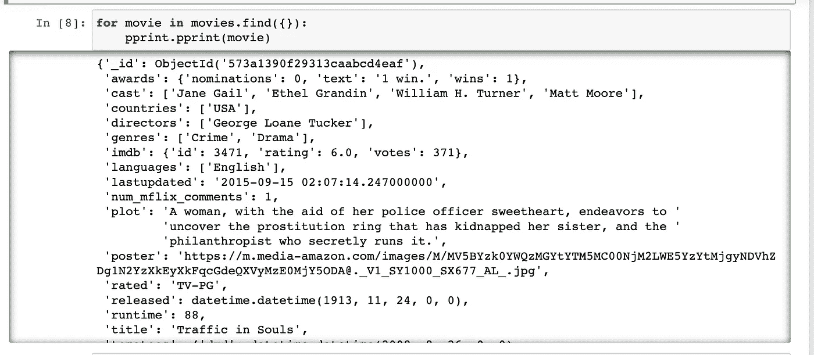

# 使用 pprint()美化您的 Python 输出！

> 原文：<https://medium.com/codex/prettify-your-python-outputs-using-pprint-60522ef997d0?source=collection_archive---------19----------------------->

任何用 Python 工作的人，通常都要处理大量的数据；大多数时候，数据并不漂亮。在大型词典或长列表上使用 ***print()*** 时，输出并不美观。

照片由 [Hitesh Choudhary](https://unsplash.com/@hiteshchoudhary?utm_source=medium&utm_medium=referral) 在 [Unsplash](https://unsplash.com?utm_source=medium&utm_medium=referral) 上拍摄

为了说明这一点，我将使用 [MongoDB](https://www.mongodb.com/) 的 python [pymongo 库](https://pymongo.readthedocs.io/en/stable/)连接到 MongoDB Atlas，并使用它打印来自其[示例电影数据库](https://www.mongodb.com/docs/atlas/sample-data/sample-mflix/)的文档。

接下来，我将打印电影收藏中的不同文档。

正如我们所看到的，输出不是很漂亮，也很难阅读。输出也没有正确缩进，这会影响嵌套数据的可读性。当我们使用 urllib/requests 库并试图获取一些嵌套 JSON 或 list 格式的数据时，情况也是如此。

# 使用 pprint

Python 中的 [pprint](https://docs.python.org/3/library/pprint.html) 模块是一个实用模块，您可以使用它以更易读、更漂亮的方式打印数据。它是标准库的一部分，对于调试处理 API 请求、大型 JSON 文件和一般数据的代码特别有用。

> `[pprint](https://docs.python.org/3/library/pprint.html#module-pprint)`模块提供了“漂亮打印”任意 Python 数据结构的能力，这种格式可以用作解释器的输入。如果格式化的结构包括不是基本 Python 类型的对象，则表示可能不可加载。如果包括诸如文件、套接字或类之类的对象，以及许多其他不可表示为 Python 文字的对象，就可能出现这种情况。([来源](https://docs.python.org/3/library/pprint.html))

pprint 是一个 Python 模块，用于以漂亮的方式打印数据结构。它一直是 Python 标准库的一部分，所以没有必要单独安装它。你需要做的就是导入它的`pprint()`函数。现在，当我使用相同的代码并使用 pprint 而不是普通的 print 时，我得到如下输出:

正如我们所看到的，输出更容易阅读，人们能够更好地看到所有字段及其值。我们所需要的只是 Python 漂亮的打印库 pprint！