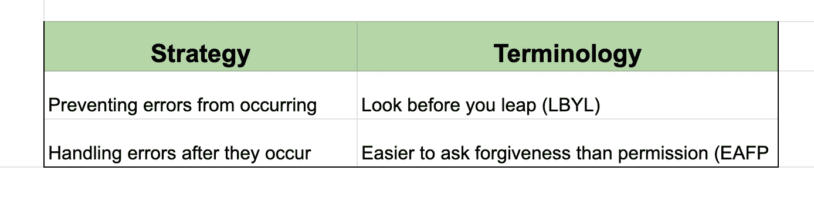
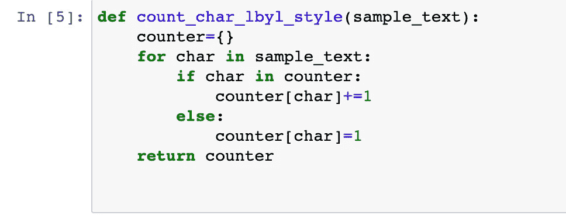
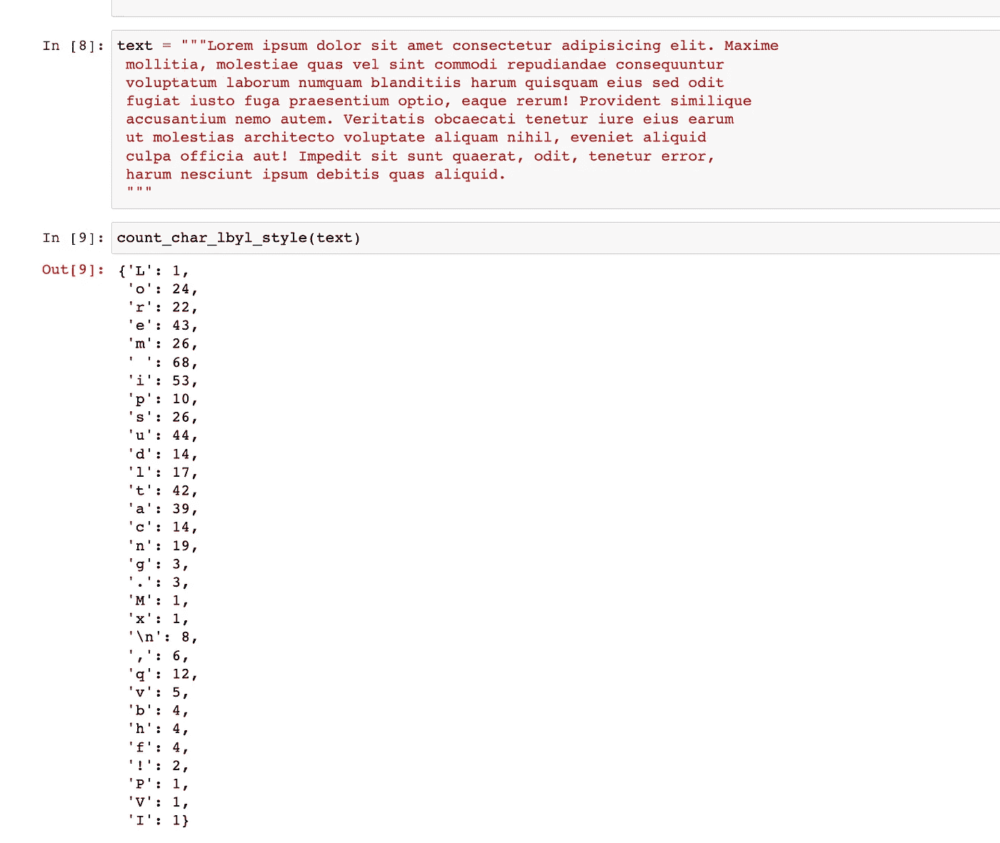
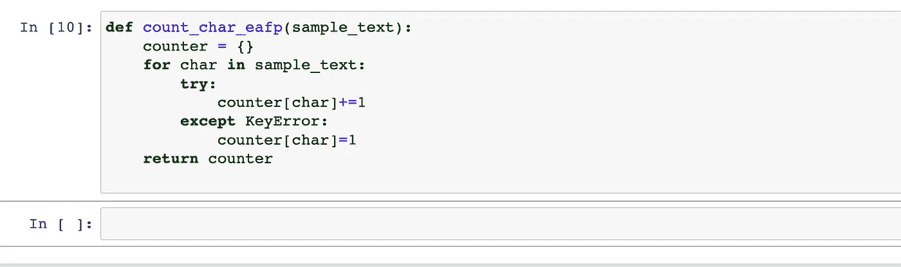
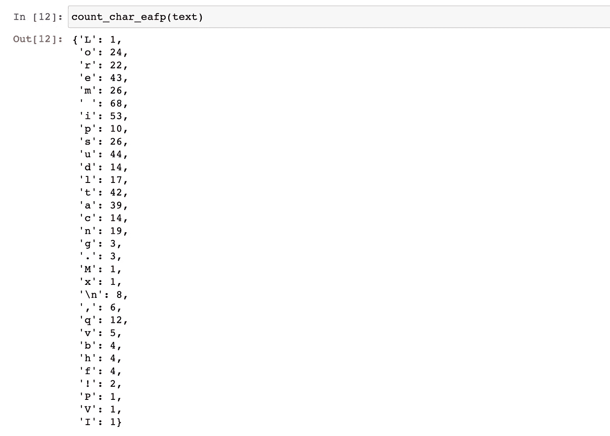

# 在 Python 中预防和处理错误

> 原文：<https://medium.com/codex/preventing-handling-errors-in-python-c1ae1f2fa689?source=collection_archive---------18----------------------->

克里斯里德在 [Unsplash](https://unsplash.com?utm_source=medium&utm_medium=referral) 上的照片

处理错误是任何编程语言中最常见的问题之一。在 Python 中，您可以在错误发生之前阻止它们，或者在错误发生之后处理它们。在编程中，面对错误有两种截然相反的方法——**三思而后行(LBYL)** 和**请求原谅比请求允许容易(EAFP)** 。在本教程中，我们将快速探究这两种策略。

# **三思而后行(LBYL)风格**

在这种编码方法中，首先检查他们的条件是否成功，然后才进一步进行。Python 文档将这种编码风格定义为:

> 这种编码风格在进行调用或查找之前显式测试前置条件。这种风格与 EAFP 方法形成对比，其特点是存在许多 if 语句。([来源](https://docs.python.org/3/glossary.html#term-LBYL))

为了更好地理解这一点，假设你有一些文本，你想写一个函数来计算每个字符的频率。因此，使用这种方法，我们最终编写了以下代码:

这个函数将一个文本作为输入，并返回一个以字符作为键的字典。为了构建字典，我们对 循环使用了一个 ***，其中我们逐个字符地进行。然后，我们检查该字符是否存在于字典中，我们简单地将它的计数器加 1，否则，如果是第一次，我们将计数器初始化为 1(否则块)。***

我们使用一些示例文本调用这个函数，下面是结果:

很简单，对吧？让我们稍微分析一下这种方法。一旦函数已经处理了一些样本文本，那么很明显，当执行检查时，目标字符已经在字典中了(if 语句)。最终，所有这些不必要的检查都会增加代码的性能成本。如果一个人正在处理一大段文本，这一点尤其正确。

如何避免这种间接成本？这就是 EAFP 风格出现的时候了！

# **请求原谅比许可容易(EAFP 式)**

> 请求原谅比请求允许容易。这种常见的 Python 编码风格假设存在有效的键或属性，并在假设证明为假时捕捉异常。这种干净快速的风格的特点是存在许多`try`和`except`语句。这种技术与许多其他语言中常见的 LBYL 风格形成对比，比如 C.( [来源](https://docs.python.org/3/glossary.html#term-EAFP))

正如官方定义所说，EAFP 编码风格的特点是使用`try` … `except`语句来捕捉和处理代码执行过程中可能出现的错误和异常情况。这种编码方法在 Python 社区中非常流行。主要是因为 Python 中快速高效的错误处理。

让我们使用与上面相同的例子，看看如何使用 EAFP 来实现这个问题。该函数将如下所示:

该函数接收样本集。这次也是如此，我们用一个 ***来代替*** 循环。但是我们没有使用 if-else 条件，而是简单地将代码放入一个 try-except 块中。现在，不是检查 char 是否已经存在于字典中，而是尝试增加 counter[char]的值。如果它能增值，那当然好。如果不是，它进入 except 块并将其初始化为 1。

我们使用上面使用的 sample_text 调用该函数。我们得到相同的结果，但是正如人们可以容易地指出的，它减少了在 LBYL 的许多开销。

这就是我们如何在 Python 中实现这两种编码风格！你编码的时候更喜欢哪个？