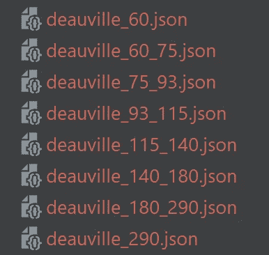
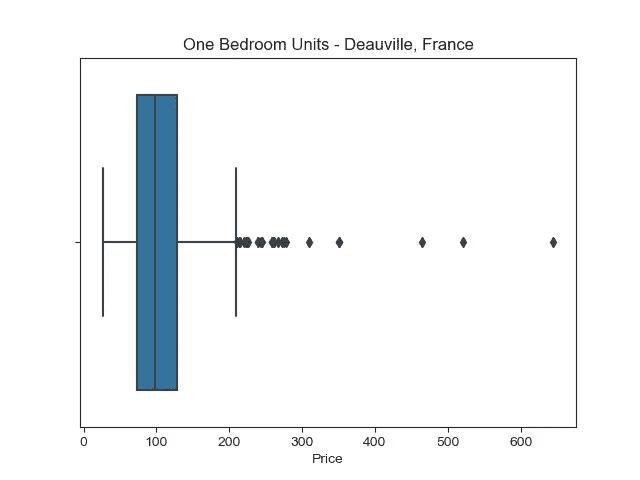
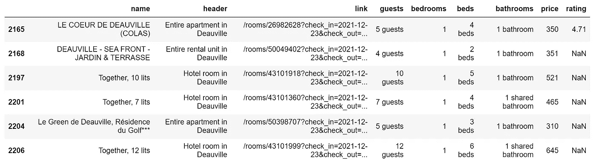
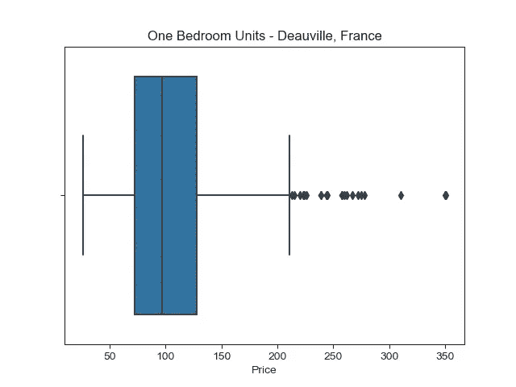
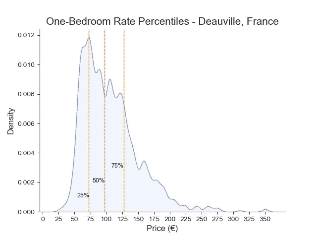

# 定价策略开发:用 Python 进行 Airbnb 市场分析

> 原文：<https://medium.com/codex/pricing-strategy-development-airbnb-market-analysis-with-python-f873be137346?source=collection_archive---------12----------------------->

成功的度假租赁公司在计划进入新市场或在现有资产组合中增加额外资产时，如何制定定价策略？

作者捕获的图像

**当然是数据分析！**

在本文中，我将介绍:

1.  如何使用 Python 从 Airbnb 获取原始完整的市场数据
2.  如何清理数据以便对熊猫进行操作
3.  如何建立基于市场费率百分位数的竞争性单位定价

[点击这里查看我的 Github 上的项目代码](https://github.com/blaaycub/Airbnb_Scraper)。

 [## GitHub - blaaycub/Airbnb_Scraper:一个从 Airbnb 搜索结果页面获取数据的 Scraper

### 从 Airbnb 结果页面获取数据的刮刀。使用这个脚本，您可以搜索城市、日期和…

github.com](https://github.com/blaaycub/Airbnb_Scraper) 

# 市场分析

知道如何在市场中准确定位你的产品对于经营一个成功的企业是必不可少的。在制定定价策略之前，租赁公司需要进行市场分析，以了解其他行业成员的价格。这使他们能够了解所在区域的定价情况，并制定数据驱动型战略。

通常，物业经理会通过第三方供应商购买数据。虽然外包数据获取在某些方面可能是有利的，但前期成本可能是一些个人或公司进入的障碍，并且提供的数据可能不总是像供应商声称的那样可靠。谁知道数据是最新的，包含错误，还是被无关的离群值不准确地扭曲了呢？

**可能的话，直奔源头。**

# 数据采集

为了按需访问 Airbnb 的精选原始数据，我决定使用 Python 创建一个 web scraper，这将允许对数据获取的完全自主权。

写《刮刮乐》的时候，我在法国，对我所在的多维尔地区 12/23/21 - 01/02/21 之间的一居室出租总数及其价格四分位数感到好奇。在 Airbnb 上简单搜索一下，会返回 300 个房源，但直觉告诉我，可能远不止这些。

将搜索结果按价格区间分开，让我找到了 300 个列表的突破点。我发现价格范围(即≤60，60–75…180–290，290≤)会产生略少于 300 个结果，以便不会错过每个查询中的任何数据点。

然后我用 Python 创建了一个 web scraper，用一个 [Scrapy spider](https://scrapy.org/) 运行它来获取所有可用列表的数据。这创建了包含≤300 个清单的八个 JSON 文件。

[点击这里查看蜘蛛的源代码](https://github.com/blaaycub/Airbnb_Scraper/blob/main/Spider/scaper.py)。

八个人。json 文件。

# 数据清理

因此，现在我们有了数据，我们希望将它转换成一种易于操作的格式。[查看完整笔记本这里](https://github.com/blaaycub/Airbnb_Scraper/blob/main/EDA/One_Bedrooms_EDA_Deauville.ipynb)。

八个 JSON 文件被读入它们自己的数据帧，每个数据帧被放入一个名为“dfs”的列表中，我使用 pd.concat、drop_duplicates()和 reset_index(drop=True)创建了一个名为“listings”的数据帧，其中包含 2209 个唯一的观察值。

为了便于聚合，我们必须将数据转换成易于操作的类型。我从**价格**变量开始，通过正则表达式删除“€”，并使用“astype(int)”将剩余的值改为一个整数。

移动到**卧室**变量，我将“Studio”替换为“0”，使用正则表达式删除“bedroom(s)”，并将剩余的值更改为一个整数。

现在，如果我们对其他变量感兴趣，如**客人、浴室或床**，我们可以对它们执行相同的操作，轻松地将它们的类型更改为整数或浮点数。但我们只对这项研究中的卧室和价格变量感兴趣。

既然**价格**和**卧室**变量已经清理完毕，我们可以创建一个箱线图来查看多维尔一居室的价格分布。

我们可以看到有很多异常值。为了充分利用我们的数据，我们将检查价格高于 300 €的列表的情况。

我们可以看到，虽然他们可能有一个相对较高的上市价格，但在指数位置:[2165，2168，2204]的单位似乎是正常的上市，我们将把他们纳入我们的数据。然而，在索引位置:[2197，2201，2206]的单元似乎是出租一家酒店的多个房间的房源，这告诉我们这些房源实际上不是一居室，我们应该将它们从我们的研究中排除。我们用”。滴”来删除它们。

在移除不相关的异常值后，通过箱线图再次查看我们的数据，我们可以看到我们的分布更加规范化了。

现在，我们利用 one_br.shape 来查看在我们的“one_br”数据帧中有多少个独特的一居室观察值。

我们可以看到有 939 个一居室单元的独特观察。

# 市场百分位数

作为一个短期租赁物业投资者，了解你所在类别的租赁单位的市场价格百分比会给你一个难以置信的优势。你不想把钱留在桌子上或要价过高而把自己挤出市场，从而低估自己。

> *并非所有产品都是平等的，了解一种产品的价值与市场上类似产品的价值相比如何，是制定定价策略时需要理解的主要概念。*

我们可以使用“ [NumPy.percentile](https://numpy.org/doc/stable/reference/generated/numpy.percentile.html) ”轻松找到价格数据的任何百分点。该函数允许用户计算沿指定轴的任何“第 q”个百分点的数据。在本研究中，我们将使用“np.percentile”找到 25 (Q1)、50(Q2/中位数)和 75 (Q3)，并将它们分别设置为变量“one_br_25”、“one_br_50”和“one_br_75”。

从这里开始，我们将在 Seaborn 创建一个 [KDE(内核密度估计值),用轴线代表不同的百分点。与直方图类似，KDE 图是一种可视化数据集中观察值分布的方法。然而，与使用离散箱的直方图不同，KDE 图使用高斯核平滑观察值，产生连续的密度。](http://seaborn.pydata.org/generated/seaborn.kdeplot.html?highlight=kde#seaborn.kdeplot)

现在我们有了市场百分位数图表，我们可以进行情绪分析，以了解每个价格范围的更多信息。它们位于哪里？他们有几间浴室？有什么便利设施？客人在评论中说了什么？这可以帮助我们为每个价格范围创建一个配置文件。

一般:
●较低四分位数(< 25%):低成本提供商，价格最低，位置不方便，可能是新市场，可能是共用卧室/浴室，设施/服务差。
● 25%-50%:专注的低成本供应商/整合的低成本差异化优势、超值价格、便利的位置、适中的设施/服务
● 50%-75%:差异化优势、高于中值的价格、绝佳的位置、更高质量的设施/津贴/服务
●上四分位数(> 75%):专注的差异化优势、最高价格、豪华单元、最佳位置/景观、最佳设施/津贴/服务。

实际上，四分位数并不总是每个市场的最佳定价模型。一些市场可能更适合五分位数，八分位数，甚至十分位数。这就是你作为市场主题专家的判断发挥作用的地方。

# 结论

重要的是关注你的酒店独特类别中的替代产品，而不仅仅是类似大小的单元。并非所有的单位都是平等的。每个单元都有自己的客户群，有自己的价格敏感度。

为了了解市场的季节性，你可以在不同的日期集进行这项研究:假期、淡季、常季、事件等。此外，请注意，许多公司利用动态定价工具，根据入住天数和入住率来改变其酒店的价格。

找到市场百分位数只是制定成功定价策略的要素之一。无论你在哪里建立你的初始价格，很可能你需要根据反馈回路的结果和市场条件进行实时调整。

这里需要注意的是，Airbnb 并没有向公众提供官方 API，对该网站的过度抓取可能会违反他们的服务条款，从而导致被屏蔽。如果您试图利用我提供的代码，请理解您这样做的风险自担。我强烈建议您在实施自己的项目之前，参考一下关于下载延迟的文档。

# 更多资源

## 卷筒纸刮刀的研制；

● [布拉德·特拉弗斯](https://medium.com/u/861216ad5921?source=post_page-----f873be137346--------------------------------)的“[网络爬虫简介&用刺儿头刮](https://www.youtube.com/watch?v=ALizgnSFTwQ&t=714s)

● [Thibaud Lamothe](https://medium.com/u/8af4ef4360de?source=post_page-----f873be137346--------------------------------) 的***用 Python 刮🐍*****四部系列。**

1.  **[Web 数据提取|抓取简介🐍](/geekculture/a-gentle-introduction-to-web-data-extraction-scraping-with-e8dc7253b571)**
2.  **[如何使用选择器|抓取来解析网页🐍](/geekculture/how-to-parse-a-webpage-using-selectors-scraping-with-dfb3894cff58)**
3.  **[让我们一起探索 Scrapy | Scraping 的奇妙世界🐍](/geekculture/lets-discover-the-wonderful-world-of-scrapy-scraping-with-ac9571338e2e)**
4.  **[Airbnb 网站的刮痧教程(带 Scrapy) |刮痧用🐍|作者 Thibaud Lamothe |极客文化](/geekculture/scraping-tutorial-on-airbnbs-website-with-scrapy-scraping-with-aefc826a8f13)**