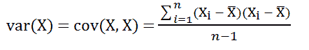
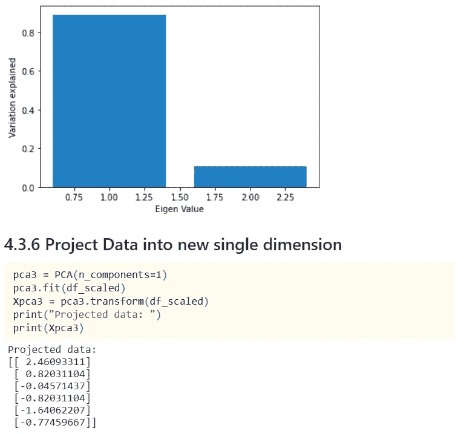

# 机器学习中的主成分分析(PCA)——你再也不会觉得它很难了

> 原文：<https://medium.com/codex/principal-component-analysis-pca-how-it-works-mathematically-d5de4c7138e6?source=collection_archive---------0----------------------->

作者创造的形象

主成分分析(PCA)是一种流行的无监督机器学习技术，用于减少训练数据集中的输入变量数量。这种技术属于降维技术。我认为，如果你已经开始阅读这篇文章，这意味着你知道某种程度的 PCA。因此，我不打算讨论它是什么，它的优点或缺点。但是我将集中讨论它是如何工作的。

尽管 Python 提供了所有的类和方法来创建您的模型和执行您的操作，无论是回归、分类或聚类问题还是 PCA，但是除非您知道幕后发生了什么，否则您将不会拥有作为数据科学家或机器学习爱好者的所有乐趣。

当我在学习 PCA 的时候，不知何故我遇到的资源不足以让我理解 PCA 背后的数学。因此，我做了一些研究，重温了我以前的数学和统计技能，在做了所有这些之后，我终于可以理解出色的降维技术背后的魔力，这就是 PCA(主成分分析)。在这篇文章中，我将尝试解释使用数学和统计概念在一个小的二维玩具数据集上执行 PCA 的所有步骤，并将其降维为一维。在手工完成所有这些之后(我指的是数学上的一步一步)，我将向您展示用 python 以编程方式完成的同样的事情，并验证我们的结果。

无论我在这里介绍的是什么，都是使用二维数据集，但这不应该阻止您理解高维大型数据集，因为一旦您可以理解二维概念，您就可以应用更高维的知识。

在开始之前，让我先向您介绍一些基本的数学和统计概念，以便您可以在本文的后面将它们联系起来。如果您已经熟悉这些概念，那么您可以直接跳到第 3 部分并继续。但是，如果您有时间，我仍然建议您浏览所有部分。

# 第一部分:一些数学知识

**1.1 标量:**标量不过是一个有值的数。例如 5 是标量，2.45 是标量。

**1.2 矢量:**矢量可以认为是一个有大小和方向的物体。二维坐标可以是矢量的一个例子。例如(4，3)。

我们可以从(0，0)到(4，3)画一条线，代表矢量的方向。那么价值或数量会是多少呢？向量的值将是点(0，0)和(4，3)之间的距离。请注意，该值将是一个标量。

现在利用毕达哥拉斯定理，我们可以求出距离为:

因此，矢量的大小是 5。

类似地，对于具有 3 维(2，5，7)的数据是向量的一个例子。因此，对于 n 维(1，4，…)的数据。，n)是矢量。

**1.3 矩阵:**矩阵是数字的数组。矩阵可以是正方形或矩形。注意，所有的向量都可以表示为矩阵。在上面的例子中，我们的向量可以表示为矩阵，如下图所示:

2x1 矩阵

**1.4 行列式:**表示一个可以从方阵中计算出来的数。例如，如果 A 是一个方阵，那么|A|表示 A 的行列式。2x2 矩阵的行列式可以计算如下:

**1.5 单位矩阵:**单位矩阵(记为 *I* )是一个方阵，矩阵的对角元素为 1，其余元素为 0。

**1.6 可逆矩阵:** Z 若满足下式，则称其为可逆矩阵(应为方阵):

注:Z 的行列式，即|Z| =0 当且仅当 Z 不可逆。

**1.7 矩阵乘法:**

a，B 是两个矩阵，AB 是乘法。如果左侧矩阵的列数等于右侧矩阵的行数，则两个矩阵可以进行乘法运算。这里 A 是 2×2，B 是 2×1 矩阵，结果是 2×1 矩阵。

**1.8 特征向量:**特征向量是一个非零向量(比如 v)，当它与另一个方阵(比如 A)相乘时，会产生另一个矩阵(也是一个向量)，它是原始向量 v 的标量倍数。

**1.9 特征值:**上式中*λ*称为特征向量 v 的特征值。

让我们从上面的等式中推导出一个重要的等式:
我们知道，

我们以后会用到这个等式。让我们转到下一部分。

# **第二节:一点统计数据**

一些简短的统计数据。

为了更好地理解，您可以将 X 视为数据集中的一列。

**2.1 标准偏差** (S)是一系列数字中数据偏离平均值的程度。计算标准差的公式为:

**2.2 方差**是标准差的平方。

**2.3 协方差**:方差描述的是一列数据的分布，协方差是同一事物的联合形式(与数据集中的两列相关)。

让我们用因子的形式写出方差公式(图 3)

即 var(X) =cov(X，X)

从相同的公式中，我们可以导出两个变量 X 和 Y(数据集中的两列)的协方差，如下所示

**2.4 Z-Score:** 我们可以使用 **z-score** 对一组观察值进行标准化或缩放，从每个观察值中减去平均值，然后除以标准偏差。公式是:

**应用 Z-score 后，新观察数据集的均值变为 0。**

到目前为止，您只需记下公式，我们将在下面的示例中真正计算它们。

# **第三节:PCA 背后的数学**

现在，你已经知道了一些基本的数学和统计学术语和公式，让我们开始讨论实际的话题。我们将看到如何使用数学一步一步地执行 PCA。我将用一个 2d 数据集来阐述它。

让我们考虑给定的数据集是具有 2 列(特征)和 6 行的数据集。列名是 X 和 y。

这里注意，(2，3)，(4，5)，(6，5)，(6，7)，(7，8)，(5，8)称为**特征向量**。

**PCA 步骤:**

**第一步:标准化数据**

我们可以使用 **z-score** 标准化或缩放数据。让我们为每一列计算相应的平均值和标准差。

如第 2.4 节所述，计算每个观察值的 Z 得分的公式为

利用这一点，让我们将原始数据转换为 Z 缩放数据:

**第二步:求协方差矩阵**

现在，让我们找到缩放数据的协方差矩阵。

**第三步:求特征值**

因为，我们将只考虑一个 PCA 分量，我们将忽略 0.261，因为它非常小，将具有特征值 2.139。

现在，我们将找到与上面找到的特征值相对应的协方差矩阵的特征向量。

**第四步:求特征向量**

## **步骤 5:使用特征向量将现有数据投影到一维中**

因为我们执行 PCA 的主要目的是将数据从较高的维度投影到较低的维度，所以让我们继续我们的示例，并使用上面找到的特征向量将缩放的数据投影到一个维度。

让我们再次检查缩放后的数据:

**第一特征向量(-1.837，-1.643)将使用以下公式进行变换:**

**(特征向量的转置)X(特征向量)**

让我们把相应的值:

类似地，如果我们投影缩放数据中的所有特征向量，我们将得到以下一维数据集。

因此，我们已经完成了对五氯苯甲醚的计算，并得出了上述一维预测数据。

# **第 4 部分:使用 Python 的 PCA**

在第 3 节中，我向您展示了我们如何在玩具数据集中执行 PCA。我现在将使用 Python 执行同样的操作，并验证我们的最终投影数据。

这是我的 Jupyter 笔记本的快照，我在其中创建了数据集并执行了 PCA 的步骤:

因此，我们可以看到我们获得了相同的数据(大约。)通过手工做数学和通过编程。唯一不同的是符号。两者都是有效的，因为 python 考虑的是特征向量的负值，而我们考虑的是正值。但是只要特征向量被归一化为长度为 1，两者都是正确的。现在，你很容易理解 PCA 算法背后的数学原理。

# **结论:**

我试着在一个很小的二维数据集中展示 PCA。在现实生活中，您将拥有一个包含大量维度(列或特征，无论您说什么)的大型数据集，当您不知道哪些特征没有为您的最终模型增加价值时，PCA 非常有用。在大型数据集中执行 PCA 并降低其维度(这就是为什么 PCA 被称为维度降低技术)后，它将更容易可视化，并为您的进一步建模做好准备。

我希望你喜欢阅读这篇文章并从中学习。请提供您的宝贵反馈。

*所有用于计算的图片均由作者创作。*