# 通过实施简化主成分分析(PCA)

> 原文：<https://medium.com/codex/principle-component-analysis-pca-simplified-with-implementation-a05eb86084f8?source=collection_archive---------8----------------------->

# 我希望有人教过我的方式

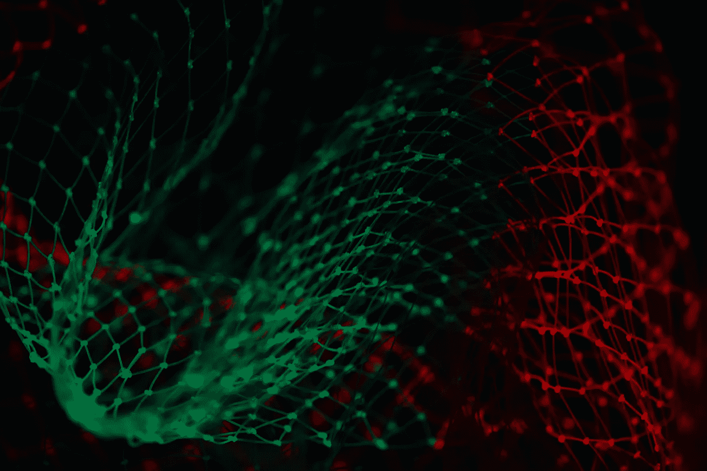

照片由 Pietro Jeng 在 Unsplash 上拍摄

主成分分析(PCA)是一种众所周知的降维技术。PCA 属于机器学习的无监督分支，它使用基于协方差矩阵的特征向量和特征值分解的“正交线性变换”，将数据集的属性投影到新的坐标系上。其目的是在减少特征数量的同时保留大部分原始信息。***PCA 的核心思想*** 是计算主成分，并用它们对数据进行基的变换，有时只使用前几个主成分，而忽略其余的。它通过生成新的不相关变量来实现这一点，这些变量以连续的方式最大化方差。完美的描述，但对想要理解它的人来说不是很有用。

***那么，我们再来试试*** ，这次用一个例子。想象你现在手里或面前有一个物体，可能是笔、电脑、电话或其他什么东西。对我来说，这是我的手表，现在仔细观察它的宽度、高度和深度(一般尺寸)，如果我让你在纸上画出来，你会怎么画？或者，如果我让你在它上面投射一个手电筒或灯光来创建原始对象的二维(2D)阴影，你会如何旋转它，以便你甚至可以在没有看到原始 3D 对象的情况下识别它？你要么根据手表的特征在纸上画一只手表，要么投射光线，使阴影与原手表的高度、宽度或曲线相似。

现在的问题是，你画的手表和原来的 3D 手表是一样的，还是手表的阴影保留了它的颜色或材料？绝对不行。但即使在所有的瑕疵之后，如果你问任何人你的画或影子，他们也会简单地说“这是一块手表”。**这就是 PCA 所做的，**它将具有大量特征(我们的 3D 手表)的数据集投影到少量变换的特征(2D 图或手表的阴影)中，这些特征保留了原始对象(一般数据集)的大部分信息。

现在你会认为这很容易，但是有一个陷阱。你如何决定你的手表相对于光源的方向或角度，以获得完美的阴影？你的答案可能是击中和跟踪，但如果对象是非常复杂的形状，而不是手表，这将需要永恒。这就是我要介绍特征向量和特征值的地方，我们先来了解一下它们是什么。

## 特征向量和特征值:

特征向量是实非零向量，当对其应用线性变换时，其方向保持不变。特征值是一个数字，表示数据在该方向上的变化量。简单地说，你正在寻找的方向或角度，以确定获得最佳投影(阴影)的手表是一个特征向量。由于我们的手表是一个 3D 产品，它可能只有很少的特征向量，可以很容易地识别，但现在考虑一个具有 50 或 100 维(特征)的数据集，是否有可能通过 hit& trail 确定其特征向量的数量？或者，即使你设法识别了所有的特征向量，你如何分类哪个是主向量？答案是特征值，具有最高特征值的特征向量是主特征向量(PCA 中的第一主分量)。前进之前的另一个重要概念是**协方差矩阵。**

## 协方差矩阵:

协方差矩阵描述了数据集的两个要素中的任何一个如何一起变化。对于我们的情况，手表的高度和宽度或宽度和深度之间的关系。要看的是，他们之间有什么联系吗？宽度随着深度的变化而变化吗？这就是协方差矩阵所保持的，它反过来帮助我们识别投射手表的正确方向(特征向量和值)。

现在你对 PCA 有了一个大概的了解，是时候实现它来巩固你的概念了。

我们将按照给定的顺序执行以下步骤，以达到最终目标:

1️⃣读取数据帧中的数据

2️⃣缩放数据

3️⃣创建协方差矩阵

4️⃣选择主成分

5️⃣验证保存的信息

6️⃣可视化

**数据读取:**

我已经使用 [smote](https://imbalanced-learn.org/stable/references/generated/imblearn.over_sampling.SMOTE.html) 创建了几个国家的蛋白质消费的合成数据集，我们将使用它来实现 PCA。以下是数据集的导入和加载:

```
import pandas as pd
import numpy as np
import matplotlib.pyplot as plt
import seaborn as snsdf = pd.read_csv('/content/proteindata.csv')
df.head()
```

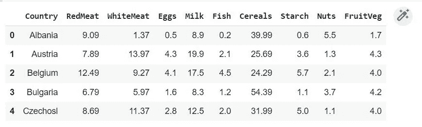

**缩放:**

现在，我们将我们的特征与标签(国家)分开，如下所示:

```
features = df.iloc[:, 1:]
Label = df.iloc[:, 0:1]
```

我们将数据分成 X，Y，因为我们需要缩放我们的特征。缩放数据集的主要原因是我们不希望某些特征由于比例差异而在算法上有偏差。我们有两种选择来缩放数据帧，一种是通过 scikit-learn 的标准缩放器:

```
from sklearn.preprocessing import StandardScaler
features_norm = StandardScaler().fit_transform(features)
features_norm
```

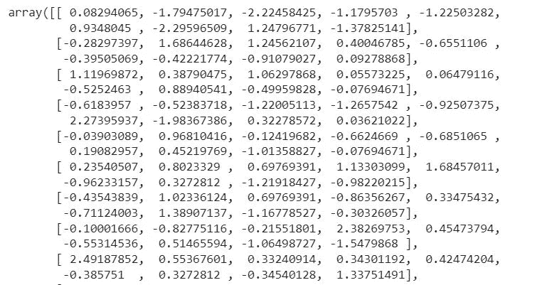

标准缩放器输出

另一种方法是从数据集中减去每个变量的平均值，使数据集以原点为中心:

```
feature_mean = features - np.mean(feautres , axis = 0)
feature_mean
```

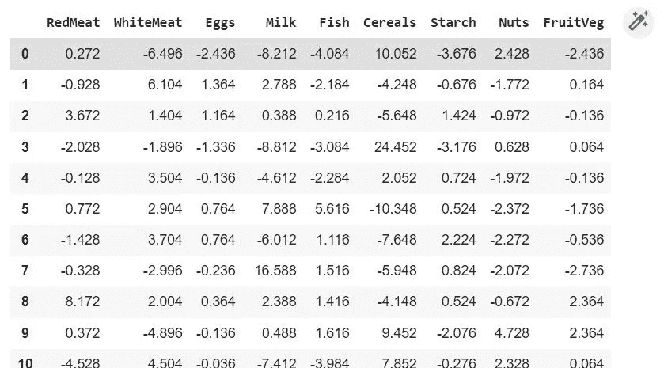

以原点为中心

**创建协方差矩阵:**

因为你已经对协方差矩阵有了一个直觉，这就是我们在简单地使用 ***numpy.cov( )*** 方法缩放我们的数据集之后如何得到它。

很高兴知道在协方差矩阵的对角线上有方差，其他元素是协方差。

```
transpose_feat = features_norm.T
covar_matrix = np.cov(transpose_feat)
covar_matrix
```

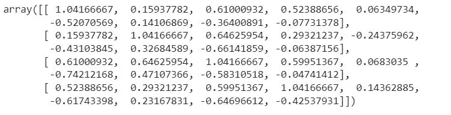

对角线有方差

**选择主成分:**

从协方差矩阵，我们现在可以计算特征向量和相应的特征值。但是在这样做之前，让我们理解为什么这样做很重要。由于我们的协方差矩阵是对称的，解释大部分方差的第一特征向量(主分量)将与在第一主分量之后保留大部分方差的第二特征向量正交，依此类推。由于 [**对称矩阵的特征向量是正交的**](https://math.stackexchange.com/questions/82467/eigenvectors-of-real-symmetric-matrices-are-orthogonal) ，这将继续我们数据集中的特征总数。使用 numpy 的 ***linalg.eig()*** 实现如下:

```
eig_values, eig_vectors = np.linalg.eig(covar_matrix)
eig_values
```

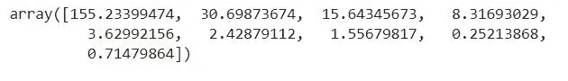

协方差矩阵的特征值

上面是特征值，下面是特征向量

```
eig_vectors
```

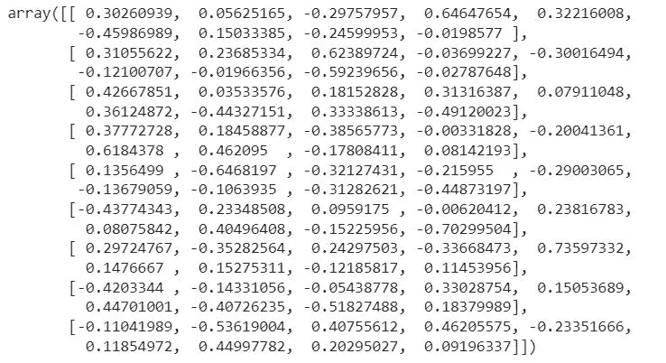

协方差矩阵的特征向量

**验证保存的信息:**

现在我们将计算每个特征向量保留了多少信息(方差)。就像把光投射到我们的物体上来看它的影子一样，但是在这里，前几个特征值的累积和将有助于我们识别物体

下面是计算每个特征向量保留的信息的代码:

```
information_preserved = []
for i in range(len(eig_values)):
    information_preserved.append(eig_values[i] / np.sum(eig_values))print(sum(information_preserved))
```

***信息 _ 保存的*** 或方差应始终等于 1。

```
information_preserved
```

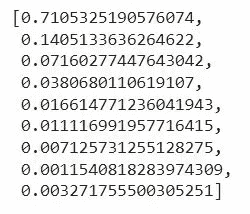

每个向量保存的信息

在我们的例子中，前 4 个 PC(主成分)解释了几乎 96%的方差(保留了信息)，这是惊人的，因为我们现在可以使用这 4 个用于模型训练、评估，前 2 个也用于可视化。这是 PCA 背后的主要思想，我们可以在低维中投影高维数据，而不会留下大部分信息内容。由于 PCA 将大量信息保留在较少的特征(维度)中，因此它也有助于减少机器学习模型的训练时间。

让我们想象一下我们所有精选的电脑:

```
total_info = np.cumsum(information_preserved)
plt.figure(figsize=(8, 6))
plt.bar(range(1,10), information_preserved, alpha=0.5, align='center')plt.step(range(1,10), total_info, where='mid', color='red')
plt.ylabel('variation/information preserved by each PC')
plt.xlabel('Principal components 1-9')
plt.show()
```

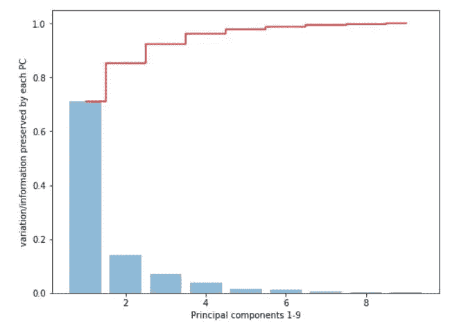

每个主成分保存信息

**可视化:**

现在，为了直观显示基于第一个 2 PC 的输出，我们开始为

```
pca_1 = features_norm.dot(eig_vectors.T[0])
pca_2 = features_norm.dot(eig_vectors.T[1])
PCA_df = pd.DataFrame(pca_1, columns=['PCA_1'])
PCA_df['PCA_2'] = pca_2
PCA_df['Countries'] = Label
PCA_df.head()
```

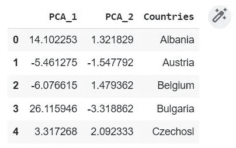

前 2 张标签

我们用缩放后的数据进行前 2 个点的点积，现在我们可以绘制散点图，如下所示:

```
y1 = Label.values.ravel()plt.figure(figsize=(10, 8))
sns.scatterplot(x='PCA_1', y='PCA_2', hue='Countries', data=PCA_df, legend=False, s=22)
plt.legend(markerscale=4)for i, txt in enumerate(y1):
     plt.annotate(txt, (pca_1[i], pca_2[i]), fontsize=12)
```

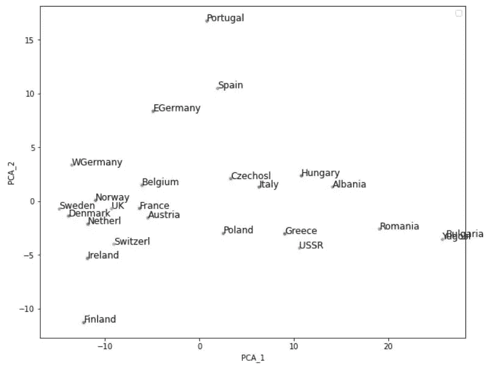

今天到此为止。除了所有这些实现，scikit-learn 还提供了一个 [PCA 模块](https://scikit-learn.org/stable/modules/generated/sklearn.decomposition.PCA.html)。希望你喜欢读这篇文章，我将发表另一篇关于处理稀疏矩阵的截断&稀疏 PCA 的文章，如果你不想错过，请跟我来。另外，如果您对具体的实施有任何要求，请[给我](https://www.linkedin.com/in/muhammad-saad-31740060/)写信。