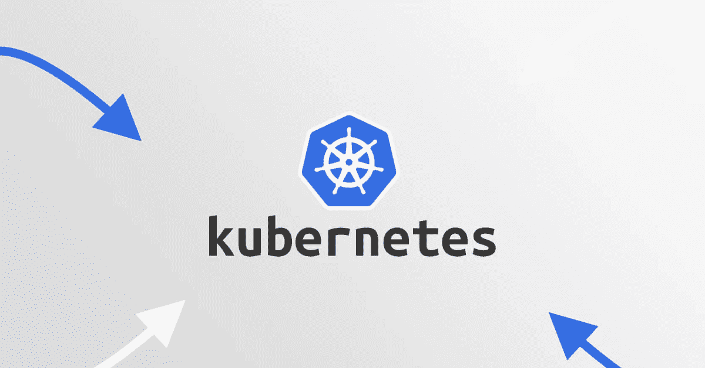

# 经过专业测试的 K8s 和 DevOps 工具

> 原文：<https://medium.com/codex/pro-tested-k8s-devops-tools-a5d7a17ad78f?source=collection_archive---------4----------------------->

来源: [Logz.io](https://logz.io/blog/ci-cd-tools-for-kubernetes/)

Kubernetes 的出现主导了容器编排市场，并加强了过去的运营方式，模糊了开发和运营之间的界限，并使 DevOps 的角色更加清晰。这是当今最流行的容器解决方案之一。

每个软件工程师都可以使用 Kubernetes 来定义服务之间的拓扑结构、线路上的节点数量、资源使用情况，并快速实现水平扩展、蓝绿色部署以及过去的其他复杂操作。以下是帮助您充分利用 Kubernetes 的工具列表。

## 集群部署工具

**亚马逊 EKS** 亚马逊弹性容器服务是一个 Kubernetes DevOps 工具，允许用户管理和扩展他们的容器化应用程序，并简化 Kubernetes 的部署。当你需要一个足够安全和稳定的 Kubernetes 服务，以尽可能少的努力维护你的基础设施，并希望将更多的精力放在你的业务发展上时，亚马逊 EKS 是一个值得的选择。

Kubespray 是一个集群生命周期管理器，帮助部署生产就绪的 Kubernetes 集群。它使用一个脚本来自动化 Kubernetes 集群配置。关键特性包括基于 Ansible 的、高度可用的、跨平台的；流行的云提供商集成甚至裸机、多种配置选项、多平台 CI/CD 等等。因为 Kubespray 有一个易于使用的开放开发模型，并且降低了编排集群的难度，所以任何人都可以很容易地学习如何使用 Kubespray。

**变戏法** 变戏法易于使用，允许用户以最小的问题部署他们的应用程序。支持本地主机部署、AWS、裸机、Azure、VMware、Joynet 和 OpenStack。

## 监控工具

Kubewatch 是一款非常好用的工具。Kubewatch 可以监控这些特定的 Kubernetes 事件，并将这些事件作为通知推送到 Slack 和 PagerDuty 等端点。可以确保您的容器是安全的，并使用行业最佳实践进行打包，同时监控软件的漏洞和更新。然而，用户说增加对多个实例的支持会更有帮助。支持多个端点，易于部署。

**Weave Scope** Weave Scope 用于对 Kubernetes 和 Docker 集群进行监控和故障排除，因此您可以腾出手来识别和纠正您的容器化应用程序的问题。

Test-infra
Testinfra 是一个基础设施测试框架，它使得编写单元测试来验证服务器的状态变得容易。它支持的一个后端是 Ansible，所以这意味着 Testinfra 可以使用 Ansible 的清单文件和清单中定义的机器集直接测试它们。对于处理复杂的模板来测试和检测错误非常有用。

**Trireme** Trireme 通过提高安全性和降低 Kubernetes 流程、工作负载和容器的复杂性，引入了一种新的网络授权方法。建议降低 Kubernetes 工作负载、容器和流程的复杂性。它可以帮助您在应用程序级别加强安全性。

**Sysdig Falco** 这是一款行为活动监控工具，提供深入的容器可见性，减少检测安全事件所需的时间，并应用允许您监控和检测容器、应用程序、主机和网络活动的规则。使用它来检查其基础设施，检测异常，并为任何类型的 Linux 系统调用设置警报通知。

Falco 还可以监视外壳何时在容器中运行、容器安装在何处、敏感文件的意外读取、出站网络尝试以及其他可疑呼叫。

## CLI 工具

**Cabin** Cabin 是一款通过 Android 或 iOS 管理 Kubernetes 的移动仪表盘。它支持用户远程管理其集群，是快速修复所有事件的优秀工具。当 Kubernetes 应用程序远离主设备时，Cabin 可以快速管理它们。这不是发展的工具。当工程师经常远离他们的主计算机并且需要快速管理他们的 Kubernetes 集群时，Cabin 是有用的。

**Kubectx/Kubens** Kubectx/Kubens 使用 autocomplete 特性，通过在集群之间来回切换，同时连接到每个集群，帮助用户轻松切换上下文。您可以使用它在 Kubernetes 名称空间之间平滑地切换。对于总是在集群或名称空间之间导航的用户来说，这是非常有益的。

## 开发工具

**网真** 它允许你在本地调试 Kubernetes 服务，简化开发和调试过程。

Helm 帮助用户管理他们的 Kubernetes 应用程序，并允许你通过 Helm 图表分享你的应用程序。这允许用户创建可共享和可复制的版本，但对于更高级和更频繁的部署，不建议这样做。

**Keel** 它允许用户重新专注于编写代码和测试他们的应用程序。这是因为如果存储库中有新版本的应用程序，它会自动更新 Kubernetes 工作负载。