# 用 Javascript 和 HTML 解决问题

> 原文：<https://medium.com/codex/problem-solving-in-javascript-html-3eb04b9a1137?source=collection_archive---------10----------------------->

在最近的一次模拟技术面试中，我被提示为我的导师完成一个简单的现场编码练习。这是一个更广泛的项目审查的一部分，包括测试沟通，规划，一般知识，以及时间限制的问题解决技能。

在这次考试之前，我被告知代码挑战并不总是产生二进制通过/失败的结果。如果程序员可以在这些辅助技能上表现出色，但没有及时解决代码，他们可能最终“通过”测试，仍然会收到工作邀请。以下是我遵循的通过测试，钉钉面试的流程。

在我们进入提示之前，让我们回顾一下程序员拥有的最好的工具；调试。调试是找到代码中断点确切位置的过程。“调试器”也是浏览器开发工具的一部分，它允许你在浏览器中一步一步地检查你的代码以缩小你的问题。Console.log()是浏览器提供的一个更通用的标识符，在 JavaScript 代码中使用，它记录作为参数传递的字符串或对象。Console.log 就像一个通用的有用的 Sherpa，帮助您查看页面上的内容，而 debugger 更像是一个特定的工具，帮助您获得更多特定功能的关注。两者都将帮助您跟踪您的问题，并为您提供一些帮助。准备好使用它们。

 [## 什么是浏览器开发者工具？-学习 web 开发| MDN

### 每个现代的网络浏览器都包括一套强大的开发工具。这些工具做一系列的事情，从…

developer.mozilla.org](https://developer.mozilla.org/en-US/docs/Learn/Common_questions/What_are_browser_developer_tools)  [## 控制台-Web API | MDN

### 控制台对象提供对浏览器调试控制台(例如 Firefox 中的 Web 控制台)的访问。具体的…

developer.mozilla.org](https://developer.mozilla.org/en-US/docs/Web/API/console#outputting_text_to_the_console)  [## 调试器- JavaScript | MDN

### 下面的示例显示了插入了调试器语句的代码，以调用调试器(如果存在)…

developer.mozilla.org](https://developer.mozilla.org/en-US/docs/Web/JavaScript/Reference/Statements/debugger) 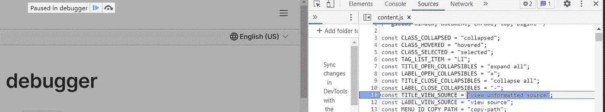 [## 控制台概述- Chrome 开发者

### 这一页解释了 Chrome DevTools 控制台如何使开发网页变得更加容易。控制台有两个主要用途…

developer.chrome.com](https://developer.chrome.com/docs/devtools/console/) 

**提示:创建一个按钮，每点击一次按钮，计数增加一个**

首先，完成这项任务有多种方法，因此将过程分解成步骤比记住如何在给定的编码语言中完成每一个小任务更重要。这就是为什么许多技术面试会让你搜索官方文档来帮助语法和格式。JavaScript 的一个主要优点是模块化，将大任务分解成更小的可重用代码。当解决手头的问题时，应该应用类似的思维过程。

第一步:制定计划！科学告诉我们，用语言描述或书写你的问题会以多种不同的方式激活你的大脑，让原本不会出现的解决方案出现。这将有助于想象需要做什么，所以如果你遇到困难或迷路，你可以回头参考-这是你的地图。记住:编码是一种语言，所以你将把一个用英语(或你的母语)写的抽象任务翻译成计算机程序能理解的 JavaScript 的具体步骤。

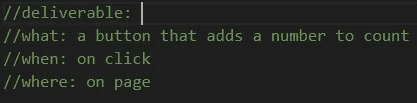

步骤 2:进一步分解可交付成果。我知道我需要能够看到按钮。我可以使用 JavaScript 动态地创建按钮，方法是初始化一个变量，创建按钮，然后给它分配一个 ID，这样我就可以在后面的代码中引用这个节点。在这里使用 console.log()方法，右键单击+ inspect -> console 来查看输出。

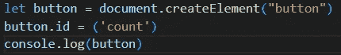

或者我可以用 HTML 创建，然后用 JavaScript 引用。

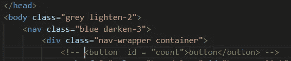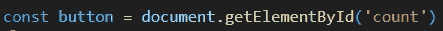

正如你所看到的，两种方法产生相同的结果。我们页面上的一个按钮；然而，在这种情况下动态创建它需要更多的代码。所以我选择了 HTML 路线。

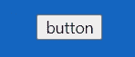

目前，我们只有一个按钮。接下来，我们需要选择按钮，然后再给它分配任务。为了选择我们的按钮，我们使用 getElementByID()方法来引用我们之前给它的唯一 ID。

 [## document . getelementbyid()-Web API | MDN

### 文档方法 getElementById()返回一个 Element 对象，表示 Id 属性与…

developer.mozilla.org](https://developer.mozilla.org/en-US/docs/Web/API/Document/getElementById) 

第四步:现在通过编写代码使它可行。

到目前为止，我们所做的就是创建一个 html 节点，并使其可选。这就是我们必须弄清楚写什么代码来实现可执行文件的地方。在我回顾的这一点上，我不知道下一步该做什么，这通常是我感到恐慌并开始猜测的时候。猜测会让你陷入你没有时间去做的兔子洞；记住这是一次定时的技术面试，所以你对不确定性的反应是最重要的。请记住，您可以使用官方文档。如果你没有分解每一步，你必须谷歌“如何在 JavaScript 中制作一个按钮，并使其可点击，每次增加 1”。这显然不会让你得到你需要的结果，很可能会导致一次失败的挑战。然而，因为我们确切地知道我们需要做什么，我们可以简单地谷歌“用 1 个 JavaScript 向上计数”。去吧，你自己试试！即使你不知道这方面的专业术语，最重要的结果之一也会是这样的:

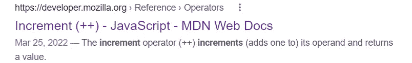

步骤 5:我们现在知道了需要使用的操作符(++)。我们知道选择可操作的 HTML 节点(按钮)的 JavaScript 变量。剩下的就是把它们放在一起。

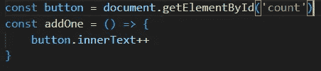

回到你的网页，尝试你的新功能。

哦哦..为什么什么都没发生？检查你的控制台

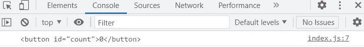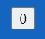

我们仍然可以在控制台上看到按钮，但是当我们点击页面上的按钮图标时，没有任何反应。

总结:我们有我们的功能，我们有我们的按钮，但是我们还没有连接它们。记住我们的计划，执行是“点击”。如果你不知道如何立即做到这一点，使用你的谷歌工具。

 [## JavaScript DOM 事件监听器

### W3Schools 提供所有主要网络语言的免费在线教程、参考资料和练习。覆盖…

www.w3schools.com](https://www.w3schools.com/js/js_htmldom_eventlistener.asp) 

因此，我们必须编写更多的代码，以便页面上的内容，即我们的 DOM，能够被我们的行为和点击所听到。

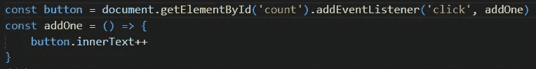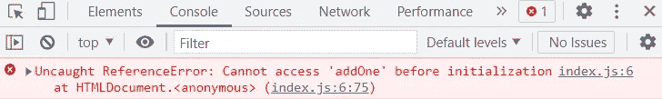 [## ReferenceError - JavaScript | MDN

### ReferenceError 对象表示当变量在…中不存在(或尚未初始化)时的错误

developer.mozilla.org](https://developer.mozilla.org/en-US/docs/Web/JavaScript/Reference/Global_Objects/ReferenceError) 

如果你关注你的控制台，你会得到一个提示，告诉你如何修复这个错误。操作顺序在 JavaScript 中非常重要，试着改变事件监听器的位置。

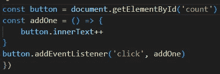

检查您的网页。

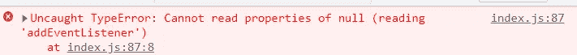

以前的 ReferenceError 现在是 TypeError！呜哇！并不是所有的错误都是一样的——如果你得到了一个不同的错误，你就在正确的轨道上！

 [## TypeError - JavaScript | MDN

### 当操作无法执行时，TypeError 对象表示一个错误，通常(但不仅限于)当…

developer.mozilla.org](https://developer.mozilla.org/en-US/docs/Web/JavaScript/Reference/Global_Objects/TypeError)  [## 语法错误对引用错误对类型错误

### 错误就像编码的副产品。像任何其他编程语言一样，javascript 中也存在错误…

omkarkolate.hashnode.dev](https://omkarkolate.hashnode.dev/errors-in-javascript) 

试着移动你的函数:如果你和其他代码一起尝试这个问题，你可能会遇到一个作用域问题。你可能试图在错误的地方调用你的函数。让我们快速回顾一下范围。

作用域本质上是对变量声明位置或其上下文的引用。全局、函数和块是不同的作用域。全局作用域可以在函数和块作用域中访问。函数和块范围被称为局部范围。函数作用域中定义的变量是函数中定义的变量，不能在不同的函数作用域中访问。块作用域是在循环或条件函数中定义的作用域。

您还可能试图使用不正确的关键字声明变量:const、let 和 var。令人困惑的是，这些关键字也有自己的预定义范围。“Const”是的缩写；保持恒定值-不能重新声明或更新。常量声明只能在声明它的块中访问。“Let”也是块范围的。Let 可以更新，但不能重新声明。它可以在不同的作用域中被声明为相同的变量而不会抛出错误，因为它们又是块作用域，所以两个实例被不同地对待。不能在同一范围内声明为不同的变量。Const 和 let 可以被[提升](https://www.freecodecamp.org/news/var-let-and-const-whats-the-difference/)，在声明之前不会被初始化。由于这个问题我们只需要一个变量，这不应该是问题的根源。如果你想了解更多关于这个特定范围的信息，请点击这里的。

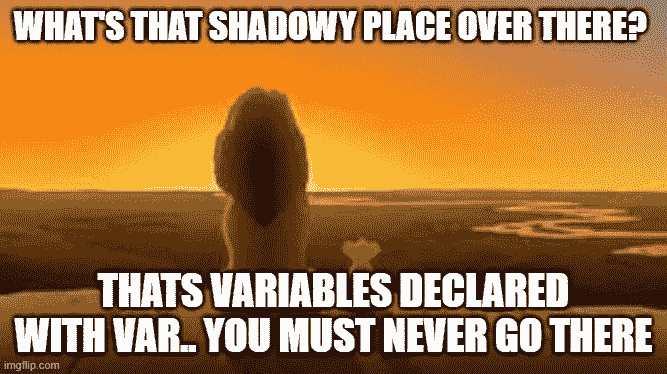

回到手头的问题。尝试更改函数的位置..

嘣！我们现在应该有一个按钮，每次点击都会增加。通过一步一步地分解任务，我们通过了编码挑战，这要归功于我们及时的计划和调试技巧。额外收获:因为我们交流了我们的思考过程，计划了每一步，并在遇到问题时使用了我们的问题解决/搜索技能，所以我们展示了我们有能力成为一名全垒打员工。

简而言之:在开始之前充分理解这个问题。当你陷入困境时，利用你手头的工具:规划、开发工具、console.log()、google 等等。编码就是解决问题。为了系统地做到这一点，使用一个正反馈环来通知你的下一个决定。创造了正确的元素。我可以使用什么工具？我引用的元素正确吗？它在浏览器中显示出来了吗？我得到了什么错误信息？如何得到不同的错误信息？它显示在控制台上了吗？我有正确的方法吗？这个顺序对吗？不断评估你在哪里，你正在尝试做什么，你将如何找到答案，以及如何实现一个解决方案。使用这种思维模式来轻松解决这类问题，并在技术面试中大放异彩的唯一方法就是练习使用它们。

额外收获:通过解决下面的简单问题，练习使用您的调试、console.log 和计划技能。

 [## 初学者面临的 10 个 JavaScript 代码挑战

### 在线课程是学习代码基础的好地方。但是当你把事情付诸实践时，你…

www.codecademy.com](https://www.codecademy.com/resources/blog/10-javascript-code-challenges-for-beginners/)  [## GitHub-sadanandpai/JavaScript-code-challenges:JavaScript 现代面试代码集…

### 受访者|面试官|知识测试|练习请给本报告一个⭐以示支持，请随意…

github.com](https://github.com/sadanandpai/javascript-code-challenges)  [## JavaScript 练习

### 你可以通过 W3Schools 的练习来测试你的 JavaScript 技能。我们收集了各种 JavaScript 练习(使用…

www.w3schools.com](https://www.w3schools.com/js/js_exercises.asp)  [## 基于协同浏览器的集成开发环境

### 跳转到内容使用我们免费的、协作式的浏览器内 IDE，用 50 多种语言编写代码-无需花费一秒钟在…

replit.com](https://replit.com/) 

[https://medium . com/@ jbmanley 45/JavaScript-array-method-find-58224 cf 99 FD 0](/@jbmanley45/javascript-array-method-find-58224cf99fd0)