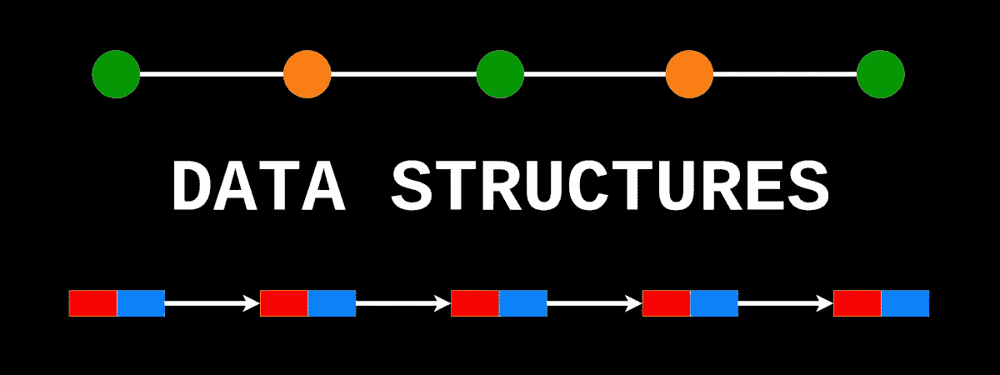
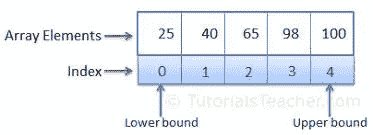
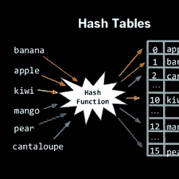
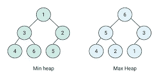
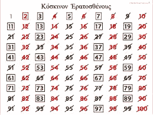

# 用数据结构解决问题

> 原文：<https://medium.com/codex/problem-solving-with-data-structures-c17fc48540f6?source=collection_archive---------19----------------------->

## 看看如何使用数据结构解决问题



数据结构是惊人的，它们可以用在很多地方，并使存储和操作数据变得更加容易。然而，为一个问题选择正确的数据结构是具有挑战性的。今天，我将介绍一些最常用的数据结构，以及如何通过例子在问题中使用它们。

在选择数据结构时，有许多事情需要考虑，例如您需要什么操作，这些操作运行的速度有多快，而且有这么多数据结构，包括数组、堆、二分搜索法树和哈希表等等，也没有什么帮助。这些数据结构都有自己的用途和用例。我将对它们进行简单的解释，并在下面给出使用它们的例子。



数组的示例

我要讲的第一个数据结构是数组。它们使用起来如此简单，却又如此有用，是非常罕见的组合。如果你不知道，数组基本上是整数的集合(但可以是任何东西)，让你通过一个索引访问每个元素，并支持常见的操作，如插入和删除，但可以支持更多。所以，我们举个例子来帮助你理解。我们创建一个数组 X，给它添加一些数字，然后删除一些数字。然后我们通过索引得到数组中的第一个元素(这是 python 语法)

```
X = [] # create and array called XX.append(1) # add 1 to the array
X.append(2) # add 2 to the array
X.append(3) # add 3 to the array
X.remove(3) # remove 3 from the arrayx[0] # we get the first element in the array (zero indexed)
```



散列表的一个例子

下一个数据结构叫做哈希表。这种数据结构对于保存记录非常有用，因为它通过键值对存储数据，并且具有非常快的查找和插入速度。它用一个哈希函数把表中的键转换成索引(如上图)，但这部分你不需要懂，只要知道它就在那里。这种数据结构理解起来稍微复杂一点，但是可能性是无限的。所以，这里有一个如何使用哈希表(python 中的字典)的例子。

```
birthdays = {} # create a new dictionarybirthdays["Joe"] = "10/11/2008" # add key "Joe", value "10/11/2008"   birthdays["Zoey"] = "5/1/2010" # add key "Joe", value "5/1/2010"
birthdays["Ian"] = "9/12/2007" # add key "Joe", value "9/12/2007"birthdays["Ian"] # get the birthday of Ian
```

上面我们可以看到一个名为“生日”的散列表，记录着乔、佐伊和伊恩的生日。我们还可以看到，使用表中的关键字，很容易找到任何人的生日。



最小(左)和最大(右)堆示例

我将介绍的最后一个数据结构是堆。堆是一种更复杂的数据结构，但是一旦你理解了它们，它们就很容易使用。当您重复进行最小或最大计算时，堆是有用的。这就是为什么有两种堆，min 堆和 max 堆。堆基本上是满足堆属性的树，这意味着在树中的给定节点，它的两个子节点必须比它小(在最小堆中)或大(在最大堆中)。

所以，现在我们已经介绍了一些数据结构，让我们学习如何使用它们

在第一个例子中，我们将使用数组数据结构。数组的一个应用是排序数字，你可以在我以前的文章中读到更多。数组有很多众所周知的应用，但这是我最喜欢的一个，寻找质数。现在，这似乎不是一个复杂的问题，但是当 n 开始变大时，找到所有小于 n 的素数，其中 n >2 可能是一个挑战。我将要描述的算法被称为厄拉多塞筛，可以轻松完成这项任务。



厄拉多塞的筛子如下工作，它首先创建一个长度为 n 的数组，并将其中的所有值设置为真。然后我们循环所有的数字，从 2 开始，因为我们知道它是质数，直到 n，然后我们检查数组中对应于当前数字的位置是否为真。如果是，那么我们将它的所有倍数设置为 False。一个额外的优化是不从 1 到 n 循环，我们只需要从 1 到 sqrt(n)循环，因为在 sqrt(n)之后，我们不再对数组做任何更改。根据维基百科，这种算法是寻找< 1000 万的质数的最有效的方法之一。这个算法的唯一缺点是它需要一个大小为 n 的数组，这可能会变得很大。

在这个例子中，我们将使用哈希表数据结构。我们知道散列表有固定的时间插入和查找，并且对于存储数据很有用，其中一个键映射到一个值，正如我们在前面的生日例子中看到的。对于这个例子，我不会讲得太深，因为需要使用这种数据结构的算法可能很复杂，但是我最喜欢的哈希表应用之一是创建文件系统。关键字可以是文件名，值可以是文件的路径，这种方法很有效，因为向表中添加内容非常快，而删除内容虽然可能较慢，但仍然相对较快。

我们讨论的最后一个数据结构是堆。对于这个例子，我们可以利用堆可以优化最小计算的事实。假设你是一名游戏设计师，你需要找到一种存储事件的方法。例如当运动员踢球或进球时。虽然您可以为此使用数组，但是查找最近的事件会非常低效，因为您必须搜索所有事件才能找到最近的事件。这就是堆的用武之地，我们可以将所有事件插入到堆中，由于根是最小的元素，由于堆的属性，我们可以提取成为最近事件的根。这就是为什么堆也被称为优先级队列。

既然您已经学习了数据结构以及如何使用它们，我鼓励您学习更多关于它们的知识，并打开解决任何问题的大门。

感谢阅读！