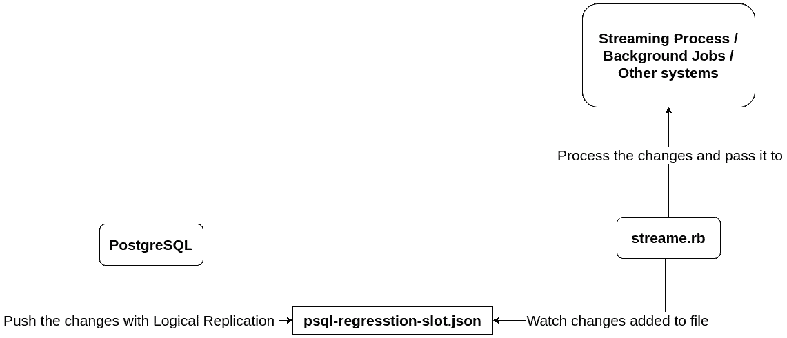

# 使用逻辑复制和 Ruby 处理 PostgreSQL 更改

> 原文：<https://medium.com/codex/process-postgresql-changes-with-logical-replication-and-ruby-a4454cac529a?source=collection_archive---------5----------------------->

您是否尝试过将数据库活动日志发送到事件系统？获取最新的更改，以便您可以更好地管理您的缓存，甚至基于数据更改触发其他事件。

在具有[逻辑解码](https://www.postgresql.org/docs/12/logicaldecoding.html)特性的 PostgreSQL 中，每次数据库中发生变化时，您都可以很容易地获得最新的变化。在这里，我们将首先设置逻辑解码，然后创建一个脚本，将这些更改推送到 Kafka、Redis 或任何流处理平台，以供进一步使用。

# 数据库设置

现在我们要用 docker 建立一个 PostgreSQL 服务器。我假设你有使用 docker 和 CLI 的基本知识，你也可以阅读我的文章[使用 Docker](https://faun.pub/tips-on-using-docker-5c19c8ad17a2) 的技巧，这是我最常用的。

首先，我们需要创建一个名为`Dockerfile-postgres`的 docker 文件来构建我们的 PostgreSQL 映像。

```
# Dockerfile-postgresFROM postgres:12.3RUN apt update && apt install -y postgresql-12-wal2json postgresql-contrib
```

我们正在使用 PostgreSQL 版本 12.3，并安装我们稍后需要的包`wal2json`。

现在让我们用这些配置创建一个 docker-compose 文件，并启动数据库容器。

```
# docker-compose.ymlversion: '2'
services:
  db:
    build:
      context: .
      dockerfile: Dockerfile-postgres
    volumes:
      - ./pgdata:/var/lib/postgresql/data
      - ./stream:/stream
    ports:
      - 5555:5432
    environment:
      POSTGRES_PASSWORD: "123123"
      POSTGRES_DB: "myworld"
```

现在，如果你运行`docker-compose up`，容器应该开始工作。

以下是成功启动的容器日志。

```
db_1   | 2022-05-02 06:26:58.664 UTC [1] LOG:  listening on IPv4 address "0.0.0.0", port 5432
db_1   | 2022-05-02 06:26:58.664 UTC [1] LOG:  listening on IPv6 address "::", port 5432
db_1   | 2022-05-02 06:26:58.667 UTC [1] LOG:  listening on Unix socket "/var/run/postgresql/.s.PGSQL.5432"
db_1   | 2022-05-02 06:26:58.694 UTC [26] LOG:  database system was interrupted; last known up at 2022-04-24 12:18:14 UTC
db_1   | 2022-05-02 06:26:58.791 UTC [26] LOG:  database system was not properly shut down; automatic recovery in progress
db_1   | 2022-05-02 06:26:58.792 UTC [26] LOG:  redo starts at 0/1669FB0
db_1   | 2022-05-02 06:26:58.792 UTC [26] LOG:  invalid record length at 0/166A0B0: wanted 24, got 0
db_1   | 2022-05-02 06:26:58.792 UTC [26] LOG:  redo done at 0/166A078
db_1   | 2022-05-02 06:26:58.806 UTC [1] LOG:  database system is ready to accept connections
```

# 什么是逻辑解码？

> 逻辑解码是将对数据库表的所有持久更改提取为一致、易于理解的格式的过程，这种格式可以在不了解数据库内部状态的详细信息的情况下进行解释。

有了这个用于复制设置的特性的帮助，对数据库的每个更改都会被记录下来，并在处理后发出。

现在，我们需要更改一些配置，以便可以启动复制插槽。你可以在这里详细阅读[。](https://www.postgresql.org/docs/12/logicaldecoding-example.html)

我们已经将 PostgreSQL 数据挂载到了`pgdata`目录中。在这个目录中，有一个叫做`postgresql.conf`的文件，我们需要对它做一些修改。在文件中找到这些键并如下设置它们，然后用`docker-compose restart`重启数据库容器。

```
wal_level = logical
max_replication_slots = 1shared_preload_libraries = 'wal2json'
```

> 在使用逻辑解码之前，必须将 [wal_level](https://www.postgresql.org/docs/12/runtime-config-wal.html#GUC-WAL-LEVEL) 设置为`logical`并将 [max_replication_slots](https://www.postgresql.org/docs/12/runtime-config-replication.html#GUC-MAX-REPLICATION-SLOTS) 至少设置为 1。

此外，我们向 PostgreSQL 添加了`wal2json`库，这样我们就可以获得 JSON 格式的复制流输出，这种格式更容易阅读和处理。

# 设置复制插槽

设置数据库并应用配置更改后，我们将设置复制插槽。为此，您需要进入 PostgreSQL CLI。您可以运行下面的命令来访问它。

```
docker-compose exec db psql -U postgres -d myworld
```

让我们用`json`输出创建一个名为`regression_slot`的逻辑复制槽。

```
SELECT * FROM pg_create_logical_replication_slot('regression_slot', 'wal2json');
```

如果命令运行成功，您应该会看到以下输出。

```
 slot_name    |    lsn    
-----------------+-----------
 regression_slot | 0/1645E78
(1 row)
```

此外，您可以运行下面的查询来获取有关复制插槽的更多信息。

```
myworld=# SELECT slot_name, plugin, slot_type, database, active, restart_lsn, confirmed_flush_lsn FROM pg_replication_slots; -[ RECORD 1 ]-------+----------------
slot_name           | regression_slot
plugin              | wal2json
slot_type           | logical
database            | myworld
active              | f
restart_lsn         | 0/1645E40
confirmed_flush_lsn | 0/1645E78
```

您可以看到此插槽尚未激活，它刚刚创建。

# 激活逻辑复制插槽

有不同的命令可以激活复制插槽并从中读取更改。其中大部分已经在 [PostgreSQL 逻辑解码实例中讨论过。](https://www.postgresql.org/docs/12/logicaldecoding-example.html)

运行下面的命令，这将启动名为`regression_slot`的插槽，并将输出流式传输到位于`/stream`目录下名为`psql-regresstion-slot.json`的文件中。

```
docker-compose exec db pg_recvlogical -d myworld -U postgres -W --slot regression_slot --start -f /stream/psql-regresstion-slot.json
```

现在检查复制插槽，它已被激活。

```
myworld=# SELECT slot_name, plugin, slot_type, database, active, restart_lsn, confirmed_flush_lsn FROM pg_replication_slots;-[ RECORD 1 ]-------+----------------
slot_name           | regression_slot
plugin              | wal2json
slot_type           | logical
database            | myworld
active              | t
restart_lsn         | 0/1645E40
confirmed_flush_lsn | 0/1645E78
```

现在让我们用一个 tail 命令来监视输出文件，看看那里会有什么。

```
$  tail -f stream/psql-regresstion-slot.json
```

# 虚拟数据

是时候创建一个简单的表并开始向其中插入几条记录了。我将创建一个名为`data`的表，包含两列`id`和`value`。

```
myworld=# CREATE TABLE data(id serial primary key, value text);myworld=# \d data
                            Table "public.data"
 Column |  Type   | Collation | Nullable |             Default              
--------+---------+-----------+----------+----------------------------------
 id     | integer |           | not null | nextval('data_id_seq'::regclass)
 value  | text    |           |          | 
Indexes:
    "data_pkey" PRIMARY KEY, btree (id)
```

现在让我们向表中插入一些随机数据。多次运行该查询，将一些数据放入表中。

```
myworld=# INSERT INTO data(value) VALUES(random());
```

# 流输出

在表格中插入一些记录后，再次检查`psql-regresstion-slot.json`文件。对于您插入的每条记录，都有这样一行。

```
{"change":[{"kind":"insert","schema":"public","table":"data","columnnames":["id","value"],"columntypes":["integer","text"],"columnvalues":[1,"0.8077364682987209"]}]}
```

现在像这样运行一个更新查询。

```
myworld=# update data set value = 'test' where id = 1;
```

您可以看到像这样添加了一个新行。

```
{"change":[{"kind":"update","schema":"public","table":"data","columnnames":["id","value"],"columntypes":["integer","text"],"columnvalues":[1,"test"],"oldkeys":{"keynames":["id"],"keytypes":["integer"],"keyvalues":[1]}}]}
```

让我们试试删除。

```
myworld=# delete from data where id = 1;
```

并且下面的行将被添加。

```
{"change":[{"kind":"delete","schema":"public","table":"data","oldkeys":{"keynames":["id"],"keytypes":["integer"],"keyvalues":[1]}}]}
```

选择查询呢？它不会向文件中添加任何行，因为 SELECT 不会更改数据库中的任何内容。

到目前为止一切顺利。我们已经用逻辑解码设置了数据库，并将所有更改放入一个文件中，我们需要小心，并应用类似 logrotate 的东西，因为如果数据库中有太多更改，它可能会耗尽所有磁盘。是时候根据这些变化来创建事件了。因此，我将创建一个 ruby 脚本来监控输出文件并处理更改。

# 应用程序设置

首先，让我们用下面的命令创建所需的 Gemfile。

```
docker run --rm -v $PWD/app:/app ruby:2.6.3 bash -c "cd /app && bundle init"
```

现在你需要添加这些宝石以备将来使用。

```
# app/Gemfile# frozen_string_literal: truesource "[https://rubygems.org](https://rubygems.org)"git_source(:github) {|repo_name| "[https://github.com/#{repo_name](https://github.com/#{repo_name)}" }gem 'yajl-ruby', require: 'yajl'
gem "eventmachine"
gem "eventmachine-tail"
```

现在让我们对 docker-compose 文件做一些更改，这样我们就可以运行我们的应用程序了。

```
# docker-compose.ymlversion: '2'
services:
  app:
    image: ruby:2.6.3
    working_dir: /app
    volumes:
      - ./stream:/stream
      - ./app:/app
    command: bash -c "bundle install && ruby streamer.rb /stream/psql-regresstion-slot.json"
  db:
    build:
      context: .
      dockerfile: Dockerfile-postgres
    volumes:
      - ./pgdata:/var/lib/postgresql/data
      - ./stream:/stream
    ports:
      - 5555:5432
    environment:
      POSTGRES_PASSWORD: "123123"
      POSTGRES_DB: "myworld"
```

现在我们已经添加了一个使用 ruby 2 . 6 . 3 版映像的应用程序服务，我们还挂载了包含我们的复制槽输出和应用程序目录的流目录。如果你启动容器，你会得到一个错误，因为我们还没有创建`streamer.rb`文件。

现在让我们在 app 目录中创建`streamer.rb`文件。把下面的内容，然后我们将一步一步地去理解代码。

```
# app/streamer.rbrequire "yajl"
require "eventmachine"
require "eventmachine-tail"class Streamer < EventMachine::FileTail
  def initialize(path, startpos=-1)
    super(path, startpos)
    [@parser](http://twitter.com/parser) = Yajl::Parser.new(:symbolize_keys => true)
    [@parser](http://twitter.com/parser).on_parse_complete = method(:object_parsed)
  enddef object_parsed(obj)
    puts "data: #{obj} \n\n"
### Send data to Kafka stream, Redis stream or create async jobs or ### make more API calls. enddef receive_data(data)
    [@parser](http://twitter.com/parser) << data
  end
enddef main(args)
  if args.length == 0
    puts "Usage: #{$0} <path> [path2] [...]"
    return 1
  end$topic = $0 || "default"EventMachine.run do
    args.each do |path|
      EventMachine::file_tail(path, Streamer)
    end
  end
endexit(main(ARGV))
```

我们正在使用`yajl` gem 与 JSON 合作。还有`eventmachine`和`eventmachine-tail`，它们帮助我们观察一个文件并获取添加到该文件中的更改。

# 流光级

现在我们要定义一个类来监控`psql-regression-slot.json`文件的变化。

Streamer 类扩展了 EventMachine::FileTail 类，它可以对文件进行尾部处理。在 initialize 方法中，我们用`yajl`创建了一个 JSON 解析器。此外，我们定义了一个名为`object_parsed.`的函数，每当一个对象被解析时都会被调用

```
[@parser](http://twitter.com/parser) = Yajl::Parser.new(:symbolize_keys => true)
[@parser](http://twitter.com/parser).on_parse_complete = method(:object_parsed)
```

在`object_parsed`方法中，我们现在要将数据写入输出。

此外，我们添加了一个名为`receive_data`的方法，该方法覆盖了`EventMachine::FileTail`类的默认方法，并将新行推送到先前初始化的解析器对象。

# 主要方法

在 main 方法中，我们从 ARGV 获取文件名，并检查它们是否存在。

之后，我们需要运行 EventMachine，并要求它用 Streamer 类结束文件。

现在，如果您再次启动应用程序容器，它将启动 tail `/stream/psql-regression-slot.json`并将这些行推入解析器。

# 下一个？

您可以很容易地定制`parsed_object`方法并向其添加更多的逻辑。您可以将更改推送到 Kafka 流、Redis 流，或者创建其他异步作业来在后台处理数据。



我还创建了一个 [Gitlab 存储库](https://gitlab.com/azolf/processpostgresqlchanges)并将所有内容都推送到那里。愿意的话可以随意交流和扩展。