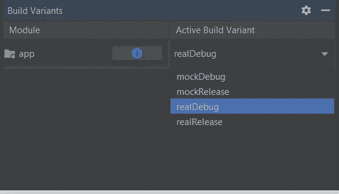
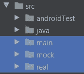
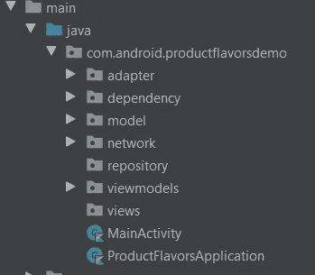
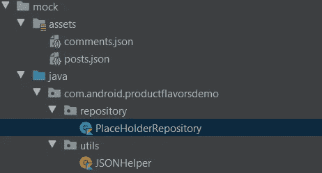
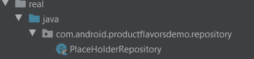
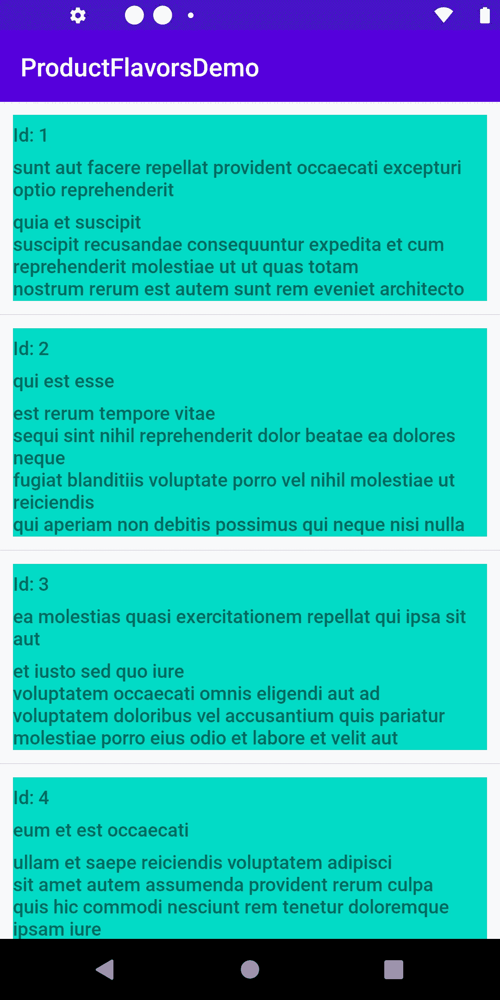

# 产品风味—简单样品

> 原文：<https://medium.com/codex/product-flavors-simple-sample-11541374a433?source=collection_archive---------9----------------------->

## 这个故事用一个简单的示例应用程序解释了 Android 产品风格。


产品风味

## **用例:**

我有一个需求，我需要从后端使用翻新/任何其他网络 API 获取数据，并填充我的用户界面。

## **挑战:**

后端还没有准备好，我将无法从后端获取数据，并填充我的用户界面。

虽然我的开发已经准备好了，但是我不能测试我的用户界面。

## **解决方案之一:**

与其等到后端开发完成，不如在没有任何网络交互的情况下用 mock JSON 测试应用程序。

这有助于测试用户界面流，也有助于修复遇到的缺陷。

一旦后端准备就绪，我们需要用真正的 API 代码替换模拟 JSON 代码。

**上述方法的问题:**

上述方法的问题是，我们需要用 API 交互代码替换包含模拟 JSON 的代码。此外，如果一段时间后，如果后端关闭，API 不再工作，我们需要修改与 API 交互相关的代码，并用模拟 JSON 代码替换它，以继续进行应用程序开发。

**解决方案 1:维护两个代码库**

维护两个代码库，一个用于模拟 JSON，另一个用于 API 交互。

这种方法的问题是维护困难。如果 UI 层有一些变化，我们需要修改两个非常困难的代码库。

**解决方案 2:产品风味**

Android 产品风格用于从单一代码库创建不同的应用程序版本。App 版本可以是免费的，也可以是付费的。它们可以有不同的主题和文本。他们可以使用不同的环境或类似于我们需求的 API。

简单来说，产品风格是你的应用程序的变体。当你想创建应用程序的多个版本时，这是非常有用的。这意味着你可以使用一个代码库生成不同版本或变体的应用程序。

产品口味是 Android Studio 的 Gradle 插件的一个强大功能，用于创建定制版本的产品。它们构成了我们称之为**构建变体**的一部分。

构建变体是 Gradle 使用一组[特定的规则](https://developer.android.com/studio/build/build-variants?authuser=1#sourceset-build)来组合在您的构建类型和产品风格中配置的设置、代码和资源的结果。虽然您不直接配置构建变体，但是您可以配置构建类型和形成它们的产品风格。

**为用例配置产品:**

我们需要为上述用例配置产品风格，这意味着我们创建两个构建变体，一个从 real API 获取数据，另一个从 mock JSON 获取数据。

将使用的架构是 MVVM，其中 viewmodel 与存储库交互，存储库又与 real API 或 mock JSON 交互以将数据返回给 ViewModel，ViewModel 将被活动/片段观察以填充 UI。

因此，我们需要在每个产品风格中都有一个具有相同名称、相同包(我使用的是相同的包)的存储库类。当选择一个特定的构建变体时，将从该特定风格中挑选存储库，并相应地获取数据。

**实现产品风味的步骤:**

步骤 1:将下面的代码块添加到 android 块的应用程序级 Gradle 中

```
flavorDimensions "fetchdata"
productFlavors **{** real **{** dimension "fetchdata"
        applicationIdSuffix ".real"
    **}** mock **{** dimension "fetchdata"
        applicationIdSuffix ".mock"
    **}
}**
```

上面的代码块包含两种产品风格**真实**和**模拟**，**真实**从后端获取数据，而**模拟**从 assets 文件夹中的模拟 JSON 文件获取数据。

所有风味必须属于一个命名的风味维度，它是一组产品风味。您必须将所有口味分配给一个口味维度；否则，您将得到构建错误。如果一个给定的模块只指定了一个风格维度，Android Gradle 插件会自动将该模块的所有风格分配给这个维度。

应用程序后缀:它指定了每种口味的包名。假设在默认配置下，应用程序的 applicationId 为“com.android.productflavorsdemo ”,则为每个产品风格添加一个后缀，如下所示:

当选择“真正的”产品风味时，我们会看到包为 com . Android . productflavorsdemo . real，如果选择了 **mock** 风味，则会看到“com . Android . productflavorsdemo . mock”

步骤 2:完成步骤 1 后，执行梯度同步:

在 Android Studio 中:Build ->选择 Build Variant，我们应该能看到如下图:



每个产品风格生成 2 个构建变体，一个用于调试，另一个用于发布构建类型。所以总共有 4 个版本。

第三步:源代码结构。

在 src 目录下创建 2 个目录/文件夹，如下所示，这样我们可以看到 2 个名为 **real** 和 **mock** 以及 **main** 的新目录，如下所示:



第三步:主**和**的包装结构如下。注意“Repository”文件夹是空的，因为我们使用产品风格从基于所选构建变体的不同来源获取数据。



步骤 4:模拟产品风味的结构:



assets 文件夹包含模拟 JSON，utils 文件夹包含从 JSON 读取数据的 JSONHelper。

PlaceHolderRepository 类从 JSonHelper 获取数据。请在下面找到存储库类的代码示例:

```
class PlaceHolderRepository(private  val apiServiceAPI: PlaceHolderServiceAPI) {
     init {
        ** *println*("From Mock ")  //Debug stmt that is displayed when mock flavor repository is executed.**
     }

     suspend fun fetchPosts(): Response<PlaceHolderPostsDataModel> =  JSONHelper.fetchParsedJSONForPosts()
     suspend fun fetchComments(): Response<PlaceHolderCommentsModel> = JSONHelper.fetchParsedJSONForComments()
}
```

步骤 4:真实产品风味的结构:



在上面的截图中可以看到，真正的产品只包含了 Repository 类。

源代码如下所示，它从实际服务中获取数据:

```
class PlaceHolderRepository(private  val apiServiceAPI: PlaceHolderServiceAPI){
    init {
        *println*("From Real ")
    }
    fun  displayInfo() = "From Real"
    suspend fun fetchPosts(): Response<PlaceHolderPostsDataModel> = **apiServiceAPI.fetchPlaceHolderPosts()**
    suspend fun fetchComments(): Response<PlaceHolderCommentsModel> = **apiServiceAPI.fetchPlaceHolderComments()**
}
//Fetches data from backend using  Retrofit library
```

输出:



当选择了特定的构建变体时，会相应地获取数据。当在 Repository 类的 init 块中执行 log 语句时选择 build variant 时，可以检查 logcat 是否从 mock 或 real 接收数据？

注意:同样，如果我们希望构建变体从 prod server/syst server 或 white labeling 获取数据，该应用程序的付费/免费版本会创建不同的产品风格，并将特定于风格的代码移动到相应的产品风格目录中。

**上述示例的来源- >可从 Github 获得:**

[](https://github.com/chandragithub2014/ProductFlavorsDemo) [## chandragithub 2014/ProductFlavorsDemo

### 产品风味简单样品。通过创建帐户为 chandragithub 2014/ProductFlavorsDemo 开发做出贡献…

github.com](https://github.com/chandragithub2014/ProductFlavorsDemo)