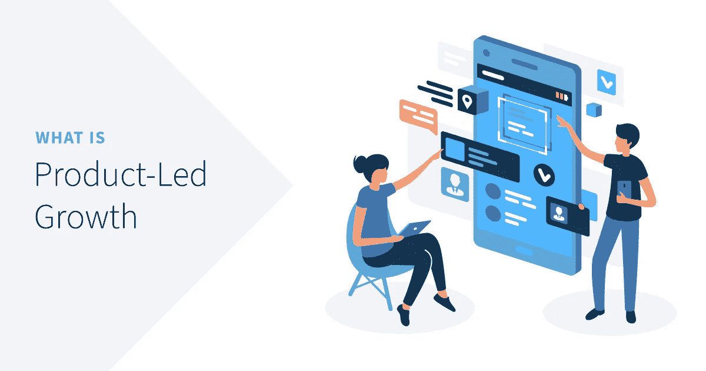

# 什么是 PLG:销售团队在这种 GTM 战略中过时了吗？

> 原文：<https://medium.com/codex/product-led-growth-plg-is-sales-dying-in-the-start-up-world-7dd1e5766803?source=collection_archive---------2----------------------->

图片来源:数字之外

# 什么是 PLG(产品导向型增长)？

顾名思义，产品导向型增长是一种走向市场的战略，它依靠产品本身作为吸引、获得和留住用户的手段

以产品为导向的增长有助于公司保持相关性并建立信任，这是数字化成熟的一个基本组成部分…