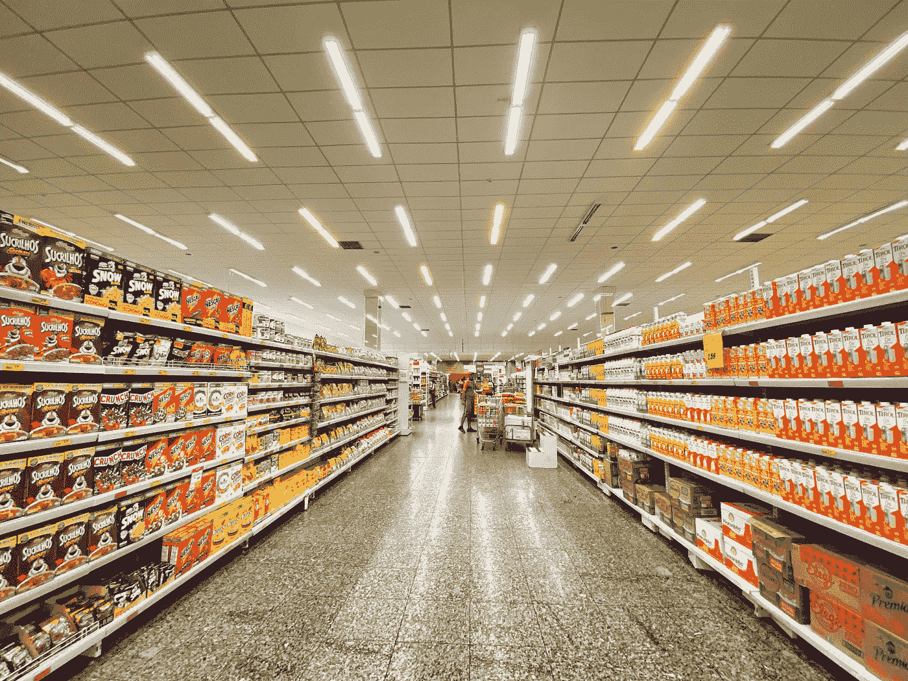
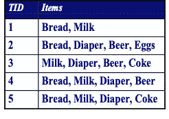
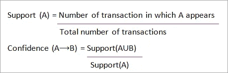
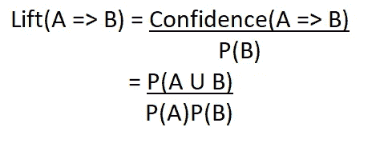

# 使用购物篮分析的产品推荐:实用指南

> 原文：<https://medium.com/codex/product-recommendation-using-market-basket-analysis-a-practical-guide-f1b76209b299?source=collection_archive---------2----------------------->



https://unsplash.com/photos/rWMIbqmOxrY

麦肯锡公司 2018 年的见解显示，消费者在**亚马逊**上购买的 35%和在**网飞**上观看的 75%来自产品推荐[【1】](https://www.mckinsey.com/industries/retail/our-insights/how-retailers-can-keep-up-with-consumers)——这是一个很大的比例，表明如果方法正确，推荐策略可以有多成功。产品推荐一直以来都是通过向客户提供感兴趣的相关产品来推动销售的绝佳方式。用于生成产品推荐的算法有很多种，但是，在本文中，我们的重点将是— **关联规则(购物篮分析)**。

# 什么是关联规则？

> 关联规则学习是一种基于规则的机器学习方法，用于发现大型数据库中变量之间的有趣关系— [*维基百科*](https://en.wikipedia.org/wiki/Association_rule_learning) 。

关联规则用于发现数据集中的频繁模式。这种技术被证明可以成功地分析交易数据，了解客户行为，然后用于增加销售。给定一个包含多个项目的交易记录，通过市场购物篮分析(MBA)的关联规则试图找到解释为什么某些项目经常一起购买的规则。

例如，凯伦·希斯在 1992 年发现啤酒和尿布之间有很强的相关性。希斯发现，购买尿布的顾客也更有可能购买啤酒。这一发现是一个很好的例子，表明如何使用关联规则轻松发现产品之间的大量隐藏相关性，从而最大限度地提高销售额。

# 流行的推荐策略

在我们进入 MBA 如何工作的细节之前，让我们对常见的产品推荐算法有一个概述:

1.  **热门产品推荐**:该算法根据给定商品的受欢迎程度向客户推荐商品。
2.  **内容过滤**:这种推荐算法试图根据行为(如评级)生成客户档案。它试图根据客户的活动模式为他们提供建议。
3.  **协同过滤**:通过收集其他类似客户的偏好或活动模式信息，向客户提出建议。
4.  **关联规则:**关联规则不同于其他方法，因为它试图回答一个问题——“*哪些项目频繁出现在一起*”。

# MBA 如何工作



图 1:示例事务数据库

给定一个商店的样本交易记录，如图 1 所示，其中包含以下产品:

={ *牛奶、面包、啤酒、尿布、可乐* }

*   **项目集**是产品列表中一个或多个项目的集合。

例如={ *牛奶、面包、尿布* }、{ *牛奶* }



*   **支持**被定义为包含一个项目集的事务的一部分。支持度越高，项目集出现的频率越高。给定一个项集**A**,**A**的支持度是**项集 A** 在事务记录总列表中出现的比率。

例如，使用图 1 中的表格，支持{ *牛奶、面包、尿布* } = > 2/5

*   **另一方面，置信度**是假定一个事务包含**项集 A** 时，该事务包含**项集 B** 的概率。

例如:

*Support _ count({ Bread })= 4*

*Support _ count({面包，尿布})=3*

因此 ***置信度=3/4***

*   **频繁模式**或**频繁项集**是支持度大于或等于所选最小支持度阈值的项集。例如，如果表(图 1)的最小支持度是 2，这意味着任何频率小于 2 的项目集都低于阈值，不会被选择。



*   最后，**升力**是对模型性能的测量。它有助于确定将一种产品与另一种产品结合是否会增加销售机会。

## 了解提升分数

*   如果**提升> 1** ，这意味着关联规则提高了胜负的几率。
*   如果**提升< 1** ，这意味着关联规则减少了期望结果的机会。
*   如果 **Lift = 1，**表示关联规则不影响结果。

# 一个使用 Python 的实践实验

在这一节中，我们将探索 Chris MOF fit[【3】](https://github.com/chris1610/pbpython/blob/master/notebooks/Market_Basket_Intro.ipynb)的 GitHub 笔记本入门，但是在深入研究代码之前，让我们先回顾一下运行时需求:

## 要求

**Python 版本:**Python 3

**Python 库:**

*pandas —* A 是一个快速、强大、灵活的数据分析和操作工具，
建立在 Python 编程语言之上。

*mlxtend —* 一个 Python 工具库，用于日常数据科学任务，如生成关联规则。

## 入门指南

现在我们知道了将要使用的工具，让我们安装库。

```
pip install pandas
pip install mlxtend
```

导入库:

```
**import** **pandas** **as** **pd**
**from** **mlxtend.frequent_patterns** **import** apriori
**from** **mlxtend.frequent_patterns** **import** association_rules
```

我们可以使用各种技术来生成频繁模式( ***FP Growth，ECLAT，Apriori*** )。对于这个例子，我们将坚持使用 Apriori(与其他方法相比，这是一种蛮力方法)。

接下来我们加载 [**数据集**](http://archive.ics.uci.edu/ml/machine-learning-databases/00352/Online%20Retail.xlsx) ，清理干净，为 MBA 准备数据。

```
df = pd.read_excel('http://archive.ics.uci.edu/ml/machine-learning-databases/00352/Online%20Retail.xlsx')#cleaning & prep
df['Description'] = df['Description'].str.strip()
df.dropna(axis=0, subset=['InvoiceNo'], inplace=**True**)
df['InvoiceNo'] = df['InvoiceNo'].astype('str')
df = df[~df['InvoiceNo'].str.contains('C')]#Filter data, fetch only data about France
basket **=** (df[df['Country'] **==**"France"]
          **.**groupby(['InvoiceNo', 'Description'])['Quantity']
          **.**sum()**.**unstack()**.**reset_index()**.**fillna(0)
          **.**set_index('InvoiceNo'))
```

上面的代码已经加载了一家英国零售店的交易数据(从 [*UCI 机器学习库*](https://archive.ics.uci.edu/ml/index.php) 中检索)。

要生成最低支持 o.o7 的频繁模式，我们可以运行下面的代码:

```
frequent_itemsets = apriori(basket_sets, min_support=0.07, use_colnames=**True**)
```

最后，我们可以基于应得的置信度、支持度和提升阈值来生成关联规则和过滤规则。

```
rules = association_rules(frequent_itemsets, metric="lift", min_threshold=1)
```

生成结果后，我们可以应用带有阈值的过滤器来选择具有更强提升或置信度值的规则:

*Lift=6*

*信心=0.8*

```
rules[ (rules['lift'] >= 6) &
       (rules['confidence'] >= 0.8) ]
```

生成的规则可以应用于商店记录，并用于产品放置和推荐。要更全面地了解代码实现及其结果，请查看笔记本中的完整代码。

# 参考

1.  麦肯锡(MacKenzie，I .)，迈耶(Meyer，c .)，& Noble，s .， [*零售商如何跟上消费者*](https://www.mckinsey.com/industries/retail/our-insights/how-retailers-can-keep-up-with-consumers) (2018)，麦肯锡&公司。[https://www . McKinsey . com/industries/retail/our-insights/how-retailers-can-keep-up-with-consumers](https://www.mckinsey.com/industries/retail/our-insights/how-retailers-can-keep-up-with-consumers)
2.  史蒂夫·斯沃耶，[啤酒和尿布:不可能的关联](https://tdwi.org/articles/2016/11/15/beer-and-diapers-impossible-correlation.aspx) (2016)，用智能转换数据。
3.  克里斯·莫菲特，[市场篮子分析介绍](https://github.com/chris1610/pbpython/blob/master/notebooks/Market_Basket_Intro.ipynb) (2016)，GitHub。