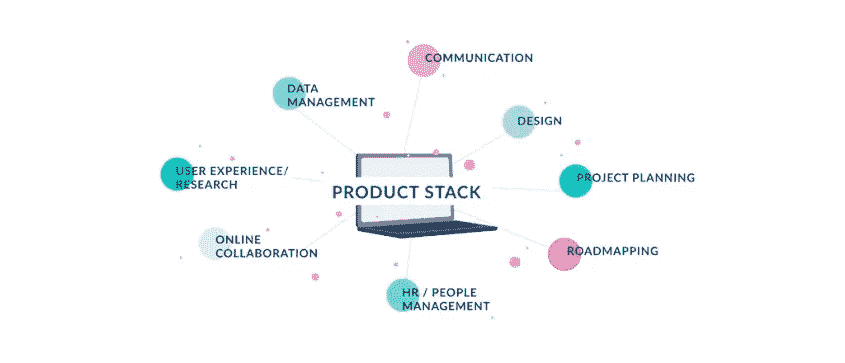
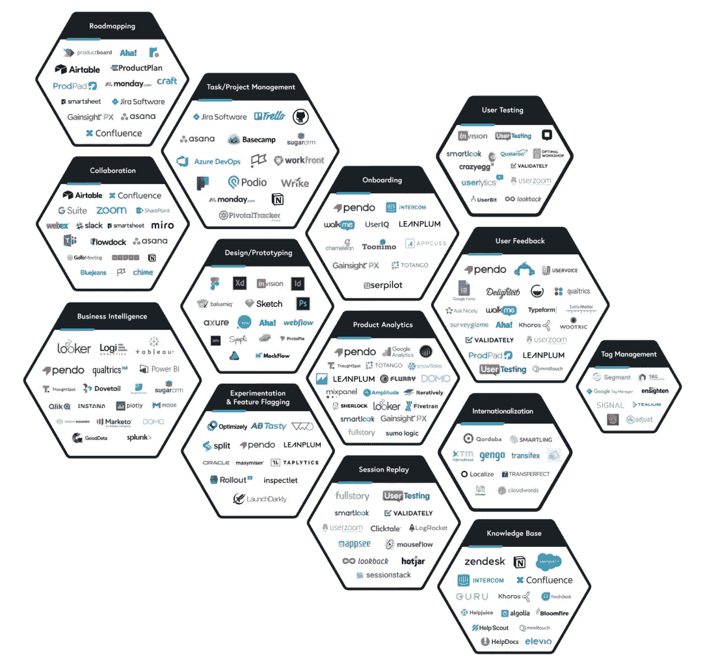

# 产品技术堆栈:了解您将使用的工具

> 原文：<https://medium.com/codex/product-tech-stack-know-the-tools-youll-be-working-with-41c54062dfb7?source=collection_archive---------3----------------------->

图片来自[产品学院](http://ProductSchool.com)

> 技术什么都不是。重要的是你对人们有信心，相信他们本质上是善良和聪明的，如果你给他们工具，他们会用它们做很棒的事情。—史蒂夫·乔布斯

在我的上一篇文章中，我写了在一个新的行业开始工作是多么令人难以承受，特别是对于那些来自非技术背景的人。我还提到的一件事是，有很多学习资源可用，就像我们今天有很多产品管理技术和工具一样，作为有抱负的项目经理，我们都同意的一件事是，在我们开始产品之旅时，事情会变得多么混乱。

这就是为什么当朋友和熟人问我‘佛罗伦萨，我想进入科技行业，我能做些什么’。我告诉他们“谷歌科技职业，广泛阅读这些职业，花一两天时间，然后我们可以谈谈”。现在不要误解我，事实上我不是一个“万事通”,我只是像大多数人一样即兴发挥，哈哈。

我告诉人们阅读这些东西的原因不仅是为了熟悉它们，而且是为了最终能够决定做什么。当我说“广泛阅读”时，我希望他们阅读这些职业中使用的工具/堆栈，因为无论他们决定在该职业中工作多长时间，他们都会使用这些工具/堆栈来完成工作。

# 产品堆栈

现在，当我们谈论产品管理中的工具时，我们谈论的是**产品经理用来执行向市场交付产品任务的技术和资源—** 其中一些任务包括任务管理、用户调查、文档、路线图、线框图等。这些工具统称为**产品堆栈**。

> 另一个有助于确保产品成功的重要因素是选择“正确的产品组合”。

图片来自 [productcraft](http://Productcraft.com)

那么有抱负的产品经理应该熟悉哪些工具呢？我们将它们分成几类，以帮助分类它们属于哪个方面。

1.  路线图:他们帮助向团队成员和利益相关者传达项目目标和策略。它们概述了产品的发展方向、优先级和进展。一些路线图工具包括:[产品计划](http://productplan.com) ( [产品计划](https://medium.com/u/7507333b8931?source=post_page-----41c54062dfb7--------------------------------))， [craft.io](http://craft.io) ，[roadmunk.com](http://roadmunk.com)， [Airfocus](https://airfocus.com) ，[啊哈！](https://aha.io)
2.  **任务管理**:用于分配任务、跟踪任务进度、协作和沟通。一些例子有[体式](http://asana.com)、[吉拉](https://www.atlassian.com/software/jira)、[点击数](https://clickup.com/)、[特雷罗](https://trello.com/)。
3.  用户研究/调查:他们帮助你从用户那里收集有用的量化反馈。一些例子有 [SurveyMonkey](http://surveymonkey.com) 、 [Typeform](https://www.typeform.com/surveys/) 、 [Google forms](https://www.google.com/forms/about/) 、Microsoft forms、 [Formstack](https://www.formstack.com/) 。
4.  **线框图&原型制作:**这些工具有助于将你的想法可视化并传达给你的团队成员。例子有[菲格玛](https://www.figma.com/)、[巴尔萨米克](https://balsamiq.com/)、[土坯 XD](https://www.adobe.com/la/products/xd.html) 、[异想天开](https://whimsical.com/)。
5.  **头脑风暴和流程图** : [米罗](http://miro.com)，[异想天开](http://whimsical.com)，[要求](http://requstory.com)是团队协作和头脑风暴的绝佳工具。他们还提供了大量的客户旅程图、思维导图、用户流等模板。
6.  **分析工具**:这些工具帮助你了解你的产品给用户带来了多少价值。它们还能帮助你发现问题，设定目标，做出明智的决定。其中一些工具包括 [Mixpanel](http://mixpanel.com/) 、 [Pendo](https://www.pendo.io/) 、 [Google analytics](https://analytics.google.com/analytics/web/) 、 [Heap](https://heap.io/) 。
7.  **团队消息**:跨职能团队使用 [Slack](http://slack.com) 、[微软团队](https://www.microsoft.com/microsoft-teams/group-chat-software)、 [Google Workspace](https://workspace.google.com/) 、 [Confluence](https://www.atlassian.com/software/confluence) 等工具进行日常沟通。
8.  **文档** : [结尾](https://coda.io)、[概念](https://www.notion.so/)、[谷歌文档](https://docs.google.com/)和[汇合](https://www.atlassian.com/software/confluence)是概述你的产品策略、产品规格、常见问题等的便捷工具。
9.  **演示/推介**:这些工具用于制作令人惊叹的幻灯片，帮助你向股东和投资者传达你的商业理念。一些例子是谷歌幻灯片、PowerPoint 演示文稿和[推介](http://pitch.com)

虽然这些并不是我们现有的所有 PM 工具，但它们是有抱负的 PM 学习如何使用它们并将它们添加到他们的技能集的良好起点。

> 产品管理是一个行业，在这个行业中，你会学到多种硬技能和软技能，同时与跨职能团队合作。

## 其他提示

轻松掌握如何使用这些工具的一个惊人的方法是将它们融入到你的日常活动中。我个人使用观念来记录我的产品之旅。我有一个页面用于工作申请跟踪、简历和求职信、日常任务、我的投资组合([https://bit.ly/FlorencePMPortfolio](https://bit.ly/FlorencePMPortfolio))等等。

我的想法板的截图

我还会推荐参加这些产品学校课程:

*   [产品分析微认证](https://productschool.teachable.com/p/productanalytics/?src=FreePMResources):本课程将帮助你了解产品分析的重要性以及如何使用 Mixpanel。
*   [选择您的产品技术组合](https://productschool.teachable.com/p/designing-your-product-tech-stack):本课程将帮助您了解您的技术需求，以及为您的产品选择正确工具的重要性等等。

当然，请查看令人惊叹的[product verse](https://productschool.com/productverse/)——产品管理工具的交互式可视化。我特别喜欢这种有趣和互动的方式。

我希望这对你有所帮助。也要记得按照自己的节奏走！

你可以通过 [Twitter](https://twitter.com/the_florencee) 和 [LinkedIn](http://linkedin.com/in/florence-ogunbore-a5a108227) 和我联系。