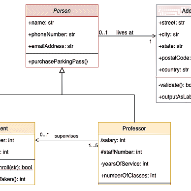
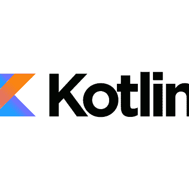

# 用 Kotlin 编程

> 原文：<https://medium.com/codex/programming-in-kotlin-934bdb3659cf?source=collection_archive---------3----------------------->

## 多范例编程语言

我认为 Kotlin 是一种非常优秀的语言，也是我最喜欢的语言。Kotlin 的创建是为了实现各种语言特性，受 Python 和 Java(显然)等其他语言的启发，并减少样板代码的数量以提高开发人员的生产率。科特林自称为:

> 让开发者更开心的现代编程语言。


马克·赖歇尔在 Unsplash[上的照片](https://unsplash.com?utm_source=medium&utm_medium=referral)

# 为什么要学科特林？

Kotlin 是一种由 Jetbrains 构建的不断发展的编程语言。他们在 2013 年开始开发，其第一个稳定版本是在 2016 年。后来，谷歌在 2019 年从 Java 转向 Kotlin，作为其 Android 应用程序的首选编程语言。

如果你是一个有经验的程序员，你会发现 Kotlin 使用了很多你可能在其他语言中见过的语言特性。这包括:

1.  JavaScript 的函数式编程。
2.  来自 Java 的面向对象编程。
3.  来自哈斯克尔的懒惰。
4.  各种各样的特性，比如来自 Python 或 PHP 的字符串模板。

# 科特林 vs Java

直接比较两种编程语言从来都不是一个好主意。但是讨论 Kotlin 带来的改进和它的缺点并没有坏处。

## 丰富

1.  在 Java 中，要编写一个简单的 Hello World 程序，你必须创建一个类和一个长的 main 方法。当然，大部分已经自动化了；然而，更少的代码等同于更好的可维护性。
2.  空安全 —在 Java 中，所有对象都允许为空。当像 C 和 C++这样的语言出现时，这是一个很大的错误。然而，Kotlin 对可空性有严格的要求。只有当您希望对象为空时，才可以允许它为空。
3.  **函数式编程—** 在最近的开发中，Java 已经改进到支持*一些*函数式编程支持。但是 Kotlin 在这种情况下已经超越了 Java。Kotlin 内置了对函数式编程的支持，这使得它变得无缝。
4.  **精简的样板文件—**`data class`的引入是将一个 50 行的 POJO (Plain Old Java Object)类转换成几个 5 行的主要改进。

## 缺点

1.  **缓慢的编译—** 由于 Kotlin 提供了广泛的特性，编译起来比同等的 Java 程序要花更长的时间。
2.  **检查异常—** Kotlin 不支持使用检查异常。即使您执行基本的 I/O 操作，您的 Kotlin 代码也将在没有 try-catch(-finally)块的情况下编译。
3.  **复杂语言—** 我过去有机会教科特林语，根据我的经验，科特林语是**一种不容易学的语言**。那些有 Python 和 Java 等其他语言经验的人可以有效地适应这一点。然而，一个没有编程经验的初学者需要更多的时间来理解 Kotlin 提供的一切。

一个有趣的事实和笑话:Kotlin 是一种自己编写的语言！Kotlin 的创建者非常讨厌 Java，以至于一旦他们发布了稳定版，他们就把代码移植到 Kotlin 上。😀

# 用于 Android 开发的 Kotlin

2019 年，谷歌宣布他们正在将首选语言转向 Kotlin。在这一转变之后，已经有了许多改进，如果 Java 仍然是他们的官方语言，这些改进就不一定会发生。

1.  **协同程序** — Java 开发人员在维护需要并发的 Android 代码时遇到了许多问题。因为在 UI 线程上运行后台任务会引发异常，所以它们必须依赖于像`Handler`和`AsyncTask`这样的类。Kotlin 开发人员抛弃了多线程的想法，使用协程来执行相同的任务。**协程是轻量级进程，在相似或不同的线程中悬浮运行**。
2.  **Jetpack Compose**——多年来，Android 依赖一种标记语言 XML 来编写应用程序的前端。Jetpack Compose 现已正式稳定，它是在 Android 中创建 UI 的首选方式，利用了 Kotlin 的强大功能。

# 结论

Kotlin 是一种不断发展的语言，每次更新都有改进。它是一种功能强大的语言，可以提高开发人员的工作效率。看到这种语言的瑰宝在今天获得认可和受欢迎是令人惊讶的。

这篇文章是我在 Medium 上的“Kotlin 编程课程”的第一篇文章。它与我的另一个阅读列表“Kotlin 的一切”是分开的，后者更倾向于 Kotlin 的高级编程特性。


[尼尚·安贾尼·贾兰](/@cybercoder.naj?source=post_page-----934bdb3659cf--------------------------------)

## 科特林编程课程

[View list](/@cybercoder.naj/list/kotlin-programming-course-86768cb5ed32?source=post_page-----934bdb3659cf--------------------------------)3 stories

[尼尚·安贾尼·贾兰](/@cybercoder.naj?source=post_page-----934bdb3659cf--------------------------------)

## 一切科特林

[View list](/@cybercoder.naj/list/everything-kotlin-fc4d61a1a661?source=post_page-----934bdb3659cf--------------------------------)19 stories

我希望你喜欢读我的文章，并学到了一些东西。谢谢大家！✌️

```
**Want to connect?**My [GitHub](https://github.com/cybercoder-naj) profile.
My [Portfolio](https://cybercoder-naj.github.io) website.
```