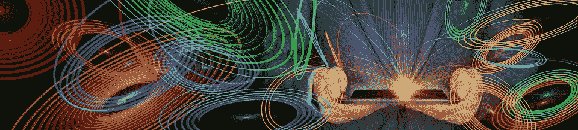

# 编程是思想的具体化

> 原文：<https://medium.com/codex/programming-is-the-materialization-of-ideas-2721916fbec3?source=collection_archive---------9----------------------->

插图作者:[杰拉尔特](https://pixabay.com/de/tablet-computer-hand-schreiben-3711135/)

**摘要**

本文介绍了 RPSE，**具体化作为软件工程的一种范式**，并列举了该范式发展和应用中最重要的理论和实践问题。

**1。基本定义**

在阐述本文的主题之前，有必要对主要术语的含义达成一致。

**1.1。软件工程**

我们将使用 IEEE 字典[1]中对软件工程的经典定义:“软件工程是对软件的开发、操作和维护的系统的、有纪律的、可量化的方法的应用”。

**1.2。范例**

对于术语**范式** *，*我们将依赖托马斯·库恩的经典定义[2]。根据库恩的观点，范式是一组概念、普遍认可的规则、模型和解决某一科学领域问题的方法。

这个概念的双重性在于一边是接受某种范式的专家群体。另一方面，接受某种范式意味着专家加入这样的社区。

托马斯·库恩在其著作《科学范式》中认为。然而，这一概念的有用性很快就体现在技术和社会生活的不同领域。许多关于范例及其影响的出版物开始出现在关于汽车工业、城市规划、某些疾病的治疗等的专业和流行文献中。

软件工程，尤其是它的重要部分编程，也不例外。现在有许多相互竞争的编程范例。维基百科[3]专门有一篇文章对它们进行了概述；还有一些有趣的评论，如[4]。所涵盖的范例只关注软件工程的一个部分，即用一种或另一种编程语言编写程序。每个专业的软件工程师都知道，大多数真正的软件项目不能只用一种范例来执行(例如，函数式编程)。

相反，本文中描述的范例适用于软件工程的所有领域。

一些论文，例如[5]，称范例为软件项目管理的不同方法，例如，瀑布模型或敏捷模型。在我看来，这些方法作为库恩定义精神中的范例是不可接受的，因为它们理论上相对简单，并且在多年存在后缺乏广泛有用的理论基础。(本文提出的范式还没有自己成熟的理论基础。然而，建立这一基础的方法今天已经可以看到了)。

**1.3。具体化**

我们在本文中使用术语“**具体化**”作为计算机科学中具体化的经典定义的扩展:“具体化是将关于计算机程序的抽象概念转化为用编程语言创建的显式数据模型或其他对象的过程”[6]。

更详细地考虑从抽象(理想)到具体(物质)的过渡过程。

在我们接触到的最早的哲学小册子中，已经习惯于把物质与理想对立起来。我们最多能感觉到(或者认为我们感觉到)理想的物体，也就是观念。这种对理想物体的感觉的指标可以是在听了一段音乐、读了一本书的一个片段等之后情绪或思维过程的变化。

试图把我们对理想的理解公式化并不会导致成功。即使是一些实际的想法，比如房屋周围的小修小补，或者准备一道熟悉菜肴的新变种，一开始也很难形成。只有在思考或试图向另一个人解释之后，这个想法才会获得越来越清晰的“轮廓”。

现在让我们从对理想概念的考虑转向对物质的考虑。我们可以感知和记录周围的物质，定性地辨别它们的属性。许多物体的性质是可以测量的。我们也可以客观地识别物质对象的层次和其他结构。要记录或测量一个对象的属性，甚至不需要有一个对象。有它的模型就够了。此外，在许多实际情况下，该模型可以在没有对象的情况下使用。模型可以和其他人讨论。人们可以根据模型进行协商。模型可以标准化(形式化)。

在人类活动的一些领域中，模型的标准化已经发展到由不同的人或自动机从标准化模型(例如，技术绘图)制作的物理对象(例如，螺栓)彼此难以区分。

鉴于所提出的定义相对不准确，我将把我们的内在和外在世界 U 的现象世界分成两部分:

U = M + I，

其中集合 M 由可以客观记录或测量的现象(物质世界)组成，I 是其他一切。

这个公式是否适用于周围世界的所有现象，这是一个公开的哲学问题。在本文中，我们将把这个公式缩小到软件工程领域。

创建或更新某个软件系统的每个过程都始于发明者、客户或开发人员头脑中关于未来系统或其组成部分的一些想法的出现。我们称这些想法为**心理模型**。

对于简单的系统或大型系统的简单扩展或更新，开发人员立即根据他或她的心智模型编写代码或配置系统。然而，在大多数情况下，人们创建和使用各种中间模型，从简单的需求列表到广泛的正式模型，如 UML 或 BPMN 模型。

因此，创建或更新软件系统的过程可以表示为一连串的精神和物质模型:

I1，I2，..在 M2 的 M1，..毫米

**2。其他领域的具体化**

很明显，上面的定义并不是全新的，并且在智力工作的邻近编程工程领域中被广泛使用，无论是有意识的还是无意识的。考虑两个这样的领域，机械工程和数学。

这两个领域早就有效地使用了物化。他们有编程工程可以学习的东西。

在机械工程中，我们看到一个完整的具体化循环，从设计师大脑中一个想法的出现，到其细节，映射到模型，最后是材料的构建。

机械工程中的具体化实际上以实物而不是形式模型的创造而告终。

数学中的情况是不同的(见亚历山大·鲍罗维克的书“显微镜下的数学”[7]第 7.3 段对此主题的有趣注释)。数学的“最终产品”是一个具有严格证明的性质的形式模型。

数学使用大量非常抽象的模型。

相反，机械工程使用相对较少的抽象模型，而是更具体的模型，例如用于 CNC 机器的模型，其允许生产物理对象。

从这个角度来说，编程居于中间。编程的最终产品是程序代码。此外，虽然程序代码在硬件上启动，但其特定的物理对象(电信号)很难与螺母、齿轮和车身相比较。另一方面，程序代码接近数学公式；有时存在直接映射。然而，在任何真正的软件系统中，你都需要考虑环境的许多具体方面以及与用户或其他系统的交互。这使得程序代码比数学公式更具体。

因此，看看这三个相邻的领域，人们可以从它们的模型的抽象性与具体性的角度来谈论排序:

数学公式< =程序代码< =机械工程模型。

**2.1。在使用模型方面，软件工程可以从邻近地区学到什么？**

让我们首先考虑数学。

在数千年的发展过程中，数学学会了从不同的角度，用非常不同的术语来描述现实或想象世界中的相同现象。古希腊人学会了用几何图形代替纯粹的文字问题表述，从而解决实际中的重要问题。后来对平面上的线和数字的互换性有了理解。然后，代数变量的概念和几何问题到代数方程组的简化就具体化了。

数学不仅学会了借助数学性质截然不同的模型来描述真实或想象的物体和过程。数学的一个重要成就是能够确定来自数学不同领域的模型的相似程度，并且能够将它们相互转化。近年来，许多对最重要的数学问题的突破性解决方案是一系列独立的证明，每一个都使用了来自一个特殊数学领域的特殊设备。

在编程中，通过编译程序的源代码和从 DSL(领域特定语言)或元数据生成代码，现在发生了类似的事情。然而，在软件工程中使用各种模型类型的文化远远落后于数学文化。

软件工程在具体化方面能从机械工程中学到什么？

在机械行业中，有一系列协调的准正式和正式模型，它们以模型结束，基于这些模型制造和安装物理对象。对于大多数类型的中间模型都是验证其有效性的正式方法。在工程产品的设计和制造中，模型是具有不同特征的专家的主要交流语言。

里面的情况看起来要糟糕得多。只有在非常大的企业中，才存在模型和过程的集合。小公司和 IT 创业公司通常不仅没有开发出正式的模型和流程，而且甚至不怀疑它们的存在。这种情况源于

*   大型企业之外的正式模型不够普及
*   开发人员尤其是管理人员的教育存在不足
*   大学教育和软件工程的实际需求之间的差距。

**3。RPSE 的定义**

我们已经定义了所有必要的术语来给出所提出的范例的基本定义:

**软件工程是通过将心智模型转换成在计算机上执行的代码而实现的具体化(思想的具体化)**。(注意，虽然范式的主要和更详细的定义谈到了模型链的构造，但范式被称为具体化而不是建模。这是因为这些链条的本质是它们变得不那么抽象，越来越具体。)

在提议的范例中:

1.  软件工程的所有基本过程都是构建精神和物质模型链的过程的具体变体(实现) *I1，I2，..在 M2 的 M1，..Mm* 。通常，这个链中最后一个最具体的模型是程序代码。
2.  软件工程的本质就是构建这样的链条。
3.  优化开发、成本和质量的所有主要问题都可以归结为相应模型链的优化构建。

上述定义在软件工程的不同领域有所不同。

只有在极少数情况下，开发人员在一开始就有一个如何解决问题的完整、清晰的计划。在大多数真实的项目中，解决方案的寻找和实现是共存的，并行发展，相互影响。心智模型、代码和中间模型(文本、图像和 UML 之类的正式模型)一起成长和变化，相互影响。

很多时候，几个人同时处理一个问题。他们每个人都有自己的心智模型，也许还有中间模型和代码片段。

通常，某些编程语言中的代码实际上并不存在，解决方案简化为配置器或生成器的托管掩码。

最后，计算设备近年来有了显著的发展。早期的处理器芯片位于台式机、笔记本电脑和服务器机架内的主板上。现在手机、游戏机、监控摄像头、智能家电等内部都有各种芯片。

我们的 RPSE 定义适用于上面列出的所有领域。

**4。RPSE 的轮廓**

有可能更精确地勾勒出 RPSE 范式的轮廓吗？下一步是试图概述它所影响的现象的主要类别。

记住库恩的定义，我们需要列出引入和使用范式的模型类型。

RPSE 模型可分为三大类:

*   心理模型
*   作为可执行代码模型的编程语言代码或其等价物。
*   中间模型

在这个三元组中，最少被研究的是心智模型。它们到底是什么意思？
**心智模型**是一个术语，指的是存在于客户、程序员和软件工程过程中其他参与者头脑中的想法。这种模型的存在是无可争议的，程序员可以自己注册。在现代技术发展水平下，这些模型无法用仪器很好地测量。

提取和测量这种有效模型的一种间接方法是采访想法持有人。显然，面试的过程极大地影响了心智模型本身。我们每个人可能都经历过这样的情况，当试图为同事制定一个问题时，会导致“启发”，通常是问题的解决。

基于正确制定的问题，访谈允许客观地构建不同复杂性的模型。最常见的此类模型有:

*   具有二进制、枚举、数字、字符串和其他元素的集合或列表，
*   图表
*   行为定义的形式模型(例如有限状态机)
*   半形式化行为模型

这些模型是心智模型的反映。他们与真实心智模型的接近程度应该由心理学或教育学理论来处理。不幸的是，作者不知道这方面有什么严肃的工作。这并不意味着这样的工作不存在。

**5。为什么软件工程需要横切范式？**

像 RPSE 这样的横切范例为软件工程过程的参与者提供了机会:

*   流程中的所有参与者有机会使用相同的术语。
*   基于明确定义的模型，系统地构建用于创建新软件的端到端过程的能力。
*   客观评估软件工程过程的中间结果并管理它的能力。

**6。范式发展的主要任务**

**6.1。理论问题**

正如库恩的书[2]中所提到的，在大多数情况下，科学家在现有范例的潜在解决方案的环境中从事问题的解决，很少从事不太清楚如何接近它们的工作。然而，这些是我们的任务，主要是:

1.  心理模型概念的结构性定义。
2.  为评估模型的抽象程度(理想性)和具体性(具体性)找到建设性的标准。
3.  寻找选择候选中间模型和附加模型的标准。
4.  选择和开发用于比较不同类型模型的标准和方法，包括它们的直接和反向追踪。
5.  开发模型自动化和自动转换的方法。

**6.2。实际任务**

除了开发所述范例的理论任务之外，为了引入 RPSE，有必要解决至少以下实际问题:

1.  创建工具用于:

*   心理模型的提取
*   将心智模型自动转换为编程语言中的中间模型或代码。
*   通过模型转换跟踪和监控模型内容的本质变化。

2.撰写必要的技术、教育文献和教学材料。

3.组织专业常设论坛和定期 RPSE 会议。

7 .**。结论**

本文试图将软件工程的 RPSE 范式定义为具体化(思想的物化)。“定义”这个词在这里不是偶然使用的。事实上，IT 项目的参与者长期从事模型的创建、转换和使用(很可能是下意识的)。

从库恩定义的严格意义上来说，所描述的方法没有权利被称为范例，因为它没有一个庞大的群体来支持它，也没有一个相互关联的模型的发达系统。然而，通过解决本文第 6 段中列出的任务，有希望实现这一目标。

这篇文章的基本观点首先发表在[这里](https://arxiv.org/abs/1810.01904)。

**参考文献**

1.  IEEE 软件工程术语标准词汇表，IEEE 标准 610.12–1990，1990。
2.  科学革命的结构。第三版。伊利诺伊州芝加哥:芝加哥大学出版社，1996 年。
3.  编程范例:[https://en.wikipedia.org/wiki/Programming_paradigm](https://en.wikipedia.org/wiki/Programming_paradigm)(状态— 27.08.2018)
4.  Peter A. Henning，Holger Vogelsang Taschenbuch Programmiersprachen。卡尔·汉瑟出版社两合公司；奥弗拉格:2。，neu bearbeitete (5。2007 年 9 月)。ISBN-13:978–3446407442。
5.  软件工程范例和模型信息技术论文[https://www . uni assignment . com/Essay-samples/Information-Technology/software-Engineering-](https://www.uniassignment.com/essay-samples/information-technology/software-engineering-)paradigms-and-models-information-technology-essay.php(state—27 . 08 . 2018)
6.  具体化(计算机科学)[https://en . Wikipedia . org/wiki/Reification _(计算机科学)](https://en.wikipedia.org/wiki/Reification_(computer_science))(状态— 27.08.2018)
7.  亚历山大·鲍罗维克。显微镜下的数学:数学实践的认知方面笔记。美国数学学会。ISBN-13:978–0821847619。