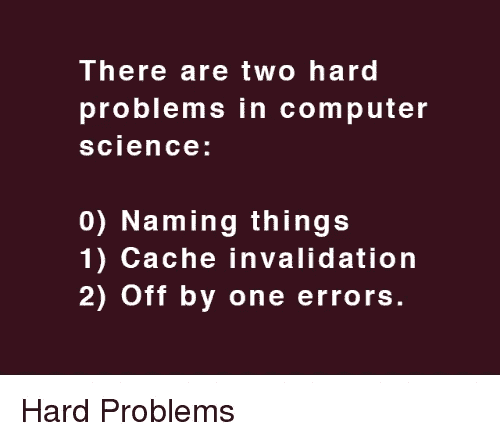

# 编程:命名事物的艺术

> 原文：<https://medium.com/codex/programming-the-art-of-naming-things-57667fe9bf47?source=collection_archive---------4----------------------->

我每天复习很多代码。**大多数程序员都不擅长命名，甚至对一些高年级学生也是如此。**

> 看完这篇文章，给东西命名对你来说就不再是问题了。我是…