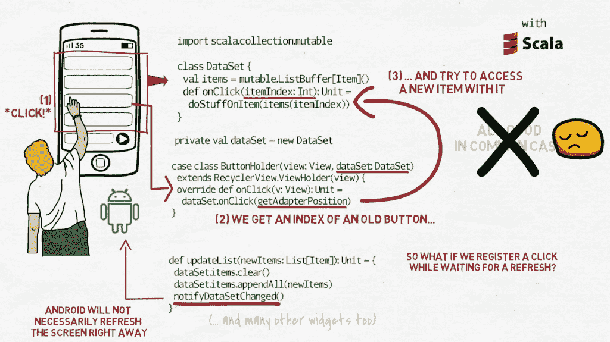
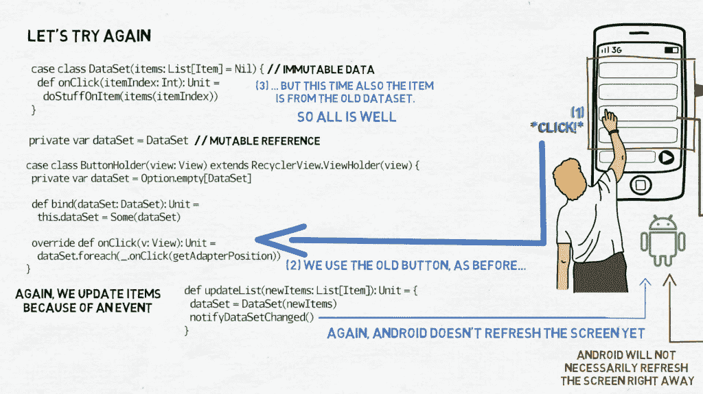
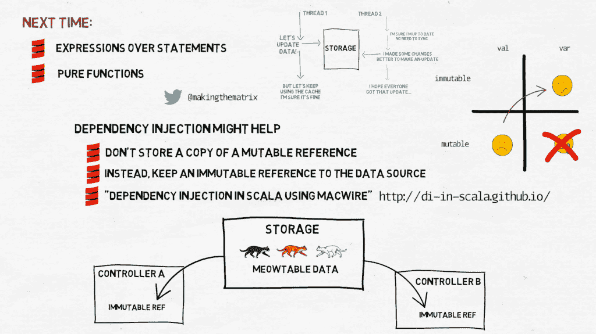

# 函数编程#6 —线程安全

> 原文：<https://medium.com/codex/programming-with-functions-6-thread-safety-7a5e1b361c8e?source=collection_archive---------12----------------------->

## [法典](http://medium.com/codex)

不可变性如何帮助线程安全的简单答案是— [基本上与懒惰](https://makingthematrix.medium.com/programming-with-functions-5-immutability-41611bb7a044)相同。如果数据没有改变，这意味着任何数量的线程都可以在任何时候访问它，并且它们不会互相干扰。但是当然，运行一个程序的全部意义在于，我们想要用数据做一些事情，而不仅仅是读取数据。程序运行的数据必须在某个时间点发生变化，因此如果程序运行在两个或更多线程上，这些线程可以访问数据并得到不同的结果。这里没有灵丹妙药。函数式编程不会将您从所有源于可变数据共享访问的错误中解救出来。但是会有帮助的。

举个例子，我们来讨论一些我在 Android 平台工作时经常看到的事情。显示元素——一排排带有标题的按钮、带有图片的磁贴等。—通过“适配器”完成。适配器根据来自某个数据源的数据，保存一个外部提供给它的项目列表。当数据改变时，元素列表被更新，适配器被提示刷新并显示根据新的项目列表创建的元素。使用可变集合的适配器代码的简化版本如下所示:

```
import scala.collection.mutableclass DataSet {
  val items = mutable.ListBuffer[Item]()
  def onClick(itemIndex: Int): Unit = 
    doStuffOnItem(items(itemIndex))
}private val dataSet = new DataSetdef updateList(newItems: List[Item]): Unit = {
  dataSet.items.clear()
  dataSet.items.appendAll(newItems)
  notifyDataSetChanged()
}case class ButtonHolder(view: View, dataSet: DataSet)
  extends RecyclerView.ViewHolder(view) {
  override def onClick(v: View): Unit = 
    dataSet.onClick(getAdapterPosition)
}
```

我们有一个类，比如说`DataSet`，它保存了一个可变的`ListBuffer`项，然后我们有一个方法`onClick`，它获取该项的索引，然后我们对该项进行处理。然后我们在这里创建一个数据集作为`val` —不可变的。然后我们有一个方法`updateList`，它从外部获得一个新的项目列表，然后我们将数据集中的项目更改为这些新项目，我们`notifyDataSetChanged()`(Android 使用该方法来刷新屏幕)。然后对于每一项，我们有`case class ButtonHolder`，它获取显示按钮的视图，并获取数据集，当用户单击屏幕上的按钮时，这个`onClick`方法被调用，然后这个`onClick`方法用`getAdapterPosition`调用`DataSet.onClick`——即按钮在按钮列表中的位置。



让我们假设当用户点击(或“点击”屏幕上的一个显示按钮)时，调用`ButtonHolder.onClick`方法。按钮持有者知道它在适配器中的位置，该位置对应于用来创建和显示给定元素的项目的索引。我们不想在`ButtonHolder`中有太多的逻辑，所以我们只是在数据集中调用`onClick`方法，赋予它按钮的位置。现在，请注意按钮持有人在构造函数中获得了对数据集的引用，然后在数据集内我们有了一个`mutable.ListBuffer`。

在一般情况下，它工作得很好。适配器在`updateList`方法中接收新项目列表，旧列表被清除，其内容被新项目替换，然后`notifyDataSetChanged()`被调用——这是来自 Android SDK 的一个方法，使用项目来创建和显示按钮。每个按钮都是从一个项目创建的，当它被点击时，我们可以访问相应的项目并做一些事情。

问题是，n `otifyDataSetChanged()`只通知 Android 数据集发生变化(d'oh)。然后，Android 被允许在它认为合适的时候刷新屏幕——不一定是马上。那么，如果我们同时注册了一次点击，会发生什么呢？我们在屏幕上仍然有旧的按钮座。它将接收点击，然后用它原来的位置调用`DataSet.onClick`。但是数据集中的数据已经不同了，新的位置可能指向与我们期望的不同的项目，或者它可能根本不指向任何东西。我们不能让它发生。方法是将分配给`val`的数据集中的可变集合替换为分配给`var`的数据集中的不可变集合。

```
case class DataSet(items: List[Item] = Nil) {
  def onClick(itemIndex: Int): Unit = 
    doStuffOnItem(items(itemIndex))
}private var dataSet = DataSetdef updateList(newItems: List[Item]): Unit = {
  dataSet = DataSet(newItems)
  notifyDataSetChanged()
}case class ButtonHolder(view: View) extends RecyclerView.ViewHolder(view) {
  private var dataSet = Option.empty[DataSet] def bind(dataSet: DataSet): Unit = 
    this.dataSet = Some(dataSet)

  override def onClick(v: View): Unit = 
    dataSet.foreach(_.onClick(getAdapterPosition))
}
```

所以现在我们又有了 case 类`DataSet`,它接受一个项目列表。然后我们有了`onClick`方法，和之前的那个很像。这里我们有一个数据集，它是一个变量，在`updateList`中，当我们获取新项目列表时，我们用包含新项目的新数据集替换该数据集。然后我们叫`notifyDataSetChanged()`。在`case class ButtonHolder`中，我们现在有了一个`var dataSet`，我们将它绑定到——bind 也是 Android 使用的一个方法——然后我们有了调用`DataSet.onClick`方法的 onClick 方法，假设数据集已经“绑定”到按钮座。



现在，当一个按钮持有者接收到一个点击，并把它和它的位置一起传递给`DataSet.onClick`时，我们可以确定我们将操作用于创建按钮的同一个数据集。项目列表保持不变，直到 Android 实际决定刷新所有内容，然后它将使用 bind 方法来替换数据集——但此时，按钮在适配器中的位置也会改变，或者整个按钮将被重新创建。

注意，它并不能解决我们所有的问题(毕竟我们不是在快乐的左上角，而是在不知何故的“meh”右上角)。例如，有可能两个线程同时处理更新，其中一个更新很快会被另一个更新所取代，我们可能会以不一致而告终。另一个线程将假设结果与它所计算的一样，也许以后会尝试访问一个不存在的元素。有许多事情可以尝试，但是这是一个相当高级的话题，超出了本系列的范围。

最后一个提示:尽量总是使用原始数据源。不要在缓存中存储可变引用的副本——当原始引用发生变化时，您的副本将会过时。相反，保持对封装数据并控制其变化的实体的不可变引用，并在需要数据时访问它。一种方法是在代码中引入依赖注入。你可以在软件工厂的网站上了解更多信息。他们也有自己的 DI 框架，叫做 [macwire](https://github.com/softwaremill/macwire) ，我们在工作中使用它，我对此非常满意。

在某种程度上，这种方法间接地促进了拥有单一真理来源的想法。对于程序中的每个数据集，应该只有一个保存它的地方，并且应该有一个统一的方法来访问和更新它。没有重复，没有角落案件偷偷摸摸的黑客。内存缓存——是的，但前提是从外部看不到它们。如果另一段代码想要从数据源中检索一个元素，它不应该知道或者甚至不应该关心该元素是否来自缓存。



哦，还有最后一个提示:永远不要使用分配给`var`的可变集合。如果你觉得不得不使用它，那只能说明代码有可怕的错误。

这就是我为你准备的关于线程安全的全部内容。在下一个视频中，我们将讨论一些表达式和纯函数的概念。感谢观看。如果你有任何问题或者因为其他原因想联系我，你可以在下面留言。或者你也可以在推特上找到我。

下次见。

先前:[用函数#5 编程:不变性](https://makingthematrix.medium.com/programming-with-functions-5-immutability-41611bb7a044)

顺便说一下，如果你有兴趣在 Android 上编写 Scala…[https://makthematrix . WordPress . com/2021/03/17/Scala-on-Android/](https://makingthematrix.wordpress.com/2021/03/17/scala-on-android/)