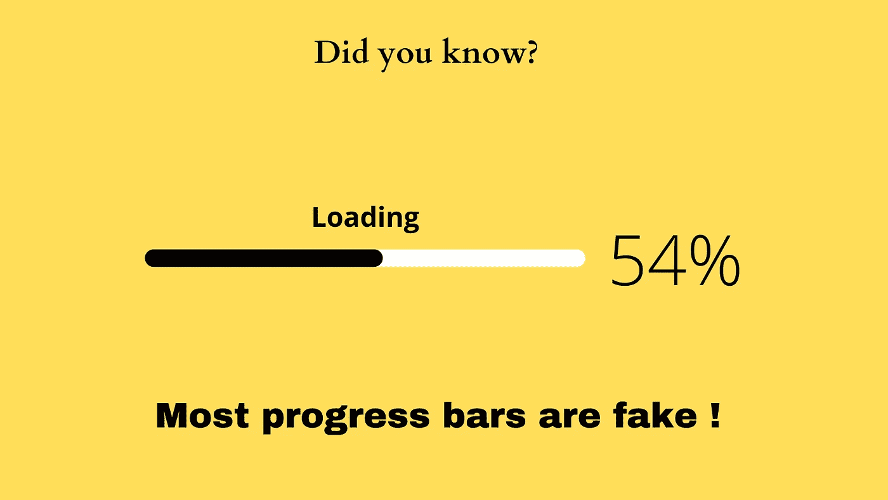

# 进度条和电梯关闭按钮是世纪骗局

> 原文：<https://medium.com/codex/progress-bars-and-elevator-close-button-are-the-scam-of-the-century-7fb268b3be13?source=collection_archive---------35----------------------->



作者使用 Canva 创建的图像

想象一下-

你很匆忙。你走进电梯，尽快离开办公室。

一旦你进去了，你就开始疯狂地按电梯里的‘关门’按钮。

一旦门关上，电梯开始下降，你会感到安慰。

但事实是，电梯里的‘关门’按钮是假的！门会在几秒钟后关闭，没有例外。

电梯按钮只是用来欺骗你，让你相信你有能力比平常更快地关门。这样，你就不会那么焦躁不安了！

同样，当你在一个应用程序中加载一些东西，而应用程序显示一个进度条时——通常情况下，这是假的。

大多数进度条不会显示实际进度。它只是每秒或每隔一秒前进 10%或 15%,并在 95%或 98%的水平停止，直到东西被加载。

为什么？这有助于您相信系统没有停止响应。心理上，你保持放松，认为系统在工作。

现在假设没有任何进度条——只有一个基本的加载图标。过一段时间，你不会觉得不安分吗？因为你不知道已经加载了多少百分比。

电梯按钮和进度条就是我们所说的‘善意的欺骗’。

下面是一个使用 JQuery 的假进度条的示例代码

```
<div class=”progress progress-xlarge progress-striped active”>
 <div class=”progress-bar progress-bar-danger” role=”progressbar” aria-valuenow=”0" aria-valuemin=”0" aria-valuemax=”100" style=”width: 90%;”></div>
</div>
<script>
 var t = setInterval(function(){
 var num = parseInt($(“.progress .progress-bar”).css(“width”));
 if(num < 100) $(“.progress .progress-bar”).css(“width”, (num+1)+”%”);
 else clearInterval(t);
 }, 250);
</script>
```

最初发布在我的 LinkedIn 个人资料上

在 LinkedIn 上关注我—[https://www.linkedin.com/in/agrawalmanoj2002/](https://www.linkedin.com/in/agrawalmanoj2002/)