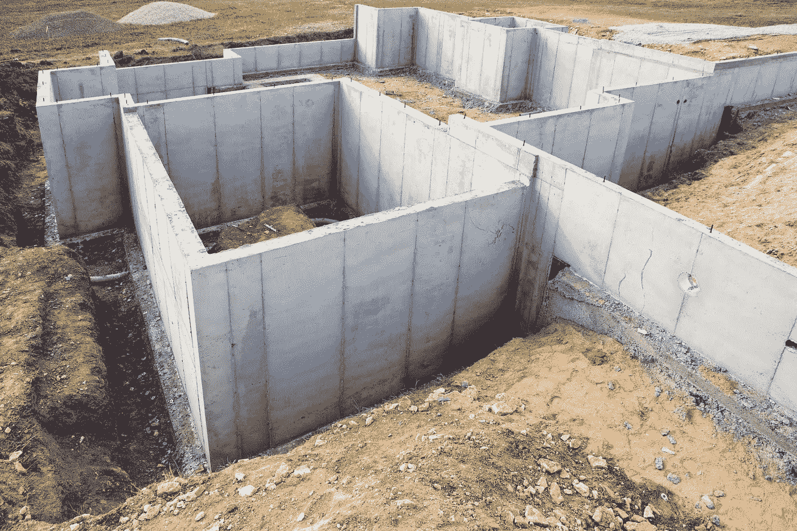

# 渐进增强第 3 部分，在布局之前获得一个可靠的基线。

> 原文：<https://medium.com/codex/progressive-enhancement-part-3-getting-a-solid-baseline-before-layout-d6dfd1c87ae5?source=collection_archive---------3----------------------->

没有坚实的基础，再好的结构也毫无意义。

在我以前的文章中，我描述了什么是[渐进式增强显示文本初稿](https://deathshadow.medium.com/progressive-enhancement-accessible-web-design-on-a-silver-platter-241ab262284b)，然后我继续[并在语义上标记该内容](https://deathshadow.medium.com/progressive-enhancement-part-2-semantic-markup-e61dcea0ec25)。这一次，我们将整理我们的最终细节，加载字体，在一些标准布局技术需要的地方添加一些 DIV，添加一些类和 ID，然后应用重置。