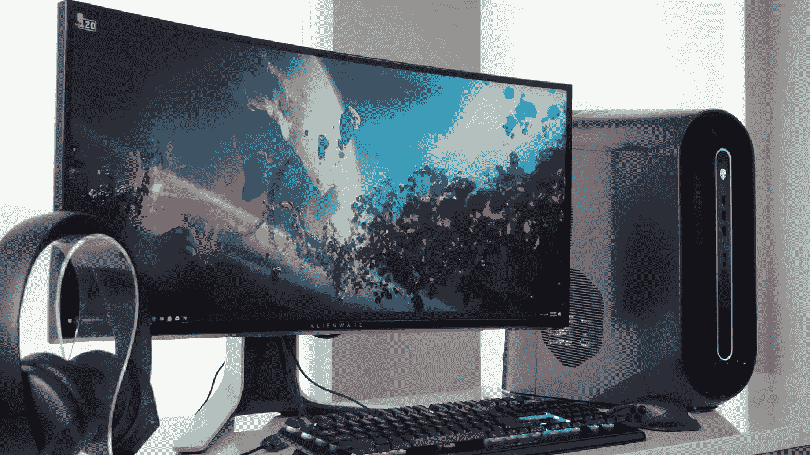

# 渐进增强第 4 部分，首先是桌面布局

> 原文：<https://medium.com/codex/progressive-enhancement-part-4-desktop-layout-first-125f546eaa41?source=collection_archive---------5----------------------->

随着我们之前的不幸在标记和重置中放置了大量的样式挂钩，我们现在可以继续我们的基线屏幕布局了。

你会听到很多关于“移动优先”设计的讨论，坦率地说，我觉得这是一派胡言。哪个可能性更大？您的最小公分母将是不支持媒体的台式机用户…