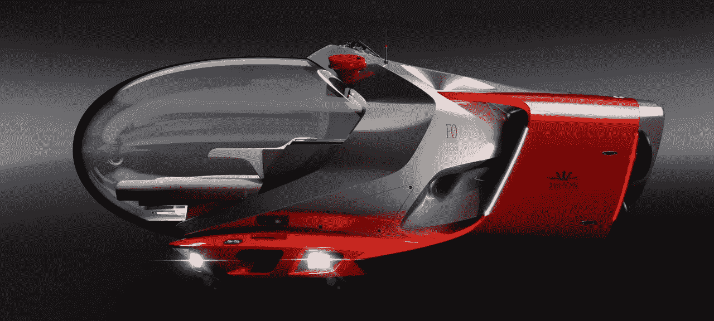

# 大力神计划:一种新型豪华潜水器

> 原文：<https://medium.com/codex/project-hercules-a-new-type-of-luxury-submersible-d281f0e5fcc0?source=collection_archive---------13----------------------->

## 速度与宽敞相结合

[大力神(海卫一潜艇媒体)](https://tritonsubs.com/wp-content/uploads/Project-Hercules-2-%C2%A9EOI-DOD-e1663784644478.png)

海卫一潜艇公司和 Espen ino 国际公司已经合作创建了[项目大力神](https://tritonsubs.com/subs/projecthercules/)，这是首个同类豪华潜水器。通过重新想象他们如何使用正在申请专利的 AVA(高级多功能丙烯酸树脂)船体，EOI 和 Triton 潜艇公司的设计伙伴 Dark Ocean DeepSea 的设计师将舒适与速度结合起来…