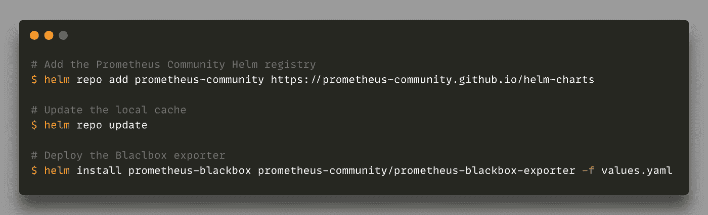
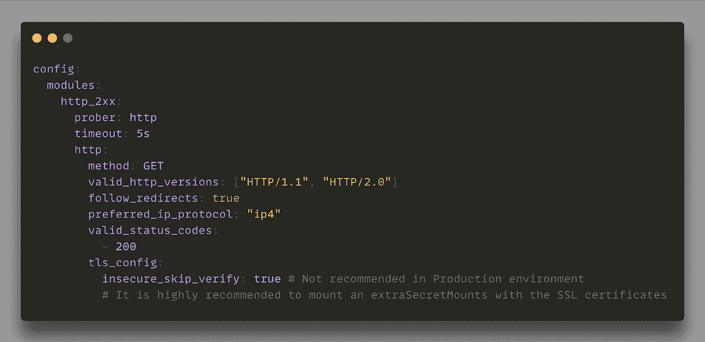
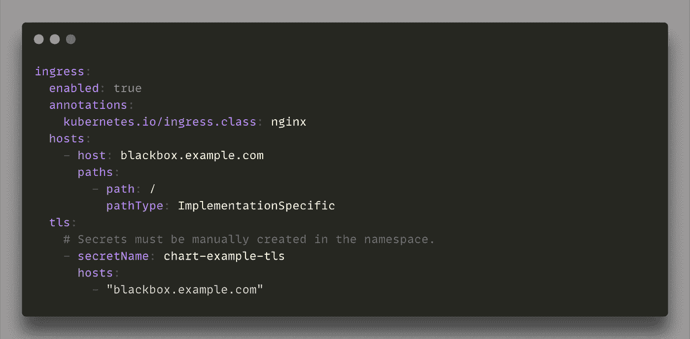
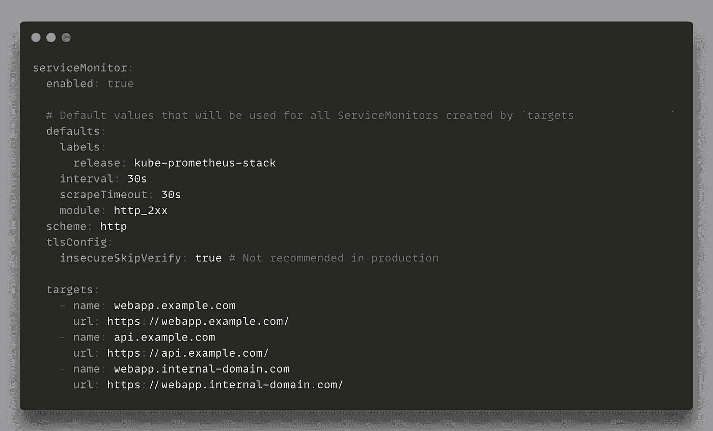
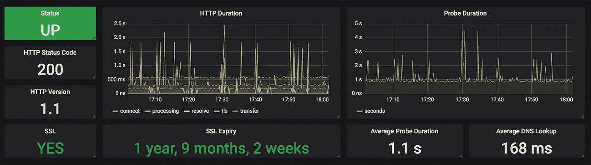

# 普罗米修斯·黑盒:什么？为什么？怎么会？

> 原文：<https://medium.com/codex/prometheus-blackbox-what-why-how-28290dbb22ce?source=collection_archive---------1----------------------->

乔恩·泰森在 [Unsplash](https://unsplash.com/?utm_source=unsplash&utm_medium=referral&utm_content=creditCopyText) 上的照片

今天，[普罗米修斯](https://prometheus.io/)在生产中被各种组织广泛使用。2016 年，这是第二个加入 CNCF 的项目，2018 年，是继 Kubernetes 之后第二个毕业的项目。随着项目的实施者和采纳者的商业生态系统的增长，出现了一种需求，即解决在 Nagios 等旧的监控工具中已经实现的特定方面。黑盒服务测试就是其中之一。

# 什么是普罗米修斯黑盒？

众所周知，Prometheus 是一个开源的、基于度量的监控系统。普罗米修斯做一件事，而且做得很好。它有一个强大的数据模型和一个查询语言来分析应用程序和基础设施的性能。

Prometheus 堆栈由多个部分组成，存储和提供数据的 Prometheus 服务器、管理警报的警报管理器和大量执行指标收集的 [Prometheus 导出器](https://prometheus.io/docs/instrumenting/exporters/)。

导出器是专用于一件事情的软件，从另一个应用程序获取统计数据，并将它们暴露给特定的端点(通常是端口和路径)，以允许远程 Prometheus 服务器收集这些指标。

今天，许多出口商作为官方的 Prometheus GitHub 组织的一部分存在和维护，其他的由外部贡献者维护。 [Blackbox](https://github.com/prometheus/blackbox_exporter) 是普罗米修斯组织维护的官方出口商之一。

Blackbox exporter 是一个工具，允许工程师执行每个系统管理员每天都要做的一件简单的事情，检查 HTTP/S、DNS、TCP 和 ICMP 端点的可用性。

基本上，Prometheus Blackbox exporter 可以被视为 PingDOM、Freshping 或 Uptime.com 的免费简单替代方案，用于监控未暴露在互联网上的内部端点。

# 为什么是普罗米修斯黑盒？

Prometheus Blackbox exporter 的主要目的是测量远程内部和外部端点(HTTP/S、DNS、TCP 和 ICMP)的响应时间，但它提供的不止这些。

导出器提供以下指标:

*   **HTTP 延迟**，访问远程端点需要多长时间？
*   **DNS 查找延迟**，解析一个 DNS 记录需要多长时间？
*   **SSL 证书信息**，远程端点安全吗？是有效证件吗？证书到期日期是什么时候？
*   **TLS 版本**，远程端点的 TLS 版本是什么？
*   **基本认证**，我能运行一个简单的 web 场景吗，比如远程端点上的认证？
*   **头验证**，我能在 HTTP 头中找到需要的参数吗？标题是否符合安全合规性？

这些指标是基础架构的重要组成部分，需要对其进行监控，以确保服务的连续性和符合某些安全认证。

不仅需要监控面向客户端的端点，还需要监控内部端点，以确保我们的第一批客户(我们的同事)的服务连续性。

黑盒不同于应用程序规范(添加到应用程序代码中以公开指标的客户端库)。Blackbox 隐式验证外部服务的状态，如 DNS 解析、网络连接、认证机构等；而应用程序工具关注性能指标。

部署在 Kubernetes 集群上，这个导出器可以提供一个免费的、高度可用的监控过程，以获得远程端点的大视图。

# 如何部署 Blackbox？

像任何 Prometheus exporter 一样，Blackbox 可以部署在操作系统上或作为一个容器。由于该导出器的目的是监控基础设施的关键方面，因此强烈建议将其部署在容器编排平台上，以利用这种类型的平台:

*   高可用性，最重要的方面，保证监控工具的可用性是每个管理员的头等大事。
*   可伸缩性，取决于检查的数量，黑盒可能需要伸缩。
*   可移植性是监控堆栈的另一个重要方面，没有人能够预测基础架构的发展，确保工具可以以不同的方式部署在本地、云中是一件好事。
*   灵活性，实现一个新的工具从来都不是一件容易的事情，所以与 Kubernetes 这样的现有平台轻松集成是一个很大的优势。

Blackbox 是由 GitHub 上的普罗米修斯组织管理的官方出口商。有一个[掌舵图](https://github.com/prometheus-community/helm-charts/tree/main/charts/prometheus-blackbox-exporter)可以轻松地将其部署在 Kubernetes 集群上。

根据 Kubernetes 的设置，部署 Prometheus exporter 可能非常简单:

默认安装附带了一个简单的 HTTP 探测器，可以轻松启动对 HTTP/S 端点的监控。

Blackbox 带有一个简单的 web UI，可以轻松访问每个健康检查的日志。可以在舵图中启用入口规则，以打开对 UI 的访问并调试 web 检查:

# 为什么以及如何使用 Kubernetes ServiceMonitor？

今天，监测不应只是一个团队的项目。这种项目应该扩展到整个工程团队，以确保基础设施的每一部分都得到很好的覆盖。这意味着监测过程应该易于理解，以便于采用。

Prometheus 操作员引入了一个名为 ServiceMonitor 的新 Kubernetes 对象。该资源可用于描述一组由 Prometheus 监控的目标，无需 Prometheus 服务器端的任何必要配置。

这是自动配置新普罗米修斯目标的简单方法。服务器能够找到任何配置了特定标签的 Kubernetes ServicesMonitor，并自动将这个新目标添加到当前列表中(默认情况下，使用的标签是"[release = kube-Prometheus-stack](https://github.com/prometheus-community/helm-charts/blob/cb01e2638e06505316a8128f1ce3e60cdb2e3f43/charts/kube-prometheus-stack/templates/prometheus/prometheus.yaml#L121)")。

推荐使用带有黑盒的 ServiceMonitor 对象来监视内部或外部端点。添加新检查属于创建独立对象，与 Prometheus 服务器的配置无关。这意味着任何想要部署新应用程序的人都可以独立管理对其应用程序的监控，而无需管理员干预来配置 Prometheus scratch。

主要的好处是分担监控所部署的每个资源的责任。

Blackbox Helm 图表可以通过 ServiceMonitor 轻松管理任何新监视目标的创建:

此配置的结果是创建了三个不同的 ServiceMonitor 对象，它们带有特定的标签`kube-prometheus-stack`，每个对象专用于一个新的 Prometheus 目标的配置。

# 如何绘制数据图表？

Blackbox 附带了一个 web UI，它提供了一些关于检查的信息，但是这个 UI 不能每天用来正确地监控多个端点的状态。

Grafana 与 Prometheus 完美集成，可能是每个人绘制任何 Prometheus 出口商收集的指标的默认选项。

Blackbox 也不例外，现在有多种仪表板将数据格式化为人类可读的图形。其中两个特别有趣:

*   [9115-blackbox](https://grafana.com/grafana/dashboards/13587) 在一个表格中提供了所有受监控终端的概览，以快速获得每个终端的状态。
*   [Prometheus black box Exporter](https://grafana.com/grafana/dashboards/7587)在每个端点的专用部分提供每个受监控端点的概述。

这两个仪表板可以合并在一起，以优化呈现，并将您的时间集中在一个仪表板上，而不是增加同一数据源的仪表板数量。

显然，这只是来自[许多其他](https://grafana.com/grafana/dashboards?search=blackbox)的两个仪表板，请随意上传您自己的仪表板，与社区共享！

# 下一个？

Blackbox 是一个有趣的导出器，可以很容易地部署在现代平台上，对基础设施的关键方面进行重要的检查。再加上动态的 Grafana 仪表板，它可以改进 SLA 的测量，并为管理团队提供基础设施的总体概况。

有关普罗米修斯黑盒的更多信息:

*   [Github 资源库](https://github.com/prometheus/blackbox_exporter)
*   [在 Kubernetes](https://github.com/prometheus-community/helm-charts/tree/main/charts/prometheus-blackbox-exporter) 部署黑匣子的舵图
*   [使用黑盒导出器和 Sysdig 监控可用性指标](https://sysdig.com/blog/blackbox-exporter-sysdig/)
*   【Prometheus 和 blackbox exporter 如何让监控微服务端点变得简单且免费
*   [普罗米修斯操作员入门](https://github.com/prometheus-operator/prometheus-operator/blob/master/Documentation/user-guides/getting-started.md)

# 关于作者

Hicham Bouissoumer —现场可靠性工程师(SRE) — DevOps

Nicolas Giron —现场可靠性工程师(SRE) — DevOps