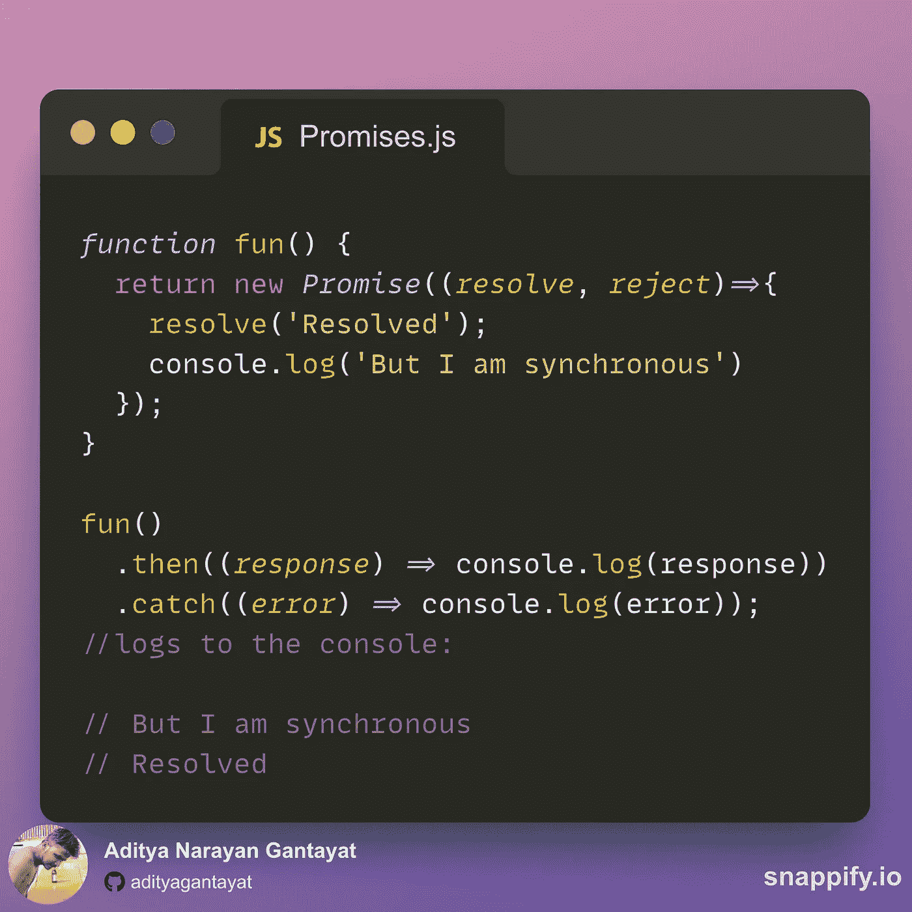
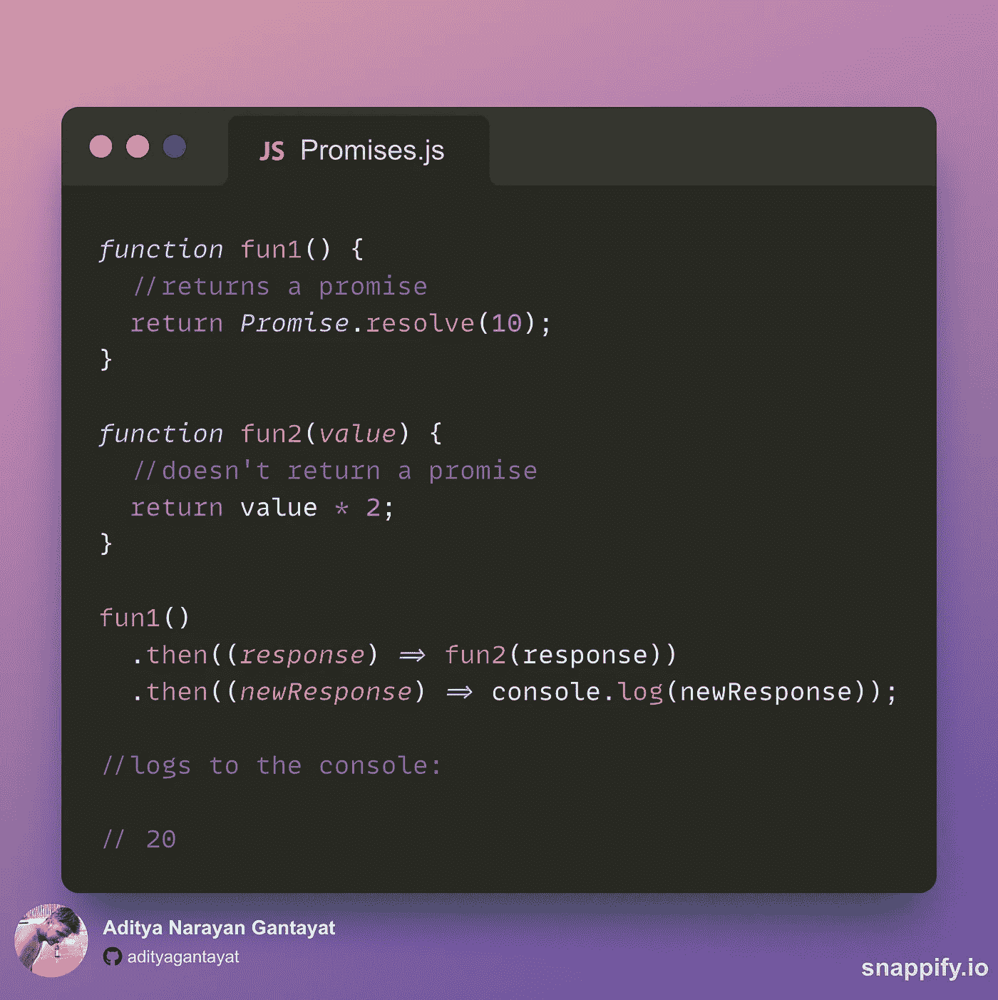
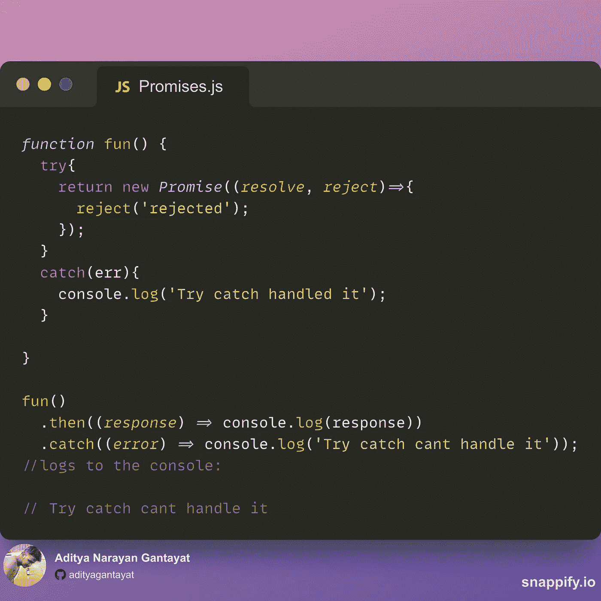
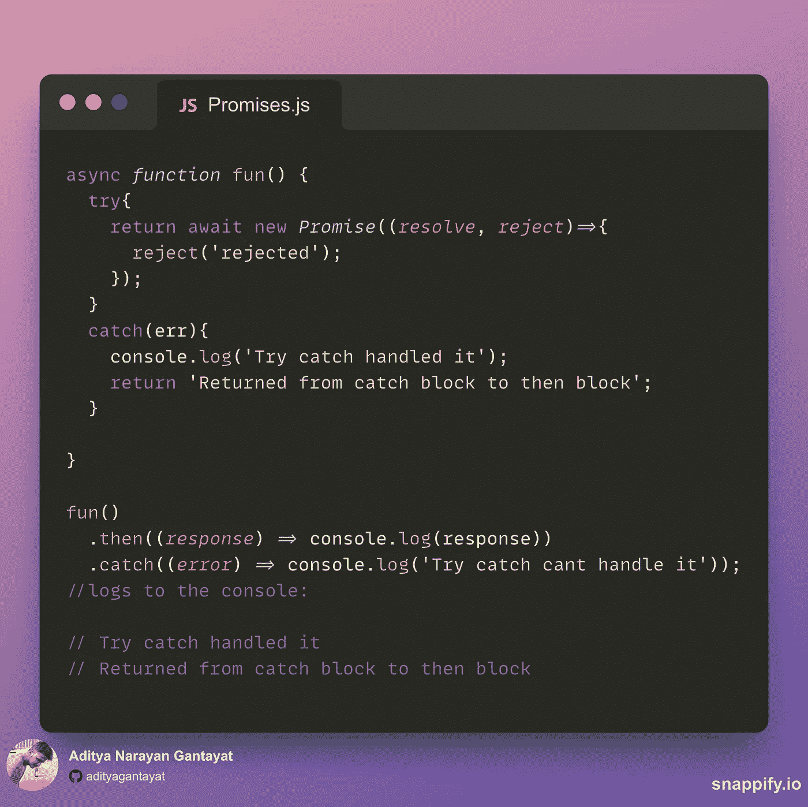

# 承诺和更多…

> 原文：<https://medium.com/codex/promises-and-more-35ca552d593?source=collection_archive---------18----------------------->

人们经常混淆承诺是异步的。但是它们真的是异步的吗？Promise 可以说是 JavaScript 中异步编程最重要的概念，然而，传递给 Promise 构造函数的回调的执行是**同步的**。

让我们用一个例子来理解同样的道理:

就像你看到的，当函数被调用时，回调传递到同步执行的承诺构造函数**，因为它没有等待承诺解决就登录*【但是我是同步的】*到控制台。
是***’。然后异步执行**的***链**。**

**这引出了另一个问题！**

****自*。那么()*** 块是异步的，它是否期望一个**承诺作为回报** **总是**？**

**答案是**不！****

**当你启动**时*。然后()*** 链，然后初始 ***然后*** 块期待一个承诺的回报，但此后，当你链多个 ***然后*** 块时，它们 ***可能会也可能不会*** 收到一个承诺的回报。**

**让我们看一个同样的例子:**

****

**我们开始了，第二个 ***然后*** 块，没有得到承诺的回报，但，工作得很好！**

**现在，我们都知道，一个承诺既可以是 ***解决*** 也可以是 ***拒绝*** 。这引起了人们的好奇，我们是否可以处理在 ***try/catch*** 块中拒绝承诺的情况，或者是否可以强制将 ***catch*** 块锁在 ***块之后，然后锁在*** 块中。**

**有什么猜测吗？让我们看看！**

****

***预料到这个结果还是有点惊讶？嗯，JS 就像生活一样，随时都可能让你大吃一惊。***

**当一个承诺被拒绝时，错误被链中的 *catch 块捕获，该链中的承诺被期望作为回报。***

**所以，我们不能用 ***try/catch*** 来处理被拒绝的承诺？**

**我们可以！**

*****异步/恭候*** 前来救援！**

****

**随着 ***async/await*** 的实现，我们确保承诺在那里被解决/拒绝。一旦它被拒绝， ***try/catch*** 的 ***catch*** 块处理它，当它返回消息时， ***然后阻塞*** 其中 ***期待一个承诺*** ，从一个 ***异步函数*** 隐式中获取响应，包装在一个 ***中*****

**当你在这里的时候，答应我鼓掌？我不是那么好的捕手，所以请不要拒绝！无红利**

**干杯！**